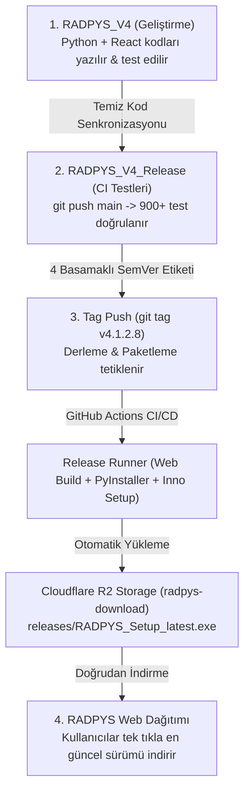

# 🚀 RADPYS V4 Master Dağıtım ve Yayınlama Kılavuzu

Bu belge, **RADPYS V4** (PySide6 Masaüstü Yönetim Paneli + React/Vite Web Portalı & Saha Asistanı + PostgreSQL Veritabanı) projesinin geliştirme, test, derleme, paketleme ve **Cloudflare R2** üzerinden otomatik yayınlama süreçlerini adım adım açıklayan ana kılavuzdur.

---

## 📐 Mimari Genel Bakış

Proje 3 temel bileşenden ve çok katmanlı kurumsal bir dağıtım mimarisinden oluşur:

1. 💻 **`RADPYS_V4` (Geliştirme Reposu - Private):**
   * Tüm Python kaynak kodları (`app/`, `ui/`), veritabanı şemaları (`schema.sql`, `seeds.sql`, `migrations/`), iş mantığı kuralları, React/Vite web portalı (`web_portal/`) ve 900+ birim/entegrasyon testinin bulunduğu ana geliştirme ortamıdır.
2. 📦 **`RADPYS_V4_Release` (Derleme & Dağıtım Reposu - Private):**
   * GitHub Actions CI/CD hattı üzerinde PyInstaller (`RADPYS.exe`, `RADPYS_Portal_Launcher.exe`), Web Portal derlemesi (`npm run build`) ve Inno Setup kurulum paketlerinin (`RADPYS_Setup_v4.x.x.x.exe`) üretildiği, testlerin doğrulandığı sürümlendirme deposudur.
3. 🌐 **`RADPYS_V4_WEB` (Web Portal & Cloudflare Dağıtım):**
   * Cloudflare Pages ve Cloudflare R2 depolama servisi üzerinde çalışan, kurumsal kullanıcılara üyelik/giriş gerekmeden doğrudan ve yüksek hızlı indirme sunan dağıtım ağıdır.

---

## 🔄 Uçtan Uca İş Akışı (Workflow)



---

## 🏷️ Sürümlendirme Standardı (4 Basamaklı SemVer)

RADPYS V4, `MAJOR.MINOR.PATCH.BUILD` disiplinini benimser:

* **MAJOR (4):** Ana mimari paradigma (RADPYS V4 - PostgreSQL + KVKK Şifreli Kasa + Web Portalı).
* **MINOR (1):** Ana modül paketleri (Cihaz, RKE, Dozimetre, Nöbet, LMS Eğitim).
* **PATCH (2):** Modül içi kurallar ve standartlar (DIN 6857-1, SKS, NDK, 36 Saat TTL Kısıtı).
* **BUILD / Hotfix (x):** Günlük geliştirmeler, UI/doküman güncellemeleri ve hata düzeltmeleri (Örn: `4.1.2.8`).

> **⚠️ Önemli:** Her sürüm öncesinde `version.json`, `app/__init__.py`, `CHANGELOG.md` ve `README.md` dosyalarındaki sürüm dizesinin eşitlendiğinden emin olunmalıdır.

---

---

## ⚡ Tek Tuşla Master Yayınlama (Önerilen En Pratik Yol)

Tüm testleri, policy kontrollerini, dosya sürüm senkronizasyonlarını, Inno Setup paketlemesini, Cloudflare R2 yüklemesini ve 3 farklı Git reposunu (`RADPYS_V4`, `RADPYS_V4_Release`, `RADPYS_V4_WEB`) tek bir komutla yayınlamak için **`deploy/publish_release.py`** orkestratörü kullanılır:

```bash
# Geliştirme dizininde tek komutla tüm süreci yürütün:
python deploy/publish_release.py 4.1.2.9 -m "Nöbet havuzu ve kroki güncellemeleri"
```

### 🎛️ Script Seçenekleri ve Parametreleri:
* `version` *(Zorunlu)*: 4 basamaklı SemVer sürümü (örn: `4.1.2.9`).
* `-m, --notes` *(Opsiyonel)*: Sürüm açıklaması veya commit mesajı.
* `--skip-tests`: Hızlı dağıtım için test ve policy adımlarını atlar.
* `--skip-web-build`: Web portalı React/Vite derlemesini atlar.
* `--skip-build`: Inno Setup derlemesini atlar (mevcut `setup_output` paketini kullanır).
* `--skip-r2`: Cloudflare R2 CDN yüklemesini atlar.
* `--skip-git`: Repoların commit/push adımlarını atlar.

---

## 📋 Manuel / Ayrıntılı Çalışma Talimatı

### 🔹 1. AŞAMA: Günlük Geliştirme ve Test (`RADPYS_V4`)

Tüm yeni özellikler, hata düzeltmeleri ve arayüz geliştirmeleri bu klasörde yapılır.

```bash
# 1. Geliştirme klasörüne geçin
cd c:\Users\user\Desktop\RADPYS\RADPYS_V4

# 2. Üzerinde çalıştığınız modülün testlerini veya tüm test paketini koşturun
python -m pytest tests/test_schema_integrity.py tests/test_nobet_havuz_service.py -v

# 3. Kodlarınızı kaydedip geliştirme reposuna push edin
git add .
git commit -m "feat: Nöbet Değişim Havuzu ve 36 saat TTL kısıtı eklendi"
git push origin main
```
git commit -m "feat: Nöbet Değişim Havuzu ve 36 saat TTL kısıtı eklendi"
git push origin main
```

---

### 🔹 2. AŞAMA: Sürüm Senkronizasyonu ve CI Doğrulama (`RADPYS_V4_Release`)

Yeni bir kararlı sürüm çıkarmaya karar verdiğinizde güncel temiz kodlar `RADPYS_V4_Release` klasörüne aktarılır.

```bash
# 1. Release klasörüne geçin
cd c:\Users\user\Desktop\RADPYS\RADPYS_V4_Release

# 2. Güncellenen sürüm kodlarını push edin
git add .
git commit -m "chore: v4.1.2.8 sürüm kodları aktarıldı"
git push origin main
```

> **📌 Ne Olur?** `git push` yapıldığında GitHub Actions üzerindeki **`ci.yml`** devreye girer. 900+ birim ve entegrasyon testini (PostgreSQL şema bütünlüğü, KVKK kasası, RKE DIN 6857-1, Nöbet motoru) 2-3 dakika içinde koşturarak kodda hiçbir regresyon olmadığını onaylar.

---

### 🔹 3. AŞAMA: Otomatik Derleme, Setup ve Cloudflare'e Yükleme (Sürüm Çıkarma)

CI testleri başarıyla tamamlandıktan sonra sürümü yayınlamak için **yalnızca versiyon etiketini (tag)** push etmeniz yeterlidir.

```bash
# 1. Release klasöründe olduğunuzdan emin olun
cd c:\Users\user\Desktop\RADPYS\RADPYS_V4_Release

# 2. Yeni versiyon etiketini oluşturun (Örn: v4.1.2.8)
git tag v4.1.2.8

# 3. Etiketi push ederek otomatik derlemeyi başlatın
git push origin v4.1.2.8
```

> **⚡ Arka Planda Otomatik Gerçekleşenler (~3 Dakika):**
>
> 1. GitHub Actions (`release.yml`) etiketi algılar.
> 2. Web portalı derlenir (`cd web_portal && npm install && npm run build`).
> 3. `PyInstaller` ile `RADPYS.exe` ve `RADPYS_Portal_Launcher.exe` derlenir.
> 4. `Inno Setup` ile `RADPYS_Setup_v4.1.2.8.exe` kurulum paketi hazırlanır.
> 5. Üretilen kurulum dosyası otomatik olarak Cloudflare R2 **`radpys-download`** kovanıza yüklenir ve sabit **`RADPYS_Setup_latest.exe`** kopyasını günceller.
> 6. `version.json` dosyası Cloudflare R2'ye yüklenerek kurulu istemcilerin otomatik güncelleme bildirimini alması sağlanır.

---

### 🔹 4. AŞAMA: Web Sitenizdeki (`RADPYS_V4_WEB`) İndirme Butonu

Cloudflare üzerindeki web sitenizde yer alan **"Windows İçin İndir"** butonunun indirme adresi **sabittir** ve sürümler değiştikçe web sitesinde kod değişikliği gerektirmez:

🔗 **Sabit İndirme Adresi:**
`https://download.radpys.com.tr/releases/RADPYS_Setup_latest.exe`  
*(veya R2 Doğrudan Erişim: `https://pub-xxxxxxxx.r2.dev/releases/RADPYS_Setup_latest.exe`)*

---

## 🛡️ Güvenlik ve Gizlilik Garantisi

1. **%100 Kaynak Kod Gizliliği:** `RADPYS_V4` ve `RADPYS_V4_Release` depoları **Private (Gizli)** olarak yapılandırılmıştır. Kaynak kodlar kurum dışına sızdırılamaz.
2. **Temiz ve Yalıtılmış Dağıtım:** Sadece derlenmiş binary `.exe` dosyaları ve şablon varlıkları kurulum paketine dahil edilir. `.py` kaynak dosyaları, `.git`, `.env` şifreleri ve `node_modules` paket içeriği tamamen filtrelenir.
3. **KVKK Uyumlu Evrak Güvenliği:** Dağıtılan sürüm, veritabanındaki tüm sağlık evraklarını ve dozimetre belgelerini `stored_files` tablosunda AES-256 Fernet ile şifreli tutar.
4. **Kesintisiz ve Hızlı İndirme:** Kullanıcılar GitHub üyelik/yetki engeline takılmadan Cloudflare CDN/R2 altyapısından kurumsal hızda indirme yapar.

---

## 🔑 Kod İmzalama (Code Signing) ve Windows SmartScreen Yönetimi

Kurulum paketi Inno Setup ve PyInstaller ile derlendiğinde Windows Defender SmartScreen varsayılan olarak *"Bilinmeyen Yayıncı"* veya *"Windows kişisel bilgisayarınızı korudu"* uyarısı gösterebilir.

### 1. Windows SmartScreen Neden Uyarır?

- **Yayıncı İtibarı (Reputation):** Microsoft, dijital sertifika ile imzalanmamış veya yeni dağıtılmaya başlanmış `.exe` sürümlerini kullanıcı sayısı ve indirme itibarı oluşana kadar geçici koruma uyarısıyla durdurur.
- **Geçici Çözüm (Kullanıcı Tarafı):** Kullanıcıların kurulum sırasında **"Daha fazla bilgi"** -> **"Yine de çalıştır"** adımlarını izlemesi yeterlidir (Kullanıcı kılavuzunda detaylandırılmıştır).

### 2. Kalıcı Çözüm (Geliştirici / Dağıtım Tarafı - Code Signing)

Kurumsal bir **Code Signing Sertifikası** (EV / OV PFX Sertifikası) edinildiğinde, otomatik derleme hattına `SignTool` entegre edilerek bu uyarı tamamen kaldırılabilir:

1. **Inno Setup Script (`radpys_installer.iss`):**

   ```ini
   [Setup]
   SignTool=mysigntool signtool.exe sign /f "cert.pfx" /p "pass" /tr http://timestamp.digicert.com /td sha256 $f
   ```

2. **GitHub Actions CI/CD Entegrasyonu (`release.yml`):**
   - Sertifika ve şifre GitHub Secrets (`CODE_SIGNING_CERT_PFX`, `CERT_PASSWORD`) olarak saklanır.
   - Paketleme adımında `signtool.exe` çalıştırılarak üretilen `RADPYS_Setup_latest.exe` dijital olarak imzalanır.
   - İmzalı `.exe` sayesinde Windows SmartScreen uyarısı tüm istemcilerde otomatik olarak aşılır.
