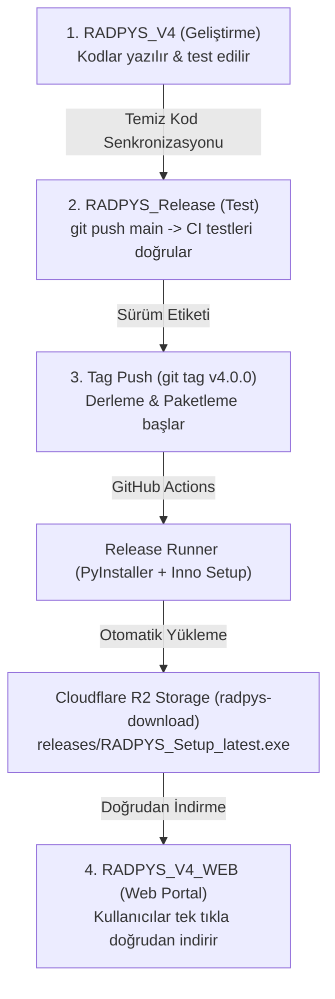

# 🚀 RADPYS Master Dağıtım ve Yayınlama Kılavuzu

Bu belge, **RADPYS** projesinin geliştirme, test, derleme, paketleme ve **Cloudflare R2** üzerinden otomatik yayınlama süreçlerini adım adım açıklayan ana kılavuzdur.

---

## 📐 Mimari Genel Bakış

Proje 3 temel bileşenden oluşur:

1. 💻 **`RADPYS_V4` (Geliştirme Reposu - Private):** Tüm Python kaynak kodları, veritabanı şemaları, iş mantığı ve yerel birim testlerinin bulunduğu ana geliştirme ortamıdır.
2. 📦 **`RADPYS_Release` (Derleme & Dağıtım Reposu - Private):** GitHub Actions ile PyInstaller ve Inno Setup derlemelerinin yapıldığı, testlerin doğrulandığı ve `.exe` paketlerinin üretildiği sürümlendirme reposudur.
3. 🌐 **`RADPYS_V4_WEB` (Web Portal & Yayınlama - Cloudflare):** Cloudflare Pages ve Cloudflare R2 depolama servisi üzerinde çalışan, kullanıcılara üyelik/giriş gerekmeden doğrudan indirme sunan web portalıdır.

---

## 🔄 Uçtan Uca İş Akışı (Workflow)



---

## 📋 Adım Adım Çalışma Talimatı

### 🔹 1. AŞAMA: Günlük Geliştirme (`RADPYS_V4`)

Tüm yeni özellikler ve düzeltmeler bu klasörde yapılır.

```bash
# 1. Geliştirme klasörüne geçin
cd c:\Users\user\Desktop\RADPYS\RADPYS_V4

# 2. Yerel testlerinizi koşturun
pytest -v

# 3. Kodlarınızı kaydedip V3 reposuna push edin
git add .
git commit -m "feat: yeni yetkilendirme ve nöbet hesaplama özellikleri eklendi"
git push origin main
```

---

### 🔹 2. AŞAMA: Sürüm Senkronizasyonu ve CI Doğrulama (`RADPYS_Release`)

Yeni bir sürüm çıkarmaya karar verdiğinizde güncel temiz kodlar `RADPYS_Release` klasörüne kopyalanır/aktarılır.

```bash
# 1. Release klasörüne geçin
cd c:\Users\user\Desktop\RADPYS\RADPYS_Release

# 2. Güncellenen kodları push edin
git add .
git commit -m "chore: v4.0.0 sürüm kodları aktarıldı"
git push origin main
```

> **📌 Ne Olur?** `git push` yaptığınızda GitHub Actions üzerindeki **`ci.yml`** devreye girer. 700+ birim testini 2 dakika içinde koşturarak kodda hiçbir kırılma olmadığını doğrular.

---

### 🔹 3. AŞAMA: Otomatik Derleme, Setup ve Cloudflare'e Yükleme (Sürüm Çıkarma)

CI testleri başarıyla tamamlandıktan sonra sürümü yayınlamak için **sadece versiyon etiketini (tag)** push etmeniz yeterlidir.

```bash
# 1. Release klasöründe olduğunuzdan emin olun
cd c:\Users\user\Desktop\RADPYS\RADPYS_Release

# 2. Yeni versiyon etiketini oluşturun (Örn: v4.0.0)
git tag v4.0.0

# 3. Etiketi push ederek otomatik derlemeyi başlatın
git push origin v4.0.0
```

> **⚡ Arka Planda Otomatik Gerçekleşenler (~1 Dakika):**
>
> 1. GitHub Actions (`release.yml`) etiketi algılar.
> 2. `PyInstaller` ile `RADPYS.exe` uygulaması derlenir (`node_modules` ve ham `.py` dosyaları otomatik filtreler).
> 3. `Inno Setup` ile `RADPYS_Setup_v4.0.0.exe` kurulum paketi hazırlanır.
> 4. Üretilen kurulum dosyası otomatik olarak Cloudflare R2 **`radpys-download`** kovanıza yüklenir ve sabit **`RADPYS_Setup_latest.exe`** kopyasını günceller.

---

### 🔹 4. AŞAMA: Web Sitenizdeki (`RADPYS_V4_WEB`) İndirme Butonu

Cloudflare üzerindeki web sitenizde yer alan **"Windows İçin İndir"** butonunun indirme adresi **sabittir** ve hiçbir zaman değiştirmeniz gerekmez:

🔗 **Sabit İndirme Adresi:**
`https://pub-xxxxxxxx.r2.dev/releases/RADPYS_Setup_latest.exe`  
*(veya Custom Domain adresiniz: `https://download.radpys.com.tr/releases/RADPYS_Setup_latest.exe`)*

---

## 🛡️ Güvenlik ve Gizlilik Garantisi

1. **%100 Kod Gizliliği:** `RADPYS_V4` ve `RADPYS_Release` depoları **Private (Gizli)** ayarlanmıştır. Dışarıdan hiç kimse Python kaynak kodlarınızı göremez.
2. **Temiz Dağıtım:** Sadece derlenmiş binary `.exe` dosyası Cloudflare R2'ye yüklenir. Kaynak `.py` kodları ve `node_modules` paket içeriğine kesinlikle dahil edilmez.
3. **Sorunsuz İndirme:** Kullanıcılar GitHub üye girişi veya 404 engeline takılmadan doğrudan web sitenizden kurumsal bir şekilde indirme yapar.

---

## 🔑 Kod İmzalama (Code Signing) ve Windows SmartScreen Yönetimi

Kurulum paketi Inno Setup ve PyInstaller ile derlendiğinde Windows Defender SmartScreen varsayılan olarak *"Bilinmeyen Yayıncı"* veya *"Windows kişisel bilgisayarınızı korudu"* uyarısı gösterebilir.

### 1. Windows SmartScreen Neden Uyarır?

- **Yayıncı İtibarı (Reputation):** Microsoft, dijital sertifika ile imzalanmamış veya yeni dağıtılmaya başlanmış `.exe` sürümlerini kullanıcı sayısı ve indirme itibarı oluşana kadar geçici koruma uyarısıyla durdurur.
- **Geçici Çözüm (Kullanıcı Tarafı):** Kullanıcıların kurulum sırasında **"Daha fazla bilgi"** -> **"Yine de çalıştır"** adımlarını izlemesi yeterlidir (Kullanıcı kılavuzunda detaylandırılmıştır).

### 2. Kalıcı Çözüm (Geliştirici / Dağıtım Tarafı - Code Signing)

Kurumsal bir **Code Signing Sertifikası** (EV / OV PFX Sertifikası) edinildiğinde, otomatik derleme hattına `SignTool` entegre edilerek bu uyarı tamamen kaldırılabilir:

1. **Inno Setup Script (`radpys_installer.iss`):**

   ```ini
   [Setup]
   SignTool=mysigntool signtool.exe sign /f "cert.pfx" /p "pass" /tr http://timestamp.digicert.com /td sha256 $f
   ```

2. **GitHub Actions CI/CD Entegrasyonu (`release.yml`):**
   - Sertifika ve şifre GitHub Secrets (`CODE_SIGNING_CERT_PFX`, `CERT_PASSWORD`) olarak saklanır.
   - Paketleme adımında `signtool.exe` çalıştırılarak üretilen `RADPYS_Setup_latest.exe` dijital olarak imzalanır.
   - İmzalı `.exe` sayesinde Windows SmartScreen uyarısı tüm istemcilerde otomatik aşılır.
