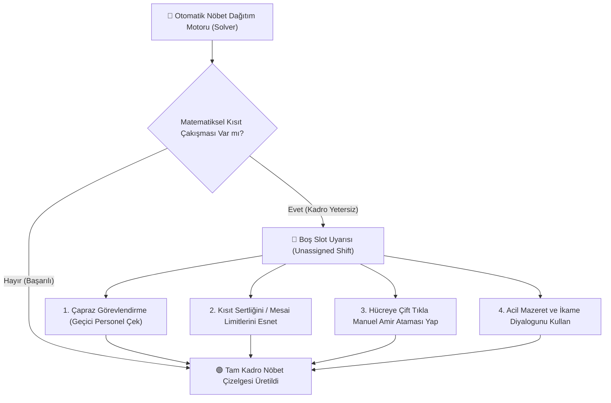
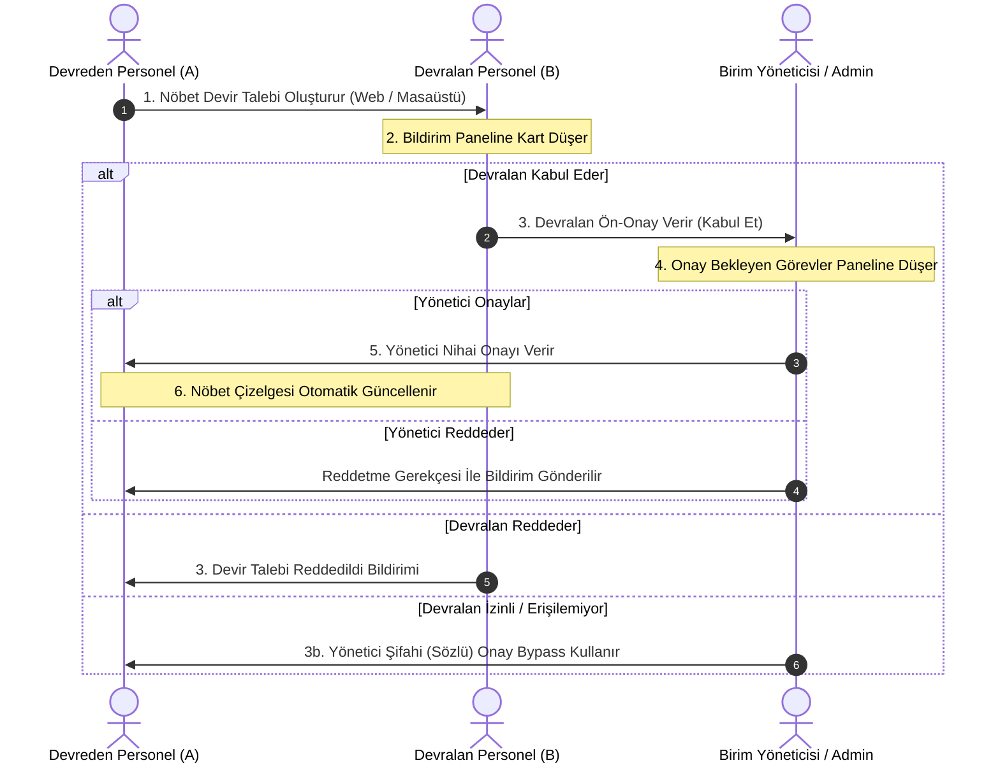
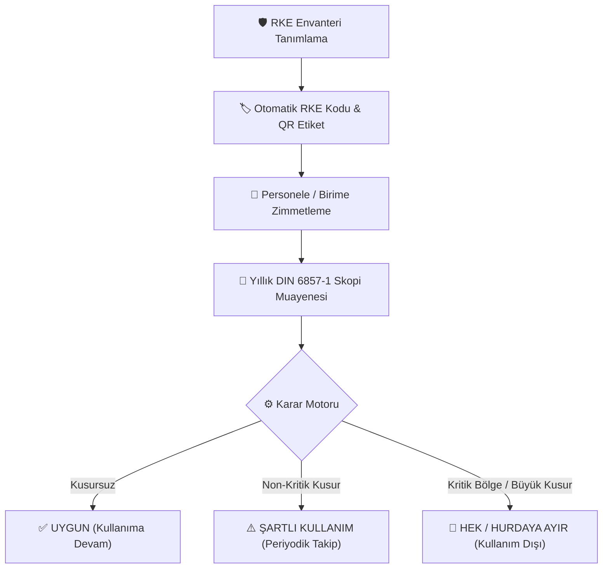
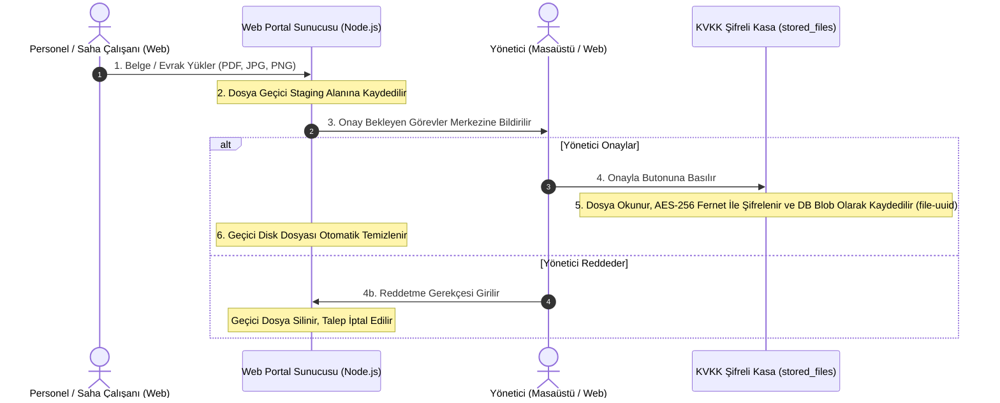
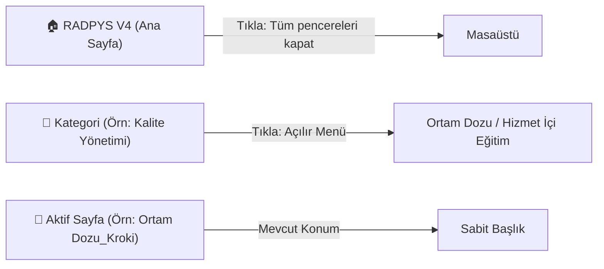

# RADPYS V4 — Güncel Operasyonel Kullanım Kılavuzu

---

## 📑 İçindekiler

### I. GENEL BİLGİLER VE KURULUM

* 1. [RADPYS V4 Kurulumu ve Windows Güvenlik İzinleri Nasıl Verilir?](#bolum-1)
* 2. [Sisteme Giriş, Şifre Değiştirme ve Kullanıcı Yetkileri Nasıl Yönetilir?](#bolum-2)

### II. OPERASYONEL MODÜLLER VE GÜNLÜK İŞLEMLER

* 3. [Personel Modülü Yönetimi ve Özlük Dosyası İşlemleri](#bolum-3)
* 4. [İzin Takip, Şua İzni ve Fiili Hizmet Takip Modülü ve Şua İzni Hak Ediş İşlemleri](#bolum-4)
* 5. [Dozimetre Takip, Doz Trendi ve Birim Risk Analiz Modülü](#bolum-5)
* 6. [Nöbet Modülü Yönetimi ve Nöbet Ayarları (Kısıtlar, Kurallar ve Algoritma Parametreleri)](#bolum-6)
* 7. [Radyasyon Güvenliği, Olay Bildirim ve DÖF (Düzeltici Önleyici Faaliyet) Modülü](#bolum-7)
* 8. [Radyasyon Ortam Dozu Ölçümleri, İnteraktif Kroki ve SKS 6.1 Alan İzleme Sistemi](#bolum-8)
* 9. [Hizmet İçi Eğitim, Sınav Soruları Havuzu, Online Sınav ve Uyum Takip Modülü](#bolum-9)
* 10. [Tıbbi Cihaz Envanteri, NDK Lisans Takibi, Kalite Kontrol & Mobil QR Arıza Portalı](#bolum-10)
* 11. [Radyasyon Koruyucu Ekipman (RKE) & DIN 6857-1 Kalite Kontrol Muayene Yönetimi](#bolum-11)

### III. KURUMSAL YÖNETİM VE RAPORLAMA

* 12. [Onay Bekleyen Görevler Paneli (Evrensel Onay ve Veri Değişiklik Denetim Sistemi)](#bolum-12)
* 13. [Raporlar Modülü (Rapor Merkezi, Kurumsal Matbu ve Dinamik Raporlar)](#bolum-13)
* 14. [Tanımlamalar (Lookup / Sabit Veriler) Modülü](#bolum-14)
* 15. [Çoklu Kullanıcı Web Portalı ve REST API Senkronizasyon Modülü](#bolum-15)

### IV. SİSTEM YÖNETİMİ VE VERİ İŞLEMLERİ

* 16. [Merkezi Bildirim ve Durum Çubuğu Sistemi](#bolum-16)
* 17. [Program Ayarları & Temalar (Karanlık/Aydınlık Görünüm Yönetimi)](#bolum-17)
* 18. [Veritabanı Modülü & PostgreSQL Bakım ve Yedekleme](#bolum-18)
* 19. [Toplu İçe Aktarma (Excel / CSV Import) Sihirbazları](#bolum-19)

### V. DESTEK VE SORUN GİDERME

* 20. [Sık Karşılaşılan Durumlar, İpuçları ve Sorun Giderme (Troubleshooting / SSS)](#bolum-20)
* 21. [Sürüm Notları ve Güncelleme Geçmişi (Update Log)](#bolum-21)

---

# I. GENEL BİLGİLER VE KURULUM

<a id="bolum-1"></a>

## 1. RADPYS V4 Kurulumu ve Windows Güvenlik İzinleri Nasıl Verilir?

### 💡 İşlemin Amacı ve Ön Koşullar

RADPYS V4; Windows 10 (Sürüm 1809 ve üzeri) ve Windows 11 (64-bit) işletim sistemlerinde çalışan, kurumsal **PostgreSQL** veritabanı ve **AES-256 KVKK Evrak Kasası** mimarisine sahip çok kullanıcılı bir masaüstü ve web yönetim sistemidir.

Yeni bir kuruluma başlamadan önce bilgisayarınızın aşağıdaki sistem ve çalışma zamanı gereksinimlerini karşıladığından emin olun.

### 📋 Sistem ve Çalışma Zamanı Gereksinimleri

* **İşletim Sistemi:** Windows 10 (Sürüm 1809 ve üzeri) veya Windows 11 (64-bit)
* **Bellek (RAM):** En az 4 GB (8 GB önerilen)
* **Disk Alanı:** En az 500 MB boş disk alanı
* **Gerekli Çalışma Zamanı Bağımlılıkları:**
  * **Masaüstü Ana Uygulaması:** Python 3.10+ / PySide6 (Masaüstü kurulum paketiyle otomatik gelir).
  * **Web Portalı & REST API Servisi (İsteğe Bağlı):** **Node.js LTS v18.0.0+** (Çoklu kullanıcı Web Portalı `web_portal` modülü ve REST API senkronizasyonu kullanılacaksa `nodejs.org` adresinden indirilip kurulmalıdır).

---

### 🐾 Adım Adım Kurulum İş Akışı

1. **Kurulum Paketini Başlatın:** İndirdiğiniz `RADPYS_Setup_latest.exe` dosyasını çift tıklayarak çalıştırın.
2. **Windows SmartScreen Uyarısını Geçin:**
   * Mavi renkli *"Windows kişisel bilgisayarınızı korudu"* uyarısı çıktığında, penceredeki **"Daha fazla bilgi"** (*More info*) bağlantısına tıklayın.
   * Alt kısımda beliren **"Yine de çalıştır"** (*Run anyway*) butonuna tıklayın.  
   *(Not: Bu uyarı, uygulamanın yeni sürümlerinde dijital imza kontrolü nedeniyle varsayılan olarak çıkar; yazılım zararlı kod içermez ve güvenlidir.)*
3. **Inno Setup Sihirbazını Tamamlayın:** Açılan kurulum sihirbazında yükleme dizinini seçin ve *"Masaüstü kısayolu oluştur"* seçeneğini işaretleyerek **"Kur"** butonuna tıklayın.

---

> 💡 **Sık Karşılaşılan Uyarılar ve Çözüm Adımları:** Detaylı soru ve çözüm rehberi için bkz: [RADPYS V4 SSS Dokümanı](RADPYS_V4_sss.md)

---

<a id="bolum-2"></a>

## 2. Sisteme Giriş, Şifre Değiştirme ve Kullanıcı Yönetimi Nasıl Yapılır?

### 💡 İşlemin Amacı

Sisteme giriş ekranı, kullanıcının rolüne tanımlı yetkiler çerçevesinde uygulamaya erişmesini sağlar. İlk oturum açma, varsayılan admin şifresi, geçici şifre değiştirme ve şifre sıfırlama işlemleri bu ekrandan yönetilir.

---

### 🔑 2.1 İlk Kurulumda Varsayılan Yönetici (Admin) Hesabı ve Şifresi Nerededir?

RADPYS V4 ilk kez yüklendiğinde ve çalıştırıldığında, veritabanı otomatik olarak tam yetkili bir **`admin`** hesabı oluşturur.

#### Admin Giriş Bilgilerine Erişim

* **Kullanıcı Adı:** `admin`
* **Geçici Şifre Dosyası:** İlk kurulum anında sistem, veritabanının bulunduğu klasörde (uygulama dizinindeki `data/` klasöründe) **`ilk_admin_bilgileri.txt`** adında bir metin dosyası otomatik oluşturur.
* **Varsayılan Parola Kuralı:** Kurulumda oluşturulan parola `Admin123!` veya metin dosyasında belirtilen güçlü geçici paroladır.

---

### 🐾 2.2 Adım Adım Oturum Açma İş Akışı

1. Masaüstündeki **RADPYS V4** kısayoluna çift tıklayın.
2. Açılan Giriş Penceresinde **Kullanıcı Adı** (`admin`) ve **Şifre** bilginizi girin.
3. **"Giriş Yap"** butonuna tıklayın.

---

### 🐾 Adım Adım İlk Girişte Şifre Değiştirme İş Akışı

1. Geçici şifrenizle ilk kez giriş yaptığınızda sistem otomatik olarak **"Zorunlu Şifre Değiştirme"** ekranını açar.
2. **Mevcut Şifre** alanına geçici şifrenizi girin.
3. **Yeni Şifre** ve **Yeni Şifre (Tekrar)** alanlarına en az 8 karakterden oluşan (büyük harf, küçük harf ve rakam içeren) yeni güçlü parolanızı girin.
4. **"Şifreyi Güncelle"** butonuna basarak işlemi tamamlayın. Artık yeni şifrenizle oturum açabilirsiniz.

---

### 🐾 Adım Adım Unutulan Şifreyi Sıfırlama İş Akışı

1. Giriş ekranındaki **"Şifremi Unuttum"** butonuna tıklayın.
2. Açılan pencerede sistemde kayıtlı **E-Posta Adresinizi** ve **Kullanıcı Adınızı** girin.
3. Yeni oluşturmak istediğiniz şifreyi iki kez girerek **"Şifremi Sıfırla"** butonuna basın.  
*(Not: E-posta veya kullanıcı adı sistemdeki kayıtla eşleşmezse uyarı alırsınız. Bu durumda sistem yöneticinizle iletişime geçmeniz gerekir.)*

---

> 💡 **Sık Karşılaşılan Uyarılar ve Çözüm Adımları:** Detaylı soru ve çözüm rehberi için bkz: [RADPYS V4 SSS Dokümanı](RADPYS_V4_sss.md)

---

### 🐾 2.3 Demo Sürümden Tam Sürüme (Lisans Aktivasyonu) Geçiş

### 💡 İşlemin Amacı ve Ön Koşullar

Uygulama ilk kurulduğunda kısıtlı **Demo Modu** (15 Gün Deneme Süresi, Maksimum 6 Personel Kaydı, Maksimum 3 Nöbet Planı) ile başlar. Tüm kısıtlamaları kaldırmak ve süresiz tam sürüme geçmek için size özel **Lisans Anahtarı** ile aktivasyon yapılmalıdır.

---

### 🐾 Adım Adım Lisans Aktifleştirme İş Akışı

1. **Hakkında Penceresini Açın:** RADPYS ana ekranının sağ üst köşesinde bulunan **"Hakkında"** butonuna tıklayın.
2. **Cihaz Kimliğini Kopyalayın:** Açılan karttaki **Lisans ve Aktivasyon** bölümünde yer alan benzersiz **Cihaz Kimliği** (örn. `RP-A1B2-C3D4-E5F6`) bilgisinin yanındaki **"Kopyala"** butonuna tıklayın.
3. **Lisans Anahtarını Alın:** Kopyaladığınız Cihaz Kimliğini yazılım temsilcinize ileterek size özel üretilen **Lisans Anahtarını** (örn. `LK-AS-PRO-PERM-...`) temin edin.
4. **Lisans Anahtarını Girin ve Onaylayın:**
   * Hakkında penceresindeki **Lisans Anahtarı** metin kutusuna anahtarı yapıştırın.
   * **"Lisansı Aktifleştir"** butonuna tıklayın.
5. **Uygulamayı Yeniden Başlatın:** *"Lisans Başarıyla Aktifleştirildi"* mesajını aldıktan sonra uygulamayı kapatıp yeniden açın. Başlık çubuğundaki `[DEMO SÜRÜMÜ]` ibaresi kalkacak ve tüm kısıtlamalar açılacaktır.

---

### 🐾 2.4 Kurulum Sonrası Hızlı Başlangıç ve İçe Aktarım

### 💡 İşlemin Amacı ve Ön Koşullar

RADPYS V4 ilk kurulduğunda veritabanı boş durumdadır. Tüm personeli ve geçmiş kayıtları tek tek elle girmek saatler sürebilir. Uygulama, **Excel/CSV Toplu İçe Aktarma Sihirbazı** ile yüzlerce personel kaydını, nöbet geçmişini ve muayene verilerini saniyeler içinde sisteme aktarmanızı sağlar.

İçe aktarımın sorunsuz tamamlanabilmesi ve veritabanındaki ilişkisel yapının (bağlı birimler, unvanlar, izinler) bozulmaması için **doğru veri yükleme sırası** izlenmelidir.

---

### 📐 Önerilen Toplu Veri İçe Aktarım Sırası (Import Hiyerarşisi)

Veri aktarımının hatalara yol açmaması için işlemler **kesinlikle aşağıdaki sırayla** yapılmalıdır:

```
┌─────────────────────────────────────────────────────────────────────────┐
│                 İLK KURULUM VERİ İÇE AKTARIM SIRALAMASI                 │
├─────────────────────────────────────────────────────────────────────────┤
│ 1. ADIM: Kurumsal Tanımlamalar (Departmanlar, Unvanlar, İzin Türleri)   │
│ 2. ADIM: Personel Ana Kayıtları (Özlük, Kimlik, Sicil ve Birim Ataması) │
│ 3. ADIM: Kullanıcı Hesapları ve Rol Atamaları (Sisteme Giriş Hesapları) │
│ 4. ADIM: Operasyonel Geçmiş Verileri (İzinler, Dozimetre ve Muayeneler) │
└─────────────────────────────────────────────────────────────────────────┘
```

#### 1. Adım: Kurumsal Tanımlamalar (Lookup Tabloları)

* **Neden İlk Sırada?** Personel eklenirken personelin hangi birimde (Radyoloji, Nükleer Tıp vb.) ve hangi unvanda (Radyoloji Teknikeri, Uman Dr. vb.) olduğu seçilmelidir. Bu tablolar boş olursa personel atamaları eksik kalır.
* **Nasıl Yapılır?** Sol menüden *Tanımlamalar (Lookup)* sekmesine gidin. Mevcut departman ve unvan listesini kontrol edin; eksik olanları manuel ekleyin veya Excel ile toplu yükleyin.

#### 2. Adım: Personel Ana Kayıtları (Personel Modülü)

* **Neden İkinci Sırada?** Nöbetler, dozimetre ölçümleri, izinler ve sağlık muayeneleri doğrudan Personel TC / Sicil Numarasına bağlanır.
* **Nasıl Yapılır?** *Personel Modülü > Personel Listesi > İçe Aktar* adımıyla hazırladığınız `personel_yukleme_sablonu.xlsx` dosyasını yükleyin.

#### 3. Adım: Kullanıcı Hesapları ve Rol Atamaları (Kullanıcı Modülü)

* **Neden Üçüncü Sırada?** Sisteme giriş yapacak personellere (Yönetici, Birim Sorumlusu vb.) kullanıcı hesabı ve şifre tanımlamak için personel kaydının önceden var olması gerekir.
* **Nasıl Yapılır?** *Kullanıcı Modülü > Kullanıcı Listesi* ekranından personellerle ilişkili kullanıcı hesaplarını oluşturun.

#### 4. Adım: Operasyonel Geçmiş Verileri (İzin, Dozimetre, Sağlık)

* **Sırasıyla:**
  * **İzin Geçmişi:** Kullanılan ve devreden şua/yıllık izin bakiyeleri.
  * **Dozimetre Ölçüm Geçmişi:** Ölçüm firmasından gelen geçmiş dozimetre sonuçları.
  * **Sağlık Muayene Geçmişi:** Periyodik sağlık muayene kayıtları.

---

### 🐾 Adım Adım Toplu Personel İçe Aktarma İş Akışı

1. **Örnek Şablonu İndirin:**
   * Sol navigasyon menüsünden **Personel Modülü > Personel Listesi** ekranına gidin.
   * Ekranın üst kısmındaki **"İçe Aktar"** butonuna tıklayın.
   * Açılan pencerede **"Örnek Şablon İndir"** butonuna basarak `personel_yukleme_sablonu.xlsx` dosyasını bilgisayarınıza kaydedin.
2. **Excel Dosyasını Doldurun:**
   * İndirdiğiniz şablonu Excel ile açın.
   * **TC Kimlik No (11 hane)** ve **Sicil No** alanlarını eksiksiz doldurun *(Sistem bu verileri çakışmayı önlemek için benzersiz anahtar olarak kullanır)*.
   * Tarih alanlarını `GG.AA.YYYY` (Örn: `15.06.1990`) formatında girin.
   * *(Not: Excel'e yazdığınız Departman veya Unvan bilgisi sistemde henüz tanımlı değilse, 1. Adımdaki tanımlamalar esnasında sistem tarafından otomatik oluşturulur).*
3. **Excel Dosyasını Yükleyin ve Doğrulayın:**
   * İçe Aktar penceresindeki **"Dosya Seç"** butonuna tıklayarak hazırladığınız Excel dosyasını seçin.
   * Sistem verileri önizleme tablosunda listeleyerek sütun eşleştirme kontrollerini hazırlar.
4. **Aktarımı Başlatın:**
   * Hatalı satır yoksa veya düzeltildikten sonra **"Aktarımı Başlat"** butonuna tıklayın.
   * Aktarım bittiğinde ekranda *"X adet personel başarıyla aktarıldı"* özeti görüntülenecektir.

---

### 🔑 Toplu İçe Aktarım Sonrası Otomatik Oluşturulan Kullanıcı Hesapları ve Geçici Şifreler

Toplu personel içe aktarımı tamamlandığında sistem, her personel için otomatik olarak bir kullanıcı hesabı ve geçici şifre oluşturur.

#### 1. Otomatik Kullanıcı Adı ve Geçici Şifre Formatı

* **Kullanıcı Adı Formatı:** Personelin Adının ilk harfi + Soyadı küçük harf ASCII formatında (Örn: *Ahmet Yılmaz* -> `ayilmaz`).
* **Geçici Şifre Formatı:** `KullanıcıAdı123!` (Örn: Kullanıcı adı `ayilmaz` olan personel için geçici şifre: `Ayilmaz123!`).

#### 2. Geçici Şifrelerin Kaydedildiği Yer ve Erişim

Sistem yöneticileri (Admin) oluşturulan toplu kullanıcı hesaplarına ve geçici şifre bilgilerine şu yöntemlerle ulaşabilir:

* **Kullanıcı Listesi Ekranı:** Sol navigasyon menüsünden **Kullanıcı Modülü > Kullanıcı Listesi** sekmesine giderek tüm personelin otomatik açılan kullanıcı adlarını ve bağlı oldukları personeli görüntüleyebilirsiniz.
* **Aktarım İletişim Raporu:** İçe aktarım tamamlandığında ekranda çıkan onay penceresinde oluşturulan geçici şifre listesi özetlenir.

#### 3. İlk Girişte Şifre Değiştirme Zorunluluğu

Güvenlik standartları gereği otomatik oluşturulan tüm kullanıcı hesaplarında ilk giriş zorunluluğu aktiftir:

* Personel kendisine verilen geçici şifre ile (`AYilmaz123!`) ilk kez giriş yaptığında, sistem otomatik olarak **"Şifre Değiştirme Penceresini"** açar.
* Personel kendi kişisel şifresini belirlemeden sisteme giriş yapamaz.

---

> 💡 **Sık Karşılaşılan Uyarılar ve Çözüm Adımları:** Detaylı soru ve çözüm rehberi için bkz: [RADPYS V4 SSS Dokümanı](RADPYS_V4_sss.md)

---

# II. TEMEL OPERASYONEL MODÜLLER

## 3. Personel Modülü Yönetimi ve Özlük Dosyası İşlemleri

### 💡 İşlemin Amacı ve Ön Koşullar

Personel Modülü; kurumda çalışan radyasyon görevlilerinin ve sağlık personelinin kimlik, özlük, sicil, görev yeri, radyasyon risk grubu (Grup A / Grup B), gebelik/emzirme kısıtları ve eğitim/belge geçmişinin merkezi olarak yönetildiği bölümdür.

Bu modül üzerinden yapılan personel atamaları ve pasife alma işlemleri; **Nöbet Çizelgelerini**, **Dozimetre Risk Analizlerini**, **Fiili Hizmet (Şua İzni) Hak Edişlerini** ve **Sağlık Periyodik Muayenelerini** doğrudan etkiler.

---

### 🐾 3.1 Yeni Personel Özlük Kaydı Nasıl Yapılır?

#### 💡 Amaç

Sisteme yeni başlayan bir personelin özlük, kimlik, iletişim, acil durum yakını, görev, eğitim ve belge bilgilerini 5 adımlı sihirbaz (Wizard) üzerinden eksiksiz kaydetmek ve otomatik kullanıcı hesabını oluşturmaktır.

#### 🐾 Adım Adım İş Akışı

1. **Personel Ekleme Sihirbazını Açın:**
   * Sol dikey menüden **Personel Modülü > Personel Listesi** sekmesine gidin.
   * Ekranın sağ üst tarafında yer alan **"Yeni Ekle"** butonuna tıklayın. Açılan pencere 5 adımlı sihirbaz yapısındadır (*Kimlik*, *İletişim*, *Özlük*, *Eğitim*, *Belgeler*).
2. **1. Adım (Kimlik Bilgileri):**
   * **TC Kimlik No (11 hane):** Personelin TC Kimlik Numarasını girin. *(Sistem yazarken aynı TC Kimlik No'ya sahip başka bir kaydın varlığını anlık denetler ve mükerrer kaydı engeller).*
   * **Adı ve Soyadı:** Personelin adını ve soyadını girin.
   * **Cinsiyet, Doğum Tarihi & Yeri:** Doğum tarihi, doğum yeri, baba adı, ana adı ve medeni halini doldurun.
   * **İleri** butonuna tıklayarak sonraki adıma geçin.
3. **2. Adım (İletişim ve Acil Durum Yakın Bilgileri):**
   * **Kişisel İletişim:** Personelin cep telefonu, e-posta adresi, ikametgah il, ilçe ve açık adres bilgilerini yazın.
   * **Acil Durum Yakınları:** Aynı sayfa altında yer alan *Acil Durum Yakını* alanından yakınlık derecesini (Eş, Anne, Baba, Çocuk vb.), ad soyad, telefon ve e-posta bilgilerini girerek **"Yakın Ekle"** butonuna tıklayın.
   * **İleri** butonuna basarak sonraki adıma geçin.
4. **3. Adım (Özlük ve Kurumsal Görev Ataması):**
   * **Sicil No:** Personelin kurumsal sicil numarasını girin.
   * **İşe Başlama Tarihi:** Takvimden işe giriş tarihini seçin.
   * **Departman / Birim:** Personelin bağlı olduğu birimi (örn: *Radyoloji, Nükleer Tıp, Radyoterapi*) seçin.
   * **Görev Unvanı:** Personelin kadro unvanını (örn: *Radyoloji Teknikeri, Sağlık Fizikçisi, Uzman Dr.*) seçin.
   * **Hizmet Tipi ve Görev Yeri:** Çalışma şekli (Vardiyalı, Nöbetçi, Gündüz) ve görev yaptığı odayı/birimi seçin.
5. **4. Adım (Eğitim Bilgileri):**
   * Personelin mezun olduğu okul, bölüm, mezuniyet tarihi ve diploma/sertifika bilgilerini girerek eğitim tablosuna ekleyin.
6. **5. Adım (Belgeler & Kaydı Tamamlama):**
   * **Özlük Belgeleri:** Personelin kimlik fotokopisi, sertifika veya sözleşme gibi özlük dosyalarını (PDF/Görsel) yükleyin.
   * Formu kaydetmek için **"Kaydet"** butonuna tıklayın.
   * Peş peşe birden fazla personel eklemek için **"Kaydet ve Yeni"** butonunu kullanabilirsiniz.
   * *(Sistem kayıt tamamlandığında personel için otomatik olarak `ayilmaz` kullanıcı adı ve `Ayilmaz123!` geçici şifresini oluşturur).*

---

### 🐾 3.2 Personel Listesinde Hızlı Arama, Filtreleme ve Dışa Aktarma Nasıl Yapılır?

#### 💡 Amaç

Yüzlerce personel arasından belirli kriterlere (Birim, Unvan, Durum) uyan kişileri anında bulmak ve listeyi Excel / PDF formatında raporlamaktır.

#### 🐾 Adım Adım İş Akışı

1. **Arama Kutusu ile Anlık Arama:** Ekranın üst kısmındaki **Arama** kutusuna personelin Adı, Soyadı, TC Kimlik Numarası veya Sicil Numarasını yazın. Siz yazdıkça tablo 250 milisaniye içinde anlık olarak süzülecektir.
2. **Birim ve Unvan Filtreleme:** **Departman** veya **Unvan** açılır menülerinden (ComboBox) sadece belirli bir birimde çalışan personeli (örn. *Nükleer Tıp*) listeleyin.
3. **Durum Filtresi:** **Durum** filtresinden *"Aktif"* veya *"Pasif"* (işten ayrılanlar) seçimi yapın.
4. **Excel / Dışa Aktarma:** Süzülen liste sonuçlarını bilgisayarınıza kaydetmek için ekranın üstündeki **"Dışa Aktar"** butonuna tıklayın ve kaydetme formatını (Excel/PDF) seçin.

---

### 🐾 3.3 Personel Detay Kartı ve Özlük Dosyası Formu Nasıl Görüntülenir ve Yazdırılır?

#### 💡 Amaç

Bir personelin kümülatif nöbet saatlerini, kalan şua iznini, son dozimetre okumasını ve özlük belgelerini tek ekrandan incelemek ve resmi **Personel Bilgi Formu** çıktısı almaktır.

#### 🐾 Adım Adım İş Akışı

1. **Detay Kartını Açın:** Personel Listesinde ilgili personelin bulunduğu satıra çift tıklayın veya satır sonundaki **"Detay"** butonuna basın.
2. **Detay Sekmelerini İnceleyin:**
   * **Özlük Bilgileri:** Kimlik, sicil ve birim bilgileri.
   * **Nöbet & İzin Özeti:** Yıllık izin bakiyesi ve toplam çalışma süreleri.
   * **Dozimetre Geçmişi:** Personele ait geçmiş dönem dozimetre ölçüm değerleri.
   * **Eğitim & Belgeler:** Personelin aldığı hizmet içi eğitimler ve yüklenen özlük taramaları.
3. **Personel Bilgi Formu Çıktısı Alın:** Detay ekranının üstündeki **"Personel Bilgi Formu Yazdır"** butonuna basarak personelin tüm özlük özetini kurumsal kapaklı Word/PDF belgesi olarak indirin.

---

### 🐾 3.4 İşten Ayrılan / İzinli Personel Kaydı Nasıl Pasife Alınır (Silme İşlemi)?

#### 💡 Amaç

Kurumdan ayrılan veya tayini çıkan personeli veritabanından kalıcı olarak silmeden **Pasif** duruma alarak geçmiş nöbet ve dozimetre kayıtlarının izlenebilirliğini (Audit Trail) korumaktır.

#### 🐾 Adım Adım İş Akışı

1. **Personeli Seçin:** Personel Listesi ekranından pasife alınacak personelin satırını seçin.
2. **Pasife Alın / Sil:** Ekranın alt veya üst barında bulunan **"Sil" / "Pasife Al"** butonuna tıklayın.
3. **Onay Verin:** Açılan onay penceresinde *"Personel pasife alınacaktır. İşlemi onaylıyor musunuz?"* sorusuna **"Evet"** yanıtını verin.
4. **Otomatik Sonuç:** Personel pasife alındığında, bu personele bağlı sisteme giriş kullanıcı hesabı da güvenlik amacıyla **otomatik olarak pasife alınır ve kilitlenir**.

---

> 💡 **Sık Karşılaşılan Uyarılar ve Çözüm Adımları:** Detaylı soru ve çözüm rehberi için bkz: [RADPYS V4 SSS Dokümanı](RADPYS_V4_sss.md)

---

---

### 🐾 3.5 📦 KVKK Madde 11 Kişisel Veri İhraç Paketi İndirme (ZIP)

#### 💡 Amaç

6698 Sayılı KVKK Madde 11 (Veri Sahibinin Hakları ve Kişisel Verilerin Taşınabilirliği) gereğince, seçili personelin sistemde kayıtlı tüm özlük, izin, dozimetre ve sağlık muayene verileri ile şifreli evrak kasasında (PostgreSQL `stored_files` tablosu) saklanan tüm orijinal belgelerini tek tıkla taşınabilir `.zip` paketi olarak bilgisayara indirmektir.

#### 🐾 Adım Adım İş Akışı

1. **Personel Listesi Ekranına Gelin:**
   * Sol navigasyon menüsünden **Personel > Personel Listesi** sekmesine tıklayın.
2. **Personel Satırına Sağ Tıklayın:**
   * Veri ihraç paketi oluşturulacak personelin satırı üzerinde farenin sağ tuşuna basın.
3. **KVKK Veri İhraç Paketini Seçin:**
   * Açılan bağlam menüsünden **`📦 KVKK Veri İhraç Paketi İndir (ZIP)...`** seçeneğine tıklayın.
4. **Kaydetme Konumunu Belirleyin:**
   * Dosya iletişim penceresinde ZIP paketinin kaydedileceği klasörü seçin (örn: `kvkk_export_12345678901.zip`).
5. **Paket İçeriğini İnceleyin:**
   * Oluşturulan ZIP arşivi açıldığında:
     * `personel_veri_ozeti.json`: Personelin tüm özlük, izin, dozimetre ve muayene verilerini okunabilir JSON formatında içerir.
     * `evraklar/`: Personelin sisteme yüklenmiş tüm diplomaları, sağlık raporları ve vesikalık fotoğrafı deşifre edilmiş orijinal formatlarında yer alır.

> [!TIP]
> **Veri Taşınabilirliği İpucu:** KVKK ihraç paketi personelin kurumdan ayrılması durumunda kişisel verilerinin eksiksiz bir kopyasını kendisine teslim etmek için kullanılabilir.

### 🐾 3.6 Gebelik & Sağlık Muafiyet Bildirim Süreci ve Otomatik Nöbet Düzenlemesi

#### 💡 Amaç

Kadın personelin gebelik bildiriminde bulunması, doktor raporunu dijital arşive işlemesi, radyasyon risk grubuna göre nöbetlerinin otomatik iptal edilmesi ve yöneticinin tek tıkla görev yeri atamasını tamamlamasını sağlamaktır.

#### 🐾 Adım Adım İş Akışı

1. **Gebelik / Sağlık Muafiyet Bildirimi Oluşturma:**
   * **Web Portal Üzerinden:** Sol Yan Menüdeki **"🤰 Gebelik & Sağlık Muafiyeti"** sekmesine tıklayın. *(Admin ve Yönetici kullanıcıları kadın personeller arasından seçim yaparak bildirim oluşturabilir).*
   * **Masaüstü Uygulaması Üzerinden:** **Personel Detay** sayfasındaki **"🤰 Gebelik / Muafiyet Ekle"** butonuna tıklayın.
2. **Bildirim Detaylarını ve Doktor Raporunu Yükleyin:**
   * **Bildirim Tarihi & Tahmini Bitiş Tarihi:** Gebelik başlangıç ve tahmini bitiş tarihlerini girin.
   * **Tercih Edilen Radyasyonsuz Birim:** Personelin talep ettiği yeni birim tercihini seçin.
   * **Doktor Raporu Yükleme:** Gebelik raporunu (PDF/Resim) sisteme yükleyin *(Belge personelin dijital özlük dosyası arşivine otomatik senkronize edilir)*.
3. **Alan Bazlı Otomatik Nöbet İptal Kuralları (Sistem Tarafından Otomatik Uygulanır):**
   * ☢️ **Radyasyonlu Alan Personeli (`radyasyonlu_alan = 1`; Tomografi, Anjiyo, Skopi vb.):** Gebelik bildirimi yapıldığı an, içinde bulunulan ay ve hazırlanmış sonraki ay içerisindeki **GÜNDÜZ VE GECE TÜM NÖBETLER** yasal zorunluluk gereği otomatik olarak `IPTAL_MAZERET` durumuna getirilir.
   * 🛡️ **Radyasyonsuz Alan Personeli (`radyasyonlu_alan = 0`; Idari, Poliklinik vb.):** Gündüz mesaileri korunur, **SADECE GECE VE 24 SAATLİK NÖBETLER** `IPTAL_MAZERET` yapılır.
4. **Merkezi Yönetici Aksiyon Sihirbazı (İdarenin 1-Tıkla Tamamlaması):**
   * Bildirim yapıldığı an **🎯 Yönetici Aksiyon Merkezi (Manager Action Hub)** ekranında yönetici için otomatik aksiyon kartı oluşturulur (Bkz. [Madde 8.4](#bolum-8-4)).

---

### 🐾 3.7 Radyasyon Güvenliği Sorumlusu (RGS / RSO) Görevlendirme ve Sertifika Takibi

#### 💡 Amaç

Nükleer Düzenleme Kurumu (NDK) mevzuatı uyarınca radyasyon kaynaklarının bulunduğu departmanlarda görevlendirilen Radyasyon Güvenliği Sorumluları (RGS) ve Yardımcılarının (RGSY) resmi görevlendirme sürelerini, yetki belgelerini ve sertifika geçerlilik sürelerini (erken uyarı rozetleri ile) takip etmektir.

#### 🐾 Adım Adım İş Akışı

1. **RGS Görevlendirme Takip Ekranını Açın:**
   * Sol navigasyon menüsünden **Personel > RGS Görevlendirmeleri** sekmesine tıklayın.
2. **KPI Özet Kartlarını İnceleyin:**
   * **Toplam RGS/RSO:** Kurum genelinde tanımlı toplam görevlendirme sayısı.
   * **Aktif Görevlendirmeler:** Halen geçerli olan görevlendirmeler.
   * **Sertifikası Yaklaşanlar:** 60 gün içinde süresi dolacak NDK sertifikaları (🟡 Sarı rozet).
   * **Sertifikası Dolanlar:** Geçerlilik süresi bitmiş sertifikalar (🔴 Kırmızı rozet).
3. **Yeni RGS Görevlendirmesi Ekleyin:**
   * Üst araç çubuğundaki **"Yeni Görevlendirme"** butonuna tıklayın.
   * Açılan formda:
     * **Personel & Departman:** Görevlendirilecek personeli ve birimi seçin.
     * **Görev Tipi:** Açılır menüden *Radyasyon Güvenliği Sorumlusu (RGS)* veya *RGS Yardımcısı (RGSY)* seçin.
     * **Görev Başlangıç ve Bitiş Tarihi:** Görevlendirme süresini takvimden belirleyin.
     * **NDK Sertifika No & Geçerlilik Tarihi:** Resmi NDK sertifika numarasını ve bitiş tarihini girin.
     * **Resmi Görevlendirme Belgesi:** NDK onay yazısını veya kurum içi görevlendirme evrakını (PDF) yükleyin *(Evrak şifreli kasaya kaydedilir)*.
   * **"Kaydet"** butonuna basarak işlemi tamamlayın.
4. **Filtreleme ve Dışa Aktarma (CSV/Excel):**
   * **Departman**, **Görev Tipi** veya **Sertifika Durumu** filtresiyle listeyi daraltabilir; **"CSV Dışa Aktar"** butonuyla resmi denetim raporu çıktısı alabilirsiniz.

---

## 4. İzin Takip, Şua İzni ve Fiili Hizmet Takip Modülü ve Şua İzni Hak Ediş İşlemleri

### 💡 İşlemin Amacı ve Ön Koşullar

İzin Modülü; personelin Yıllık İzin, Şua İzni (Sağlık İzni), Mazeret İzni ve Sağlık Raporu kayıtlarının oluşturulduğu, birim içi nöbet planlaması için izin takibinin yapıldığı ve raporlandığı bölümdür.

> ⚠️ **Resmi İzin Kaydı Uyarısı:** RADPYS V4 içerisinde tutulan izin kayıtları ve bakiye hesaplamaları, birim içi operasyonel nöbet çizelgelerinin hazırlanması ve radyasyon güvenliği takibi amacıyla kullanılır. Kurumun resmi idari ve hukuki izin kayıtları **HBYS (Hastane Bilgi Yönetim Sistemi)** veya **PBYS (Personel Bilgi Yönetim Sistemi)** üzerinde tutulmaktadır. Asıl ve resmi olarak bağlayıcı izin verileri kurum içi HBYS/PBYS kayıtlarıdır.

RADPYS V4 sisteminde izin kayıtları veritabanına işlenerek nöbet çakışmaları ve NDK mevzuatına tabi **Şua İzni (30 Gün)** takibi operasyonel olarak yürütülür.

---

### 🐾 4.1 İzin Kaydı Nasıl Oluşturulur ve Kaydedilir?

#### 💡 Amaç

Personel için izin kaydı (Yıllık İzin, Şua İzni, Mazeret vb.) oluşturmak, yerine bakacak vekil personeli tanımlamak ve izin bakiyesini anında güncellemektir.

#### 🐾 Adım Adım İş Akışı

1. **İzin Kayıt Ekranını Açın:**
   * Sol dikey menüden **İzin Modülü > İzin Listesi** sekmesine gidin.
   * Ekranın üst barında yer alan **"İzin Ekle"** butonuna tıklayın.
2. **İzin Detaylarını Girin:**
   * **Personel Seçimi:** İzin kullanacak personeli listeden seçin.
   * **İzin Türü:** Açılır menüden izin türünü seçin (örn: *Yıllık İzin, Şua İzni, Mazeret İzni, Hastalık/Rapor İzni, Babalık İzni*).
   * **Başlangıç ve Bitiş Tarihi:** İznin başlayacağı ve biteceği tarihleri takvimden seçin. Sistem net süre gün sayısını otomatik hesaplayacaktır.
   * **Onay Durumu Seçimi (2-Aşamalı İzin Onay Mekanizması):**
     * **🟡 Ön Onaylı:** Personel sözlü veya ön bildirimle izne çıkacağını ilettiğinde seçilir. İdari onay henüz resmileşmemiş olsa dahi nöbet motoru bu tarihleri çakışma yaşanmaması için otomatik bloklar.
     * **🟢 Resmi Onaylı:** İzin belgesi resmiyet kazandığında ve onaylandığında seçilir. Yasal Şua izni hakedişleri, Yıllık İzin düşümleri ve Fiili Hizmet Zammı (FHZ) cetvelleri **yalnızca Resmi Onaylı** olan izinleri dikkate alır.
3. **Vekil Personel ve Açıklama Belirleyin:**
   * **Yerine Bakacak Personel (Vekil):** İzin süresince nöbet veya görevleri devralacak personeli seçin.
   * **Açıklama / Adres:** İzin süresince bulunacağı adres ve açıklama bilgisini girin.
4. **Belge Ekleyin (Rapor veya Mazeret Belgesi Varsa):**
   * Sağlık raporu veya resmi mazeret belgesi durumlarında **"Dosya Seç"** butonuna basarak rapor belgesini (PDF/Görsel) kayda ekleyin.
5. **Kaydı Tamamlayın:**
   * **"Kaydet"** butonuna tıklayın. İzin kaydı sisteme işlenecektir. Toplu Aktarım (Excel/CSV) ile sisteme yüklenen geçmiş izin verileri otomatik olarak **`Resmi Onaylı`** kabul edilir.

---

### 🐾 4.2 Şua İzni (Radyasyon İzni) ve Yıllık İzin Hak Edişleri Nasıl Hesaplanır?

#### 💡 Amaç

Radyasyon görevlilerinin NDK ve Sağlık Bakanlığı mevzuatı gereği hak kazandığı **30 günlük kesintisiz Şua İzni** ile hizmet yılına göre hesaplanan Yıllık İzin bakiyelerini görüntülemek ve toplu hesaplamaktır.

> 📌 **Şua İzni Veri Doğrulama ve Hak Kazanma Esası:** Şua İzni, geriye dönük fiili çalışma karşılığı kazanılan bir haktır *(devreden bir izin bakiyesi değildir)*. Personel önceki yılın çalışmasını tamamladığında ertesi yılda Şua İznini kullanmaya hak kazanır. Hesaplamada kullanılan çalışma süreleri **kurum içi idari işler / özlük biriminden alınan resmi verilerle doğrulanarak** sisteme işlenmelidir.

#### 🐾 Adım Adım İş Akışı

1. **İzin Hak Ediş Ekranına Gidin:**
   * Sol menüden **İzin Modülü > İzin Hak Edişleri** sekmesine gidin.
2. **Yıllık İzin Bakiye Tablosunu İnceleyin:**
   * Tabloda personellerin *Yıl*, *Hakkedilen Gün* (O yıl kazanılan hak), *Devir Gün* (Geçen yıldan aktarılan bakiye), *Kullanılan Gün* ve net *Kalan Gün* (`[Hakkedilen] + [Devir] - [Kullanılan]`) sütunları yer alır.
3. **Şua İzni Hak Ediş Yapısını İnceleyin:**
   * **Hakedilen Şua İzni (Geçmiş Yıl Çalışma Karşılığı):** Önceki yılın fiili çalışması tamamlanarak içinde bulunulan yılda kullanıma açılan resmi Şua İzni hakkıdır (Örn: 30 Gün).
   * **Hesaplanan Şua İzni (Cari Yıl Birikimi):** Personelin içinde bulunulan yıl içerisinde çalıştığı aylar boyunca biriktirmekte olduğu (ve ertesi yıl kullanıma açılacak) Şua İzni birikimidir.
   * **Kullanılan Şua İzni:** İçinde bulunulan yılda kullanıma açılan haktan fiilen kullanılan gün sayısıdır.
   * **Kalan Şua İzni:** `[Hakedilen Şua İzni] - [Kullanılan Şua İzni]` formülüyle hesaplanır.
4. **Toplu Hak Ediş Hesaplama:**
   * Ekranın üstündeki **"Toplu Hesapla"** butonuna basarak tüm personelin hizmet süresine göre (0-10 yıl: 20 gün, 10+ yıl: 30 gün) ve radyasyon grubuna göre Şua İzni hak edişlerini güncelleyin.
5. **Manuel Hak Ediş Düzenleme:**
   * Belirli bir personelin hak edişini düzeltmek için ilgili satıra çift tıklayın veya **"Düzenle"** butonuna basarak hak ediş gün sayılarını güncelleyip **"Kaydet"** butonuna basın.

---

### ⏳ 4.2.1 Şua İzni Zamanaşımı Takibi ve Yıl Sonu Erken Uyarı Paneli

#### 💡 Amaç
Mevzuat gereği Şua izinleri cari takvim yılı (31 Aralık) sonuna kadar kesintisiz kullandırılmalıdır; sonraki yıla devretmez. Sistem, kullanılmayan izinlerin yanma riskini önceden tespit ederek idareye erken planlama imkanı sunar.

#### 🐾 Adım Adım İş Akışı
1. **İzin Hak Edişleri** tablosunda üst filtre panelinde yer alan **"⏳ Zamanaşımı Yaklaşan Şua İzinleri"** kutucuğunu işaretleyin.
2. Tablo yalnızca kalan Şua izni bulunan ve zamanaşımı riski taşıyan personelleri listeler.
3. Kalan gün sayısına göre sistem hücrelerde otomatik rozetler gösterir:
   * `[⏳ 45g]` (Turuncu Rozet): Yıl sonuna 60 günden az kaldığını gösterir.
   * `[🚨 15g]` (Kırmızı Rozet): Yıl sonuna 30 günden az kaldığını ve acil izin planlaması gerektiğini gösterir.
   * `[🚨 YANDI]`: 31 Aralık tarihi geçmiş ve kullanılmamış Şua izinlerinin yandığını gösterir.
4. Hücre üzerine fare ile gelindiğinde detaylı yasal son kullanım tarihi ve kalan gün bilgisi tooltip olarak görüntülenir.

---

### 🐾 4.3 Oluşturulan İzin Kaydı Nasıl Düzenlenir veya İptal Edilir / Silinir?

#### 💡 Amaç

Hatalı veya tarihi değişen izin kayıtlarını güncellemek ya da iptal edilen izinleri veritabanından silerek personelin hakkını iade etmektir.

#### 🐾 Adım Adım İş Akışı

1. **İzin Listesinden Kaydı Seçin:**
   * **İzin Modülü > İzin Listesi** ekranına gidin.
   * Düzenlenecek veya silinecek izin kaydının satırına çift tıklayın veya satırı seçin.
2. **Kayıt Düzenleme:**
   * Ekrandaki **"Düzenle"** butonuna tıklayın. İzin tarihlerini veya türünü değiştirip **"Kaydet"** butonuna basarak güncelleyin. Kalan bakiye otomatik yeniden hesaplanır.
3. **Kaydı İptal Etme / Silme:**
   * İzni iptal etmek için satırı seçip **"Sil"** butonuna basın. Açılan onay penceresine **"Evet"** yanıtını verin. İzin silindiğinde düşülen gün sayısı personelin kalan bakiyesine **otomatik iade edilir**.

---

### 🐾 4.4 Web Portalı Çevrimiçi İzin Talepleri ve Masaüstü Veritabanı Senkronizasyonu

#### 💡 Amaç

Saha çalışanlarının Web Portalı (`web_portal`) üzerinden oluşturduğu izin başvurularının Masaüstü RADPYS V4 veritabanına (PostgreSQL `radpys_db` `personel_izinler` tablosu) otomatik aktarılması, **Onay Bekleyen Görevler Paneli** üzerinden yöneticilerce incelenerek karara bağlanmasıdır.

#### 🐾 Adım Adım İş Akışı

1. **Web Portalından İzin Talebinin İletilmesi:**
   * Personel Web Portalı üzerinden *İzin Talep Formu* ile talebini iletir (`POST /api/izin/talep`).
2. **Arka Plan Senkronizasyonu (`WebSyncService`):**
   * Masaüstü RADPYS V4 arka plan senkronizasyon servisi (`WebSyncService`) web verilerini okuyarak `personel_izinler` tablosuna `onay_durumu = 'Beklemede'` etiketiyle işler ve yöneticiye anlık bildirim üretir.
3. **Amir / Yönetici Onayı:**
   * Masaüstü uygulamasında **Yönetim > Onay Bekleyen Görevler > İzin Talepleri** sekmesine gidin.
   * Talebi inceleyip **"Onayla"** butonuna basarak izni onaylayın veya gerekçe yazarak **"Reddet"** butonuna basın.
4. **Bakiye ve Takvim Güncellemesi:**
   * Onaylanan izin kaydı otomatik olarak personelin bakiye düşümüne işlenir ve Birim Nöbet Çizelgesinde izinli gün olarak gösterilir.

---

### 🐾 4.5 Yıl Sonu Devir İzin Bakiyeleri Yeni Yıla Nasıl Aktarılır?

#### 💡 Amaç

Yıl sonunda personelin kullanmadığı devir izin bakiyelerini yeni çalışma yılına aktarmak veya mevzuat gereği yanma süresi dolan izinleri dondurmaktır.

#### 🐾 Adım Adım İş Akışı

1. **İzin Hak Edişleri** ekranına gidin.
2. Ekranın sağ üst tarafında yer alan **"Devir Aktar"** butonuna tıklayın.
3. Açılan onay diyalogunda yeni hedef yılı (örn: *2026*) seçin.
4. Sistem, personellerin kalan izin günlerini yeni yılın *Devir Gün* sütununa aktaracak ve geçmiş yıl bakiyelerini arşivleyecektir.

---

> 💡 **Sık Karşılaşılan Uyarılar ve Çözüm Adımları:** Detaylı soru ve çözüm rehberi için bkz: [RADPYS V4 SSS Dokümanı](RADPYS_V4_sss.md)

---

### 🐾 4.6 Fiili Hizmet Süresi Zammı (FHZ) ve Sağlık (Şua) İzni Hakediş Sihirbazı

### 💡 İşlemin Amacı ve Ön Koşullar

> 🎯 **ASIL VE BİRİNCİL AMAÇ VURGUSU:**  
> Fiili Hizmet Modülü ve Fiili Hizmet Hesaplama sürecinin **ASIL VE BİRİNCİL AMACI, Sağlık (Şua) İznini (0-30 Gün) hesaplamaktır**.  
> Sistemdeki fiili çalışma sürelerinin (gün/saat) kayıt altına alınması ve işlenmesi; radyasyonlu alanlarda görev yapan personellerin yıllık yasal **Sağlık (Şua) İzni Gün Hakedişlerini** kıstelyevm esasına (oran-orantı) göre doğru, adil ve mevzuata uygun şekilde tespit etmek amacıyla yapılmaktadır.

> ℹ️ **SGK Emeklilik / Yıpranma Payı Ayrımı:** RADPYS V4 bir emeklilik hizmet süresi zammı veya SGK yıpranma payı hesaplama yazılımı **değildir**. Sistem emeklilik kıdem süresi zammı hesaplamaz; yapılan tüm fiili hizmet hesaplamaları doğrudan personelin yıllık yasal **Sağlık (Şua) İzni Gün Sayısını** belirlemeye yöneliktir.

---

#### 🔀 4.6.1 Personel Asıl Birimi ve Nöbet Çizelgesi Arasındaki Hibrit (Hybrid) Hesaplama Mantığı

Radyasyonla çalışan sağlık personelleri kurum içerisinde tek bir alana sabit kalmayabilir; haftanın belirli gün ve gecelerinde farklı birimlerde (örn: Anjiyografi, Skopi, Nükleer Tıp, Tomografi, Acil Radyoloji) nöbet tutarken, nöbet dışı normal mesai günlerinde kendi kadrosunun bağlı olduğu **Asıl Birimlerinde** (örn: Genel Radyoloji) görev yapabilirler.

RADPYS V4, hak kayıplarını ve mükerrer veri girişini önlemek için **Hibrit (Hybrid) Hesaplama Yöntemini** varsayılan akıllı algoritma olarak kullanır.

#### 💡 Hibrit Hesaplama Yöntemi Nasıl Çalışır? (Katmanlı Öncelik Mimarisi)

```
┌─────────────────────────────────────────────────────────────────────────┐
│                 HİBRİT HESAPLAMA ÖNCELİK HİYERARŞİSİ                    │
├─────────────────────────────────────────────────────────────────────────┤
│ 1. ÖNCELİK (Manuel Override): Kullanıcının Girdiği Görevlendirmeler     │
│    └─ Yetkilinin manuel eklediği geçici birim atamaları en üsttedir.    │
│ 2. ÖNCELİK (Nöbet Çizelgesi): Yayınlanmış Nöbet Planı Kayıtları         │
│    └─ Nöbet tutulan günlerde, nöbet tutulan birim ve saati çekilir.     │
│ 3. ÖNCELİK (Asıl Birim / Tamamlama): Personel Özlük Kartı Birimi        │
│    └─ Nöbet yazılmayan mesai günleri personelin Asıl Birimiyle dolarlar.│
└─────────────────────────────────────────────────────────────────────────┘
```

1. **1. Katman — Nöbet Çizelgesi Senkronizasyonu (Nöbetli Günler):**
   * Sistem, ilgili ay içerisinde yayınlanmış nöbet çizelgesini tarar. Personelin nöbet tuttuğu tarih ve saat aralıklarını (örn: *Acil Skopi Nöbeti - 16 Saat*) tespit eder ve nöbet tutulan birimin radyasyon risk durumuna (Radyasyonlu Alan / Normal Alan) göre ilgili günleri nöbet birimiyle haritalandırır.
2. **2. Katman — Asıl Birim ile Boşluk Tamamlama (Nöbet Dışı Mesai Günleri):**
   * Nöbet planında nöbet yazılmayan, personelin boşta kalan diğer normal mesai günleri için personelin kadrosunun bağlı olduğu **Asıl / Varsayılan Birim** (Personel Özlük Kartındaki Alt Departman) ve standart günlük mesai saati (*7.0 saat*) otomatik olarak devreye girer.
3. **3. Katman — Manuel Müdahale (Geçici Görevlendirme):**
   * Yetkili kullanıcı belirli bir personel için özel bir tarih aralığında manuel bir görev dağılımı kaydı girdiğinde (örn: *10-15 Mayıs arası Anjiyo Görevi*), bu manuel kayıt hem nöbet hem de varsayılan birim atamalarının üzerine yazarak (override ederek) geçerli olur.

---

### ⚙️ Hesaplama Kaynağı Seçenekleri

Hesaplama ekranındaki **"Hesaplama Kaynağı"** açılır menüsünden kurumunuzun çalışma modeline göre 3 farklı yöntemden biri seçilebilir:

* 🌟 **Hibrit Yöntem (Varsayılan ve Önerilen):** Nöbet çizelgeleri ile personelin asıl birimini ve manuel görevlendirmelerini akıllıca birleştirir.
* 📋 **Sadece Nöbet Çizelgeleri:** Sadece onaylanıp yayınlanan nöbet planlarındaki nöbet birimlerini ve saatlerini esas alır.
* ✍️ **Sadece Manuel Görev Dağılımı:** Nöbet planlarına bakılmaksızın yalnızca kullanıcının manuel girdiği görev dağılımlarını ve varsayılan birim kayıtlarını dikkate alır.

---

#### ⚛️ Özel Durum: Dönem İçi Farklı Risk Grubu Nöbetleri (Örn: BT vs. MR Nöbetleri)

Bir personel aynı ay içerisinde hem **Çalışma Koşulu A alanında (BT - Bilgisayarlı Tomografi)** hem de **Çalışma Koşulu B alanında (MR - Manyetik Rezonans)** nöbet tutuyorsa sistem şu yasal ve teknik kuralı uygular:

* **BT (Bilgisayarlı Tomografi - Çalışma Koşulu A):**
  * İyonlaştırıcı radyasyon içerdiği için BT nöbetinde çalışılan saatler, **Şua İzni** hesabına **tam gün/saat olarak eklenir**.
* **MR (Manyetik Rezonans - Çalışma Koşulu B):**
  * MR cihazı manyetik alanla çalıştığı ve iyonlaştırıcı radyasyon içermediği için sistemde Çalışma Koşulu B (Radyasyonsuz) olarak tanımlıdır.
  * Mevzuat gereği (Çalışma Koşulu B kontrolü), MR nöbetinde tutulan saatler **Şua günü hesabından Otomatik Elenir (Dahil Edilmez)**.
* **Asıl Görev Yeri Aylık Fiili Çalışma Süresi:**
  * Personelin asıl birimi (kadro birimi) Genel Radyoloji (Çalışma Koşulu A) ise, MR tutmadığı nöbet dışı normal mesai günleri için 7.0 saatlik radyasyonlu çalışma hakkı hesabına eklenmeye devam eder.

---

#### 🏥 Özel Durum: Asıl Birimi Çalışma Koşulu B Olup Çalışma Koşulu A Alanında Nöbet Tutan Personeller

Personelin kadrosunun bağlı olduğu **Asıl Birim Çalışma Koşulu B** (Örn: *MR Unit, Poliklinik, İdari Büro*) ancak ay içerisinde **Çalışma Koşulu A Biriminde** (Örn: *BT, Anjiyografi, Skopi*) nöbet tutuyorsa sistem şu şekilde çalışır:

1. **Asıl Görev Yeri Aylık Fiili Çalışma Süresi (Çalışma Koşulu B):**
   * Asıl birimi Çalışma Koşulu B olduğu için nöbet dışındaki asıl görev yeri aylık çalışma günleri **radyasyonlu çalışma saatine DAHİL EDİLMEZ (0 saat eklenir)**.
2. **Fazla Mesai / Nöbet Günleri (Çalışma Koşulu A):**
   * Nöbet çizelgesinde BT veya Anjiyo (Çalışma Koşulu A) nöbeti tuttuğu gün ve nöbet saati (örn: *16 veya 48 saat*) **Radyasyonlu Fiili Çalışma Süresi olarak çekilir ve Şua hesabına eklenir**.
3. **Sonuç:**
   * Personel haksız yere tüm aydan Şua almaz; **yalnızca fiilen Çalışma Koşulu A alanında tuttuğu fazla mesai / nöbet saatlerinin toplamı oranında** Şua İzni hakedişi kazanır.

---

#### 📐 3-Adımlı İlerleme Sihirbazı (Wizard Workflow)

Fiili Hizmet Modülü ekranı, işlemlerin eksiksiz ve sırasıyla yapılabilmesi için üst kısımda **Adım İlerleme Çubuğu (Step Progress Widget)** ile **"Geri"** ve **"İleri"** navigasyon butonlarını içeren 3 adımlı sihirbaz yapısında tasarlanmıştır:

1. **1. Adım: Görev Dağılımı** (Aylık çalışma ve birim atamaları)
2. **2. Adım: Fiili Hizmet Hesaplama** (Dönem hakediş ve kilit işlemleri)
3. **3. Adım: Puantaj Raporu** (Kümülatif raporlama ve dışa aktarım)

---

#### 🐾 Adım 1: Görev Dağılımı ve Çalışma Süreleri Girişi

#### 💡 Amaç

Personelin dönem (ay/yıl) bazında görev yaptığı birimleri, fiili çalışma saatlerini belirlemek, otomatik görev ataması yapmak ve taslak kayıtları toplu onaylamaktır.

#### 🐾 Adım Adım İş Akışı

1. **Görev Dağılımı Sekmesini Açın:**
   * Sol menüden **Fiili Hizmet Modülü** penceresini açın. Ekran ilk açıldığında üst sihirbaz çubuğunda 1. Adım olan **"Görev Dağılımı"** sekmesi aktif gelecektir.
2. **Dönem ve Filtre Seçimi Yapın:**
   * Ekranın üst filtre barından `Yıl` (örn: *2026*), `Dönem Ayı` ve `Hizmet Sınıfı` filtresini seçin.
   * Dönemler arasında hızlı geçiş yapmak için `◀` *(Önceki Dönem)* ve `▶` *(Sonraki Dönem)* yön ok butonlarını kullanabilirsiniz.
3. **Otomatik Görev Atama Yapın:**
   * Tüm personellerin sistemde tanımlı varsayılan birimlerine göre dönem kayıtlarını oluşturmak için **"Otomatik Görev Ata"** butonuna tıklayın.
4. **Manuel Görev Dağılımı Ekleyin veya Güncelleyin:**
   * Ekranın sağındaki **"Dağılım Kaydı"** panelinden:
     * **Personel ve Birim:** Listeden personeli ve görev yaptığı birimi seçin.
     * **Tarihler:** **Başlangıç** ve **Bitiş** tarihlerini takvimden belirleyin.
     * **Çalışma Saati:** Günlük çalışma saatini girin *(Varsayılan: 7.0 saat; 0.5 adımlarla değiştirilebilir)*.
     * **Onay Durumu:** Kaydın onay durumunu seçip **"Kaydet"** butonuna basın.
   * Yeni bir kayıt girmek için **"Yeni"**, seçili kaydı silmek için **"Sil"** butonunu kullanın.
5. **Değişen Görev Yerlerini Filtreleyin:**
   * **"Sadece Değişenler"** onay kutusunu işaretleyerek, personeling varsayılan biriminden farklı bir yerde görev yaptığı (manuel müdahale edilmiş turuncu vurgulu) kayıtları süzebilirsiniz.
6. **Toplu Onaylama Yapın:**
   * Dönemdeki tüm taslak görev kayıtlarını tek tıkla onaylı duruma getirmek için **"Toplu Onayla"** butonuna basınız. *(Not: Hesaplama adımına geçmeden önce tüm kayıtların onaylanması gerekmektedir).*
7. **İkinci Adıma Geçin:**
   * Ekranın sağ üst barındaki mavi renkli **"İleri"** butonuna basarak 2. Adım olan *Fiili Hizmet Hesaplama* ekranına ilerleyin.

---

#### 🐾 Adım 2: Fiili Hizmet ve Sağlık (Şua) İzni Gün Hakediş Hesaplaması

#### 💡 Amaç (Asıl Amaç: Sağlık / Şua İzni Hakedişi)

Fiili Hizmet Hesaplama adımının **asıl ve birincil amacı Sağlık (Şua) İzni hakedişini hesaplamaktır**. Onaylı görev dağılımı verilerini işleyerek personellerin iyonlaştırıcı radyasyonlu alanlardaki aylık fiili çalışma saatlerini ve izin düşümlerini analiz eder; bu verilere dayanarak personelin hak kazandığı net **Sağlık (Şua) İzni Gün Sayısını (0-30 Gün)** üretir, dönemi kilitler ve hakediş belgelerini oluşturur.

#### 🧮 Sağlık (Şua) İzni Hakediş Formülü Spesifikasyonu

🌴 **Şua İzni Gün Hakediş Formülü (Kıstelyevm Esası):**  
Yıl sonunda hak edilecek 30 günlük yasal Şua İzni, personelin iyonlaştırıcı radyasyonlu alanda (BT, Röntgen, Skopi, Anjiyo) fiilen çalıştığı gün sayısına göre oranlanır:  

* 📐 **Hesaplama Yöntemi:** `(Radyasyonlu Alanda Çalışılan Gün Sayısı ÷ Yıllık Toplam Çalışılan Gün Sayısı) × 30 Gün`  
* 💡 **Pratik Örnek:** Yıl içinde toplam 200 gün çalışan bir personel, bunun 100 gününü BT/Röntgen alanında geçirmişse `(100 ÷ 200) × 30 = 15 Gün` Şua İzni kazanır.

---

#### 🐾 Adım Adım İş Akışı

1. **Hesaplama Kaynağını Belirleyin:**
   * Ekranın üstündeki **Hesaplama Kaynağı** açılır menüsünden veri kaynağını (*Hibrit Yöntem*, *Görev Dağılımı* veya *Nöbet Çizelgesi*) seçin.
2. **Hakediş Hesaplamasını Başlatın:**
   * **"Fiili Hizmet Hesapla"** butonuna tıklayın. Sistem personellerin aylık fiili günlerini, kullanılan izinlerini, FHZ zammını ve net **ŞUA Gün** değerlerini hesaplayıp tabloda listeleyecektir.
   * ⚠️ **Resmileşmemiş İzin Emniyet Kilidi (Uyarı Dialogu):** Eğer seçilen dönem içerisinde henüz idari onayı tamamlanmamış **"Ön Onaylı"** izin kaydı bulunuyorsa, sistem hesaplamayı durdurarak ekranınıza ikaz penceresi (`fhz_onaysiz_izin_uyari_dialog.ui`) çıkarır. *"İzinlere Git"* butonuna basarak ilgili izinlerin resmi evrak durumunu *"Resmi Onaylı"* yapabilir, ardından FHZ hesaplamasını güvenle yeniden çalıştırabilirsiniz.
3. **Hesaplamayı Veritabanına Kaydedin:**
   * **"Kaydet / Güncelle"** butonuna basarak hesaplanan sonuçları sisteme kaydedin.
4. **Dönemi veya Yılı Kilitleyin:**
   * Hesaplaması tamamlanan ay için verilerin sonradan değiştirilmesini önlemek amacıyla **"Dönemi Kilitle"** butonuna basın. Yıl sonlarında tüm yıl verilerini dondurmak için **"Yılı Kilitle"** butonunu kullanın.
5. **Hakediş Raporu Çıktısı Alın:**
   * Dönem hakediş listesini kurumsal belgelere dönüştürmek için **"Aylık Hakediş PDF"** veya **"Aylık Hakediş Excel"** butonlarına tıklayın.
6. **Üçüncü Adıma Geçin:**
   * Sağ üstteki **"İleri"** butonuna basarak 3. Adım olan *Puantaj Raporu* ekranına geçin.

---

#### 🐾 Adım 3: Puantaj ve Kümülatif Hakediş Raporlama

#### 💡 Amaç

Yıllık veya dönemsel bazda personellerin kümülatif çalışma saatlerini, toplam izin günlerini ve kazanılan kümülatif Şua günlerini tek tabloda raporlamak ve Excel formatında indirmektir.

#### 🐾 Adım Adım İş Akışı

1. **Rapor Parametrelerini Seçin:**
   * `Rapor Yılı` ve `Dönem` seçimini yapın.
2. **Raporu Oluşturun:**
   * **"Raporu Oluştur"** butonuna tıklayın.
3. **Kümülatif Tabloyu İnceleyin:**
   * Tabloda *Kimlik No*, *Adı Soyadı*, *Top Gün*, *Top İzin*, *Fiili Saat*, *Kümülatif Saat* ve *Hak Edilen ŞUA* sütunlarını inceleyin.
4. **Excel İndirin:**
   * Ekranın üstündeki **"Excel İndir"** butonuna basarak puantaj raporunu bilgisayarınıza indirin.

---

> 💡 **Sık Karşılaşılan Uyarılar ve Çözüm Adımları:** Detaylı soru ve çözüm rehberi için bkz: [RADPYS V4 SSS Dokümanı](RADPYS_V4_sss.md)

---

### 🐾 4.6 Periyodik Sağlık Muayeneleri Takibi ve Periyodik Muayene Takibi

### 💡 İşlemin Amacı ve Ön Koşullar

Sağlık Muayene Modülü; NDK (Nükleer Düzenleme Kurumu) ve Sağlık Bakanlığı mevzuatı uyarınca iyonlaştırıcı radyasyonla çalışan personellerin işe giriş, periyodik, şua izni öncesi/sonrası ve kontrol sağlık muayenelerini kayıt altına almak, uzmanlık branş onaylarını (Dahiliye, Dermatoloji, Göz) takip etmek ve periyodik muayene son tarihlerini izlemek amacıyla kullanılır.

> ⚠️ **NDK ve Sağlık Bakanlığı Periyodik Muayene Zorunluluğu:** Radyasyon görevlileri (Çalışma Koşulu A) mevzuat gereği **yılda en az 1 kez (365 günde bir)** periyodik sağlık taramasından (Kan tahlili, Periferik yayma, Göz katarakt muayenesi, Cildiye taraması) geçmek zorundadır. Geciken veya yaklaşan muayeneler sistemde otomatik renk kodlarıyla uyarılır.

---

#### 🐾 4.6.1 Yeni Sağlık Muayene Kaydı Nasıl Oluşturulur? (2-Adımlı Sihirbaz)

#### 💡 Amaç

Personelin yeni bir sağlık muayene kaydını 2 adımlı sihirbaz üzerinden uzmanlık branş onaylarıyla birlikte sisteme kaydetmek ve taranmış muayene formunu yüklemektir.

#### 🐾 Adım Adım İş Akışı

1. **Sağlık Muayene Ekranını Açın:**
   * Sol dikey menüden **Sağlık Muayene Modülü > Sağlık Muayene Listesi** sekmesine gidin.
2. **Ekle Butonuna Basın:**
   * Ekranın üst toolbar'ında yer alan **"Ekle"** butonuna basarak *Yeni Sağlık Muayenesi* diyalog penceresini açın.
3. **1. Adım (Temel Muayene Bilgileri ve Personel Seçimi):**
   * **Hizmet Sınıfı Filtresi:** İsteğe bağlı olarak personelin hizmet sınıfını (*Radyasyon Görevlisi, Asistan Doktor, Akademik Personel vb.*) seçin.
   * **Personel Seçimi:** `TC / Ad ile Ara` arama kutusuna personelin adını veya TC Kimlik Numarasını yazarak personeli listeden seçin. Seçilen personelin *Departman* ve *Ünvan* bilgisi otomatik ekrana gelecektir.
   * **Muayene Türü:** Açılır menüden muayene amacını seçin (*İşe Giriş Muayenesi, Periyodik Muayene, Şua İzni Öncesi Muayene, Şua İzni Sonrası Muayene, Kontrol Muayenesi*).
   * **Muayene Tarihi:** Muayenenin yapıldığı tarihi takvimden seçin.
   * **Sonraki Muayene Tarihi:** Sistem muayene türüne göre (örn: *Periyodik Muayeneler için 1 yıl sonra*) bir sonraki muayene tarihini otomatik hesaplayarak metin kutusuna dolduracaktır.
   * **İleri** butonuna basarak 2. Adıma geçin.
4. **2. Adım (Uzmanlık Branş Muayeneleri ve Karar):**
   * **Dahiliye (İç Hastalıkları):** Dahiliye uzmanınca muayene yapılmışsa **"İmzalandı"** onay kutusunu işaretleyin, branş sonucunu (*Uygun, Uygun Değil, Koşullu Uygun, Belirsiz*) ve muayene tarihini girin.
   * **Dermatoloji (Cildiye):** Dermatoloji muayenesi için **"İmzalandı"** kutusunu işaretleyin, sonucunu ve muayene tarihini seçin.
   * **Göz Hastalıkları (Radyasyon Katarakt Riski):** Göz muayenesi için **"İmzalandı"** kutusunu işaretleyin, branş sonucunu ve tarihini belirleyin.
   * **Tavsiyeler / Notlar:** Hekim tarafından belirtilen kısıtlamaları veya tavsiyeleri (örn: *Göz katarakt takibi önerilir, 6 ay sonra kontrol*) not alanına yazın.
   * **Muayene Formu Yükleme:** Islak imzalı taranmış muayene belgesini (PDF veya Görsel) eklemek için **"Seç"** butonuna basarak bilgisayarınızdan dosyayı seçin.
5. **Kaydı Tamamlayın:**
   * **"Kaydet"** butonuna basarak muayene kaydını tamamlayın. Kayıt anında tabloya eklenecektir.

---

#### 🐾 4.6.2 Muayene Listesinde Filtreleme, Geçmiş Muayeneler ve Durum Takibi

#### 💡 Amaç

Yaklaşan veya süresi geçen muayeneleri takip etmek, personelin geçmiş tüm tahlil/muayene dökümünü incelemek ve rapor belgesini indirmektir.

#### 🐾 Adım Adım İş Akışı

1. **Muayene Durumuna Göre Filtreleme:**
   * Ekranın üstündeki **Muayene Durumu** filtresinden seçim yapın:
     * **Süresi Geçmiş (Kırmızı Vurgu):** 1 yıllık periyodik muayene süresi dolmuş personeller.
     * **Yaklaşıyor - 30 Gün (Sarı Vurgu):** Muayene süresinin dolmasına 30 günden az kalan personeller.
     * **Normal (Yeşil Vurgu):** Muayenesi güncel olan personeller.
2. **Genel Sonuç ve Muayene Türü Filtreleme:**
   * **Sonuç** filtresinden *Uygun*, *Uygun Değil* veya *Koşullu Uygun* kayıtlarını süzün.
   * **Muayene Türü** filtresinden sadece *Periyodik* veya *İşe Giriş* kayıtlarını süzün.
3. **Personel Geçmiş Muayene Dökümü (Geçmiş Butonu):**
   * Listeden ilgili personelin satırını seçin ve **"Geçmiş"** butonuna basarak **Geçmiş Muayeneler Penceresini** açın. Bu ekranda personelin geçmiş yıllarda olduğu tüm muayene türleri, muayene tarihleri, yapıldığı yer, hekim adı, sonuçlar ve notlar kronolojik tabloda görüntülenir.
4. **Muayene Detayı ve Yüklenen Belgeyi Açma (Detay Butonu):**
   * Satırı seçip **"Detay"** butonuna bastığınızda personelin muayene kartı ve yüklenen ıslak imzalı muayene formu görüntülenecektir.
5. **Kayıt Silme (Sil Butonu):**
   * Hatalı muayene kaydını silmek için satırı seçip **"Sil"** butonuna basın ve onay diyalogunda *"Evet"* seçeneğine tıklayın.

---

> 💡 **Sık Karşılaşılan Uyarılar ve Çözüm Adımları:** Detaylı soru ve çözüm rehberi için bkz: [RADPYS V4 SSS Dokümanı](RADPYS_V4_sss.md)

---

## 5. Dozimetre Takip, Doz Trendi ve Birim Risk Analiz Modülü ve NDK Radyasyon Risk Takibi

### 💡 İşlemin Amacı ve Ön Koşullar

Dozimetre Modülü; iyonlaştırıcı radyasyonla çalışan personellerin akredite dozimetre ölçüm firmalarından (TAEK / NDK onaylı laboratuvarlar) gelen periyodik kişisel dozimetre ölçüm sonuçlarını (`Hp(10)` Tüm Vücut, `Hp(0.07)` Cilt, `Hp(3)` Göz Merceği, `Ekstremite`) kayıt altına almak, yıllık ve 5 yıllık kümülatif doz limit aşımlarını denetlemek, NDK anomali uyarılarını izlemek ve DÖF (Düzeltici Önleyici Faaliyet) tutanaklarını yönetmek amacıyla kullanılır.

> ⚠️ **NDK Yasal Doz Limitleri ve Uyarı Seviyeleri:** NDK (Nükleer Düzenleme Kurumu) mevzuatına göre radyasyon görevlileri (Çalışma Koşulu A) için yıllık efektif doz limiti **20 mSv/yıl** (ardışık 5 yılın ortalaması 20 mSv/yıl, tek bir yılda en fazla 50 mSv) ile sınırlandırılmıştır. Tek periyot ölçümünde **2.0 mSv** üzerindeki değerler *Sarı Uyarı*, **5.0 mSv** üzerindeki değerler *Kırmızı Anomali / Tehlike* olarak işaretlenir ve otomatik DÖF aksiyon süreci başlatılır.

---

### 🐾 5.1 Dozimetre Ölçüm Takibi ve Manuel Ölçüm Girişi

#### 💡 Amaç

Dozimetre ölçüm sonuçlarını dönemsel olarak sorgulamak, yeni ölçüm verisi girmek, ölçümleri düzenlemek ve geçmiş doz trendlerini incelemektir.

#### 🐾 Adım Adım İş Akışı

1. **Dozimetre Takip Ekranına Gidin:**
   * Sol dikey menüden **Dozimetre Modülü > Dozimetre Takip** sekmesini açın.
2. **Dönem ve Birim Filtrelemesi Yapın:**
   * Üst filtre alanından `Yıl`, `Periyot` (Aylık/2 Aylık), `Birim` ve `Durum` (*Tümü, Uyarı, Tehlike, Normal*) filtelerini seçin ve **"Filtrele"** butonuna tıklayın.
   * `Ad / TC / ID ara...` arama kutusuna personel adını veya TC Kimlik Numarasını yazarak anlık süzme yapabilirsiniz.
3. **Yeni Ölçüm Kaydı Ekleyin (Manuel Giriş):**
   * Ekranın üst kısmında yer alan **"Yeni Ölçüm Ekle"** butonuna basarak **Dozimetre Ölçüm Giriş Formunu** açın.
   * **Personel Seçimi:** `Personel` açılır menüsünden personeli seçin.
   * **Ölçüm Dönemi:** `Yıl` ve `Ay` seçimini yapın.
   * **Tarihler ve Belge Bilgileri:** *Okuma Tarihi*, *Gönderim Tarihi*, *Sonuç Tarihi*, *Dozimetre No*, *Laboratuvar Adı* ve *Rapor No* alanlarını doldurun.
   * **Doz Değerleri (mSv):** Ölçüm firmasından gelen resmi rapordaki `Hp(10)` (Tüm Vücut / Derin Doz), `Hp(0.07)` (Cilt / Yüzey Dozu), `Hp(3)` (Göz Merceği Dozu) ve `Ekstremite` (Yüzük/Bileklik Dozu) değerlerini 3 ondalıklı hassasiyetle (örn: `0.450` mSv) girin.
   * **Kaydet** butonuna basarak ölçümü kaydedin.
4. **Ölçüm Düzenleme ve Silme:**
   * Tablodaki ölçüm satırını seçerek **"Düzenle"** veya **"Sil"** butonları ile kaydı güncelleyin ya da silin.

---

### 🐾 5.2 Dozimetre Karşılaştırma, Trend ve Birim Risk Analizi

#### 💡 Amaç

İki farklı periyot veya iki farklı yıl arasındaki kişisel doz değişim farklarını, artış oranlarını ve birim bazlı radyasyon risk haritasını grafiksel ve istatistiki olarak analiz etmektir.

#### 🐾 Adım Adım İş Akışı

1. **Karşılaştırma Sekmesine Geçin:**
   * Üst sekme çubuğundan **"Dozimetre Karşılaştırma"** sekmesini seçin.
2. **Dönemsel ve Yıllık Doz Karşılaştırma:**
   * İki periyot (örn: *2026/01 ile 2026/02*) veya iki yıl (örn: *2025 ile 2026*) seçimini yapın.
   * Tabloda personellerin iki dönem arasındaki doz farkını (`Delta`), yüzde değişim oranını (`Değişim %`) ve mini sparkline çizgi grafikleriyle doz trendlerini inceleyin.
3. **Birim Risk Haritası ve Risk Skoru:**
   * Birim analiz tablosunda her birimin *Personel Sayısı*, *Toplam Ölçüm Adedi*, *Ortalama Hp10 Dozu*, *Maksimum Hp10 Dozu*, *Uyarı/Tehlike Sayısı* ve *Birim Risk Skorunu* (*Kritik, Uyarı, İzle, Normal*) değerlendirin.

---

### 🐾 5.3 NDK Limit Aşımı, Erken Uyarı ve DÖF Aksiyon Yönetimi

#### 💡 Amaç

Yıllık 20 mSv limitini geçen veya tek ölçümde 5 mSv anomali eşiğini aşan personeller için otomatik oluşan NDK anomali kayıtlarını incelemek ve DÖF (Düzeltici Önleyici Faaliyet) tutanaklarını yürütmektir.

#### 🐾 Adım Adım İş Akışı

1. **Aksiyonlar Sekmesine Geçin:**
   * Üst sekme çubuğundan **"Aksiyonlar & Anomali Bildirimleri"** sekmesine tıklayın.
2. **Anomali ve Erken Uyarı Kayıtlarını İnceleyin:**
   * Tabloda NDK limitini aşan veya anomali tespit edilen personellerin gerekçelerini (örn: *Tek okumada 5.8 mSv tehlike dozu tespit edildi*) inceleyin.
3. **İnceleme / DÖF Başlatın:**
   * Anomali satırını seçerek **"İnceleme / DÖF Başlat"** butonuna basın.
   * Açılan DÖF diyalogunda olayın kök nedenini (örn: *Zırhlama eksikliği, Cihaz kalibrasyon hatası, Kurşun önlük takılmaması*) ve alınan idari kararları (örn: *Personel 1 ay radyasyonsuz birime çekildi, Dozimetre tekrar okumaya gönderildi*) girin.
4. **İnceleme Tutanağı Yazdırın:**
   * **"İnceleme Tutanağı (PDF)"** butonuna basarak kurumsal NDK bildirim tutanağını bilgisayarınıza indirin ve imzalatın.

---

### 📑 5.3.1 Resmi RD.F43 Doz Araştırma Formu Doldurma ve Doz Hesaplama Sihirbazı

#### 💡 Amaç
NDK ve RADKOR standartlarında 2 sayfalık resmi RD.F43 Yüksek Doz / Unutulma Araştırma Formunu doldurmak, 10 iş günü yasal süresini takip etmek ve tahmini doz sihirbazını çalıştırmaktır.

#### 🐾 Adım Adım İş Akışı
1. **Dozimetre Takip** ekranında anomali veya unutulma tespiti yapılan satırdaki **"Araştırma Formu"** butonuna tıklayın.
2. Pencere açıldığında üstteki **10 İş Günü Yasal Süre Rozetini** (`🟢 Yasal Süre: X iş günü kaldı` veya `🚨 Yasal Süre Doldu`) kontrol edin (Hafta sonları otomatik atlanır).
3. **Sorular 1-4:** Personelin çalışma ortamı, koruyucu ekipman (RKE) kullanımı ve şüpheli durum detaylarını girin.
4. **Dozimetre Unutulma Durumu:** Dozimetre oda içinde unutulduysa ilgili kutucuğu işaretleyin:
   * **Unutulma Süresi (saat)** ve **Oda Doz Hızı ($\mu\text{Sv/sa}$)** değerlerini girin.
   * **"⚡ Tahmini Dozu Hesapla"** butonuna basarak formülsel dozu anında hesaplatın.
5. **Rapor Çıktısı:**
   * Alt araç çubuğundaki **"📄 Resmi RD.F43 Word Çıktısı"** butonuna basarak doldurulan resmi NDK/RADKOR 2 sayfalık Word belgesini tek tıkla oluşturun.

---

### 🐾 5.4 Akredite Dozimetre Firması Raporlarını Toplu İçe Aktarma (Excel/PDF Import)

#### 💡 Amaç

Ölçüm firmasından gelen yüzlerce personelin dozimetre rapor dosyasını (Excel / PDF) sürükle-bırak yöntemiyle tek tıkla sisteme aktarmaktır.

#### 🐾 Adım Adım İş Akışı

1. **İçe Aktarma Sihirbazını Açın:**
   * Dozimetre Takip ekranının üst barındaki **"Toplu İçe Aktar (Excel/PDF)"** butonuna basarak **Toplu Dozimetre İçe Aktarım Sihirbazını** açın.
2. **1. Adım (Dosya Seç):**
   * Ölçüm firmasından gelen Excel (`.xlsx`) veya PDF rapor dosyasını ekrandaki sürükle-bırak alanına bırakın veya **"Dosya Seç"** butonuyla yükleyin.
3. **2. Adım (Önizleme & Eşleştirme Kontrolü):**
   * Sistem dosyadaki personelleri TC Kimlik veya Dozimetre No ile otomatik eşleştirir; eşleşen ve eşleşmeyen kayıt sayılarını özet alanında görüntüler.
4. **3. Adım (Kaydet & Raporla):**
   * **"Aktarımı Başlat"** butonuna basarak verileri kaydedin. İçe aktarım bittiğinde otomatik anomali DÖF kayıtları üretilecektir.

---

> 💡 **Sık Karşılaşılan Uyarılar ve Çözüm Adımları:** Detaylı soru ve çözüm rehberi için bkz: [RADPYS V4 SSS Dokümanı](RADPYS_V4_sss.md)

---

<a id="bolum-6"></a>

## 6. Nöbet Modülü Yönetimi ve Nöbet Ayarları (Kısıtlar, Kurallar ve Algoritma Parametreleri)

### 💡 İşlemin Amacı ve Ön Koşullar

Nöbet Modülü; radyoloji ve hastane birimlerinde görev yapan personellerin aylık nöbet çizelgelerinin (vardiyalarının) otomatik ve adil bir şekilde planlanmasını, mevzuat kısıtlarının (gebelik, emzirme, kıdem, yaş, sendika vb.) uygulanmasını, nöbet devir ve mazeret taleplerinin yönetilmesini sağlar.

Nöbet planlama safhasında hata yapılmaması ve otomatik dağıtım motorunun doğru çalışabilmesi için **Nöbet Ayarlarının** eksiksiz ve doğru yapılandırılması gerekmektedir.

> ℹ️ **Nöbet Kısıt Hiyerarşisi ve Öncelik Mimarisi:** RADPYS V4 otomatik nöbet dağıtım motoru (Scheduler), nöbet atamalarını gerçekleştirirken kuralları kesin bir öncelik hiyerarşisine göre denetler. (Ayrıntılı görsel editoryal şema için bkz: [Nöbet Kısıt Hiyerarşisi Şeması (HTML)](../diagrams/nobet_kisit_hiyerarsisi.html))

| Öncelik Katmanı | Öncelik Seviyesi | Kural Kapsamı ve Detayları |
| --- | --- | --- |
| 🚨 **1. ÖNCELİK** | **Mutlak Yasal Mevzuat & Sağlık** | Gebelik, Emzirme, Yaş/Kıdem Muafiyetleri, Gece Nöbeti Yasal Sınırları *(Asla İhlal Edilemez)* |
| 🏥 **2. ÖNCELİK** | **Birim Kuralları & Kapasite** | Asgari / Azami Nöbetçi Sayısı, Departman Hizmet Kesintisizliği Eşikleri |
| 🔄 **3. ÖNCELİK** | **Vardiya & Rotasyon Kısıtları** | Dinlenme Süreleri, Üst Üste Gece Vardiyası Engeli, Hizmet Sınıfı Kısıtları |
| 📝 **4. ÖNCELİK** | **Personel Mazeret & Devir** | Yasal İzinler, Önceden Onaylanmış Nöbet Devir Talepleri, Mazeret İstekleri |
| ⚖️ **5. ÖNCELİK** | **Temel Ayarlar & Adalet Algoritması** | Hafta Sonu / Bayram Adalet Dengesi Katsayıları, Geçmiş Nöbet Puanı Dengesi |

---

### 🐾 6.1 Temel Nöbet Parametreleri

Bu ekrandan sistem genelindeki yaş/kıdem muafiyetleri, adalet dengeleme katsayıları, tavan fazla mesai limitleri ve plan#### 📦 Otomatik Hazır Gelen (Seed) Yasal Kurallar

Sistem ilk kurulduğunda aşağıdaki tüm yasal kurallar veritabanında hazır yüklenir:

1. ⏱️ **Haftalık Standart Memur Mesaisi (Saat):** *(Varsayılan: 40.0 Saat - 657 S.K.)*
2. ☢️ **Haftalık Radyasyonlu Alan Mesaisi (Saat):** *(Varsayılan: 35.0 Saat - Radyoloji)*
3. 🤱 **Emzirme İzni (İlk 6 Ay - Günlük):** *(Varsayılan: 3.0 Saat)*
4. 🤱 **Emzirme İzni (İkinci 6 Ay - Günlük):** *(Varsayılan: 1.5 Saat)*
5. 🤰 **Gebelik Muafiyeti (Günlük):** *(Varsayılan: 0.0 Saat / Gece Muafiyeti %100)*
6. 🏛️ **Sendika İzni (Memur - Haftalık):** *(Varsayılan: 4.0 Saat)*
7. 🛠️ **Sendika İzni (İşçi/Destek - Haftalık):** *(Varsayılan: 2.0 Saat)*

#### 🛡️ Kurumsal Genel Kısıtların Silinmeye Karşı Korunması

* 🔒 **Kurumsal Genel Kısıtlar (Tüm Sınıf / Tüm Birim):** Hizmet sınıfı ve birim alanı boş olan kurumsal temel yasal kısıtlar **SİLİNEMEZ**. Yanlışlıkla silinip mevzuat boşluğu oluşması engellenir. Kullanıcı bu kuralların değerini güncelleyebilir veya pasife alabilir.
* 🗑️ **Birim veya Hizmet Sınıfı Özel Kısıtları:** Kullanıcının belirli birimler (örn: *Radyoloji*) veya kadrolar için eklediği özel kısıtlar **SERBESTÇE SİLİNEBİLİR**.

#### 🛠️ Sert (Hard) vs. Yumuşak (Soft) Kısıt Mimarisi

* ⛔ **Sert Kısıtlar (Hard Constraints):** Algoritmanın **ASLA ihlal edemeyeceği** mutlak kurallardır. Bir sert kısıt ihlal edilecekse algoritma o personele nöbet yazmaz. *(Örn: Gebelik muafiyeti, Nöbet ertesi 24s zorunlu dinlenme süresi)*.
* ⚖️ **Yumuşak Kısıtlar (Soft Constraints):** Algoritmanın adaletli dağıtım yapmak için hedeflediği, ancak çaresiz kaldığında esnetebildiği esnek kurallardır. *(Örn: Hafta sonu nöbet adalet dengesi, Bayram nöbet eşitliği)*.

#### 📋 Algoritma Kural Tipleri ("Kural Tipi" Açılır Listesi)

* **Aylık Maksimum Nöbet:** Bir personelin ayda alabileceği maksimum nöbet sayısı.
* **Üst Üste Nöbet Sınırı:** Peş peşe günlerde tutulabilecek maksimum nöbet sınırı.
* **Nöbet Ertesi Dinlenme:** Nöbet bittikten sonraki zorunlu dinlenme saati *(Varsayılan: 24.0 saat)*.
* **Hafta Sonu Limit:** Ayda tutulabilecek maksimum cumartesi/pazar nöbet sayısı.
* **Bayram Limit:** Resmi ve dini bayram günlerinde tutulabilecek maksimum nöbet sayısı.

---

> 💡 **Sık Karşılaşılan Uyarılar ve Çözüm Adımları:** Detaylı soru ve çözüm rehberi için bkz: [RADPYS V4 SSS Dokümanı](RADPYS_V4_sss.md)

---

### 🐾 6.2 Nöbet Planlama ve Otomatik Çizelge Oluşturma Sihirbazı

Aylık nöbet ayarları ve kısıtlar yapılandırıldıktan sonra, aylık nöbet planını oluşturma işlemine geçilir.

#### 1. Yeni Nöbet Planı Açma

1. **Nöbet Planları Ekranını Açın:** Sol menüden **Nöbet Modülü > Nöbet Plan Listesi** sekmesine gidin.
2. **"Yeni Plan"** butonuna basarak diyalog penceresini açın.
3. **Zorunlu Alanları Doldurun:**
   * **Plan Adı:** Anlaşılır bir isim verin (örn: *Haziran 2026 Radyoloji Tekniker Nöbet Planı*).
   * **Yıl & Ay:** Planın ait olduğu yılı ve ayı seçin.
   * **Birim & Hizmet Sınıfı:** Nöbet yazılacak birimi ve hizmet kadrosunu seçin.
   * ⚠️ **Tekil Kombinasyon Kuralı:** Sistem aynı Yıl + Ay + Birim + Hizmet Sınıfı kombinasyonunda 2 aktif plan oluşturulmasına izin vermez.
4. **"Kaydet"** butonuna basarak plan taslağını oluşturun.

#### 2. 3-Adımlı Otomatik Nöbet Dağıtım Sihirbazı

Plan listeden seçilip **"Planı Aç"** veya **"Otomatik Oluştur"** butonuna basıldığında 3 adımlı dağıtım sihirbazı devreye girer:

* **1. Adım: Ön Kontrol ve Personel Hedef Saat Hesaplama (Temel Ayarlar)**:
  * Sistem ilgili ayın resmi tatil ve bayramlarını tarayarak net **Fiili Çalışma Gün Sayısını** ve personelin tutması gereken **Aylık Hedef Çalışma Saatini** (İş Günü x 7.0 Saat - İzinler) otomatik hesaplar ekrana basar.
  * Birimde personel yetersizliği varsa **"Çapraz Görevlendirme"** butonuna basarak diğer birimlerden geçici nöbetçi personel çekebilirsiniz.
* **2. Adım: Otomatik Dağıtım Motorunun Çalıştırılması (Önizleme & Dağıtım)**:
  * **"Otomatik Dağıtımı Başlat"** butonuna basıldığında Scheduler (Solver) motoru arka planda çalışır.
  * Tüm Sert Kısıtlar (Süt izni, gebelik, 24s dinlenme vb.) %100 sıfır hatayla denetlenir.
  * Yumuşak kısıtlarda adalet puan optimizasyonu yapılarak en dengeli vardiya matrisi oluşturulur.
* **3. Adım: Nöbet Çizelgesi Önizleme ve Taslağı Kaydetme (Plan Oluştur)**:
  * Oluşturulan aylık nöbet matrisi önizleme tablosunda gösterilir.
  * Birim sorumlusu gerekirse hücrelere çift tıklayarak manuel nöbet değişikliği yapabilir.
  * **"Taslağı Kaydet"** butonuna basılarak çizelge veritabanına kaydedilir.

#### 3. Nöbet Çizelgesi Detay Ekranı ve İşlemleri

Plan oluştuktan sonra çizelge kartı açılır:

* **Manuel Nöbet Ekleme / Düzenleme:** Satır ve gün hücresine tıklayarak **"Yeni Kayıt"** veya **"Kaydı Düzenle"** butonları ile manuel vardiya yazabilirsiniz.
* **Nöbet Devir Talebi:** Bir personel nöbetini değiştirmek istediğinde ilgili nöbet hücresi seçilip **"Devir Talebi"** butonuna basılır ve devredilecek personel seçilir.
* **Plan Onay ve Yayınlama Akışı:**
  * **Taslak:** Üzerinde çalışılan, personellere henüz ilan edilmemiş plan.
  * **"Planı Onayla":** Plan onaylandığında *Yayınlandı* statüsüne geçer ve personellerin mobil/web ekranlarında ilan edilir.

* **"Taslağa Dön":** Yayınlanmış planda revizyon gerektiğinde yetkili kullanıcı planı tekrar taslağa çekebilir.
  * **"Arşivle":** Dönemi biten planlar arşive kaldırılır.

#### 4. Otomatik Dağıtım Motorunun Boş Bıraktığı (Atanamayan) Slotların Doldurulması ve İkame Yönetimi



Otomatik nöbet dağıtım motoru (Scheduler / Solver) çalıştırıldığında; birimdeki personel sayısının yetersiz olması, personellerin yasal muafiyetleri (gebelik, emzirme, 25 yıl kıdem), 24 saatlik nöbet ertesi zorunlu dinlenme kuralı veya yıllık izin/mazeret çakışmaları nedeniyle **matematiksel olarak hiçbir personelin atanamadığı boş slotlar (unassigned shift slots)** oluşabilir.

Sistem bu boş kalan vardiya hücrelerini nöbet tablosunda 🔴 **"Kadro Yetersiz / Boş Slot"** uyarısıyla belirginleştirir. Bu boş slotları doldurmak için RADPYS V4 üzerinde 4 farklı çözüm ve ikame mekanizması sunulmaktadır:

1. 🔄 **Çapraz Görevlendirme İle Komşu Birimlerden Geçici Personel Çekme:**
   * Otomatik Dağıtım Sihirbazı 1. Adımında veya Nöbet Çizelgesi ekranında **"Çapraz Görevlendirme"** butonuna basın.
   * **Birim Filtresi** açılır menüsünden kurumdaki diğer uyumlu birimleri (örn: *MR, Poliklinik Röntgen, Mammografi, Anjiyografi, Nükleer Tıp*) seçin.
   * Açılan listeden nöbet desteği verebilecek personelleri işaretleyip **"Kaydet"** butonuna basarak bu plana geçici nöbetçi kadrosu olarak dahil edin.
   * Dağıtım motorunu tekrar çalıştırdığınızda (**"Otomatik Dağıtımı Başlat"**), motor bu geçici personelleri boş slotlara adil şekilde atayacaktır.

2. ⚖️ **Kısıt Sertlik Derecelerini veya Mesai Limitlerini Geçici Esnetme:**
   * Eğer boş slotlar fazla mesai tavanından kaynaklanıyorsa, **Nöbet Ayarları > Temel Ayarlar** ekranından *Maksimum Fazla Mesai Süresi* limitini (örn: 60 saatten 80 saate) veya *Ayda Max Hafta Sonu Nöbeti* yumuşak kısıtını geçici olarak esnetin.
   * **Nöbet Ayarları > Yasal Kısıtlar** ekranında ilgili kuralın kural tipini *Sert (Hard)* yerine *Yumuşak (Soft)* kısıta çevirin.
   * Dağıtım motorunu yeniden çalıştırarak boş slotların otomatik dolmasını sağlayın.

3. ✍️ **Hücre Bazlı Manuel Nöbet Atama / Düzenleme:**
   * Nöbet çizelgesi ekranında boş kalan kırmızı hücreye çift tıklayın veya **"Yeni Kayıt"** / **"Kaydı Düzenle"** butonlarına basın.
   * Açılan diyalogdan nöbetçi personeli manuel seçin. Sistem yasal kısıt aşımı varsa (örn: 24s dinlenme ihlali) uyarı basar; ancak amir/yönetici yetkisiyle atamaya onay vererek boş slotu manuel tamamlayabilirsiniz.

4. 🚨 **Acil Mazeret ve İkame Yönetimi:**
   * Nöbet planı yayınlandıktan sonra aniden gelişen sağlık raporu, mazeret veya acil izin nedeniyle boşalan slotlar için **"Acil Mazeret & İkame"** diyalogunu açın.
   * Mazeretli personeli ve mazeret türünü seçin. Sistem personelin üzerindeki nöbetleri otomatik boşa çıkarır ve yerine ikame nöbetçi atamanız için öneri listesi sunar.

5. ⚡ **Akıllı İkame Öneri Motoru İle Sağ Tık Hızlı Atama:**
   * Nöbet Çizelgesi tablosundaki boş veya değiştirilmek istenen herhangi bir slota **sağ tıklayın**.
   * Menüden **"⚡ Akıllı İkame Ata (Önerilenler)"** alt başlığını açın.
   * Sistem yasal izinli, raporlu, çakışan nöbetli veya dinlenme kuralına takılanları eler; aylık hedef çalışma saati açığına ve hafta sonu dengesine göre en yüksek skora sahip ilk 3 personeli (örn: *Ahmet Kaya %95*) gerekçeleriyle listeler.
   * Adaya tıklandığında personel tek tıkla slota atanır ve aylık yük saatleri anında güncellenir.

---

### 🐾 6.3 Radyoloji Nöbet, Çalışma Saati ve Yasal Şua İzni Hesaplama Kuralları

> ℹ️ **Önemli Not:** RADPYS V4 bir maaş/bordro ödeme yazılımı **değildir**. Sistem parasal ücret hesaplamaz; Sağlık Bakanlığı ve NDK mevzuatına uygun olarak personelin **aylık çalışma saatlerini, hedef mesai süresini, nöbet saat yükünü, fazla mesai saatlerini ve yasal Şua izni gün hakedişini** takip eder.

---

#### 📊 1. Temel Çalışma Süreleri ve Birim Saat Katsayıları

* ☢️ **Radyasyonlu Alan Çalışma Süresi (BT, Röntgen, Skopi, Anjiyo):** Haftalık **35 saat** *(günlük 7 saat)* esas alınır.
* ⏱️ **Standart Memur Çalışma Süresi (MR, USG, Poliklinik):** Haftalık **40 saat** *(günlük 8 saat)* esas alınır.
* 🔄 **Karma Birim Çalışması Dönüşüm Oranı:** Personel ay içinde hem radyasyonlu (BT/Röntgen) hem normal alanda çalıştığında, BT/Röntgen saatleri standart mesaiye oranlanırken **1,285 katı** (35 saatlik esas) ile dönüştürülür.
* 🏥 **Riskli/Özellikli Birim Nöbet Yükü:** Riskli birimlerde (Acil, Yoğun Bakım, Ameliyathane) tutulan nöbetler nöbet dengesi ve çizelgede Özellikli Birim Nöbet Saati olarak takip edilir.
* 🌙 **Gece Vardiyası (20:00 - 08:00):** Gece saatlerinde tutulan nöbetler gece vardiyası kategorisinde adil nöbet dağılım puanına dahil edilir.

---

#### 🛡️ 2. Nöbet ve Vardiya Engelleme Kuralları

* 🤰 **Hamile Personel Koruması:** Hamileliği belgelenen personel iyonlaştırıcı radyasyonlu birimlerde (BT, Röntgen vb.) görevlendirilemez ve gece vardiyasında (20:00 - 08:00) **çalıştırılamaz** *(Sistem otomatik engeller)*.
* 🤱 **Süt İzni ve Emzirme Koruması:** Yasal süt izni kullanan kadın personel süt izni dönemi boyunca radyasyonlu alanlarda ve gece nöbetinde **çalıştırılamaz** *(Sistem otomatik engeller)*.
* 👨‍⚕️ **Asistan Doktor Nöbet Sınırı:** Asistan doktorlara peş peşe veya 3 günde bir nöbet yazılamaz; iki nöbet arasında **en az 2 tam gün** dinlenme verilir.
* 🎖️ **25 Yıl Kıdem Muafiyeti:** Meslekte 25 yılını dolduran personellere sistem otomatik gece nöbeti yazmaz; nöbet yazılması için amir onayı gerekir.

---

#### 🧮 3. Hedef Çalışma Saati ve Fazla Mesai Saati Nasıl Hesaplanır?

Personelin aylık mesaisi gün bazlı değil, **Vardiyadaki Aktif Çalışma Saatleri** üzerinden hesaplanır:

1. **Net Fiili İş Günü:** Ayın toplam gün sayısından hafta sonları (Cumartesi/Pazar), resmi tatiller ve personelin iş gününe denk gelen izinleri düşülerek net çalışma gün sayısı bulunur.
2. **Aylık Hedef Çalışma Saati:**  
   `(Net İş Günü × Günlük Standart Mesai Saati) - Yasal İzin İndirimleri - Önceki Aydan Devreden Borç/Alacak`  
   *(Günlük Standart Mesai: Radyasyon görevlileri için 7,0 saat, normal memurlar için 8,0 saattir. Süt izni, gebelik indirimi ve sendika izinleri doğrudan hedef saatten düşülür).*
3. **Fazla Mesai Saati Tespiti:**  
   Personelin ay içinde fiilen tuttuğu nöbet saatleri toplamı, hesaplanan aylık hedef çalışma saatinden fazla ise aradaki saat farkı personelin **Fazla Mesai Çalışma Saati** olarak kaydedilir.

---

#### 🌴 4. Yıllık Şua (Sağlık) İzni Gün Hakedişi Nasıl Hesaplanır?

> 🎯 **Modül Ayırımı ve Asıl Amaç:** Şua izinleri Nöbet Modülünden bağımsız olarak **Fiili Hizmet Modülü** üzerinden hesaplanır ve takip edilir. Fiili Hizmet Modülünün ve fiili hizmet hesaplama algoritmalarının **asıl ve birincil amacı Sağlık (Şua) İzni hesaplamasıdır**.

Radyasyon görevlilerinin yıl sonunda hak edeceği 30 günlük yasal Sağlık (Şua) İzni, **Fiili Hizmet Modülü** tarafından yıl içinde radyasyonlu birimlerde (BT, Röntgen, Skopi, Anjiyo) fiilen çalışılan gün sayısının yıllık toplam çalışılan gün sayısına oranlanmasıyla (Kıstelyevm esası) otomatik hesaplanır:

* 📐 **Hesaplama Yöntemi:**  
  `(Radyasyonlu Birimde Çalışılan Gün Sayısı ÷ Yıllık Toplam Çalışılan Gün Sayısı) × 30 Gün`
* 💡 **Pratik Örnek:** Yıl içinde toplam 220 gün çalışan bir personel, bu sürenin 110 gününü BT/Röntgen biriminde geçirmişse:  
  `(110 ÷ 220) × 30 = 15 Gün` Şua İzni hak kazanır.

---

#### 🖥️ 5. Arayüzde Hesaplanan Değerlerin Takibi ve Ekran Karşılıkları

Hesaplanan tüm hedef çalışma saatleri, nöbet yükleri ve Şua izinleri kullanıcı arayüzünde ilgili modül ekranlarından takip edilir:

1. 📊 **Nöbet Çizelge Detay & İnceleme Ekranı (`Nöbet Modülü > Nöbet Plan Listesi > Planı Aç / İncele`):**
   * Çizelgenin altında yer alan **Özet İstatistik Tablosunda** her personel için anlık olarak:
     * 🟢 **`Hedef Süre (Saat)`:** Hesaplanan net aylık hedef mesai saati.
     * 🔵 **`Fiili Çalışma (Saat)`:** Ay içinde fiilen yazılan nöbetlerin saat toplamı.
     * 🟡 **`Fazla Mesai (Saat)`:** Hedef saati aşan net fazla mesai saat yükü.
     * 📈 **`Nöbet Sayısı`:** Personelin ayda tuttuğu vardiya adedi.

2. 🧙‍♂️ **Otomatik Dağıtım Sihirbazı (`Nöbet Modülü > Otomatik Dağıt`):**
   * **1. Adım (Temel Ayarlar & Ön Kontrol):** Ayın tatil ve izinleri düşülerek personelin **Aylık Hedef Çalışma Saati** kartı gösterilir.

3. ⚖️ **Borç & Alacak Mutabakat Ekranı (`Nöbet Modülü > Borç & Alacak Yönetimi`):**
   * Geçmiş aylardan devreden saat borç ve alacakları **`Hedef Süre (Saat)`**, **`Fiili Çalışma (Saat)`** ve **`Fark / Devreden Mesai (Saat)`** sütunlarından takip edilir ve bir sonraki aya devredilir.

4. ☢️ **Şua ve Fiili Hizmet Takip Ekranı (`Fiili Hizmet Modülü > Fiili Hizmet ve Şua Hakediş`):**
   * Personelin radyasyonlu alanda (BT/Röntgen) çalıştığı gün oranıyla hesaplanan **`Şua İzni Hakediş Gün Sayısı (0-30 Gün)`** sütununda ve yıllık döküm tablosunda takip edilir.

---

### 🐾 6.4 RADPYS V4 Web Portalı Nöbet ve Vardiya Ekranları (Çoklu Kullanıcı ve Mobil Erişim)

#### 💡 Amaç

Kurumdaki tüm çalışanların (tekniker, fizikçi, uzman vb.) masaüstü uygulamasına ihtiyaç duymadan, web tarayıcısı veya mobil cihazlar üzerinden aylık birim nöbet çizelgelerini görüntülemesi, kişisel vardiyalarını takip etmesi, nöbet devir/takas talebi oluşturması ve onay süreçlerini yürütmesidir.

---

#### 🌐 Web Portalı Nöbet Ekranlarının Detaylı İşlevleri

##### 1. 🗓️ Birim Aylık Nöbet Çizelgesi ve Vardiya Takvimi Ekranı

* **Aylık Takvim Matrisi (Çizelge Sekmesi):** Birimdeki tüm personellerin ilgili ay boyunca tutacağı vardiyaları (*Gündüz Vardiyası, Akşam Vardiyası, Gece Vardiyası, 24 Saatlik Nöbet, Acil Çağrı Nöbeti*) renk kodlarıyla takvim üzerinde gösterir.
* **Sadece Benim Nöbetlerim Filtresi:** Personel tek bir tıkla yalnızca kendisine ait vardiyaları süzerek kişisel çalışma takvimini görüntüleyebilir.
* **Birim Özet ve Mesai İstatistikleri (Mesai Hesabı Sekmesi):** İlgili birim çalışanlarının anlık *Aylık Hedef Çalışma Saati*, *Fiili Tutulan Nöbet Saati*, *Net Fazla Mesai Saati* ve *Toplam Nöbet Sayısı* kartlarını özet halinde sunar.
* **Birim İzin ve Mazeret Haritası (İzinler Sekmesi):** Ay içinde birimde kimlerin yıllık izin, Şua izni veya mazeretli olduğunu takvim matrisi üstünde göstererek nöbet planlamasını şeffaflaştırır.

##### 2. 🔄 Nöbet Devir & Takas Talebi Formu Ekranı

* **Devir Talebi Oluşturma:** Nöbet matrisi üzerinden devredilmek istenen vardiya hücresine tıklanarak veya sol menüdeki **"Nöbet Devir Talebi"** formuna gidilerek devir işlemi başlatılır.
* **Talep Bilgileri:** Devredilecek nöbet tarihi, vardiya türü, nöbeti devralacak hedef personel ve devir mazeret gerekçesi seçilerek onay işlemine gönderilir.

##### 3. 🔔 2 Aşamalı Nöbet Devir Onay Paneli Ekranı



* **Bana Gelen Talepler (Devralan Personel Ön-Onayı):** Bir çalışma arkadaşı nöbetini size devrettiğinde web paneline ve bildirim alanınıza anlık bilgilendirme kartı düşer. Kart üzerindeki **"Kabul Et"** veya **"Reddet"** butonlarıyla 1. aşama ön-onayı verilir.
* **Benim Gönderdiğim Talepler:** Oluşturduğunuz devir taleplerinin durumunu (*Devralan Onayı Bekliyor, Admin Onayı Bekliyor, Reddedildi, İptal Edildi*) anlık takip edebilir; devralan personel henüz kabul etmeden önce **"Talebi İptal Et"** seçeneğiyle işlemi durdurabilirsiniz.
* **Yönetici / Admin Nihai Onayı:** Devralan personelin onayladığı talepler doğrudan yöneticinin onay kuyruğuna düşer. Yönetici onayladığında nöbet otomatik olarak yeni personelin üzerine geçirilir.
* **Yönetici Şifahi Onay Bypass Seçeneği:** Nöbeti devralan personel izinliyse veya sisteme erişemiyorsa, birim yöneticileri telefon/sözlü izni teyit ederek **"Devralan Sözlü/Telefon İzni İle Onayla"** butonuyla süreci beklemeden tamamlayabilir.

##### 4. 📊 Kişisel Nöbet Dashboard ve Kısıtlar Ekranı

* **Yaklaşan Vardiyalarım:** Önümüzdeki günlerde tutulacak nöbetleri sayaç ve harita bilgisiyle kart halinde gösterir.
* **Yasal Haklar ve Muafiyetler:** Personelin tanımlı muafiyetlerini (*Gebelik, Süt İzni, 25 Yıl Kıdem Muafiyeti*) ve tavan fazla mesai limitini şeffaf bir şekilde listeler.

---

### ❓ Nöbet Planlama Sık Karşılaşılan Sorular

* **Soru: İki personel peş peşe 2 gün nöbet tutabilir mi?**
  * *Cevap:* Hayır. Sistemde *Nöbet Ertesi Dinlenme* sert kısıtı aktif olduğu için 24 saatlik nöbet sonrası en az 24 saat zorunlu dinlenme verilir.
* **Soru: Yayınlanmış planda isim değişikliği yapıldığında hakediş saatleri ne olur?**
  * *Cevap:* Eğer *Onayda Otomatik Çizelge Güncelle* ayarı aktifse, devir onaylandığı anda nöbet çizelgesindeki isim otomatik güncellenir ve personellerin aylık hakediş/fazla mesai saatleri anında yeniden hesaplanır.

---

<a id="bolum-7"></a>

## 7. Radyasyon Güvenliği, Olay Bildirim ve DÖF (Düzeltici Önleyici Faaliyet) Modülü

```mermaid
graph LR
    subgraph Web Portalı (Saha Çalışanları)
        A1["1. Adım: Temel Bilgiler ve Birim"] --> A2["2. Adım: Kategori ve Kök Neden"]
        A2 --> A3["3. Adım: Açıklamalar ve Acil Müdahale"]
        A3 --> A4["🚀 Olayı Gönder (Anonim/İsimli)"]
    end
    
    subgraph Masaüstü RADPYS V4 (Kalite Birimi ve RKG)
        A4 --> B1["📥 İnceleme Paneline Düşer"]
        B1 --> B2["🔍 Kök Neden Analizi ve İnceleme"]
        B2 --> B3{"DÖF Gerekli mi?"}
        B3 -- Evet --> C1["🚨 DÖF Aksiyonu Başlat ve Sorumlu Atan"]
        B3 -- Hayır --> C2["✅ Kapanış Notu Gir ve Kapat"]
        C1 --> C3["🎯 Aksiyon Tamamlandı ve Etkinlik Değerlendirmesi"]
    end
```

### 💡 İşlemin Amacı ve Mimari Yapısı

Bu modül; radyoloji, nükleer tıp, radyoterapi ve iyonlaştırıcı radyasyon kaynaklarıyla çalışılan birimlerde meydana gelen radyasyon emniyeti ihlallerini, ramak kala olayları, cihaz arızalarını, kurşun önlük/paravan eksikliklerini ve çalışan/hasta güvenliği anomalilerini kayıt altına almak; kök neden analizi gerçekleştirerek DÖF (Düzeltici Önleyici Faaliyet) aksiyonlarını başlatmak ve takip etmek amacıyla tasarlanmıştır.

> 🌐 **Çoklu Kullanıcı ve Web Portalı Entegrasyon Mimarisi:**
> RADPYS V4 mimarisinde **Olay Bildirimi** süreci saha çalışanları ve yönetim arasında iki kanaldan yürütülmektedir:
>
> 1. **Saha Personeli ve Çalışanlar (Web Portalı):** Tıbbi görüntüleme teknikerleri, uzman doktorlar, fizikçiler ve diğer tüm çalışanlar; bilgisayar veya mobil cihazlarından **RADPYS V4 Web Portalı**'na giriş yaparak **"Olay Bildirimi"** sekmesinden anlık bildirim oluştururlar.
> 2. **Kalite Yöneticileri ve RKG (Masaüstü RADPYS V4):** Bildirilen tüm olaylar anında veritabanına işlenir. Kalite Birimi ve Radyasyon Koruma Görevlileri (RKG) Masaüstü RADPYS V4 uygulamasında **Kalite & Güvenlik > Olay Bildirim / DÖF** sekmesinden olayları inceler, durum günceller, sorumlu atar ve DÖF aksiyonlarını yönetir.

---

### 🐾 7.1 Web Portalı Üzerinden Yeni Olay Bildirimi (Saha Personeli & Çalışan İş Akışı)

#### 💡 Amaç

Herhangi bir radyasyon emniyeti ihlali veya güvenlik olayında saha çalışanlarının web tarayıcısı üzerinden 3 adımda hızlı ve güvenli bildirim yapmasını sağlamaktır.

#### 🐾 Adım Adım İş Akışı (Web Portalı)

1. **Web Portalına Giriş Yapın:**
   * Bilgisayarınızdan veya mobil cihazınızdan kurum **RADPYS V4 Web Portalı** adresine giriş yapın.
   * Sol navigasyon panelinden **"Olay Bildirimi"** sekmesini seçin.
2. **1. Adım: Olay Temel Bilgilerini Doldurun:**
   * **Olay Tarihi / Saati:** Olayın gerçekleştiği tarih ve saati takvimden seçin.
   * **Gerçekleştiği Birim:** Olayın meydana geldiği birimi (örn: *Acil Skopi, BT-1, Anjiyografi, Nükleer Tıp PET-CT*) seçin. Listede bulunmayan bir alan için **"Diğer (Serbest Yaz)"** seçeneğini işaretleyip alan adını yazın.
   * **Bildiren Personel:** Oturum açan kullanıcının adı otomatik gelir. İstenirse listeden değiştirilebilir. Gizlilik gerektiren durumlarda **"Anonim Bildirim Yap"** kutucuğunu işaretleyin (Kimlik bilgisi gizlenir).
   * **Bildiren Görev / Rol:** Görevinizi seçin (*Tıbbi Görüntüleme Teknikeri, Radyoloji Uzmanı / Asistanı, Tıbbi Fizik Uzmanı / Mühendisi, Hemşire, Ameliyathane Personeli / Cerrah / Anestezi Ekibi, Temizlik / Destek Personeli, Diğer*).
   * **Etkilenen Taraf:** Olaydan etkilenen kişi, cihaz veya alanı yazın (örn: *Hasta X, BT Tüp Ünitesi, Radyoloji Teknikeri Y*).
   * **Olay Sonucu:** Olayın şiddet seviyesini seçin:
     * 🟡 *Ramak Kala (Hasar oluşmadan önlendi)*
     * 🟢 *Hafif Zarar*
     * 🟠 *Orta Zarar*
     * 🔴 *Ciddi Zarar*
   * **Geri Bildirim Tercihi:** İnceleme sonucu hakkında e-posta ile bilgilendirilmek istiyorsanız **"Geri Bildirim İstiyorum"** kutusunu işaretleyip e-posta adresinizi girin.
   * **"İleri"** butonuna basarak 2. adıma geçin.

3. **2. Adım: Olay Sınıflandırması ve Kök Neden Seçimi:**
   * **Kategori Seçimi:** Olay türünü seçin (*Radyasyon İhlali Çalışan Odaklı, Radyasyon İhlali Hasta Odaklı, MR Güvenlik İhlali, Cihaz / Ekipman Arızası, Ramak Kala Vaka*).
   * **Alt Detay Seçenekleri:** Seçtiğiniz kategoriye özel ekranda beliren onay kutularından ilgili durumları çoklu işaretleyin (örn: *Zırhlama Kapısı Açık Kaldı, Kurşun Önlük Kullanılmadı, Dozimetre Takılmadı, Yanlış Organ Çekimi*).
   * **Olası Kök Nedenler:** Olayın kök sebeplerini işaretleyin (*Eğitim Eksikliği, Yoğun İş Yükü / Yorgunluk, Cihaz Kalibrasyon Hatası, Prosedür İhlali, İletişim Kopukluğu*).
   * **"İleri"** butonuna basarak 3. adıma geçin.

4. **3. Adım: Açıklamalar, Acil Müdahale ve Bildirim Gönderimi:**
   * **Olay Tanımı / Detaylı Açıklaması (* Zorunlu):** Olayın geliştiği anı detaylıca yazın.
   * **Yapılan Acil Müdahale:** Olay anında alınan ilk önlemleri yazın (örn: *Şutlama derhal durduruldu, havalandırma açıldı, oda boşaltıldı*).
   * **DÖF Önerisi:** Olayın tekrar etmemesi için önerdiğiniz tedbiri yazın.
   * **"Gönder / Olayı Bildir"** butonuna basarak bildirimi tamamlayın. Sistem otomatik benzersiz bir olay kayıt numarası üretir (örn: `OB-2026-00001`).

---

### 🐾 7.2 Masaüstü RADPYS V4: Olay Bildirimleri ve DÖF Yönetimi (Yönetici Paneli)

#### 💡 Amaç

Kurum kalite yöneticileri, birim amirleri ve radyasyon koruma görevlilerinin (RKG); Web Portalından gelen ve masaüstünden bildirilen tüm olayları incelemesi, durumlarını güncellemesi, sorumlu ataması ve DÖF aksiyonlarını yönetmesidir.

#### 🐾 Adım Adım İş Akışı (Yönetici)

1. **Yönetim Paneline Gidin:**
   * Masaüstü RADPYS V4 uygulamasında sol menüden **Kalite & Güvenlik > Olay Bildirim / DÖF** sekmesine geçin.
2. **Filtreleme ve Arama Yapın:**
   * *Kategori*, *Durum* (*Açık, İncelemede, Kapalı, İptal*), *Olay Sonucu* ve *Tarih Aralığı* filtrelerini kullanarak olayları süzün. Arama kutusuna Takip No (`OB-2026-00001`) veya anahtar kelime yazın.
3. **Olay Detayını ve Kök Nedenleri İnceleyin:**
   * Listeden olay satırına tıkladığınızda sağ panelde olayın tüm detayları, seçilen kök nedenler, etkilenen taraf ve olaya ait tarihçe görüntülenir.
4. **Durum Güncelleme ve Sorumlu Atama:**
   * Olay durumunu **"İncelemede"** olarak güncelleyin ve olayı çözmekle görevli personeli seçin.
   * Olay çözüldüğünde durumu **"Kapalı"** yapın. ⚠️ *Sistem kapatma esnasında zorunlu Kapanış Notu girilmesini ister.*

---

### 🐾 7.3 DÖF (Düzeltici Önleyici Faaliyet) Aksiyon Yönetimi

#### 💡 Amaç

Tekrarlayan veya kritik radyasyon emniyeti riskleri için aksiyon planı oluşturmak ve sorumlulara görev atamaktır.

#### 🐾 Adım Adım İş Akışı

1. **DÖF Aksiyonu Başlatın:**
   * İlgili olay seçili iken **"DÖF Aksiyonu Ekle"** butonuna basın.
2. **Aksiyon Detaylarını Tanımlayın:**
   * **Aksiyon Tipi:** *Düzeltici Faaliyet* (mevcut hatayı düzeltme), *Önleyici Faaliyet* (olası hatayı önleme), *İyileştirici Faaliyet*.
   * **Faaliyet Tanımı:** Yapılacak somut işlemi yazın (örn: *Acil Skopi odası kurşun cam zırhlamasının yenilenmesi ve kalibrasyon ölçümü*).
   * **Sorumlu Personel & Hedef Tarih:** Aksiyon sorumlusunu ve tamamlanması gereken son tarihi belirleyin.
3. **Aksiyon Takibi ve Kapatma:**
   * Sorumlu personel faaliyetini tamamladığında durumu **"Tamamlandı"** olarak günceller ve etkinlik değerlendirme notunu ekler.

---

### 🐾 7.4 NDK 3 Günlük Yasal Bildirim Takibi ve Süreç İncelemesi

#### 💡 Yasal Dayanak ve Amaç

Nükleer Düzenleme Kurumu (NDK) *Radyasyon Güvenliği Yönetmeliği* ve *Radyasyon Tesislerine İlişkin Yetkilendirmeler Yönetmeliği* uyarınca; iyonlaştırıcı radyasyon kaynaklarıyla çalışılan alanlarda meydana gelen doz aşımı, cihaz arızası veya radyasyon güvenliğini ihlal eden olaylarda **en geç 3 takvim günü (72 saat)** içerisinde NDK'ya resmi bildirim yapılması yasal bir zorunluluktur.

RADPYS V4; radyasyon kategorisindeki olaylarda bu 3 günlük yasal son tarihi otomatik hesaplar, görsel renk kodlarıyla amirleri uyarır ve yönetim panelinde mevzuat uyum takibini yürütür.

#### 🐾 Otomatik Takip, Renk Kodlu Uyarılar ve İşaretleme

1. **Otomatik Son Tarih Hesaplama:**
   * Bir bildirim açıldığında olay kategorisinde `"RADYASYON"` tanımlı ise veya formda **"NDK Bildirimi Gerekli"** kutucuğu işaretlendiğinde sistem `ndk_bildirim_gerekli = 1` set eder.
   * Bildirim tarihi esas alınarak yasal NDK son bildirim tarihi otomatik olarak **`Olay Tarihi + 3 Gün`** olarak hesaplanır.
2. **Tablo Görsel Renk Kodlama Mimarisi (Masaüstü & Web):**
   * 🔴 **`🔴 GECİKMEDE (Kırmızı Vurgu)`:** 3 günlük yasal NDK süresi dolmuş ancak resmi bildirim henüz yapılmamış acil vakalar. Tablo hücresi açık kırmızı arka plan ve koyu kırmızı font ile uyarılır.
   * 🟠 **`🟠 SON GÜN (Turuncu Vurgu)`:** 72 saatlik bildirim sınırının son gününe girilmiş kritik vakalar.
   * 🔵 **`🔵 Bekliyor (Mavi Vurgu)`:** 3 günlük yasal süre içerisinde takibi devam eden bildirimler.
   * 🟢 **`🟢 Bildirildi (Yeşil Vurgu)`:** NDK resmi bildirim tarihi sisteme işlenerek kapatılan vakalar.
   * ⚪ **`⚪ Gerekmiyor`:** Radyasyon riski taşımayan standart olay bildirimleri.
3. **1-Tıkla NDK Bildirimi İşaretleme Paneli:**
   * RKG veya İdareci Masaüstü uygulamasında **Olay Bildirim Listesi**'nden ilgili vakayı seçtiğinde sağ paneldeki **NDK Bildirim Kayıt Alanı** aktifleşir.
   * Bildirim tarihini seçip **"NDK Bildirim Durumunu Kaydet"** butonuna basıldığında kayıt `yapildi` (veya süresi geçmişse `gecikmeli_yapildi`) olarak güncellenir ve denetim loglarına kaydedilir.

4. **NDK 2. Gün Hatırlatıcısı (Otomatik Sistem Alarmı):**
   * Olay bildirimi yapıldıktan sonra **2. güne girildiğinde** (`Kalan Süre: Son 24 Saat`), sistem arka plan servisi otomatik olarak Admin ve Yönetici rollerine **"⚠️ NDK 2. Gün Hatırlatıcısı"** sistem bildirimi iletir.
   * Süresi dolan olaylar için `🚨 NDK BİLDİRİM SÜRESİ DOLDU` alarmı basılarak kurumun mevzuat cezası alması önlenir.

---

> 💡 **Sık Karşılaşılan Uyarılar ve Çözüm Adımları:** Detaylı soru ve çözüm rehberi için bkz: [RADPYS V4 SSS Dokümanı](RADPYS_V4_sss.md)

---

---

<a id="bolum-8"></a>

## 8. Radyasyon Ortam Dozu Ölçümleri, İnteraktif Kroki ve SKS 6.1 Alan İzleme Sistemi

### 💡 İşlemin Amacı ve Yasal / SKS Dayanağı

Sağlık Bakanlığı Sağlıkta Kalite Standartları (**SKS Hastane v6.1 - SRG11.02**) ve Nükleer Düzenleme Kurumu (**NDK Radyasyon Güvenliği Yönetmeliği**) uyarınca, iyonlaştırıcı radyasyon kaynaklarının kullanıldığı birimlerde (Röntgen, BT, Anjiyografi, Skopi, Nükleer Tıp vb.) ortam radyasyon doz hızlarının periyodik olarak ölçülmesi, denetimli ve gözetimli alan sınırlarının harita üzerinde izlenmesi ve eşik aşımlarının kayıt altına alınması yasal bir zorunluluktur.

**Radyasyon Ortam Dozu & İnteraktif Kroki Modülü**, kurumun mimari kat planları (vektörel PDF veya yüksek çözünürlüklü görsel) üzerinde radyasyon izleme noktalarını canlı pinler halinde haritalandırmayı, periyodik doz ölçümlerini kaydetmeyi, eşik kontrollerini (Normal, Uyarı, Limit Aşımı) otomatik yürütmeyi ve Sağlık Bakanlığı denetimlerine hazır **SKS Resmi Excel Raporu** üretmeyi sağlar.

---

### 🐾 8.1 Masaüstü İnteraktif Kroki Tuvali, Plan Yükleme ve Canlı Pin Yönetimi

#### 💡 Amacı

Birim mimari planlarının sisteme aktarılması, oda bazlı sabit doz izleme noktalarının harita üzerinde işaretlenmesi ve koordinatlarının yönetilmesidir.

#### 🐾 Adım Adım İş Akışı

1. **Ortam Dozu Ekranını Açın:**
   * Sol navigasyon panelinden **Kalite Yönetimi > Ortam Dozu Ölçümleri** (`btnOrtamDozu`) butonuna tıklayın.
2. **Birim / Departman Seçimi:**
   * Üst kontrol çubuğundaki **"Birim / Departman"** (`comboDepartman`) açılır listesinden incelemek veya plan yüklemek istediğiniz radyasyonlu birimi seçin.
3. **Mimari Plan / Kroki Yükleme (`btnKrokiYukle`):**
   * Üst bardaki **"Kroki Yükle"** (veya *"Krokisi Değiştir"*) butonuna basın.
   * Bilgisayarınızdan mimari kat planına ait tek sayfalı vektörel **PDF** dosyasını veya **PNG / JPG** görselini seçin. Sistem dosyayı otomatik render ederek grafik tuvaline (`QGraphicsScene`) yükler.
4. **Haritada Gezinme ve Yakınlaştırma (Pan & Wheel Zoom):**
   * **Zoom:** Fare tekerleğini ileri/geri kaydırarak haritada sınırsız yakınlaşıp uzaklaşabilirsiniz.
   * **Pan (Kaydırma):** Farenin sol tuşuna basılı tutarak planı dilediğiniz yöne sürükleyebilirsiniz.
   * **Ekrana Sığdır (`btnZoomFit`):** Haritayı tek tıkla ilk merkez konumuna döndürür.
5. **Yeni Ölçüm Noktası Tanımlama (`btnYeniNokta`):**
   * **Yöntem 1 (Haritadan):** Mimari plan üzerinde noktanın bulunacağı odaya/alana **farenin sağ tuşuyla** tıklayın ve açılan menüden **"Bu Konuma Yeni Nokta Ekle..."** seçeneğini seçin.
   * **Yöntem 2 (Butondan):** Üst bardaki **"Yeni Nokta Ekle"** (`btnYeniNokta`) butonuna tıklayın.
6. **Nokta Bilgilerini Doldurun:**
   * **Nokta Kodu:** Departman koduna göre otomatik artan profesyonel sayaç önerilir (Örn: `RAD_ACL_RNT_01`, `TEK_SOR_BT_01`).
   * **Nokta Tanımı:** Açıklayıcı konum girin (Örn: *BT Kumanda Masası Kurşun Cam Arkası*).
   * **Alan Sınıfı (NDK):** *Denetimli Alan*, *Gözetimli Alan* veya *Halka Açık Alan* seçildiğinde NDK standart uyarı (2.5 / 0.5 / 0.1 µSv/h) ve limit (10.0 / 2.5 / 0.5 µSv/h) eşikleri otomatik dolar.
   * **"Kaydet"** butonuna bastığınızda çift katmanlı parlayan canlı pin (`KrokiPinItem`) haritada yerini alır.
7. **Pinleri Taşıma ve Kilitleme:**
   * Pinlerin kilit simgesi açıkken farenin sol tuşuyla tutup sürükleyerek oda içindeki yerini değiştirebilirsiniz.
   * Düzenleme bittiğinde alt bardaki **"Pinleri Kilitle"** (`btnPinKilitle`) butonuna basarak pinleri sabitleyebilirsiniz.

---

### 🐾 8.2 Periyodik Doz Ölçümü Kaydetme ve Eşik Değerlendirmesi

#### 💡 Amacı

Kalibre edilmiş çevre dedektörleriyle (örn: Fluke 451B) periyodik olarak yapılan doz hızı (µSv/h) ölçümlerini sisteme işlemek ve limit kontrollerini gerçekleştirmektir.

#### 🐾 Adım Adım İş Akışı

1. **Ölçüm Giriş Formunu Açın:**
   * **Pratik Yol (Haritadan):** Mimari plan üzerindeki ilgili **pine çift tıklayın**.
   * **Buton Yolu:** Üst bardaki **"+ Ölçüm Kaydet"** (`btnYeniOlcum`) butonuna basın.
2. **Ölçüm Değerlerini Girin:**
   * **Ölçülen Doz Hızı (\*):** Cihazda okunan değeri µSv/h cinsinden girin (Örn: `0.450`).
   * **Doğal Arka Plan:** Arka plan doz değerini girin (Varsayılan: `0.100` µSv/h).
   * **Ölçüm Tarihi & Cihazı:** Ölçüm tarihini ve kullanılan dedektörün model/seri numarasını girin.
   * **Notlar:** Opsiyonel çekim/zırhlama notlarını ekleyin.
3. **"Ölçümü Kaydet"** butonuna basın. Sistem anlık olarak doz değerini değerlendirir:
   * 🟢 **Normal (Güvenli):** Doz hızı uyarı eşiğinin altındadır. Pin yeşil yanar.
   * 🟡 **Uyarı:** Doz hızı uyarı eşiğini aşmıştır. Pin sarı yanar.
   * 🔴 **Limit Aşımı:** Doz hızı yasal limit eşiğini aşmıştır. Pin kırmızı yanar.

---

### 🐾 8.3 SKS 6.1 Resmi Excel Denetim Raporu Dışa Aktarımı

#### 💡 Amacı

Sağlık Bakanlığı SKS ve NDK denetimlerinde ibraz edilmek üzere birimin tüm ölçüm geçmişini, alan sınıflarını ve eşik durumlarını resmi kurumsal Excel formatında indirmektir.

#### 🐾 Adım Adım İş Akışı

1. **"SKS Raporu (Excel)"** (`btnSksExcelExport`) butonuna tıklayın.
2. Kaydedilecek dosya konumunu seçin.
3. Sistem; kurum başlığı, birim adı, ölçüm noktaları, ölçülen dozlar ve durum değerlendirmelerini içeren hazır formatlı `.xlsx` dosyasını üretir.

---

### 🐾 8.4 Web Portalı ve Mobil Cihazlardan Alan İzleme (`OrtamDozuView.tsx`)

#### 💡 Amacı

Saha teknisyenleri, Birim Sorumluları ve Radyasyon Koruma Sorumlularının (RKS/RSO) tablet, telefon veya web tarayıcısı üzerinden krokileri canlı izlemesi ve anlık ölçüm girebilmesidir.

#### 🐾 Adım Adım İş Akışı (Web Portal)

1. **Web Portalına Giriş:** Web portalında oturum açın (`admin`, `sorumlu`, `rks`, `rso` yetkili roller).
2. **Menüden Açın:** Sol menüden **Radyasyon & Alan İzleme > Ortam Dozu Ölçümleri** sekmesine gidin.
3. **Canlı Harita Gezintisi:**
   * Masaüstünde tanımlanmış krokiler ve pinler pixel-perfect olarak yüklenir.
   * Fareyi basılı tutup sürükleyerek planı kaydırabilir, tekerlekle %50-%400 arası yakınlaşabilirsiniz.
4. **Haritadan Yeni Nokta Ekleme (`+ Yeni Nokta Ekle`):**
   * Üstteki sarı/yeşil **"+ Yeni Nokta Ekle"** butonuna basın (İmleç hedef şeklini alır).
   * Planda istediğiniz odaya sol tıklayın. Tıklanan yerin koordinatları ve departman kodlu nokta kodu (örn: `RAD_ACL_RNT_02`) otomatik dolarak formu açar.
5. **Pinden Tek Tıkla Doz Girişi:**
   * Haritadaki herhangi bir pine tıklayarak ölçüm modalını açın, doz değerini girip kaydedin. Harita ve rozet anında güncellenir.

---

### ❓ Ortam Dozu ve Kroki Sık Karşılaşılan Sorular

* **Soru: PDF mimari plan yüklediğimde harita net görünür mü?**
  * *Cevap:* Evet. Sistem vektörel PDF planlarını yüksek çözünürlüklü donanım render'ı ile açar; zoom yapıldığında piksellenme yapmaz.
* **Soru: Web portalda krokisi olmayan bir birim seçtiğimde ne olur?**
  * *Cevap:* Sistem krokisi olan diğer birimleri öneren hızlı geçiş butonları gösterir.

---

<a id="bolum-9"></a>

## 9. Hizmet İçi Eğitim, Sınav Soruları Havuzu, Online Sınav ve Uyum Takip Modülü

### 💡 İşlemin Amacı ve Ön Koşullar

Sağlık Bakanlığı, Çalışma ve Sosyal Güvenlik Bakanlığı ile Nükleer Düzenleme Kurumu (NDK) mevzuatları uyarınca radyasyon çalışanları ve hastane personelinin zorunlu periyodik eğitimleri (Radyasyondan Korunma, İSG, Temel Yaşam Desteği vb.) alması, sınav değerlendirmelerinden geçmesi ve geçerlilik sürelerinin takip edilmesi yasal bir zorunluluktur.

**Hizmet İçi Eğitim Yönetim Modülü**, kurumsal eğitim kataloğunun oluşturulmasını, personellere toplu veya bireysel eğitim atanmasını, sınav soru havuzunun kurgulanmasını, personellerin web portalı üzerinden online eğitim dökümanlarını inceleyip sınavları tamamlamasını ve departman bazlı yasal eğitim uyumunun (Compliance) tek ekrandan raporlanmasını sağlar.

---

### 🐾 9.1 Eğitim Kataloğu ve Materyal Tanımlama

#### 💡 Amacı

Kurumda verilecek eğitimlerin süreleri, baraj puanları, geçerlilik periyotları ve eğitim materyalleri (PDF, sunum, video linki) bu ekrandan tanımlanır.

#### 🐾 Adım Adım İş Akışı

1. Sol navigasyon menüsünden **"Kalite & İSG > Hizmet İçi Eğitim"** ekranını açın.
2. Üst sekmelerden **"Eğitim Kataloğu"** sekmesine geçin.
3. Sağdaki **"Eğitim Türü Tanımla / Düzenle"** formunu doldurun:
   * **Eğitim Adı (\*):** Eğitimin resmi adını girin (Örn: *Radyasyondan Korunma ve Kalite Standartları*).
   * **Kategori (Lookup):** Sistem tanımlarından gelen kategoriyi seçin (*Radyasyon Güvenliği, İSG, Tıbbi Cihaz, Kalite vb.*).
   * **Geçerlilik Süresi (Ay):** Sertifikanın geçerlilik süresini ay olarak girin (Yıllık eğitimler için `12`, süresiz eğitimler için `0`).
   * **Zorunlu Eğitim mi?:** Uyum raporunda departman personelleri için zorunlu sayılması için işaretleyin.
   * **Sınav Aktif mi? & Baraj Puanı (%):** Eğitimin online sınav gerektirip gerektirmediğini ve geçme notunu (Örn: `%70`) belirleyin.
   * **Eğitim Dökümanı / Materyali:** Personelin çalışacağı PDF sunumu veya eğitim dokümanını **"Dosya Seç..."** butonu ile sisteme yükleyin (Dosya KVKK Evrak Kasasında şifrelenir).
   * **Video / Web Bağlantısı:** İsteğe bağlı olarak eğitim videosu linkini girin.
4. **"Kaydet"** butonuna tıklayarak eğitimi kataloğa ekleyin.

---

### 🐾 9.2 Sınav Soruları Havuzu Yönetimi ve Otomatik Soru Bağlama

#### 💡 Amacı

Sınavlı eğitimler için çoktan seçmeli (A, B, C, D) soru bankası oluşturulmasını ve soruların hedef eğitimlere atanmasını sağlar.

#### 🐾 Adım Adım İş Akışı

1. **"Sınav Soruları Havuzu"** sekmesine geçin.
2. Üst araç çubuğundan **"Kategori"** ve **"Eğitim Başlığı"** seçin. *(Not: Açılır kutuya doğrudan yazı yazarak arama yapabilirsiniz).*
3. Sağ paneldeki soru formundan:
   * **Soru Metni (\*):** Soruyu girin.
   * **A, B, C, D Seçenekleri (\*):** Şıkları eksiksiz doldurun.
   * **Doğru Cevap (\*):** Doğru şıkkı (A, B, C, D) belirleyin.
   * **"Kaydet"** butonuna basın. Soru otomatik olarak eğitimin kategorisiyle merkezi soru bankasına işlenir ve eğitime bağlanır.
4. **Toplu / Pratik İşlemler:**
   * **Başka Eğitimden Kopyala... :** Daha önce tanımlanmış başka bir eğitimin tüm sınav sorularını tek tıkla mevcut eğitime kopyalayabilirsiniz.
   * **Excel'den Soru Yükle & Şablon İndir:** Hazırlanan standart soru şablonu ile yüzlerce soruyu saniyeler içinde içe aktarabilirsiniz.

---

### 🐾 9.3 Toplu ve Bireysel Personel Eğitim Ataması

#### 💡 Amacı

Belirli bir birimdeki veya unvandaki personellere zorunlu eğitimlerin atanması ve son tamamlama tarihinin belirlenmesi.

#### 🐾 Adım Adım İş Akışı

1. **"Toplu Eğitim Atama"** sekmesine geçin.
2. **"Atanacak Eğitim"** açılır kutusundan eğitimi seçin.
3. **"Son Tamamlama Tarihi"** belirleyin (Varsayılan olarak 30 gün sonrası gelir).
4. Sol filtre çubuğundan **Birim** ve **Hizmet Türü** seçerek hedef personelleri süzün.
5. Tablodan atanacak personelleri işaretleyin (veya **"Tümünü Seç"** butonuna basın).
6. **"Seçili Personellere Toplu Ata"** butonuna tıklayarak atamaları tamamlayın. Personellere bildirim gönderilir ve atamalar web portalında görünür.

---

### 🐾 9.4 Online Sınav ve Tamamlama Süreci (Web Portal & Masaüstü)

#### 💡 Amacı

Personelin eğitim dokümanını inceleyip sınavı tamamlaması ve sertifikasyon kaydının oluşturulması.

#### 🐾 Adım Adım İş Akışı

1. **Web Portalı Üzerinden:**
   * Personel `http://sunucu-ip:3000` adresinden kendi TC kimlik ve şifresiyle portala giriş yapar.
   * **"Eğitimlerim & Sınavlar"** sekmesinden kendisine atanan eğitimi seçer.
   * Eğitim dokümanını ve videosunu inceledikten sonra **"Sınava Başla"** butonuna tıklar.
   * Soruları cevaplayıp **"Sınavı Bitir"** butonuna basar.
2. **Otomatik Değerlendirme & Onay:**
   * Sınav motoru anında puanı hesaplar.
   * Baraj puanı (örn: %70) aşıldığında sistem personelin eğitimini otomatik olarak **"Tamamlandı"** durumuna getirir ve sertifika geçerlilik tarihini hesaplar.
   * Değişiklik, denetim kaydı için **"Onay Bekleyen Görevler"** kuyruğuna iletilir.
3. **Harici Eğitim / Manuel Belge Girişi:**
   * Kurum dışından alınan sertifikalar için **"Tamamlama & Belge Girişi"** sekmesinden personel, eğitim, tarih ve sertifika PDF dosyası seçilip doğrudan kaydedilebilir.

---

### 🐾 9.5 Departman Eğitim Uyum Raporu ve Yasal Denetim Takibi

#### 💡 Amacı

Sağlık Bakanlığı ve NDK teftişlerinde personellerin zorunlu eğitim eksikliklerini ve yaklaşan geçerlilik tarihlerini tek ekranda analiz etmek.

#### 🐾 Adım Adım İş Akışı

1. **"Eğitim Uyum Raporu"** sekmesine geçin.
2. Filtre seçeneklerinden **Birim**, **Eğitim Türü** ve **Uyum Durumu** (*Aktif, Süresi Yaklaşıyor, Süresi Doldu, Hiç Alınmamış*) seçin.
3. **"Uyum Raporunu Filtrele"** butonuna basın.
4. **Renkli Durum Göstergeleri:**
   * 🟢 **Yeşil (Aktif):** Eğitimi tamamlanmış ve geçerlilik süresi devam ediyor.
   * 🟠 **Turuncu (Süresi Yaklaşıyor):** Eğitimin bitmesine 30 günden az kalmış (Erken uyarı bildirimi üretilir).
   * 🔴 **Kırmızı (Süresi Doldu / Alınmamış):** Yasal süresi dolmuş veya hiç eğitim almamış personel.
5. **"Excel Raporu İndir"** butonuyla resmi denetim listesini dışa aktarın.

---

### ❓ Sık Karşılaşılan Uyarılar ve Çözümleri

* **"Lütfen sorunun ekleneceği eğitim başlığını seçiniz" Uyarısı:** → Üst kısımdan bir eğitim seçilmeden soru kaydı yapılmaya çalışılmıştır.
* **"Tüm seçenekler (A, B, C, D) doldurulmalıdır" Uyarısı:** → Soru seçeneklerinden biri boş bırakılmıştır.
* **"Geçerlilik süresi doldu" Bildirimi:** → Sistem, geçerlilik bitimine 15 gün ve 3 gün kala yöneticiye ve personele otomatik uyarı bildirimi üretir.

---
<a id="bolum-10"></a>

## 10. Tıbbi Cihaz Envanteri, NDK Lisans Takibi, Kalite Kontrol & Mobil QR Arıza Portalı

### 💡 İşlemin Amacı ve Ön Koşullar

RADPYS V4 Cihaz Yönetimi Modülü; sağlık tesisindeki tüm radyasyon kaynaklı (Bilgisayarlı Tomografi, Röntgen, Anjiyografi, C-Kollu Skopi, Mamografi, SPECT vb.) ve radyasyonsuz (Manyetik Rezonans - MR, Ultrasonografi - USG) görüntüleme cihazlarının envanterini, NDK (Nükleer Düzenleme Kurumu) lisanslarını, periyodik Kalite Kontrol (QC) testlerini ve arıza bildirim süreçlerini uçtan uca yönetmek için tasarlanmıştır.

Masaüstü uygulamasında sol dikey menüden **Cihaz Yönetimi** sekmesinden erişilir.

---

### 🐾 10.1 Cihaz Listesi, Hızlı Filtreleme ve Toolbar İşlemleri

Cihaz Yönetimi ana ekranında arama kutusunun hemen altında **3'lü Hızlı Filtreleme Seçeneği** yer almaktadır:

* 🔵 **Tümü:** Sistemde kayıtlı aktif tüm cihazları listeler.
* 🟡 **Radyasyonlu (X-Ray):** NDK lisansına tabi ve iyonlaştırıcı radyasyon üreten cihazları filtreler.
* 🟢 **Radyasyonsuz (MR/USG):** Manyetik ve ultrasonik tanı cihazlarını filtreler.

#### 🛠️ Üst Araç Çubuğu (Toolbar) Butonları

* **`[ + Yeni Cihaz ]`:** Sisteme yeni cihaz kimliği, marka, model, seri no, NDK lisans ve garanti bilgisi tanımlama diyaloğunu açar.

* **`[ ✏️ Düzenle ]`:** Tabloda seçili olan cihazın detaylarını ve geçmişini düzenleme penceresini açar *(aynı zamanda satıra çift tıklanarak da açılabilir)*.
* **`[ 🗑️ Sil / HEK ]`:** Cihazı arşive kaldırır veya Hurda/HEK (Hizmet Dışı) statüsüne geçirir.
* **`[ 📥 Excel İçe Aktar ]`:** `Lisanslı Cihazlar.xlsx` şablonundaki toplu envanteri tek tıkla sisteme aktarır.
* **`[ 📊 Excel Raporu ]`:** Mevcut filtrelenmiş envanter tablosunu Excel formatında dışa aktarır.
* **`[ 🏛️ NDK Çizelgesi ]`:** Sağlık Bakanlığı ve NDK resmi denetimlerine sunulmak üzere standart resmi formatlı **"NDK Cihaz ve Lisans Denetim Çizelgesi"** oluşturur.
* **`[ 🏷️ QR Etiket ]`:** Seçili cihaz için canlı 2D Karekod kimlik kartını üretir.

---

### 🐾 10.2 Zengin Sağ Tık (Context Menu) Kullanımı

Tablodaki herhangi bir cihaz satırına sağ tıklandığında açılan hızlı işlem menüsü:

* ✏️ **Cihazı Düzenle:** Cihaz kartını açar.
* 🗑️ **Cihazı Sil / HEK'e Ayır:** Cihazı arşive taşır.
* 🏷️ **QR Etiket Yazdır / İncele:** Cihazın kimlik kartı ve QR etiket önizleme diyaloğunu açar.

---

### 🐾 10.3 Cihaz Karekod (QR) Etiketi Önizleme, Yazdırma ve PNG Kaydetme

#### 💡 Amaç

Her tıbbi cihazın üzerine yapıştırılacak dayanıklı kimlik ve hızlı arıza bildirim etiketlerini üretmektir.

#### 🐾 Adım Adım İş Akışı

1. Tablodan ilgili cihazı seçip üstteki **"QR Etiket"** butonuna basın *(veya sağ tıklayıp QR Etiket seçeneğini seçin)*.
2. Açılan **Cihaz Karekod Etiketi** penceresinde sistem otomatik olarak:
   * Bilgisayarın yerel ağ IP'sini (`LAN IP`) tespit ederek QR koda yazar (`http://192.168.X.X:3000/?cihaz=KOD`).
   * Cihaz Kodu, Marka, Model, Seri No ve Bulunduğu Birim/Oda bilgilerini kart üzerinde şekillendirir.
3. **`[ Etiketi Yazdır ]`** butonuna basarak doğrudan barkod/etiket yazıcısına veya A4 ofis yazıcısına gönderebilirsiniz.
4. **`[ PNG Olarak Kaydet ]`** butonuna basarak etiket kartını yüksek çözünürlüklü `.png` resmi olarak kaydedebilirsiniz.

---

### 🐾 10.4 Web & Mobil Portal Üzerinden Karekod ile Hızlı Arıza Bildirimi

1. **Telefon Kamerasını Tutun:** Sağlık personeli veya tekniker, cihazın üzerindeki QR etiketi cep telefonu kamerasıyla okutur.
2. **Otomatik Yönlenme:** Web Portal anında açılarak **`📱 QR Okundu: [Cihaz Kodu] seçildi`** bildirimiyle doğrudan **"Hızlı Arıza Bildir"** sekmesine geçer.
3. **Arıza Girişi:** Arıza açıklaması ve aciliyet seviyesi (Normal, Yüksek, Acil/Hizmet Durdu) seçilerek **"Arıza Bildir"** butonuna basılır.
4. **Teknik Servis Müdahalesi:** Biyomedikal veya teknik ekip, Web Portal **"Arıza Takip & Müdahale"** sekmesinden yapılan işlemi, parça değişimini ve gerekirse tüp seri numarasını girerek arızayı anında kapatır.

---

### 🐾 10.5 5 Sekmeli Cihaz Formu & 4. Kat Planı Pin Kilitleme Modu

Yeni cihaz eklerken veya mevcut bir cihazı düzenlerken açılan diyalog **5 Sekmeli Profesyonel Form** yapısına sahiptir:

1. **1. Genel Bilgiler:** Cihaz Kodu, Marka, Model, Seri No, Bulunduğu Birim/Departman, Hizmete Giriş Tarihi ve Kaynak Grubu.
2. **2. NDK Lisans Bilgileri:** Lisans Numarası, Lisans Durumu, Lisans Başlangıç/Bitiş Tarihleri, Birim Sorumlusu ve RKS Personeli seçimi.
3. **3. Garanti & Bakım:** Yetkili servis firması, garanti başlangıç/bitiş tarihleri ve periyodik bakım sözleşmesi detayları.
4. **4. Kat Planı / Kroki Konumu:**
   * **Mimari Kroki Seçimi:** İlgili birime ait kat planı (`.pdf` veya `.png/.jpg`) seçildiğinde kroki otomatik olarak tuvale yüklenir.
   * **Oda / Salon No:** Cihazın bulunduğu spesifik oda (Örn: *Anjiyo Salon 1*, *BT Kumanda Odası*).
   * **İnteraktif Pin Yerleşimi:** Cihazın oda içindeki tam konumunu belirleyen çift katmanlı parlayan pin (`🩻 Cihaz Kodu • Oda`).
   * **🔒 Pin Kilitleme / Taşıma Koruma Modu:**
     * **`[ 🔒 Pin Kilitli ]` (Varsayılan):** Haritada serbestçe gezinirken (Pan / Zoom) pinin yanlışlıkla başka odalara sıçramasını önler.
     * **`[ 🔓 Taşıma Aktif ]`:** Butona tıklandığında turuncu renkli taşıma modu açılır; pin farenin sol tuşuyla tutularak oda içinde serbestçe yeni yerine sürüklenebilir.
   * **Ekrana Sığdır (`btnCihazZoomFit`):** Kat planını pencere boyutuna tam sığdırır.
5. **5. Kılavuzlar & Belgeler:** Cihaza ait kullanım kılavuzu, teknik servis el kitabı veya NDK zırhlama raporlarının AES-256 Fernet şifreli evrak kasasına yüklenmesi.

---

<a id="bolum-11"></a>

## 11. Radyasyon Koruyucu Ekipman (RKE) & DIN 6857-1 Kalite Kontrol Muayene Yönetimi

### 💡 İşlemin Amacı ve Mevzuat Dayanağı

Radyasyon Koruyucu Ekipman (RKE) ve Kişisel Koruyucu Donanım (KKD) Modülü; sağlık tesisinde iyonlaştırıcı radyasyon alanlarında kullanılan tüm koruyucu önlükler, tiroid koruyucular, gonad koruyucular, kurşun gözlükler, kurşun eldivenler, masa altı perdeleri ve koruyucu paravanların **envanterini, personele/birime zimmet durumunu ve uluslararası DIN 6857-1 / IEC 61331-3 standartlarına göre periyodik kalite kontrol muayenelerini** yönetmek amacıyla geliştirilmiştir.

Sağlık Bakanlığı SKS (Sağlıkta Kalite Standartları) ve NDK yönergeleri uyarınca, tüm radyasyon koruyucu donanımların yılda en az bir kez floroskopi/skopi veya radyografi cihazları altında fiziki bütünlük (çatlak, delik, kırılma, homojenite kaybı) kontrolünden geçirilmesi ve sonuçlarının resmi olarak kayıt altına alınması yasal zorunluluktur.

Masaüstü uygulamasında sol dikey navigasyon menüsünden:
* **Koruyucu Ekipman (RKE) \> RKE Yönetimi**
* **Koruyucu Ekipman (RKE) \> RKE Muayene Listesi**
sekmelerinden erişilir.



---

### 🐾 11.1 Akıllı RKE Kodlama Motoru (Otomatik Kod Üretimi)

RADPYS V4, koruyucu ekipmanların kurum içinde standart ve karışıklığa mahal vermeyecek şekilde adlandırılması için **Akıllı Kod Üretim Motoru (`RkeKodGenerator`)** ile donatılmıştır.

* **Merkezi Kod Formatı:** `RKE-[TürKodu]-[SıraNo]`
* **Koruyucu Tür Kodları:**
  * **Önlük (Ön Korumalı / Tam Korumalı):** `RKE-O-001`, `RKE-O-002`...
  * **Tiroid Koruyucu:** `RKE-TK-001`, `RKE-TK-002`...
  * **Gonad Koruyucu:** `RKE-G-001`, `RKE-G-002`...
  * **Kurşun Gözlük:** `RKE-GOZ-001`...
  * **Kurşun Eldiven:** `RKE-E-001`...
  * **Masa Yanı / Altı Perde:** `RKE-P-001`...
  * **Tekerlekli / Sabit Paravan:** `RKE-PRV-001`...

> 💡 **Otomatik Kod Tamamlama:** Yeni bir koruyucu ekipman eklerken koruyucu türünü seçtiğinizde, sistem veritabanındaki en son numarayı tarayarak bir sonraki boş sıra numarasını otomatik olarak `RKE Kodu` alanına yazar.

---

### 🐾 11.2 RKE Envanter Yönetimi ve Zimmet İşlemleri

**Koruyucu Ekipman (RKE) \> RKE Yönetimi** ekranı; kurumdaki tüm koruyucu donanımların teknik özelliklerini, fiziksel konumlarını ve muayene durumlarını listeler.

#### 🛠️ Üst Araç Çubuğu (Toolbar) Butonları:
* **`[ + Yeni Ekipman ]`:** Sisteme yeni koruyucu donanım tanımlama diyaloğunu (`RkeTanimDialog`) açar.
* **`[ ✏️ Düzenle ]`:** Seçili ekipmanın kurşun eşdeğeri, marka, model, lokasyon veya zimmet bilgilerini günceller.
* **`[ 🗑️ Sil / HEK ]`:** Ekipmanı servis dışı bırakır, arşive kaldırır veya Hurda/HEK statüsüne geçirir.
* **`[ 🏷️ QR Etiket ]`:** Seçili ekipman için dayanıklı 2D Karekod kimlik kartı ve etiket önizlemesini açar.
* **`[ 📥 Excel İçe Aktar ]`:** `Koruyucu Ekipmanlar (RKE).xlsx` şablonundaki toplu envanteri tek tıkla sisteme aktarır.
* **`[ 📊 Excel Raporu ]`:** Filtrelenmiş envanter listesini Excel (.xlsx) formatında dışa aktarır.
* **`[ 🔍 Muayene Ekle ]`:** Seçili ekipman için doğrudan yeni bir DIN 6857-1 Kalite Kontrol Muayenesi başlatır.

#### 📋 Ekipman Tanımlama Kartı Alanları:
1. **RKE Kodu:** Otomatik veya manuel girilen tekil ekipman kodu *(Örn: `RKE-O-008`)*.
2. **Koruyucu Türü:** Önlük, Tiroid, Gonad, Gözlük vb.
3. **Kurşun Eşdeğeri (mm Pb):** Ekipmanın nominal kurşun kalınlığı *(0.25 mm Pb, 0.35 mm Pb, 0.50 mm Pb)*.
4. **Beden / Boyut:** S, M, L, XL, Standart, 60x100 cm vb.
5. **Marka, Model & Seri No:** Üretici firma ve imalat seri numarası.
6. **Üretim & İlk Kullanım Tarihi:** Ekipmanın yaş takibi ve amortisman süresi için tarih kayıtları.
7. **Bulunduğu Birim & Oda:** Ekipmanın fiziki olarak asılı bulunduğu departman *(Örn: Anjiyo 1, Skopi Odası, Ameliyathane 4)*.
8. **Zimmetli Personel:** Ekipman bireysel olarak bir personele tahsis edilmişse ilgili çalışan seçilir; ortak kullanımda ise *"Ortak Kullanım / Birim Ekipmanı"* olarak bırakılır.
9. **Kullanım Durumu:** `Aktif (Kullanımda)`, `Bakımda / Onarımda`, `Geçici Hizmet Dışı`, `HEK (Kullanım Dışı)`.

---

### 🐾 11.3 DIN 6857-1 Kalite Kontrol Muayenesi ve Otomatik Karar Motoru

DIN 6857-1 ve IEC 61331-3 standartları, koruyucu donanımların floroskopi veya radyografi altında taranarak kurşun katmanındaki kırılma, yırtılma ve deliklerin alan hesabına göre değerlendirilmesini öngörür.

#### 🐾 Muayene Kaydı Ekleme Adımları:
1. Tablodan muayene edilecek ekipmanı seçip **"Muayene Ekle"** butonuna basın *(veya sağ tıklayıp Muayene Ekle seçin)*.
2. Açılan **RKE Kalite Kontrol Muayene Formu** (`RkeMuayeneDialog`) penceresinde:
   * **Test Cihazı:** Muayenenin yapıldığı Röntgen / Skopi cihazını seçin.
   * **Test Gerilimi (kVp):** Standart test tüp voltajını girin *(Genellikle 70-90 kVp)*.
   * **Muayene Tarihi & Yapan Kişi:** Muayeneyi gerçekleştiren Medikal Fizik Uzmanı veya RKG sorumlusu seçilir.
   * **Hasar Bölgesi:**
     * 🔴 **Kritik Bölge:** Gonad, tiroid, sternum/göğüs ve arka omurga hattı gibi hayati organları koruyan alanlar.
     * 🟡 **Non-Kritik Bölge:** Etek uçları, omuz askıları ve kenar dikiş çevreleri.
   * **Kusur Alanı (mm²):** Skopi görüntüsünde tespit edilen toplam hasarlı alan büyüklüğü *(Örn: 0 mm², 8 mm², 25 mm²)*.
   * **Fiziki Bulgular:** *Yırtık, Çatlak, Kırılma, Delik, Homojenite Kaybı, Toka/Cırt Hasarı, Kusursuz*.
3. **⚙️ Karar Motoru Otomatik Değerlendirmesi:**
   Sistem, girilen hasar bölgesi ve kusur alanı verilerine göre mevzuat kararını anlık olarak üretir:
   * 🟢 **UYGUN (KULLANILABİLİR):** Kusur tespit edilmedi, homojenite tam. Bir sonraki muayene 1 yıl sonra.
   * 🟡 **ŞARTLI KULLANILABİLİR (YILLIK / 6 AYLIK TAKİP):** Non-kritik bölgede izin verilen tolerans dahilinde küçük kusur var. Periyodik izlemeye alındı.
   * 🔴 **HEK / KULLANIM DIŞI (RED):** Kritik bölgede delik/yırtık tespit edildi veya toplam kusur alanı standardı aştı. **Ekipman derhal kullanımdan çekilir ve otomatik olarak HEK statüsüne alınır.**
4. **"Kaydet ve Tamamla"** butonuna basılarak muayene raporu sisteme işlenir.

---

### 🐾 11.4 RKE Muayene Listesi ve KPI İstatistik Paneli

**Koruyucu Ekipman (RKE) \> RKE Muayene Listesi** ekranı; sağlık kuruluşundaki tüm muayenelerin kronolojik geçmişini, kontrolü yaklaşan veya geciken ekipmanları tek bir ekranda raporlar.

#### 📊 Üst KPI Özet Kartları:
* 🛡️ **Toplam Muayene Sayısı:** Kurum bünyesinde yapılan toplam kontrol sayısı.
* 🟢 **Uygun (Kullanımda):** Muayenesi başarılı olan güvenli donanımlar.
* 🟡 **Şartlı Kullanım:** Yakın takipte olan ekipmanlar.
* 🔴 **HEK / Hurdaya Ayrılanlar:** Güvensiz bulunup imha/hurda sürecine alınanlar.
* ⏰ **Muayenesi Yaklaşanlar / Gecikenler:** Son muayenesinin üzerinden 11 aydan fazla geçmiş donanımlar *(Kırmızı uyarı rozetiyle amirlere erken bildirim gönderilir)*.

---

### 🐾 11.5 Toplu Excel İçe Aktarma (RKE ve Muayene Sihirbazları)

Mevcut Excel envanterinizi sisteme saniyeler içinde aktarmak için:
1. **RKE Yönetimi \> Excel İçe Aktar** butonuna basın.
2. Excel dosyanızdaki sütunların (*RKE Kodu, Türü, Kurşun Eşdeğeri, Seri No, Birim, Zimmetli Personel*) şablona uygun olduğunu teyit edin.
3. **"Aktarımı Başlat"** butonuna basarak yüzlerce koruyucu ekipmanı tek tıkla veritabanına işleyin.

---


# III. KURUMSAL YÖNETİM VE RAPORLAMA

<a id="bolum-12"></a>

## 12. Onay Bekleyen Görevler Paneli (Evrensel Onay ve Veri Değişiklik Denetim Sistemi)

### 💡 İşlemin Amacı ve Mimari Yapısı

RADPYS V4, kurumsal veri güvenliğini, veri doğruluğunu ve denetim izlenebilirliğini (`Audit Trail`) en üst düzeyde tutmak amacıyla **Evrensel Onay ve Veri Değişikliği Denetim Sistemi** ile donatılmıştır. Bu sistem; onay yetkisi kısıtlanmış kullanıcıların veya saha çalışanlarının sistemde yaptığı ekleme, düzenleme veya silme işlemlerini veritabanına doğrudan yazmak yerine geçici bir **Onay Kuyruğuna** aktarır. Yöneticiler tüm modüllerden gelen onay taleplerini tek bir merkezden inceler ve karara bağlar.

Masaüstü uygulamasında sol dikey navigasyon menüsünden **Yönetim > Onay Bekleyen Görevler** sekmesinden erişilir.

---

### 🐾 12.1 4 Temel Onay Kategorisi ve Adım Adım Yönetim İş Akışı

#### 💡 Amaç

Yöneticilerin ve amirlerin kurum genelinden gelen nöbet devir, gebelik/idari aksiyon, taslak nöbet planı ve veri değişiklik taleplerini kategoriler halinde inceleyip karara bağlamasını sağlamaktır. *(Not: İzin talepleri ve onayları doğrudan İzin Modülü > İzin Listesi ve İzin Hak Edişleri üzerinden yürütülmektedir).*

#### 🐾 Adım Adım İş Akışı

1. **Onay Bekleyen Görevler Paneline Gidin:**
   * Sol navigasyon menüsünden **Yönetim > Onay Bekleyen Görevler** sekmesine tıklayın.
2. **Sol Kategori Menüsünden İlgili Alanı Seçin:**
   * 🔄 **Nöbet Devirleri:** Nöbetini devreden ve devralan personellerin onayından geçmiş (`Devralan Onaylı`) veya amir/yönetici nihai onayı bekleyen nöbet takas taleplerini listeler.
   * 🤰 **Gebelik & İdari Aksiyonlar:** Radyasyon çalışanlarının gebelik bildirimleri sonrası görev yeri değişikliği, nöbet ikameleri ve gündüz mesai dengelemesini 3 adımlı sihirbazla yürütür.
   * 🖨️ **Nöbet Planları:** Birim sorumluları tarafından hazırlanan ve yayına alınmak üzere yönetici onayına sunulan taslak nöbet planlarını listeler.
   * ⚙️ **Veri Değişiklikleri:** Onay kısıtlı rollerin (`onay_gerektirir = 1`) yaptığı personel özlük, eğitim, muayene veya evrak ekleme/düzenleme/silme taleplerini listeler.
3. **Talep Detaylarını İnceleyin:**
   * Sağ tablodan ilgili talep satırını seçin. Alt panelde personelin gerekçesi, başvuru tarihi ve talep detayları görüntülenir.
4. **Onayla veya Reddet Butonlarını Kullanın:**
   * **"Onayla"** butonuna bastığınızda işlem onaylanır ve ilgili modül veritabanına otomatik işlenir.
   * **"Reddet"** butonuna basıldığında açılan diyalog penceresine **Reddetme Gerekçesini** yazarak işlemi reddedin. Başvuran personele otomatik sistem bildirimi oluşturulur.

---

### 🐾 12.2 Veri Değişikliği Onay Kuyruğu ve Eski/Yeni Değer Karşılaştırması (Diff Görünümü)

#### 💡 Amaç

Onay gerektiren bir veri güncellemesinde (örn: personel özlük bilgisi değişikliği, nöbet kuralı değişikliği) eski veri ile yeni önerilen veriyi kıyaslayarak hatalı kayıt yapılmasını önlemektir.

#### 🐾 Adım Adım İş Akışı

1. **Veri Değişiklikleri Kategorisini Seçin:**
   * Onay Bekleyen Görevler Paneli sol menüsünden **"Veri Değişiklikleri"** sekmesine tıklayın.
2. **Fark İnceleme Diyalogunu Açın:**
   * Listeden veri değişikliği satırını seçerek **"Fark İncele / Detay"** butonuna basın.
3. **Eski ve Yeni Değerleri Karşılaştırın:**
   * Açılan **Veri Karşılaştırma ve Fark Ekranında (Diff View)**:
     * 🔴 **Mevcut / Eski Değerler (Kırmızı Vurgu):** Veritabanındaki halihazırda kayıtlı veri.
     * 🟢 **Önerilen / Yeni Değerler (Yeşil Vurgu):** Kullanıcının değiştirmek istediği yeni değerler.
4. **Değişikliği Karara Bağlayın:**
   * Değişiklikler doğruysa **"Onayla ve Uygula"** butonuna basarak veriyi güncelleyin. Yanlışsa **"Talebi Reddet"** butonuna basın.

---

### 🐾 12.3 Yönetici Şifahi Onay Bypass Mekanizması (Nöbet Devirleri İçin)

#### 💡 Amaç

Devralan personelin izinli olması veya web portalına erişemediği durumlarda nöbet devir sürecinin tıkanmasını önlemektir.

#### 🐾 Adım Adım İş Akışı

1. **Nöbet Devirleri Kategorisine Gidin:**
   * Sol menüden **"Nöbet Devirleri"** kategorisini seçin.
2. **Devralan Onayı Bekleyen Talebi Seçin:**
   * Durumu henüz *Devralan Onayı Bekliyor* aşamasında olan talebi işaretleyin.
3. **Şifahi Onay Seçeneğini Kullanın:**
   * **"Devralan Sözlü/Telefon İzni İle Onayla"** butonuna tıklayın.
   * Sistem denetim günlüğüne *"Sözlü Onay İle Yönetici Tarafından Tamamlandı (Onaylayan Yöneticiniz)"* şerhini düşerek devir işlemini anında tamamlar.

---

<a id="bolum-8-4"></a>

### 🐾 12.4 Gebelik ve Sağlık İdari Aksiyon Sihirbazı (Merkezi Yönetici Aksiyon Merkezi)

#### 💡 Amaç

Gebelik bildirimi yapan personelin boşalan nöbetlerine ikame atanması, yeni radyasyonsuz birimine geçişi ve eksik gündüz mesailerinin tamamlanmasını tek bir onay ekranından 3 adımlı sihirbazla atomik olarak çözmektir.

#### 🐾 Adım Adım İş Akışı

1. **Aksiyon Merkezini Açın:**
   * **Web Portal Üzerinden:** Sol menüden **"🎯 Yönetici Aksiyon Merkezi"** sekmesine gidin.
   * **Masaüstü Üzerinden:** **Onay Bekleyen Görevler > 🤰 Gebelik & İdari Aksiyonlar** butonuna basın.
2. **3 Adımlı Sihirbazı Çalıştırın ("Aksiyonları Düzenle & Onayla"):**
   * **1️⃣ Adım (Görev Yeri Değişikliği):** Personelin atanacağı radyasyonsuz birimi onaylayın *(Personelin tercihi vurgulanır)*.
   * **2️⃣ Adım (Boşalan İkame Nöbetler):** Personelin iptal edilen nöbet günlerine girmesi için diğer uygun çalışanlara nöbet devri/atamasını yapın veya kısmi otomatik nöbet motorunu çalıştırın.
   * **3️⃣ Adım (Gündüz Vardiya Dengeleme):** Personelin aylık yasal mesai hedefini (160s) doldurmak üzere eksik kalan saatler için radyasyonsuz gündüz mesaisi (08:00-16:00) atayın.
3. **Onayla ve Tamamla:**
   * **"Tüm Değişiklikleri Onayla & Kaydet"** butonuna basın. Sistem görev yeri değişikliğini, nöbet ikamelerini ve gündüz vardiyalarını veritabanında tek işlem grubunda tamamlar.

---

### 🐾 12.5 Evrensel Alt Tablo Onay Motoru ve Kapsamı

#### 💡 Amaç

Sistemdeki tüm personel alt modülleri (Evrak Kasası, Eğitim, Sertifika, Önceki Hizmetler, Sağlık Muayeneleri, Çalışma Kısıtları/Muafiyetler, Gebelik Takip, Cihaz Zimmet ve RGS Görevlendirmeleri) onay kuyruğuna entegre edilmiştir.

* **Yetkisiz / Saha Rolleri İçin (`onay_gerektirir = 1`):** Eklenen veya düzenlenen alt kayıtlar doğrudan veritabanına işlenmez; `degisiklik_talepleri` tablosuna kaydedilerek yönetici onayına sunulur.
* **Yönetici Onayı:** Yönetici masaüstündeki Onay Bekleyen Görevler ekranından talebi onayladığında, `ApprovalService` ilgili PostgreSQL tablosuna atomik transaction ile doğrudan yazar.

---

### 🐾 12.6 KVKK AES-256 Şifreli Evrak Kasası Onay & Aktarım Süreci



1. **Web Yükleme:** Personel web portaldan belge yüklediğinde dosya geçici olarak sunucuda depolanır ve onay talebi oluşturulur.
2. **Onaylama & Şifreleme:** Yönetici onay butonuna bastığı an arka plandaki `ApprovalService._migrate_uploaded_file_to_vault` servisi devreye girer. Dosya okunur, **AES-256 Fernet** ile şifrelenir ve PostgreSQL `stored_files` tablosuna aktarılır.
3. **Kalıcı `file-uuid`:** `personel_belgeler` tablosuna güvenli `file-uuid` anahtarı yazılır ve geçici dosya temizlenir.

---

### 🐾 12.7 Silme Taleplerinin Onay Süreci (`Silme Onayı Bekliyor`)

#### 💡 Amaç

Hatalı veya kötü niyetli veri silinmelerini önlemek amacıyla standart personelin eğitim, evrak veya sağlık muayenesi silme talepleri onay sürecine bağlanmıştır.

1. **Silme Başvurusu:** Personel kendi profilinden bir belgeyi veya eğitimi silmek istediğinde kayıt veritabanından silinmez.
2. **Onay Kuyruğuna Yönlendirme:** Mevcut veri anlık kopyalanarak `islem_tipi = 'silme'` olarak `degisiklik_talepleri` tablosuna aktarılır ve kaydın durumu **`Silme Onayı Bekliyor`** olur.
3. **Yönetici Kararı:** Yönetici onaylarsa kayıt ve diskteki kopyası veritabanından kalıcı olarak silinir; reddederse kayıt olduğu gibi korunur.

---

---

<a id="bolum-13"></a>

## 13. Raporlar Modülü (Rapor Merkezi, Kurumsal Matbu ve Dinamik Raporlar)

### 💡 İşlemin Amacı ve Mimari Yapısı

RADPYS V4 Raporlar Modülü; kurum yönetiminin, NDK (Nükleer Düzenleme Kurumu), Sağlık Bakanlığı SKS (Sağlıkta Kalite Standartları) denetçilerinin ve birim amirlerinin ihtiyaç duyduğu tüm kurumsal dökümleri, matbu formları, istatistiki çizelgeleri ve periyodik cetvelleri üretmek amacıyla tasarlanmıştır.

Sistemde üretilen tüm raporlar **PDF (.pdf)**, **Excel (.xlsx)** ve **Word (.docx)** formatlarında dışa aktarılabilir; kurum logosu, üst bilgi/alt bilgi (header/footer) ve mevzuat referansı başlıklarıyla dinamik oluşturulur.

Masaüstü uygulamasında sol dikey navigasyon menüsünden **Raporlar > Rapor Merkezi** sekmesinden erişilir.

---

### 🐾 13.1 Rapor Kategorileri ve Katalog İçeriği

Rapor Merkezi sol tarafındaki kategori ağacında 7 ana başlık altında toplanmış kurumsal raporlar yer almaktadır:

1. 👥 **Personel Raporları:**
   * **Personel Listesi Raporu:** Aktif/pasif durum, departman, ünvan ve hizmet sınıfı filtreli tüm personel özlük dökümü.
   * **Personel Kimlik ve İletişim Rehberi Raporu:** Acil durum ve kurum içi iletişim rehberi döküm raporu.
   * **Genel Personel Durum Raporu:** Personellerin öğrenim, kıdem ve birim bazlı kurumsal dökümü.
2. ☢️ **Doz Takip & Mevzuat Raporları:**
   * **Dozimetre Ölçüm Döküm Raporu:** Personellerin periyodik okuma dozları ve kümülatif doz geçmişi.
   * **SKS 6.1 SRG11.02 Kümülatif Radyasyon Doz Takip Raporu:** Sağlık Bakanlığı SKS 6.1 standartlarına ve NDK mevzuatına %100 uygun matbu resmi kümülatif doz takip formu.
   * **Radyasyon Alanları Ortam Dozu Denetim Raporu:** Alan izleme, oda arka plan ve dedektör ölçümlerinin yasal sınır uygunluk denetim raporu.
3. 🌴 **İzin ve Fiili Hizmet Raporları:**
   * **Personel İzin Bakiye Raporu:** Personellerin kullanabileceği yıllık izin, yasal Şua izni ve mazeret izni gün bakiyeleri.
   * **Fiili Hizmet ve Şua Hakediş Raporu:** Radyasyonlu alanda çalışma süresiyle hesaplanan Şua İzni hakediş döküm cetveli.
4. 📊 **Nöbet ve Vardiya Raporları:**
   * **Nöbet Hakediş ve Çalışma Raporu:** Personel bazında aylık hedef mesai, fiili nöbet saatleri, fazla mesai saatleri ve nöbet katsayı özeti.
   * **Birim Nöbet Çizelgesi Resmi Dökümü:** Yayınlanmış onaylı nöbet planlarının resmi kurum dökümü.
5. 🏥 **Sağlık ve Kalite Raporları:**
   * **Personel Sağlık Muayene Döküm Raporu:** Periyodik kan ve sağlık tarama sonuçları, görev uygunluk durumları.
   * **Personel Eğitim Durum Raporu:** Radyasyon güvenliği eğitim tamamlama ve eksik eğitim takip dökümü.
   * **Olay Bildirimi ve DÖF Trend Raporu:** Radyasyon güvenliği olay bildirimleri, kök neden ve düzeltici faaliyet analiz cetveli.
6. 🔬 **Cihaz ve Koruyucu Ekipman (RKE) Raporları:**
   * **Cihaz Lisans ve Kalibrasyon Takip Raporu:** NDK lisans bitişleri, periyodik kalite kontrol (QC) ve kalibrasyon takip çizelgesi.
   * **RKE Muayene Çizelgesi (DIN 6857-1 / SKS):** Kurşun önlük, tiroid koruyucu ve gonadal koruyucuların yıllık floroskopi/radyografi muayene ve sağlamlık dökümü.
7. 📍 **Lokasyon ve Envanter Raporları:**
   * **Fiziksel Konum ve Oda Bazlı Envanter Raporu:** Bina, kat ve oda bazında yerleşik cihaz, RKE ve görevli personel envanter dökümü.

---

### 🐾 13.2 Rapor Oluşturma ve Parametrik Filtreleme İş Akışı

#### 💡 Amaç

İstenilen raporu saniyeler içinde filtreleyerek önizlemek, istenen dosya formatında (.pdf, .xlsx, .docx) bilgisayara indirmektir.

#### 🐾 Adım Adım İş Akışı

1. **Rapor Merkezine Geçin:**
   * Sol dikey menüden **Raporlar > Rapor Merkezi** sekmesine tıklayın.
2. **Kategori ve Rapor Seçimi Yapın:**
   * Sol paneldeki **Rapor Kategorileri** ağacından ilgili kategoriyi seçin (örn: *Mevzuat*, *Cihaz/RKE* veya *Doz Takip*).
   * Açılan listeden üretmek istediğiniz rapor başlığına tıklayın (örn: *Cihaz Lisans ve Kalibrasyon Takip Raporu*).
3. **Sağ Paneldeki Rapor Bilgilerini İnceleyin:**
   * Seçilen raporun adı, açıklaması ve mavi renkli **Mevzuat Referansı** (örn: *SKS 6.1 / NDK / DIN 6857-1*) görüntülenir.
4. **Çıktı Formatını Seçin:**
   * **Çıktı Formatı** açılır menüsünden *PDF (.pdf)*, *Excel (.xlsx)* veya *Word (.docx)* seçeneklerinden birini seçin.
5. **Dinamik Parametre ve Filtreleri Doldurun:**
   * Rapor türüne göre beliren parametre alanlarını ayarlayın:
     * **Ölçüm / Nöbet Dönemi:** Açılır listeden ilgili dönemi seçin (örn: *2026 Ağustos (2026-08)* veya *2026 Tüm Yıl*).
     * **Departman Filtresi:** İlgili birimi seçin veya tüm kurum için *Tüm Departmanlar* olarak bırakın.
     * **Sadece Aktif Personel / Ekipman:** Pasif kayıtların rapora dahil edilip edilmeyeceğini belirleyin.
     * **Sıralama Düzeni:** Rapordaki sıralamayı belirleyin (*Ada göre, Departmana göre, Koda göre*).
6. **Raporu Üretin ve İndirin:**
   * **"Rapor Oluştur / İndir"** butonuna basın.
   * Sistem seçtiğiniz formatta dosyayı derler ve dosya kaydetme diyalogunu açar. Kaydetmek istediğiniz konumu seçerek işlemi tamamlayın.

---

### 🐾 13.3 Rapor Şablonları, Dinamik Çok Satırlı Başlıklar ve Logo Yönetimi

#### 💡 Amaç

Kurum logosunu, amblemini ve çok satırlı kurumsal başlıkları (Üniversite, Fakülte, Anabilim Dalı) düzenleyerek tüm Word ve Excel raporlarının kurumsal kimliğe %100 uygun üretilmesini sağlamaktır.

#### 🐾 Adım Adım İş Akışı

1. **Şablon Ayarları Sekmesine Geçin:**
   * Rapor Merkezi ekranındaki 2. sekme olan **"Şablon ve Marka Ayarları"** sekmesine tıklayın *(Yalnızca yönetici yetkisine sahip kullanıcılara görünür)*.
2. **Kategoriye Göre Şablon İnceleme & Yeniden Oluşturma:**
   * **Rapor Kategorisi Filtresi:** Açılır kutudan kategori seçerek ilgili şablonları filtreleyin.
   * **Şablon Seçimi:** İncelenecek şablonu seçin; **"Aç"** butonuyla varsayılan ofis programınızda doğrudan görüntüleyin veya **"Yeniden Oluştur"** ile fabrika ayarlarına döndürün.
3. **Çok Satırlı Kurum Başlıklarını Girin (Enter ile Alt Alta Satırlar):**
   * **☑ Kurum Başlık 1:** Kurumun ana hiyerarşik başlığını girin. **Enter** tuşuna basarak alt alta satırlar oluşturabilirsiniz:
     ```text
     T.C. İSTANBUL ÜNİVERSİTESİ
     İSTANBUL TIP FAKÜLTESİ
     ```
   * **☑ Kurum Başlık 2:** Kliniğin veya anabilim dalının adını girin:
     ```text
     RADYOLOJİ ANABİLİM DALI BAŞKANLIĞI
     ```
4. **Kurum Logolarını Belirleyin:**
   * **☑ Kurum Logo 1 (Sol Logo):** **Gözat...** butonuna basarak kurumun ana amblemini/logosunu (PNG/JPG) seçin.
   * **☑ Kurum Logo 2 (Sağ Logo):** Fakülte veya hastane ikinci logosunu seçin.
5. **Canlı Önizleme ve Kayıt:**
   * Sağ taraftaki **Canlı Önizleme Paneli**, girdiğiniz çok satırlı başlıkları ve logoları anında simüle eder.
   * **"Kaydet"** butonuna basarak ayarları kalıcı olarak kaydedin.
   * *Not: Sistem, Word (`docxtpl.Listing`) motoru sayesinde başlıklarda Enter ile geçtiğiniz tüm satırları Word ve PDF çıktılarında gerçek `<w:br/>` satır sonları olarak alt alta kusursuz biçimde basar.*

---

> 💡 **Sık Karşılaşılan Uyarılar ve Çözüm Adımları:** Detaylı soru ve çözüm rehberi için bkz: [RADPYS V4 SSS Dokümanı](RADPYS_V4_sss.md)

---

<a id="bolum-14"></a>

## 14. Tanımlamalar (Lookup / Sabit Veriler) Modülü

### 💡 İşlemin Amacı ve Mimari Yapısı

Tanımlamalar Modülü; kurum bünyesindeki birimleri (departmanlar), personel ünvanlarını, hizmet sınıflarını, izin türlerini, resmi tatil takvimlerini ve kalite olay bildirimi sorumlularını merkezi olarak yapılandıran sistem altyapısıdır. Bu ekranda tanımlanan sabit veriler; personel kayıtlarında, otomatik nöbet dağıtım sihirbazında, Şua izni hesaplamalarında ve resmi raporlarda standart referans verisi olarak kullanılır.

Masaüstü uygulamasında sol dikey navigasyon menüsünden **Yönetim > Tanımlamalar / Sabit Veriler** sekmesinden erişilir.

---

### 🐾 14.1 Departman ve Radyasyonlu Alan Sınıflandırması Tanımları

#### 💡 Amaç

Kurumdaki tıbbi ve idari birimleri tanımlamak, hiyerarşik üst departman bağlantılarını kurmak ve birimin radyasyonlu alan olup olmadığını belirlemektir.

#### 🐾 Adım Adım İş Akışı

1. **Departman Tanımları Ekranına Geçin:**
   * Tanımlamalar ekranında **"Departman Tanımları"** sekmesini seçin.
2. **Yeni Departman Ekleme:**
   * **"Yeni"** butonuna basın. Sağ taraftaki **Departman Detayı** formu açılır.
3. **Departman Bilgilerini Doldurun:**
   * **Departman Adı & Kodu:** Birimin adını (örn: *Bilgisayarlı Tomografi (BT-1)*) ve kurum içi kodunu girin.
   * **Üst Departman:** Açılır menüden bağlı olduğu ana kliniği seçin (örn: *Radynoloji Anabilim Dalı*).
   * **Birim Sorumlusu:** Birim amiri / sorumlu teknikerini seçin.
   * ☢️ **Radyasyonlu Alan Bayrağı:** Birimde iyonlaştırıcı radyasyon cihazı (BT, Röntgen, Skopi, Anjiyografi, Nükleer Tıp vb.) kullanılıyorsa **"Radyasyonlu Alan"** onay kutusunu işaretleyin.  
     * ⚠️ *Bu işaretleme, o birimde görev yapan personellerin haftalık mesaisini yasal 35 saat olarak ayarlar ve yıllık 30 günlük Şua İzni hakediş motorunu tetikler.*
   * 📅 **Nöbet Tutulan Birim Bayrağı:** Birimde gece/vardiya nöbeti tutuluyorsa **"Nöbet Tutulan Birim"** kutusunu işaretleyin.
4. **Kaydet ve Excel'e Aktar:**
   * **"Kaydet"** butonuna basarak birimi sisteme ekleyin. **"Excel Aktar"** butonuyla tüm departman listesini döküm alabilirsiniz.

---

### 🐾 14.2 Ünvan ve Hizmet Sınıfı Tanımları

#### 💡 Amaç

Kurumdaki personel ünvanlarını ve yasal hizmet sınıflarını (SHS, GİH, THS) tanımlamaktır.

#### 🐾 Adım Adım İş Akışı

1. **Ünvan Tanımları Ekranını Seçin:**
   * **"Ünvan Tanımları"** sekmesine geçin.
2. **Ünvan Detaylarını Tanımlayın:**
   * **Ünvan Adı & Kod:** *Tıbbi Görüntüleme Teknikeri*, *Radyoloji Uzmanı*, *Tıbbi Fizik Uzmanı*, *Radyoloji Asistanı*, *Hemşire* vb. unvanları girin.
   * **Hizmet Sınıfı:** Açılır listeden yasal hizmet sınıfını seçin (*Sağlık Hizmetleri Sınıfı - SHS, Genel İdare Hizmetleri - GİH, Teknik Hizmetler Sınıfı - THS*).
3. **Kaydı Tamamlayın:**
   * **"Kaydet"** butonuna basarak ünvanı aktifleştirin. Personel kayıt ekranında bu ünvanlar açılır menü olarak belirir.

---

### 🐾 14.3 İzin Türleri ve Şua İzni Parametre Tanımları

#### 💡 Amaç

Kurumda kullanılan tüm izin tiplerini (Yıllık İzin, Sağlık İzni, Şua İzni, Mazeret İzni, Süt İzni) ve Şua izni hakediş kurallarını yapılandırmaktır.

#### 🐾 Adım Adım İş Akışı

1. **İzin Türleri Sekmesine Geçin:**
   * **"İzin Türü Tanımları"** sekmesini seçin.
2. **İzin Kurallarını Belirleyin:**
   * **İzin Adı & Kodu:** İzin türünü tanımlayın (örn: *Sağlık (Şua) İzni*).
   * **Yıllık Azami Limit:** İznin yıl içindeki tavan gün sayısını girin (Şua izni için 30 gün).
   * **Düşüş Önceliği ve Maaş/Hakediş Kesintisi:** İznin yıllık izin bakiyesinden düşülüp düşülmeyeceğini ve Şua izni hakediş gün sayısını etkileyip etkilemeyeceğini belirleyin.
3. **Değişiklikleri Kaydedin:**
   * **"Kaydet"** butonuna basarak izin parametrelerini güncelleyin.

---

### 🐾 14.4 Resmi Tatiller ve İdari İzin Takvimi Tanımları

#### 💡 Amaç

Yıl içindeki Dini ve Millî Bayramları, resmi tatilleri, yarım gün arife günlerini ve idari izinleri tanımlayarak nöbet mesai katsayılarının ve hedef çalışma saatlerinin doğru hesaplanmasını sağlamaktır.

#### 🐾 Adım Adım İş Akışı

1. **Resmi Tatil Takvimi Sekmesini Açın:**
   * **"Resmi Tatil Tanımları"** sekmesine tıklayın.
2. **Yeni Tatil Günü Ekleme:**
   * **"Yeni Tatil Ekle"** butonuna basın.
3. **Tatil Bilgilerini Girin:**
   * **Tatil Adı:** *29 Ekim Cumhuriyet Bayramı*, *Ramazan Bayramı Arife*, *15 Temmuz Demokrasi Günü* vb. yazın.
   * **Tarih Aralığı:** Başlangıç ve bitiş tarihlerini takvimden seçin.
   * **Mesai Durumu:** *Tam Gün Tatil*, *Yarım Gün Tatil (Arife)* veya *İdari İzin* durumunu seçin.
4. **Takvime İşleyin:**
   * **"Kaydet"** butonuna bastığınızda seçilen tarihler otomatik olarak Nöbet ve Vardiya motorunda tatil katsayısıyla işlenir.

---

### 🐾 14.5 Kalite & Olay Bildirimi Kategori Sorumluları Tanımları

#### 💡 Amaç

Web Portalından veya masaüstünden bildirilen olay ihlallerinin ilgili kalite ve RKG sorumlularına otomatik yönlendirilmesini sağlamaktır.

#### 🐾 Adım Adım İş Akışı

1. **Kategori Sorumluları Sekmesine Geçin:**
   * **"Olay Bildirimi Kategori Sorumluları"** sekmesini seçin.
2. **Kategori ve Sorumlu Eşleştirin:**
   * Olay kategorisi seçin (*Radyasyon İhlali Çalışan, MR Güvenlik İhlali, Cihaz Arızası, Ramak Kala*).
   * Karşısına incelemekle görevli Kalite Yöneticisini veya Radyasyon Koruma Görevlisini (RKG) atayın.
3. **Kaydedin:**
   * **"Kaydet"** butonuna basarak olay bildirimlerinin ilgili sorumlunun sistem paneline otomatik yönlendirilmesini aktifleştirin.

---

> 💡 **Sık Karşılaşılan Uyarılar ve Çözüm Adımları:** Detaylı soru ve çözüm rehberi için bkz: [RADPYS V4 SSS Dokümanı](RADPYS_V4_sss.md)

---

<a id="bolum-15"></a>

## 15. Çoklu Kullanıcı Web Portalı ve REST API Senkronizasyon Modülü

### 💡 İşlemin Amacı ve Mimari Yapısı

RADPYS V4, kurum içindeki ve kurum dışındaki tüm çalışanların sisteme eşzamanlı ve esnek bir şekilde erişebilmesi için hibrit bir mimaride tasarlanmıştır:

1. **Masaüstü RADPYS V4 (PySide6 / Qt):** Kurum yöneticileri, amirler, Radyasyon Koruma Görevlileri (RKG) ve Kalite Birimi tarafından veritabanı yönetimi, nöbet dağıtımı, dozimetre takibi ve resmi raporlama amacıyla yerel bilgisayarda kullanılır.
2. **Çoklu Kullanıcı Web Portalı (`web_portal`):** Tıbbi görüntüleme teknikerleri, doktorlar, fizikçiler ve diğer tüm çalışanlar tarafından web tarayıcıları (Chrome, Edge, Safari vb.) veya mobil cihazlar üzerinden anlık nöbet takibi, nöbet devri, olay bildirimi ve izin başvurusu yapmak amacıyla kullanılır.

#### 🌐 Intranetten İnternete Güvenli Geçiş ve Bulut Yayınlama Esnekliği

Web Portalı mimarisi hem kurum içi yerel ağda (**Intranet / LAN**) hem de **dış internete açık güvenli bulut ortamında (Internet / Cloud)** çalışacak şekilde güncellenmiştir:

* **Yerel Ağ (Intranet / LAN):** Hastane içi yerel IP adresi üzerinden hızlı yayınlama (örn: `http://192.168.1.100:3000`).
* **İnternet / Bulut (Internet / Cloud / Reverse Proxy):** Cloudflare Tunnel, Nginx / Apache Reverse Proxy veya alan adı SSL sertifikası arkasında güvenli dış internet erişimi (örn: `https://portal.radpys.com.tr` veya `https://radpys.hastane.gov.tr`).
* **İlk Giriş Güvenlik Akışı:** İlk kez oturum açan personeller (`ilkGiris === 1`) hem yerel ağda hem de internet ortamında sistem kilitlenmeden doğrudan şifre yenileme ekranına yönlendirilir.
* **Eşzamanlı İstek Güvenliği (`dbMutex`):** Dış internetten aynı anda gelen çoklu isteklerde veri deposu bütünlüğü thread-safe mutex kilit altyapısı ile korunmaktadır.

İki sistem arasında güvenli REST API köprüsü çalışır; Web Portalında yapılan bir başvuru veya devir işlemi anında masaüstü veritabanına ve yönetici onay kuyruğuna yansır.

---

### 🐾 15.1 Web Portalına Giriş ve Kullanıcı Rolleri

#### 💡 Amaç

Saha çalışanlarının herhangi bir ek yazılım kurmadan, web tarayıcısı üzerinden (hem kurum içi Intranet hem de dış Internet üzerinden) kendi kullanıcı adı/şifresiyle sisteme güvenli erişmesini sağlamaktır.

#### 🐾 Adım Adım İş Akışı

1. **Web Portal Adresini Açın:**
   * Bilgisayarınızın veya mobil cihazınızın web tarayıcısından kurum içi Intranet veya güvenli dış Internet **RADPYS V4 Web Portalı** adresini girin (örn: `http://192.168.1.100:3000` veya `https://radpys.hastane.gov.tr`).
2. **Kullanıcı Girişi Yapın:**
   * **Kullanıcı Adı / T.C. Kimlik No** ve **Şifre** alanlarını doldurun.
   * **"Giriş Yap"** butonuna basın. Sistem JWT (JSON Web Token) kimlik doğrulaması yaparak sizi ana dashboard ekranına yönlendirir.
   * *(İlk kez giriş yapıyorsanız sistem sizi doğrudan Şifre Değiştirme ekranına yönlendirecektir).*
3. **Profil ve Rol Bilgisi:**
   * Ekranın sağ üst köşesinde adınız, bağlı olduğunuz departman (örn: *BT-1 Kliniği*) ve rolünüz (*Saha Çalışanı / Tekniker*) görüntülenir.

---

### 🐾 15.2 Web Portalı Modülleri ve Ekran İş Akışları

Web Portalı sol navigasyon panelinde çalışanların günlük operasyonlarını yürüteceği 5 ana modül bulunmaktadır:

#### 1. 🏠 Kişisel Dashboard ve Anlık Bildirimler

* **Yaklaşan Vardiyalarım:** Personelin önümüzdeki günlerde tutacağı nöbetleri tarih, saat ve birim detaylarıyla listeler.
* **Aylık Mesai Özeti:** Personelin ilgili aydaki hedef mesai saatini ve tamamlanan nöbet saati oranını dairesel grafik ile gösterir.
* **Okunmamış Bildirimler:** Devir talepleri, onay durumları ve yönetici duyuruları anlık zil simgesinde gösterilir.

#### 2. 🗓️ Birim Aylık Nöbet Çizelgesi ve İstatistikler

* Birimdeki tüm çalışma arkadaşlarının aylık nöbet matrisini gösterir.
* **"Sadece Benim Nöbetlerim"** anahtarı açılarak yalnızca şahsi vardiyalar süzülebilir.
* **"Mesai Hesabı"** sekmesinden birimdeki personellerin aylık hedef süreleri ve fazla mesai durumları incelenebilir.

#### 3. 🔄 Nöbet Devir ve Takas Formu

* Nöbet çizelgesinden devredilmek istenen nöbet günü seçilir.
* Devralacak personel ve mazeret nedeni belirlenerek 1. aşama devir talebi oluşturulur.
* Devralan personel web ekranına düşen onay kartından **"Kabul Et"** butonuna bastığında talep otomatik olarak masaüstü yönetici onay kuyruğuna iletilir.

#### 4. ⚠️ Radyasyon Güvenliği ve Olay Bildirimi (3-Adımlı Sihirbaz)

* Olay tarihi, gerçekleştiği birim, etkilenen taraf, olay kategorisi ve olası kök nedenler 3 adımda seçilir.
* Gizlilik gerektiren durumlarda **"Anonim Bildirim Yap"** seçeneği işaretlenerek kimlik gizlenebilir.
* Gönderilen bildirim anında Masaüstü RADPYS V4 Kalite & DÖF ekranına ve RKG paneline düşer.

#### 5. 🌴 Çevrimiçi İzin Talep Formu ve Amir Onay Akışı

#### 💡 Amaç

Saha çalışanlarının (radyoloji teknikerleri, uzmanlar, hemşireler) hastane iç ağından (Intranet) veya dış internet üzerinden mobil cihaz/web tarayıcısı ile Yıllık İzin, Şua İzni (Sağlık İzni), Mazeret İzni, Hastalık/Rapor İzni, Evlilik/Babalık İzni başvurularını çevrimiçi iletmesi, takvim günü bazlı izin sürelerini otomatik hesaplatması ve başvuru durumlarını (`Beklemede`, `Onaylandı`, `Reddedildi`, `İptal`) canlı takip etmesidir.

#### 🐾 Adım Adım İş Akışı

1. **Saha Formları veya Ana Ekrandan Formu Açın:**
   * Web Portal sol navigasyon akordiyon menüsünden **Saha Formları > İzin Talep Formu** sekmesine veya ana karşılama ekranındaki **"İzin Talep Formu"** kartına tıklayın.
2. **İzin Türünü Seçin:**
   * Açılır menüden talep edilen izin türünü seçin:
     * **Yıllık İzin:** Hizmet kıdemine göre 20 veya 30 gün olarak hak edilen resmi izin.
     * **Şua İzni (Işın İzni):** Radyasyon görevlilerine tanınan kesintisiz 30 günlük yasal sağlık izni. *(Seçildiğinde ekranda mevzuat bilgilendirme uyarı rozeti belirir).*
     * **Mazeret / Evlilik / Babalık / Ölüm / Rapor İzni:** Kurumsal ve sağlık mazeret başvuruları.
3. **Başlangıç ve Bitiş Tarihlerini Belirleyin:**
   * **İzin Başlangıç Tarihi** ve **İzin Bitiş Tarihi** alanlarını takvim seçiciden işaretleyin.
   * Sistem otomatik olarak takvim günü farkını hesaplayıp sağ alt köşedeki **"Talep Edilen İzin Süresi"** rozetinde gösterecektir. *(Eğer bitiş tarihi başlangıçtan önce seçilirse sistem kırmızı renkli `⚠️ Geçersiz Tarih` uyarısı vererek kaydı engeller).*
4. **Mazeret / Açıklama Notu Ekleyin:**
   * İznin gerekçesini veya ulaşılabilecek iletişim bilgilerini açıklama kutusuna yazın.
5. **Başvuruyu Gönderin:**
   * **"İzin Talebini Gönder"** butonuna basın. Talep anında veritabanına işlenerek Masaüstü RADPYS V4 veritabanına (PostgreSQL `radpys_db`) ve **Onay Bekleyen Görevler Paneline** iletilir.
6. **Canlı Talep Takibi ve İptal İşlemi:**
   * Ekranın sağ tarafındaki **"İzin Taleplerim ve Durum Takibi"** panelinden başvurunuzun son durumunu (`Beklemede`, `Onaylandı`, `Reddedildi`) ve varsa yöneticinin red nedenini anlık takip edin.
   * Henüz `Beklemede` statüsündeki bir talebinizi vazgeçmeniz halinde satır yanındaki **"Talebi İptal Et"** butonuna basarak iptal edebilirsiniz.

---

### 🐾 15.3 RADPYS Portal Başlatıcı (GUI Launcher) ve Web Servis Yönetimi

#### 💡 Amaç

Kurum sunucusunda veya ana bilgisayarda Web Portal Node.js REST API servisini grafik arayüzlü **RADPYS Portal Launcher** ile tek tıkla başlatmak, durdurmak, IP/port bilgilerini görmek ve canlı sistem loglarını izlemektir.

#### 🐾 Adım Adım Portal Başlatma ve Yönetim İş Akışı

1. **Portal Launcher Uygulamasını Başlatın:**
   * Masaüstündeki **"RADPYS Portal Launcher"** kısayoluna veya program dizinindeki **`RADPYS_Portal_Launcher.exe`** (veya `user_launcher/portal_launcher.py`) dosyasına çift tıklayın.
2. **Servisi Tek Tıkla Başlatın (`[ ▶ Portali Başlat ]`):**
   * Launcher arayüzünde yeşil renkli **"▶ Portali Başlat"** butonuna basın.
   * Sistem otomatik olarak Node.js ortamını ve `web_portal` paketini denetler, port çakışması yoksa sunucuyu `3000` numaralı portta devreye alır.
   * Durum rozeti anında 🟢 **"RUNNING / PORTAL AKTİF"** olarak güncellenir.
3. **Yerel Ağ IP Adresi ve Doğrudan Erişim (`[ 🌐 Portala Git ]`):**
   * Launcher penceresinde sistemin LAN IP adresi otomatik tespit edilerek gösterilir (Örn: `http://192.168.1.100:3000`).
   * **"🌐 Portala Git"** butonuna basarak doğrudan varsayılan web tarayıcınızda açabilirsiniz. Kurum yerel ağındaki diğer telefon, tablet ve bilgisayarlar bu adrese bağlanabilir.
4. **Canlı Akış Logları ve Durdurma:**
   * Ekrandaki konsol panelinden API isteklerini, gelen bağlantıları ve senkronizasyon hareketlerini anlık izleyebilirsiniz.
   * Hizmeti sonlandırmak istediğinizde kırmızı **"⏹ Portali Durdur"** butonuna basmanız yeterlidir.
   * İsteğe bağlı olarak Launcher penceresini sağ üstteki küçült butonuyla **Windows Sistem Tepsisine (System Tray)** alarak arka planda sessiz çalışmasını sağlayabilirsiniz.

---

### 🐾 15.4 Mobil Saha Veri Girişi & PWA (Progressive Web App) Kurulumu

#### 💡 Amaç

Nöbetçi radyoloji teknikerleri ve hekimlerin, akıllı telefon veya tabletlerinden web tarayıcısına ihtiyaç duymadan, uygulama mağazası (App Store / Play Store) indirmesi olmadan tek tıkla RADPYS Portal uygulamasını cihazlarına yerel uygulama gibi kurması ve nöbet devir-teslim verilerini girmesidir.

#### 🐾 Adım Adım Mobil Cihaza Yükleme İş Akışı

1. **Mobil Tarayıcı ile Portala Erişin:**
   * Cihazınızın tarayıcısından (Android Chrome / iOS Safari) kurum portal adresinizi (örn. `https://radpys.hastaneadi.local`) açın.
2. **Uygulamayı Ana Ekrana Ekleyin (PWA Kurulumu):**
   * **Android (Chrome):** Ekranın altında çıkan *"RADPYS Portal Uygulamasını Yükle"* istemine veya sağ üst menüdeki *"Ana Ekrana Ekle"* seçeneğine tıklayın.
   * **iOS (Safari):** Alt kısımdaki **Paylaş (Share)** simgesine basın, açılan menüden **"Ana Ekrana Ekle"** seçeneğine dokunun.
3. **Ana Ekrardan Tek Tıkla Başlatın:**
   * Cihazınızın ana ekranına **RADPYS Portal** logosu yüklenecektir. Dokunduğunuzda uygulama adres çubuğu olmadan tam ekran (standalone) olarak açılacaktır.

> 🔒 **Çevrimdışı Güvenlik Notu:** PWA uygulaması açıldığında canlı nöbet verileri KVKK gereğince internet/ağ bağlantısı olmadan gösterilmez. İnternet kesildiğinde ekranda güvenli çevrimdışı bildirim sayfası gösterilir.

---

> 💡 **Sık Karşılaşılan Uyarılar ve Çözüm Adımları:** Detaylı soru ve çözüm rehberi için bkz: [RADPYS V4 SSS Dokümanı](RADPYS_V4_sss.md)

---

<a id="bolum-16"></a>

## 16. Merkezi Bildirim ve Durum Çubuğu Sistemi

### 💡 İşlemin Amacı ve Mimari Yapısı

RADPYS V4; kullanıcıların sistemdeki kritik olaylardan (dozimetre limit aşımları, nöbet devir talepleri, onay bekleyen izinler, DÖF görevlendirmeleri vb.) anında haberdar olması için iki kademeli bir bildirim ve durum izleme mimarisi kullanır:

1. **Anlık Pop-Up Bildirimleri (Toast / Snackbar):** Ekranın köşesinde belirip kullanıcının çalışmasını bölmeden (non-blocking) birkaç saniye sonra kaybolan durum mesajları.
2. **Merkezi Bildirim Paneli ve Rozet Sayacı (Notification Center):** Ekranın sağ üst köşesindeki Zil imgesinde okunmamış bildirim sayısını (badge) anlık gösteren ve tıklandığında detaylı bildirim listesini açan diyalog.
3. **Alt Durum Çubuğu (Status Bar):** Veritabanı bağlantı durumu, aktif kullanıcı/rol ve REST API servis durumunu anlık gösteren panel.

---

### 🐾 16.1 Anlık Pop-Up Bildirimleri (Toast / Snackbar Mesajları)

#### 💡 Amaç

Yapılan kaydetme, güncelleme veya silme işlemlerinin sonucunu kullanıcı ekranını kilitlemeden (diyalog penceresi açmadan) hızlıca teyit etmektir.

#### 🐾 Adım Adım İş Akışı ve Renk Kodları

Sistemde herhangi bir işlem yapıldığında (örn: personel kaydı, nöbet devir talebi oluşturma) ekranın sağ üst/alt köşesinde 3 saniyelik hafif bir bildirim kartı belirir:

* 🟢 **Başarı Mesajları (Yeşil Toast):** İşlemin başarıyla tamamlandığını gösterir (örn: *Personel kaydı başarıyla güncellendi*).
* 🔴 **Hata / Tehlike Mesajları (Kırmızı Toast):** Kritik kısıt ihlallerini ve işlem hatalarını gösterir (örn: *Nöbet ertesi dinlenme kuralı ihlali nedeniyle kayıt yapılamadı*).
* 🟡 **Uyarı Mesajları (Sarı Toast):** Dikkat edilmesi gereken anomalileri bildirir (örn: *Personelin yıllık fazla mesai tavanına 5 saat kaldı*).
* 🔵 **Bilgilendirme Mesajları (Mavi Toast):** Sistem içi genel duyuruları aktarır (örn: *Arka plan veritabanı yedeği alındı*).

---

### 🐾 16.2 Merkezi Bildirim Paneli ve Açılır Zil Ekranı (Notification Center)

#### 💡 Amaç

Kullanıcıya veya amire yönlendirilen tüm olay, izin, devir ve mevzuat uyarılarını tek bir merkezde toplamak ve ilgili ekrana hızlı navigasyon sağlamaktır.

#### 🐾 Adım Adım İş Akışı

1. **Zil Bildirim Simgesini Kontrol Edin:**
   * Ekranın sağ üst başlık çubuğunda yer alan **Zil İkonu (Bildirimler)** üzerinde kırmızı dairesel okunmamış bildirim rozet sayısı (badge) görüntülenir (örn: `3`).
   * Bildirim sayacı her 30 saniyede bir arka planda otomatik güncellenir.
2. **Bildirim Panelini Açın:**
   * **Zil İkonuna** tıklayın. Ekranın sağ üst köşesinden aşağıya doğru **Merkezi Bildirim Penceresi** açılır.
3. **Bildirim Listesini İnceleyin:**
   * Bildirim kartlarında olayın başlığı, açıklaması, tarihi ve kategorisi (*Nöbet Devir, İzin Talebi, Dozimetre Anomali, DÖF Görevlendirme*) renkli ikonlarla gösterilir.
4. **Bildirime Tıklayarak İlgili Modüle Geçin:**
   * Bir bildirim kartına tıkladığınızda:
     * Bildirim otomatik olarak **"Okundu"** durumuna geçer ve rozet sayısı 1 azalır.
     * Sistem sizi doğrudan ilgili işlem ekranına yönlendirir (örn: *Nöbet Devir Bildirimine* tıklandığında direkt *Onay Bekleyen Görevler > Nöbet Devirleri* sayfası açılır).
5. **Toplu Temizleme İşlemleri:**
   * **"Tümünü Okundu İşaretle"** butonuna basarak tüm bildirimleri tek tıkla okundu yapabilirsiniz.
   * **"Tümünü Temizle"** butonuyla bildirim geçmişini boşaltabilirsiniz.

---

### 🐾 16.3 Alt Durum Çubuğu (Status Bar) ve Sistem Durum Göstergeleri

#### 💡 Amaç

Uygulamanın en altındaki durum çubuğunda veritabanı, servis ve kullanıcı sağlık durumunu anlık olarak izlemektir.

#### 🐾 Adım Adım İş Akışı

Ekranın en alt bandında soldan sağa doğru şu durum göstergeleri yer alır:

* 🔐 **Veritabanı Durumu:** Kurumsal PostgreSQL veritabanı ve KVKK Fernet AES-256 şifreli evrak kasası bağlantı durumunu gösterir (🟢 *Veritabanı Bağlı / Güvenli*).
* 👤 **Aktif Kullanıcı Bilgisi:** Giriş yapan kullanıcının adını ve rolünü gösterir (örn: *Kullanıcı: Ahmet Yılmaz (Birim Yöneticisi)*).
* 🌐 **REST API Servis Durumu:** Web Portalı sunucusunun çalışıp çalışmadığını gösterir (🟢 *Web API Aktif (Port 8000)*).
* ⏳ **Asenkron Görev / Arka Plan İlerleme Çubuğu:** Toplu Excel içe aktarma veya otomatik nöbet dağıtım sihirbazı çalışırken ilerleme yüzdesini (%65) ve işlem durumunu gösterir.

---

### 🐾 16.4 Üst Araç Çubuğu Hiyerarşik Gezinti (Breadcrumb) ve Hızlı Geçiş Açılır Menüleri

#### 💡 Amaç

Kullanıcının uygulama içerisinde hangi modülde ve ekranda olduğunu anlık izlemesi, üst kategorilere tıkladığında alt sayfalara doğrudan açılır menü ile erişmesi ve ana masaüstüne tek tıkla dönebilmesidir.



#### 🧭 Kullanım ve Akıllı Davranış Kuralları:

1. **Otomatik Gizlenme (Akıllı Yaşam Döngüsü):**
   * Açık olan tüm alt pencereler kapatıldığında üst breadcrumb navigasyonu arka planda asılı kalmaz; otomatik olarak temizlenir ve gizlenir (`setVisible(False)`).
   * Yeni bir sayfa açıldığında hiyerarşik yol anında belirir.
2. **`RADPYS V4` Kök Butonu:**
   * Breadcrumb'ın en başındaki `RADPYS V4` veya `Ana Sayfa` butonuna tıklandığında açık tüm sayfalar kapatılarak temiz ana masaüstü ekranına dönülür.
3. **Kategori Hızlı Geçiş Menüleri (`QMenu`):**
   * Ara kategorilere (*Kalite Yönetimi*, *Cihaz Yönetimi*, *Personel Modülü*, *Nöbet Planları*, *İzin Modülü*, *Sistem Yönetimi*) tıklandığında ilgili modül grubunun altındaki tüm sayfaları içeren şık bir açılır menü (Dropdown) belirir.
   * Örneğin **Kalite Yönetimi** tıklandığında açılan menüden doğrudan *Ortam Dozu ve İnteraktif Kroki* veya *Hizmet İçi Eğitim & LMS* ekranına tek tıkla geçiş yapılabilir.

---

> 💡 **Sık Karşılaşılan Uyarılar ve Çözüm Adımları:** Detaylı soru ve çözüm rehberi için bkz: [RADPYS V4 SSS Dokümanı](RADPYS_V4_sss.md)

---

<a id="bolum-17"></a>

## 17. Program Ayarları & Temalar (Karanlık/Aydınlık Görünüm Yönetimi)

### 💡 İşlemin Amacı ve Mimari Yapısı

Program Ayarları ve Temalar modülü; uygulamanın görsel temasını (Karanlık/Aydınlık mod), sistem genelinde çalışan çalışma parametrelerini (izin düşüş kuralları, dozimetre anomali eşikleri, otomatik yedekleme sıklığı vb.) ve kullanıcı arayüzü tercihlerini kişiselleştirmek amacıyla tasarlanmıştır.

Masaüstü uygulamasında sol dikey navigasyon menüsünden **Yönetim > Program Ayarları** sekmesinden erişilir.

---

### 🐾 17.1 Karanlık Mode (Dark Mode) ve Aydınlık Tema Geçişi

#### 💡 Amaç

Gece nöbetinde çalışan radyoloji personelinin göz yorulmasını önlemek veya gündüz mesaisinde yüksek okunabilirlik sağlamak için arayüz temasını tek tıkla değiştirmektir.

#### 🐾 Adım Adım İş Akışı

1. **Tema İkonunu Bulun:**
   * Ekranın sağ üst tarafında yer alan **Güneş / Ay (Tema Değiştir)** butonunu bulun.
2. **Temayı Değiştirin:**
   * **Ay Simgesine (Karanlık Moda Geç)** bastığınızda arayüz anında modern, göz yormayan koyu mavi/gri **Karanlık Tema (Dark Mode)** rengine bürünür.
   * **Güneş Simgesine (Aydınlık Moda Geç)** bastığınızda arayüz ferah **Aydınlık Tema (Light Mode)** rengine döner.
3. **Kalıcı Hatırlatma:**
   * Seçilen tema tercihi veritabanına otomatik kaydedilir; uygulamayı kapatıp açtığınızda son seçtiğiniz tema ile açılır.

---

### 🐾 17.2 Sistem Çalışma Parametreleri ve Konfigürasyon Yönetimi

#### 💡 Amaç

Yazılımın temel çalışma kurallarını ve sistem anahtarlarını dinamik olarak yapılandırmaktır.

#### 🐾 Adım Adım İş Akışı

1. **Program Ayarları Sayfasına Geçin:**
   * Sol navigasyon panelinden **Yönetim > Program Ayarları** sekmesine tıklayın.
2. **Arama ve Filtreleme Yapın:**
   * Üstteki arama kutusuna değiştirmek istediğiniz parametrenin adını veya anahtar kelimesini yazın (örn: *doz_limiti*, *yedekleme_sifresi*, *bildirim_suresi*).
3. **Kategori Seçimi:**
   * Tablo üzerindeki kategorilerden (*Genel, İzin, Dozimetre, Nöbet, Güvenlik, Sistem*) ilgili alanı seçin.
4. **Ayar Detayını Düzenleyin:**
   * Tablodan ayar satırına tıkladığınızda sağdaki **Ayar Detayı** paneli açılır.
   * **Ayar Değeri:** Parametrenin yeni değerini girin veya açılır menüden seçin.
   * **Açıklama:** Ayarın ne işe yaradığı detaylıca açıklanır.
5. **Değişiklikleri Kaydedin:**
   * **"Kaydet"** butonuna basarak yeni ayarı aktifleştirin. Sistem gerekli durumlarda yeniden başlatma gerektirmeden konfigürasyonu anında uygular.

---

> 💡 **Sık Karşılaşılan Uyarılar ve Çözüm Adımları:** Detaylı soru ve çözüm rehberi için bkz: [RADPYS V4 SSS Dokümanı](RADPYS_V4_sss.md)

---

<a id="bolum-18"></a>

## 18. Veritabanı Modülü & PostgreSQL Bakım ve Yedekleme

### 💡 İşlemin Amacı ve Mimari Yapısı

RADPYS V4 veritabanı altyapısı; KVKK ve kişisel sağlık verilerini koruma kanunlarına tam uyumlu olarak **kurumsal PostgreSQL veritabanı ve KVKK Fernet (AES-256-CBC) şifreli evrak kasası (stored_files)** ile korunmaktadır. Yetkisiz kişilerin veya üçüncü taraf yazılımların belgelere ve verilere doğrudan erişmesi engellenmiştir.

Veritabanı Bakım ve Yedekleme Modülü; olası donanım arızalarına, veri kayıplarına veya çökme durumlarına karşı şifreli yedek almayı, geçmiş yedeğe geri dönmeyi (restore) ve veritabanı performansını optimize etmeyi sağlar.

Masaüstü uygulamasında sol dikey navigasyon menüsünden **Yönetim > Veritabanı & Bakım** sekmesinden erişilir.

---

### 🐾 18.1 Şifreli Veritabanı ve Dosya Yedekleme İş Akışı

#### 💡 Amaç

Sistemdeki tüm personel, izin, nöbet, dozimetre ve olay verilerinin anlık şifreli yedeğini oluşturmaktır.

#### 🐾 Adım Adım İş Akışı

1. **Veritabanı Bakım ve Yedekleme Ekranına Geçin:**
   * Sol dikey menüden **Yönetim > Veritabanı & Bakım** sekmesine tıklayın.
2. **Veritabanını Yedekleyin:**
   * **"Veritabanı Yedekle"** butonuna basın.
   * Sistem o anki tüm kayıtları tarih ve saat damgası ekleyerek (örn: `radpys_db_backup_20260812_083000.dump`) şifreli arşiv dosyası olarak kaydeder.
3. **Ekli Dosyaları Arşivleyin:**
   * Sisteme yüklenmiş matbu dilekçeleri, sağlık muayene raporlarını ve kurum içi tutanakları yedeklemek için **"Dosyaları Yedekle"** butonuna basın. Yüklenmiş tüm dosyalar sıkıştırılmış arşiv paketi olarak dışa aktarılır.
4. **Yedek Listesini Yenileyin:**
   * **"Yenile"** butonuna basarak sol paneldeki **Veritabanı Yedekleri** tablosunda oluşturulan yeni yedeğin tarihini, dosya boyutunu ve durumunu kontrol edin.

---

### 🐾 18.2 Geçmiş Yedekten Geri Yükleme (Restore) İş Akışı

#### 💡 Amaç

Yanlışlıkla silinen verileri kurtarmak veya sistemi geçmişteki kararlı bir yedek noktasına geri döndürmektir.

#### 🐾 Adım Adım İş Akışı

1. **Yedek Satırını Seçin:**
   * Sol taraftaki **Veritabanı Yedekleri** tablosundan geri dönmek istediğiniz yedek kaydını işaretleyin.
2. **Geri Yükleme İşlemini Başlatın:**
   * İlgili satırdaki **"Geri Yükle"** butonuna basın.
3. **Güvenlik Onayını Verin:**
   * Sistem öncelikle mevcut halihazırdaki veritabanının otomatik *Güvenlik Yedeğini* alır.
   * Açılan onay uyarısında **"Evet, Geri Yükle"** butonuna basarak işlemi tamamlayın. Uygulama veritabanı bağlantısını yenileyerek seçilen yedek noktasına geri döner.

---

### 🐾 18.3 Veritabanı Bakım ve Performans İyileştirme Araçları

#### 💡 Amaç

Zamanla genişleyen veritabanının dosya boyutunu küçültmek, sorgulama hızını artırmak ve yapısal sağlığını doğrulamaktır.

#### 🐾 Adım Adım İş Akışı

Sağ paneldeki **Sistem Bakım Araçları** kartı üzerinden 3 temel bakım aracı çalıştırılabilir:

1. 🧹 **Boyut Optimize Et (VACUUM):**
   * **"Boyut Optimize Et (VACUUM)"** butonuna basın.
   * Veritabanında silinen kayıtların kapladığı atık boş alanı temizler, veritabanı dosya boyutunu küçültür ve disk alanını rahatlatır.
2. 🏥 **Bütünlük Kontrolü Çalıştır (Integrity Check):**
   * **"Bütünlük Kontrolü Çalıştır"** butonuna basın.
   * Veritabanının fiziksel yapısında veri bozulması (corruption) veya indeks çakışması olup olmadığını tarar ve sağlık raporu basar.
3. ⚡ **İndeksleri Yenile (REINDEX):**
   * **"İndeksleri Yenile (REINDEX)"** butonuna basın.
   * Arama, filtreleme ve raporlama sorgularının çalışma hızını artıran veritabanı indekslerini yeniden inşa eder.

---

### 🐾 18.4 Tehlikeli Bölge: Veritabanı Sıfırlama Mekanizması

#### 💡 Amaç

Yıl sonu devirlerinde veya test sonrasında tüm kullanıcı ve operasyon verilerini temizleyerek sistemi fabrika ayarlarına döndürmektir.

#### 🐾 Adım Adım İş Akışı

1. **Tehlikeli Bölge Kartını İnceleyin:**
   * Ekranın sağ altındaki **Tehlikeli Bölge** kartını bulun.
2. **Sıfırlama Butonuna Basın:**
   * **"Veritabanını Sıfırla"** butonuna tıklayın.
3. **Kapsam Açıklaması ve 2 Aşamalı Güvenlik Onayı:**
   * ⚠️ *Sıfırlama işlemi; tüm personelleri, nöbetleri, izinleri, dozimetre ölçümlerini ve kalite ihlal kayıtlarını siler. Ancak sistem sabitleri, tanımlamalar, program ayarları ve yönetici hesabı korunur.*
   * **1. Aşama (Metin Onayı):** Açılan ilk doğrulama penceresindeki kutucuğa büyük harflerle **SIFIRLA** yazarak onaylayın.
   * **2. Aşama (Şifre Onayı):** Ardından açılan Sudo güvenlik penceresine oturum açtığınız **Sistem Yöneticisi Parolanızı** girerek sıfırlama işlemini tamamlayın.

---

> 💡 **Sık Karşılaşılan Uyarılar ve Çözüm Adımları:** Detaylı soru ve çözüm rehberi için bkz: [RADPYS V4 SSS Dokümanı](RADPYS_V4_sss.md)

---

### 🐾 18.5 🔓 PostgreSQL Veritabanı ve Yedek Yönetimi

#### 💡 Amaç

Kurumun verilerini başka bir sunucuya veya yedek merkezine aktarmak istemesi durumunda, standart `pg_dump` veya SQL dışa aktarım araçlarıyla tüm veritabanı kayıtlarını ve şifreli dosya kasasını (`stored_files`) taşınabilir paketler olarak ihraç etmektir.

#### 🐾 Adım Adım İş Akışı

1. **Veritabanı Bakım Ekranına Geçin:**
   * Sol menüden **Yönetim > Veritabanı & Bakım** sekmesine tıklayın.
2. **Veritabanı Yedekle Butonuna Basın:**
   * **`Veritabanı Yedekle`** butonuna basarak anlık PostgreSQL `.dump` yedeği oluşturun.
3. **Dışa Aktarma:**
   * Yedekler tablosundan ilgili yedeği seçip **"Dışa Aktar"** butonuna basarak bilgisayarınızdaki herhangi bir güvenli klasöre kaydedin.

> [!TIP]
> **PostgreSQL Standartları:** Alınan `.dump` dosyaları pgAdmin, DBeaver veya `pg_restore` komutu ile tüm PostgreSQL sunucularına kolaylıkla geri yüklenebilir.

---

### 🐾 18.6 🛡️ KVKK Dosya Erişim ve İşlem İzi Logu (Audit Log)

#### 💡 Amaç

Hangi yetkilinin ne zaman hangi evrakı görüntülediğini, deşifre ettiğini, sildiğini veya dışa aktardığını KVKK Madde 12 uyarınca geriye dönük denetlemektir.

#### 🐾 Adım Adım İş Akışı

1. **Yönetim > Veritabanı & Bakım** ekranına gelin.
2. **`🛡️ KVKK Dosya Günlüğü`** butonuna basın.
3. Açılan **KVKK Dosya İşlem ve Erişim Log Paneli** diyalogunda:
   * `STORE`: Yeni dosya yükleme işlemi
   * `READ`: Şifreli dosyanın geçici çözülüp açılması
   * `DELETE`: Dosyanın silinmesi (30 günlük soft-delete)
   * `PURGE`: Dosyanın kalıcı imha edilmesi
   aksiyonlarını zaman damgası ve kullanıcı bilgisiyle sorgulayın.

<a id="bolum-19"></a>

## 19. Toplu İçe Aktarma (Excel / CSV Import) Sihirbazları

### 💡 İşlemin Amacı ve Mimari Yapısı

Toplu Veri Aktarım Sihirbazı; kuruma yeni katılan çok sayıda personeli, geçmiş dozimetre okuma dozlarını veya hazır nöbet listelerini tek tek elle girmek yerine Excel (.xlsx, .xls) veya CSV (.csv) dosyalarından topluca veritabanına aktarmak amacıyla tasarlanmış 4 adımlı akıllı aktarım modülüdür.

Sistem, yüklenen dosyayı veritabanına aktarırken veri hatalarını, mükerrer T.C. Kimlik Numaralarını ve geçersiz kayıtları otomatik tespit eder; aktarılamayan satırları işlem sonunda detaylı hata raporu (.csv) olarak sunar.

Masaüstü uygulamasında sol dikey navigasyon menüsünden **Yönetim > Toplu İçe Aktarma** sekmesinden erişilir.

---

### 🐾 19.1 4-Adımlı Toplu Aktarım Sihirbazı İş Akışı

#### 💡 Amaç

Dış kaynaktan (Excel / CSV) gelen verileri belirlenen modüle göre eşleştirip toplu olarak sisteme aktarmaktır.

#### 🐾 Adım Adım İş Akışı

##### 1. Adım: Aktarım Modülü Seçimi ve Dosya Yükleme

1. **Aktarım Ekranına Geçin:**
   * Sol dikey menüden **Yönetim > Toplu İçe Aktarma** sekmesine tıklayın (`ui/pages/admin/system/import_page.ui`).
2. **Aktarım Modülünü Seçin:**
   * Sol listeden aktaracağınız veri türünü seçin (*Personel Listesi*, *Geçmiş İzin Bilgileri*, *İzin Hakedişleri*, *Fiili Hizmet Süreleri*, *Sağlık Muayeneleri*, *Nöbet Planları*, *Roller*, *Modüller/Yetkiler*, *Departmanlar*, *Unvanlar* vb.).
3. **Şablon İndirin (İsteğe Bağlı):**
   * **"Şablonlar"** butonuna basarak örnek dosya formatını inceleyin.
4. **Dosyayı Seçin:**
   * **"Gözat"** (`browseButton`) butonuna basarak Excel (.xlsx, .xls) veya CSV (.csv) dosyanızı seçin (veya dosyayı ekrana sürükleyip bırakın).
5. **"İleri"** butonuna basarak sütun eşleştirme adımına geçin.

---

##### 2. Adım: Sütun Eşleştirme ve Önizleme (Column Mapping & Raw Preview)

1. **Sütun Eşleştirmelerini Kontrol Edin:**
   * Sistem, dosyanızdaki sütun başlıkları ile veri alanlarını (Alias ve Etiket eşleştirmeleriyle) otomatik eşleştirir.
   * Zorunlu alanlar kırmızı yıldız (`*`) ile belirtilmiştir (örn: *Ad Soyad \**, *TC No \**). Otomatik eşleşmeyen alanları açılır menülerden (`QComboBox`) manuel seçin.
2. **"İleri"** butonuna basarak Önizleme & Doğrulama adımına geçin.

---

##### 3. Adım: Akıllı Ön Doğrulama (Dry-Run), Rozetler ve Tablo Üzerinde Düzenleme

1. **Otomatik Dry-Run Taraması:**
   * Sistem henüz veritabanına yazmadan önce tüm veriyi analiz eder ve satırlara anlık durum rozeti atar:
     * `🟢 Geçerli`: Veritabanına aktarıma tam hazır ve geçerli satırlar.
     * `🟡 Mükerrer`: TC Kimlik, Cihaz Kodu veya Dozimetre No veritabanında zaten kayıtlı olan satırlar.
     * `🔴 Hatalı`: Eksik zorunlu alan veya geçersiz biçim içeren satırlar.
2. **Tablo Üzerinde Doğrudan Düzenleme (In-Place Edit):**
   * Hatalı veya mükerrer satırları düzeltmek için Excel dosyasına geri dönmenize gerek yoktur.
   * Önizleme tablosundaki ilgili hücreye **çift tıklayarak** veriyi doğrudan düzenleyebilirsiniz; sistem düzenleme sonrası satırı anında yeniden doğrular.
3. **Çakışma Stratejisi Seçimi:**
   * Mükerrer kayıtlar için **"Çakışma Stratejisi"** açılır kutusundan tercihinizi yapın:
     * *"Mükerrerleri Güncelle (Merge)"*: Sistemdeki mevcut kaydı yeni gelen bilgilerle günceller.
     * *"Mükerrerleri Atla (Skip)"*: Mevcut kaydı korur, dosyadaki satırı atlar.
4. **"Aktarımı Başlat"** butonuna basın.

---

##### 4. Adım: Sonuç Özeti ve Hata Detay Raporu

1. **Aktarım Sonucunu İnceleyin:**
   * İşlem tamamlandığında özet bilgi görüntülenir:
     * *Başarılı Kayıt Sayısı*
     * *Hatalı Kayıt Sayısı*
2. **Hata Raporu İndirin (Varsa):**
   * Eğer aktarılamayan hatalı satırlar varsa **"Hata Raporunu Aç (.csv)"** (`btnOpenErrorReport`) butonu görünür. Bu rapora tıklayarak hangi satırda ne hatası alındığını (ör. geçersiz veri formatı, yetkisiz alan vb.) CSV formatında inceleyebilirsiniz.
3. **Kullanıcı Hesap Bilgilerini İndirin (Personel Aktarımı İse):**
   * Otomatik kullanıcı hesabı oluşturulmuşsa **"Kullanıcı Hesap Bilgilerini İndir (.txt)"** (`btnExportCredentials`) butonu görünür.
4. **"Tamamla"** veya **"Yeni Aktarım"** butonuna basarak işlemi sonlandırın.

---

> 💡 **Sık Karşılaşılan Uyarılar ve Çözüm Adımları:** Detaylı soru ve çözüm rehberi için bkz: [RADPYS V4 SSS Dokümanı](RADPYS_V4_sss.md)

---

<a id="bolum-20"></a>

## 20. Sık Karşılaşılan Durumlar, İpuçları ve Sorun Giderme (Troubleshooting / SSS)

### 💡 Genel Sorun Giderme Yaklaşımı

Bu bölümde RADPYS V4 kullanımı sırasında karşılaşılabilecek olası aksaklıklar, sistem mesajları ve adım adım çözüm yöntemleri derlenmiştir.

---

### ❓ Sıkça Sorulan Sorular ve Çözüm Adımları

#### 1. 🚨 Nöbet Otomatik Dağıtım Sihirbazı Boş Slot Bırakıyor (🔴 "Kadro Yetersiz / Boş Slot")

* **Neden Olur?:** Birimdeki personel sayısının az olması, 24 saatlik nöbet ertesi zorunlu dinlenme kuralı, emzirme/gebelik muafiyetleri veya yıllık fazla mesai tavan sınırının aşılması nedeniyle matematiksel kısıtlar çakışmaktadır.
* **Çözüm:**
  1. Nöbet Sihirbazı 1. Adımında veya Nöbet Çizelgesi ekranında **"Çapraz Görevlendirme"** butonuna basarak komşu birimlerden geçici personel çekin.
  2. **Nöbet Ayarları > Yasal Kısıtlar** ekranından ilgili yumuşak kısıt limitlerini esnetin.
  3. Kırmızı hücreye çift tıklayarak amir yetkisiyle manuel atama yapın.

---

#### 2. ☢️ Dozimetre NDK Yıllık Limit Aşım Uyarısı Alıyorum (🔴 "NDK Limit Aşımı >20 mSv")

* **Neden Olur?:** Personelin 12 aylık kümülatif tümdücut dozu NDK ve Sağlık Bakanlığı yasal sınırı olan 20 mSv (veya 5 yıllık 100 mSv) limitini aşmıştır.
* **Çözüm:**
  1. Sistem personel sayfasında ve dozimetre tablosunda personeli otomatik 🔴 **"Yüksek Riskli / Limit Aşıldı"** statüsüne alır.
  2. Personeli derhal radyasyonlu alandan (BT/Röntgen) çıkarıp radyasyonsuz birime (MR/Poliklinik) çekin.
  3. **Kalite & Güvenlik > Olay Bildirim / DÖF** panelinden otomatik oluşturulan DÖF aksiyonunu açıp Sağlık Bakanlığı sağlık tarama tutanağını işleyin.

---

#### 3. 🌐 Web Portalına Tarayıcıdan Erişilemiyor ("Bağlantı Reddedildi")

* **Neden Olur?:** Web Portal Node.js servisi sunucuda çalışmıyor veya kurum güvenlik duvarı (Firewall) bağlantı portunu (Port 3000) engellemektedir.
* **Çözüm:**
  1. Sunucuda veya ana bilgisayarda komut satırından `cd web_portal && node dist/server.js` (veya `npm run dev`) komutuyla servis durumunu kontrol edin.
  2. Windows Güvenlik Duvarı'nda 3000 numaralı TCP portuna yerel ağ gelen bağlantı kuralı (Inbound Rule) izni tanımlayın.
  3. İstemci cihazlardan sunucunun yerel IP adresine (örn: `http://192.168.1.100:3000`) erişim sağlayın.

---

#### 4. 🖨️ PDF / Excel Rapor Alırken "İzin Engeli / Dosya Açık" Uyarısı

* **Neden Olur?:** Üretilecek rapor dosyası bilgisayarınızda halihazırda başka bir programa (Adobe Reader, Microsoft Excel) açıktır.
* **Çözüm:**
  1. Açık olan PDF/Excel dosyasını veya klasör penceresini kapatın.
  2. **Rapor Merkezi > Rapor Oluştur** butonuna tekrar basın.

---

#### 5. 🔑 Şifremi Unuttum / Hesabım Kilitlendi

* **Neden Olur?:** 3 kez üst üste hatalı şifre girildiğinde sistem hesabı 15 dakika boyunca geçici kilitler.
* **Çözüm:**
  1. Kurum Sistem Yöneticinize (Admin) başvurun.
  2. Yönetici **Yönetim > Kullanıcı Yönetimi** panelinden kullanıcınızı bularak **"Şifre Sıfırla"** butonunu kullanabilir.

---

<a id="bolum-21"></a>

## 21. Sürüm Notları ve Güncelleme Geçmişi (Update Log)

### 🗺️ RADPYS V4.1.2.4 (Sürüm 4.1.2.4 — Mimari Kat Planı PDF Desteği, Cihaz Pin Kilitleme & Akıllı Breadcrumb Menüleri)

* 📄 **Mimari Kat Planı / Kroki PDF Desteği (`pypdfium2`):**
  * Ortam Ölçüm Krokileri ve Departman Kat Planları havuzuna PNG/JPG formatlarının yanı sıra standart mimari çizim formatı olan **`.pdf` dosyalarının doğrudan yüklenmesi** ve yüksek çözünürlüklü `QPixmap` olarak sahneye aktarılması sağlandı.
  * Çok sayfalı ve tek sayfalı PDF planlarının ilk sayfası otomatik işlenerek ölçeklenebilir vektörel netlikte tuvale yerleştirilir.
* 🩻 **Cihaz Yönetimi Kat Planı Veri Yükleme & Kayıt Bütünlüğü:**
  * Cihaz düzenleme formundaki 4. Kat Planı sekmesinde veritabanı anahtarları tekilleştirildi; düzenleme modunda kroki, oda ve pin konumu eksiksiz yüklenir.
  * `_set_combo_by_data` sayısal ID ve string veri dönüşümleri normalize edilerek açılır kutuların doğru indekste açılması sağlandı.
* 🔒 **Cihaz Kat Planı Pin Kilitleme / Taşıma Güvenlik Modu:**
  * Cihaz Ekle/Düzenle ekranındaki 4. Kat Planı araç çubuğuna pin kilitleme butonu (`btnCihazPinKilitle`) entegre edildi (Açılışta varsayılan olarak **Kilitli** gelir).
  * Kilitli modda haritada serbestçe gezilirken pinin yanlışlıkla kayması engellendi; taşıma modunda pin serbestçe konumlandırılabilir.
* 🧭 **Üst Araç Çubuğu Breadcrumb Yaşam Döngüsü & Otomatik Gizlenme:**
  * Açık olan tüm alt pencereler kapatıldığında üst breadcrumb navigasyonunun masaüstü arka planında asılı kalması önlendi; içerik sıfırlanıp bileşen otomatik olarak gizlenir (`setVisible(False)`).
* ⚡ **Akıllı Breadcrumb Kategori Hızlı Geçiş Açılır Menüleri:**
  * Breadcrumb üzerindeki üst modül kategorilerine (*Kalite Yönetimi*, *Cihaz Yönetimi*, *Personel Modülü*, *Nöbet Planları*, *İzin Modülü*, *Sistem Yönetimi*) tıklandığında ilgili kategorinin tüm alt ekranlarını listeleyen şık, karanlık tema uyumlu açılır menü eklendi.
  * Kök `RADPYS V4` öğesine tıklandığında açık tüm alt pencereler kapatılarak temiz karşılama ekranına dönülmesi sağlandı.
* 🌐 **Web Portal Durum Çubuğu Hata İyileştirmesi:**
  * `app_controller.py` içindeki eski tanımsız değişken referansları temizlenerek Node.js Web Portal durum kontrolü stabilize edildi.

---

### 🚀 RADPYS V4.1.2.2 (Sürüm 4.1.2.2 — Akıllı Dry-Run İçe Aktarma, Resmi RD.F43 Doz Formu, Nöbet İkame Motoru, Şua Erken Uyarı & NDK 2. Gün Hatırlatıcısı)

* 📥 **Toplu İçe Aktarma Akıllı Ön Doğrulama (Dry-Run) & In-Place Hücre Düzeltme:**
  * Excel/CSV yüklemelerinde veritabanına yazmadan önce format ve mükerrerlik denetimi (🟢 Geçerli, 🟡 Mükerrer, 🔴 Hatalı).
  * Hatalı satırların Excel'e dönmeden doğrudan önizleme tablosu üzerinde çift tıklanarak anlık düzenlenebilmesi.
  * Akıllı çakışma çözümleri (*"Mükerrerleri Güncelle / Merge"*, *"Mükerrerleri Atla / Skip"*).
* 📑 **Resmi RD.F43 Doz Araştırma Formu & Dinamik Doz Hesaplama Sihirbazı:**
  * NDK / RADKOR resmi standartlarında 2 sayfalık matbu Word araştırma formu üretimi (`docxtpl`).
  * 10 iş günü yasal araştırma süresi rozeti (hafta sonlarını atlayan sayaç).
  * Doz Hızı ($\mu\text{Sv/sa}$) $\times$ Unutulma Süresi formülü ile tahmini doz hesaplama motoru.
* ⚡ **Nöbet Çizelgesi Otomatik İkame Öneri Motoru:**
  * Çizelge tablosunda boş slota sağ tıklandığında *"⚡ Akıllı İkame Ata"* menüsü.
  * İzin/rapor/çakışma ve 24 saat dinlenme kuralı filtrelemesi; aylık saat açığı ve hafta sonu adaletine göre 0-100 arası skorlama ve tek tıkla slota atama.
* ⏳ **Şua İzni Zamanaşımı & Erken Uyarı Paneli:**
  * 31 Aralık öncesi kalan Şua izinlerinin yanmasını önlemek için otomatik erken uyarı rozetleri (` [⏳ 45g]`, ` [🚨 15g]`, ` [🚨 YANDI]`) ve tek tık hızlı filtreleme.
* 🔔 **Kalite & Olay Bildirimi 2. Gün NDK Hatırlatıcısı:**
  * 3 günlük yasal sürenin 2. gününe girildiğinde (`gecen_gun >= 2`) Admin ve Yönetici rollerine otomatik sistem uyarısı ve süre aşımı alarmı.
* 🦺 **RKE Karar Motoru Tekilleştirme (SSOT):**
  * DIN 6857-1, IEC 61331 ve SKS 6.1 standartlarında merkezi kural motoru (`evaluate_rke_inspection_rules`) ile masaüstü ve web arayüzlerinin tam senkronizasyonu.

---

### 📊 RADPYS V4.1.2.1 (Sürüm 4.1.2.1 — Yeni Rapor Kataloğu, Çok Satırlı Dinamik Kurum Başlıkları & Şablon Marka Yönetimi)

* 📑 **4 Yeni Kurumsal Rapor Kataloğu (`REPORT_REGISTRY` & `ReportEngine`):**
  * 🔬 **Cihaz Lisans ve Kalibrasyon Takip Raporu (`cihaz_lisans_kalibrasyon`):** NDK lisans bitişleri, periyodik kalite kontrol (QC) ve kalibrasyon takip çizelgesi.
  * 🦺 **Radyasyon Koruyucu Ekipman (RKE) Muayene Çizelgesi (`rke_muayene_cizelgesi`):** DIN 6857-1 / SKS standartlarında kurşun önlük, tiroid ve koruyucu donanımların yıllık muayene ve sağlamlık dökümü.
  * ☢️ **Radyasyon Alanları Ortam Dozu Denetim Raporu (`ortam_dozu_denetim`):** Alan izleme, oda arka plan ve dedektör ölçümlerinin yasal sınır uygunluk denetim raporu.
  * 📍 **Fiziksel Konum ve Oda Bazlı Envanter Raporu (`fiziksel_konum_envanter`):** Bina, kat ve oda bazında yerleşik cihaz, RKE ve görevli personel envanter dökümü.
  * **Otomatik Şablon Güncellemesi (`template_updater.py`):** `data/templates/` altındaki 40 şablon (`.docx`, `.xlsx`) otomatik üretildi ve güncellendi.
* 🏛️ **Dinamik Kurumsal Marka & Kategori Bazlı Şablon Filtreleme:**
  * Sabit "Sağlık Bakanlığı" metinleri kaldırılarak veritabanı ayarlarından (`program_ayarlari`) gelen dinamik `BASLIK_1`, `BASLIK_2`, `LOGO_1` ve `LOGO_2` yapısına geçildi.
  * Şablonların kategoriye göre filtrelenmesi (`cmbTemplateCategory`), tek tıkla açılması (`Aç`) ve orijinal haline sıfırlanması (`Yeniden Oluştur`).
  * Şablona özel override karmaşıklığı kaldırılarak tek merkezli, sade ve kullanıcı dostu marka yönetimi sağlandı.
* ✍️ **Çok Satırlı Başlık Desteği & Word XML `<w:br/>` Satır Kırılımı:**
  * `Kurum Başlık 1` ve `Kurum Başlık 2` girişleri `QPlainTextEdit` ile Enter destekli çok satırlı hale getirildi.
  * `docxtpl.Listing` entegrasyonuyla Word ve PDF çıktılarında çok satırlı başlıklar gerçek XML `<w:br/>` satır sonları olarak alt alta üretilir.
* 🐛 **Ek Hata Düzeltmeleri (Hotfix):**
  * Olay bildirim servisinde `list_olay_lookups` uyumsuzluğu ve `QTableWidgetItem` datetime tip hatası giderildi.

---

### 🛡️ RADPYS V4.1.2 (Sürüm 4.1.2.0 — Koruyucu Donanım / RKE Yönetimi, DIN 6857-1 Kalite Kontrol, Akıllı Kodlama & Toplu İçe Aktarma)

* 🛡️ **Koruyucu Ekipman (RKE) ve KKD Yönetim Merkezi:**
  * `rke_envanter`, `rke_muayeneler` ve `rke_zimmet_hareketleri` tabloları ile tam donanım envanter takibi.
  * Canlı KPI Kartları: Toplam Envanter, Kullanıma Uygun (Aktif), Şartlı Kullanım, Muayenesi Yaklaşanlar (≤30 Gün), Muayenesi Geçenler ve HEK / Hurda ekipman sayıları.
  * Gelişmiş filtreleme: Ekipman türü, Departman/Birim, Durum ve Muayene Periyodu filtreleri; arama çubuğu ve Tabler SVG ikonları ile zenginleştirilmiş modern toolbar.
* 🤖 **Akıllı Kodlama Motoru (Lookup-First Smart Code Generator):**
  * **Departman / Koruyucu No Formülü:** `[AnaBilimDaliKodu]-[BirimKodu]-[KoruyucuCinsiKodu]-[SıraNo]` *(Örn: `ANZ-AML-Ö-001`, `RAD-ACL-TK-004`)*.
  * **Merkezi RKE Kodu Formülü:** `RKE-[KoruyucuCinsi]-[SıraNo]` *(Örn: `RKE-O-001`, `RKE-TK-015`)*.
  * Sistem Tanımları (Lookup) öncelikli dinamik çözümleme: Departman veya Ekipman Türü kodları değiştirildiğinde formül otomatik olarak güncel tanım kodlarını baz alır.
* 🔍 **DIN 6857-1 & Sağlık Bakanlığı SKS 6.1 Kalite Kontrol Muayene Motoru:**
  * Muayene Giriş Ekranı (`RkeMuayeneDialog`): Skopi cihazı seçimi, test gerilimi (kVp), hasar bölgesi (Kritik/Non-Kritik), kusur alanı (mm²), dinamik klinik bulgular ve önerilen aksiyon seçimi.
  * Otomatik Karar Motoru: Hasar alanı ve kritik bölge kuralına göre anlık `KULLANIMA_UYGUN`, `SARTLI_KULLANIM` veya `HEK_HURDAYA_AYIR` kararı üretimi.
  * RKE Muayene Listesi Sayfası (`RkeMuayeneListesiController`): Tüm muayene kayıtları, dinamik filtreleme, KPI özet paneli ve muayene geçmişi takibi.
* 🔒 **KVKK AES-256 Şifreli Fotoğraf & Röntgen Muayene Kasası:**
  * Skopi/röntgen ve fiziksel muayene fotoğrafları `stored_files` tablosunda AES-256 Fernet ile şifrelenir; galeride doğrudan şifresi çözülerek yüksek çözünürlükte incelenir.
* 🏛️ **Konsolide Sistem Tanımları (`rke_tanimlari`) & Tekil Menü:**
  * Ekipman Türleri, Muayene Bulguları, Hasar Bölgeleri ve Markalar tek bir konsolide arayüzden yönetilir.
* 📥 **Toplu Veri İçe Aktarma (Excel / CSV Import) Entegrasyonu:**
  * **Cihaz Listesi (Radyoloji)**, **Koruyucu Ekipman (RKE) Listesi** ve **RKE Muayene & Kalite Kontrol** kayıtları için tam otomatik toplu veri aktarım modları. Otomatik kod tamamlama ve durum normalizasyonu desteği.

---

### 🏥 RADPYS V4.1.0 (Sürüm 4.1.0.0 — Tıbbi Cihaz Envanteri, NDK Lisansı, Kalite Kontrol & Mobil QR Arıza Portalı)

* 🩻 **Tıbbi Cihaz Envanteri & 3'lü Hızlı Filtreleme:**
  * `Tümü`, `Radyasyonlu (X-Ray)`, `Radyasyonsuz (MR/USG)` hızlı filtreleri, NDK lisansı, marka/model, seri no, tüp seri no ve garanti takibi.
  * Üst toolbar (`Yeni Cihaz`, `Düzenle`, `Sil / HEK`) ve zengin sağ tık menüsü (`✏️ Düzenle`, `🗑️ Sil/HEK`, `🏷️ QR Etiket`).
* 🏷️ **Cihaz Karekod (QR) Etiketi Modülü (`CihazQrDialog`):**
  * Dinamik LAN IP algılama ile 2D karekod üretimi (`http://LAN_IP:3000/?cihaz=KOD`).
  * Zebra/barkod etiket yazıcılarına veya ofis yazıcılarına doğrudan yazdırma ve yüksek çözünürlüklü PNG kaydetme.
* 📱 **Web & Mobil Portal Entegre Hızlı Arıza Bildirimi (`CihazArizaView`):**
  * Sahada telefon kamerasıyla QR okutulduğunda cihaz otomatik seçili anında arıza bildirim ekranı.
  * Biyomedikal/teknik servis müdahale, parça değişimi, tüp seri no güncelleme ve arıza kapatma akışı.
* 🏛️ **NDK Resmi Denetim Çizelgesi & Excel Entegrasyonu:**
  * Sağlık Bakanlığı ve NDK resmi denetimlerine sunulan standart formatlı Excel denetim çizelgesi ve Excel'den toplu içe aktarma sihirbazı.

---

### ☢️ RADPYS V4.0.2 (Sürüm 4.0.2.0 — Ortam Dozu & İnteraktif Kroki)

* 🗺️ **Masaüstü & Web İnteraktif Mimari Plan Krokisi:**
  * Tek sayfalı vektörel PDF ve PNG/JPG kat planlarını `QGraphicsScene` ve Web Tuvalinde donanım hızlandırmalı sunma.
  * Sınırsız fare tekerleğiyle yakınlaştırma (Wheel Zoom), tuvali tut-sürükle (Pan/Drag) ve tek tıkla "Ekrana Sığdır".
  * Çift katmanlı parlayan halo rozetli canlı pinler, sürükle-bırak oda konumlandırma ve pin kilitleme.
* 📍 **Departman Koduna Göre Sayaçlı Otomatik Nokta Kodu:**
  * Birim ön ekiyle kurumsal standartta nokta kodu üretimi (Örn: `RAD_ACL_RNT_01`, `TEK_SOR_BT_01`).
* 📊 **SKS 6.1 ve NDK Doz Eşikleri & Resmi Excel Raporu:**
  * *Denetimli Alan*, *Gözetimli Alan* ve *Halka Açık Alan* NDK eşik kontrolleri (Normal, Uyarı, Limit Aşımı).
  * Sağlık Bakanlığı denetimlerine uygun tek tıkla resmi SKS Excel rapor dışa aktarımı.
* 🌐 **Web Portalı & Tablet/Mobil Alan İzleme:**
  * Yetkili rollere (`admin`, `sorumlu`, `rks`, `rso`) özel canlı kroki, haritaya tıklayarak yeni nokta tanımlama ve pinden anlık ölçüm kaydetme.

---

### 🎓 RADPYS V4.0.1 (Sürüm 4.0.1.0 — Hizmet İçi Eğitim & Online Sınav LMS)

* 📚 **Hizmet İçi Eğitim Yönetim Merkezi:**
  * Departman bazlı yasal eğitim geçerlilik ve uyum raporu (Compliance Matrix).
  * Toplu eğitim atama, erken uyarı bildirimleri (15 gün ve 3 gün kala) ve AES-256 şifreli sertifika kasası.
  * Kurumsal eğitim kataloğu, video/PDF materyal yükleme ve sistem tanımları kategori entegrasyonu.
* 📝 **Sınav Soruları Havuzu & Akıllı Filtreleme:**
  * Çoktan seçmeli (A, B, C, D) soru bankası, canlı kategori filtresi ve yazarak arama yapılabilir (auto-complete) eğitim açılır kutusu.
  * Başka eğitimden tek tıkla soru kopyalama ve Excel'den toplu soru yükleme/şablon indirme.
* 🌐 **Web Portalı Entegre Online Sınav Motoru (LMS):**
  * Personellerin web ve mobil üzerinden eğitim dökümanlarını inceleyip sınavları tamamlayabildiği self-servis arayüz.
  * Sunucu tarafı otomatik puanlama, baraj notu doğrulaması ve Evrensel Onay Sistemi entegrasyonu.

---

### 🐘 RADPYS V4.0 (Sürüm 4.0.0 — PostgreSQL Kurumsal Veritabanı & PWA)

* 🐘 **PostgreSQL 14+/16 Kurumsal Mimarisi (`psycopg3`):**
  * Çok kullanıcılı, yüksek eşzamanlılıklı ve ACID uyumlu ilişkisel veritabanı motoru.
  * Otomatik `VACUUM ANALYZE`, `REINDEX`, `pg_dump` ve `pg_restore` tam yedekleme araçları.
* 🌐 **React + Vite + Tailwind + PWA Web Portalı:**
  * Mobil ana ekrana yüklenebilir (Installable) çevrimdışı önbellek korumalı PWA desteği.
* 🛡️ **Görsel Diff Destekli Evrensel Onay Sistemi:**
  * Tüm alt tablolarda yetkisiz değişiklikleri onay kuyruğuna aktaran ve yan yana kıyaslama sunan onay paneli.
* 🔒 **KVKK AES-256 Fernet Şifreli Evrak Kasası (`stored_files`):**
  * Yüklenen belgeleri PostgreSQL veritabanında AES-256 ile şifreleyen ve tarayıcıda doğrudan açan belge motoru.

---

### 🚀 RADPYS V4 (Sürüm 3.0.0 — Kurumsal Sürüm)

* 🌐 **Çoklu Kullanıcı Web Portalı Entegrasyonu (`web_portal`):**
  * Saha çalışanları, teknikerler ve doktorlar için React + Node.js tabanlı duyarlı (responsive) web portalı erişimi.
  * Mobil uyumlu Nöbet Çizelgesi takvim matrisi ve kişisel vardiya takibi.
* ⚠️ **3-Adımlı Radyasyon Güvenliği ve Olay Bildirim Sihirbazı:**
  * Web portalı ve masaüstünden 3 adımda ramak kala / radyasyon ihlali bildirimi.
  * Anonim bildirim yapma seçeneği ve masaüstü DÖF/CAPA aksiyon takip paneli.
* 🛡️ **Evrensel Onay ve Veri Değişikliği Denetim Sistemi (`Audit Trail`):**
  * Yetkisiz rollerin veri değişikliklerini onay kuyruğuna aktaran yapı.
  * Eski/Yeni veri değerlerini yan yana kıyaslayan **Diff Görünüm Diyaloğu**.
* 🔐 **PostgreSQL & KVKK Fernet 256-Bit AES Şifreli Evrak Kasası:**
  * KVKK ve kişisel sağlık verilerini askeri düzeyde koruyan şifreleme altyapısı (`stored_files`).
  * Otomatik **VACUUM**, **REINDEX** ve `pg_dump / pg_restore` veritabanı bakım araçları.
* 🤖 **Gelişmiş Otomatik Nöbet Dağıtım Motoru (Scheduler / Solver):**
  * Yasal Şua izni, gebelik/emzirme koruması, 25 yıl kıdem muafiyeti ve 24 saatlik dinlenme kısıtlarını gözeterek otomatik vardiya yazan solver altyapısı.
  * Çapraz görevlendirme ile komşu birimlerden geçici personel çekme ve boş slot doldurma mekanizmaları.
* 📊 **SKS 6.1 SRG11.02 & NDK Mevzuat Uyum Motoru:**
  * Sağlık Bakanlığı SKS standartlarına tam uyumlu kümülatif doz takip formu ve Şua İzni kıstelyevm hesaplama motoru.
* 🎨 **Karanlık / Aydınlık Tema Motoru (Dark/Light Mode):**
  * Gece nöbetlerinde göz yormayan HSL tailormade Karanlık Tema tercihi.
