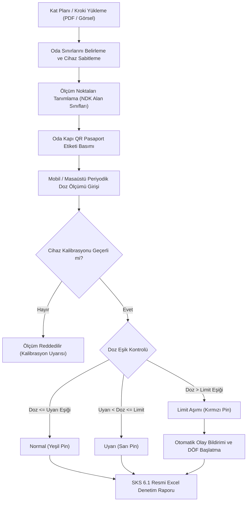
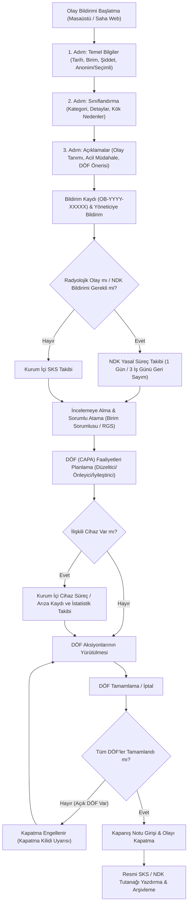
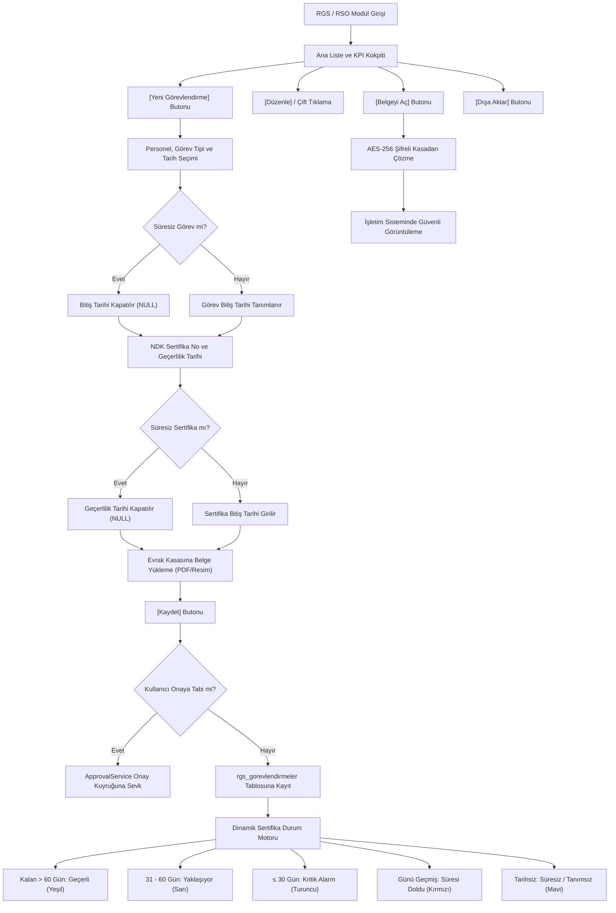
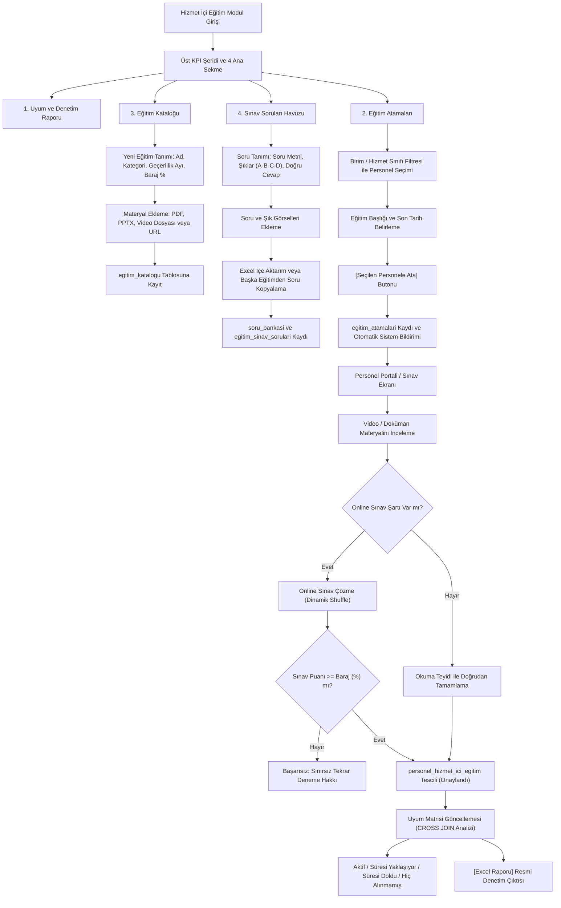

# RADPYS V4 — Güncel Kullanım Kılavuzu

RADPYS (Radyoloji ve Radyasyon Yönetim Sistemi), hastane radyoloji birimlerinin personel nöbetlerini, dozimetre takibini, ortam radyasyon ölçümlerini, koruyucu ekipman (RKE) muayenelerini ve tıbbi cihaz envanterini mevzuat standartlarına (NDK, Sağlık Bakanlığı SKS 6.1, DIN 6857-1) tam uyumlu olarak yöneten entegre karar destek platformudur.

---

## 01. Kurulum, Başlatma ve İlk Giriş

### 1. Hızlı Başlangıç ve Önemli Eşikler

- **Yasal & Güvenlik Standardı:** Sağlık Bakanlığı Bilgi Güvenliği Standartları & KVKK 6698 Uyumlu
- **Giriş Yöntemi:** Kurumsal Kullanıcı Adı ve Şifre
- **Zorunlu İlk Giriş Şifresi:** En az 8 karakter (Büyük harf, küçük harf, rakam ve özel karakter)
- **Destek ve Lisanslama:** 30 Günlük Deneme / Kurumsal Lisans Paketi
- **Platform:** 🖥️ Masaüstü Yönetim Uygulaması & 📱 Saha Web Portalı

---

### 2. 5N1K Kural ve Fonksiyon Tablosu

| NE? (Ekran Kontrolü) | NEDEN? (Kullanım Amacı) | NASIL? (Çalışma Mantığı) | NE ZAMAN? (Hangi Durumda) | KİM? (Yetkili Kitle) |
| --- | --- | --- | --- | --- |
| **Kullanıcı Girişi** | Sisteme güvenli kimlik doğrulamasıyla erişmek. | Kullanıcı adı ve şifre girilip **[Giriş Yap]** butonuna basılır veya Enter tuşuna dokunulur. | Programa her girişte. | Tüm personel. |
| **Beni Hatırla** | Kullanıcı adını tekrar tekrar yazma zahmetini ortadan kaldırmak. | Kutu işaretlendiğinde kullanıcı adı bilgisayara kaydedilir. Şifre asla kaydedilmez; sonraki açılışta imleç doğrudan şifre kutusunda başlar. | Kişisel/sabit çalışma bilgisayarlarında. | Tüm personel. |
| **Şifreyi Göster** | Parola yazarken olası harf veya rakam hatalarını anında fark etmek. | Kutu işaretlendiğinde gizli noktalar açık metne dönüşür. | Şifre yazımında hata şüphesi olduğunda. | Tüm personel. |
| **Zorunlu Şifre Değişimi** | Geçici veya varsayılan şifreyle sistemde kalınmasını engellemek. | İlk girişte açılan formda yeni şifre iki kez girilir. Standartları karşılayan şifre kaydedilince oturum açılır. İptal edilirse giriş sonlandırılır. | İlk kez oturum açıldığında veya parola süresi dolduğunda. | Yeni tanımlanan veya şifresi sıfırlanan personel. |
| **Parola Güvenlik Kuralları** | Tahmin edilmesi kolay şifrelerin kullanılmasını önlemek. | Şifre en az 8 karakter olmalı; en az bir büyük harf, bir küçük harf, bir rakam ve bir özel karakter içermelidir. Kullanıcı adıyla aynı olamaz. | Şifre belirlenirken veya güncellenirken. | Tüm personel. |
| **Şifremi Unuttum** | E-posta teyidiyle yeni şifre belirlemek. | **[Şifremi Unuttum?]** butonuna tıklanıp kullanıcı adı ve sisteme kayıtlı e-posta adresi yazılır; eşleşme doğrulanırsa yeni şifre kaydedilir. | Şifre hatırla­namadığında. | E-postası tanımlı personel. |
| **Evrensel Arama (Ctrl+K)** | Menüler arasında aramadan herhangi bir personele veya sayfaya 2 saniyede ulaşmak. | Klavyeden **Ctrl+K** tuşlarına basılır; arama kutusuna en az 2 harf yazıldığında sayfalar, hızlı işlemler ve personel kartları anında listelenir. | Hızlı işlem veya kayıt ararken. | Tüm kullanıcılar. |
| **Sistem Bildirim Merkezi** | Nöbet devri, olay bildirimi veya dozimetre uyarılarından anında haberdar olmak. | Sağ üstteki zil simgesine tıklanır. Okunmamış bildirim varsa zil açık maviye döner. Nöbet devir bildirimi tıklandığında doğrudan onay/red penceresi açılır. | Yeni bir görev veya uyarı atandığında. | İlgili görev personeli. |
| **Cihaz Kimliği (Machine ID)** | Kurum lisansını fiziksel sunucuya güvenle bağlamak. | **[Hakkında]** ekranında `RP-XXXX-...` formatındaki kimlik görüntülenir ve **[Kopyala]** butonuyla panoya alınarak lisans yöneticisine iletilir. | İlk lisans aktivasyonunda veya yenilemede. | Sistem Yöneticisi (Admin). |
| **Lisans Aktivasyonu** | Kurumun tam sürüm kullanım haklarını etkinleştirmek. | **[Hakkında]** penceresindeki lisans kutusuna sağlanan lisans anahtarı yapıştırılır ve **[Lisansı Aktifleştir]** butonuna basılır. | Lisans satın alındığında veya süre uzatıldığında. | Sistem Yöneticisi (Admin). |
| **Destek Paketi (Log) Oluştur** | Teknik takılmalarda analiz günlüklerini tek tıkla destek ekibine iletmek. | **[Destek Paketi (Log) Oluştur]** butonuna basıldığında sistem günlükleri Masaüstüne `radpys_destek_log.zip` olarak kaydedilir. | Beklenmeyen bir hata veya teknik destek ihtiyacında. | Tüm kullanıcılar / Birim Sorumlusu. |

---

### 3. Kritik Kural ve Saha Uyarıları

> ⚠️ **Saha Notu: Lisans Süresi Dolumu ve Yönetici Modu**  
> Kurum lisansının süresi bittiğinde sistem normal personelin giriş yapmasını otomatik olarak engeller. Sistem Yöneticisi (Admin) ise lisansı yenileyebilmesi amacıyla doğrudan **Lisans Aktivasyon** ekranına yönlendirilir; yeni anahtar girilene kadar operasyonel modüller kilitli kalır.

> 💡 **Pratik İpucu: E-postası Kayıtlı Olmayan Kullanıcılar**  
> Sistemde tanımlı bir e-posta adresi bulunmayan kullanıcılar **[Şifremi Unuttum?]** ekranından kendileri parola sıfırlayamaz. Bu personellerin birim amirine veya sistem yöneticisine başvurması gerekir; yönetici tek tıkla personele geçici şifre atayabilir.

> 🔒 **Güvenlik Standardı: Tekil Çalışma Kilidi**  
> RADPYS masaüstü uygulaması çalışırken masaüstü simgesine tekrar tıklanırsa ikinci bir pencere açılmaz; halihazırda açık olan program penceresi otomatik olarak ekranın en önüne getirilir.

---

### 4. Ekran Konumları ve Kullanım Adımları

#### A. Sisteme İlk Giriş ve Şifre Güncelleme

1. Masaüstündeki **RADPYS** simgesine çift tıklayarak uygulamayı başlatın.
2. Açılan ekranda **[Kullanıcı Adı]** ve **[Şifre]** alanlarını doldurun.
3. Kendi bilgisayarınızdaysanız **[Beni Hatırla]** kutusunu işaretleyin.
4. **[Giriş Yap]** butonuna tıklayın.
5. Eğer ilk girişinizse veya şifreniz sıfırlandıysa ekrana **Şifre Değiştirme** penceresi gelir.
6. En az 8 karakterden oluşan, büyük/küçük harf, rakam ve özel karakter içeren yeni şifrenizi iki kutuya da yazın ve **[Kaydet]** butonuna basın.

#### B. Evrensel Komut Paletini (Ctrl+K) Kullanma

1. Klavyeden **Ctrl+K** kısayoluna basın.
2. Arama çubuğuna gitmek istediğiniz sayfanın adını (Örn: *Nöbet*, *İzin*, *RKE*) veya aradığınız personelin adını/TC kimlik numarasını yazın.
3. Klavyenizin **Yukarı/Aşağı** ok tuşlarıyla listeden seçip **Enter** tuşuna basın. İlgili ekran saniyeler içinde açılacaktır.

#### C. Lisans Anahtarını Girme ve Aktifleştirme

1. Ekranın sağ üstündeki bilgi/hakkında menüsünden **[Hakkında]** penceresini açın.
2. **[Cihaz Kimliği]** yanındaki **[Kopyala]** butonuna basarak kurum cihaz kodunuzu lisans sağlayıcısına iletin.
3. Size iletilen lisans anahtarını **[Lisans Anahtarınızı Girin]** kutusuna yapıştırın.
4. **[Lisansı Aktifleştir]** butonuna tıklayın. Başarılı onay mesajından sonra tüm modüller açılacaktır.

---

## 02. Kullanıcı ve Rol Yönetimi

### 1. Hızlı Başlangıç ve Önemli Eşikler

- **Yetkilendirme Modeli:** Rol Tabanlı Erişim Kontrolü (RBAC) & 4 Kademeli Kapsam (Miras, Kendisi, Departman, Tümü)
- **Yetkili Rol:** Yalnızca Sistem Yöneticisi (`Admin`)
- **Şifre Sınırı:** En az 8 karakter (Yeni hesaplar ve şifre güncellemeleri için)
- **Hesap Durumu:** Fiziksel silme yoktur; hesaplar devre dışı bırakıldığında doğrudan **Pasife Alınır**
- **Platform:** 🖥️ Yalnızca Masaüstü Yönetim Uygulaması (Web portalında yetki/hesap yönetimi bulunmaz)

---

### 2. 5N1K Kural ve Fonksiyon Tablosu

| NE? (Ekran Kontrolü) | NEDEN? (Kullanım Amacı) | NASIL? (Çalışma Mantığı) | NE ZAMAN? (Hangi Durumda) | KİM? (Yetkili Kitle) |
| --- | --- | --- | --- | --- |
| **Yeni Kullanıcı Tanımlama** | Kurum personeline veya idari operatörlere sisteme giriş yetkisi vermek. | **[Yeni Kullanıcı]** butonuna tıklanır; kullanıcı adı, ad soyad, rol ve en az 8 karakterli ilk şifre girilerek kaydedilir. | Yeni bir çalışan göreve başladığında. | Sistem Yöneticisi. |
| **Personel Bağlantısı** | Kullanıcı hesabını personelin özlük, nöbet, izin ve dozimetre siciline bağlamak. | Formdaki **[Personel Bağlantısı]** açılır kutusundan ilgili personelin adı seçilir. Bağlantı kurulmazsa hesap yalnızca bağımsız operatör olur; nöbet veya dozimetreye dahil edilmez. | Klinik çalışanlara hesap açılırken. | Sistem Yöneticisi. |
| **Hesap Kilidi Kaldırma** | Yanlış şifre denemeleri nedeniyle kilitlenen kullanıcının giriş engelini kaldırmak. | Listeden kilitli kullanıcı seçilir; aktifleşen **[Kilidi Kaldır]** butonuna basılarak hatalı deneme sayacı anında sıfırlanır. | Personel şifresini art arda yanlış girip kilitlendiğinde. | Sistem Yöneticisi. |
| **Hesabı Pasife Alma** | Görevden ayrılan veya geçici olarak yetkisi durdurulan kullanıcının erişimini kesmek. | Kullanıcı seçilip **[Aktif/Pasif]** veya **[Pasif Yap]** butonuna basılır. Sistemde fiziksel silme yapılmaz; hesap pasife çekilerek işlem geçmişi korunur. | Personel kurumdan ayrıldığında veya izne çıktığında. | Sistem Yöneticisi. |
| **Kendi Hesabını ve Admin'i Koruma** | Sistemin yöneticisiz kalmasını ve yanlışlıkla kilitlenmesini engellemek. | Açık oturum kullanıcısı kendi hesabını pasife alamaz. Sistem omurgasını oluşturan `Admin` kullanıcısı ve rolü pasife alınamaz veya adı değiştirilemez. | Yanlışlıkla işlem yapılmaya çalışıldığında. | Tüm yöneticiler için otomatik kilit. |
| **Yeni Rol Ekleme ve Kapsam** | Departman bazlı görev ve veri erişim sınırlarını belirlemek. | **[Sistem Rolleri]** sekmesinden **[Yeni Rol Ekle]** butonuna basılır. Rol adı, açıklaması ve veri kapsamı (Kendisi, Departman, Tümü) seçilerek kaydedilir. | Yeni bir unvan veya sorumluluk grubu tanımlandığında. | Sistem Yöneticisi. |
| **Rol Kopyalama (Klonlama)** | Çok sayıda modül yetkisini baştan seçmek yerine mevcut bir rolden yeni rol türetmek. | Rol seçilip **[İşlemler] > [Seçileni Kopyala]** tıklanır. Kaynak rolün tüm modül okuma/yazma/silme ve kapsam ayarları yeni role aktarılır. | Benzer yetkilere sahip yeni bir görev profili oluşturulurken. | Sistem Yöneticisi. |
| **Role Bağlı Kullanıcıları Görme** | Bir rolde yetki değişikliği yapmadan önce o rolden etkilenen personelleri denetlemek. | Rol tablosunda sağ tıklanıp **[Kullanıcıları Göster]** seçilir. İlgili role atanmış personeller durumlarıyla birlikte açılır. | Rol düzenleme veya yetki daraltma öncesinde. | Sistem Yöneticisi. |
| **Okuma Yetkisi Bağımlılık Motoru** | Görme yetkisi olmayan personelin kayıt eklemesini veya silmesini engellemek. | Modül Yetkileri sekmesinde Yazma, Güncelleme veya Silme kutusu işaretlendiğinde **Okuma** kutusu otomatik açılır. Okuma kapatıldığında diğer tüm yetkiler otomatik kapanır. | Yetki matrisinde kutular işaretlenirken. | Sistem Yöneticisi. |
| **Modül Düzeyinde Kapsam (Miras / Özel)** | Bir rolün genel yetki alanını belirli modüller için esnetmek veya daraltmak. | Matriste her modül satırında 4 seçenek sunulur: **[Miras]** (Rolün genel ayarını kullanır), **[Kendisi]**, **[Departman]** veya **[Tümü]**. | Örneğin teknikere genel olarak sadece kendi kayıtlarını görme yetkisi verilip, Nöbet modülünde 'Kendi Departmanı'nı görmesi istendiğinde. | Sistem Yöneticisi. |
| **Hazır Yetki Şablonları** | Modülleri tek tek işaretlemeden saniyeler içinde standart profiller uygulamak. | **[Şablon Uygula]** açılır kutusundan *Sadece Okuma*, *Operasyon* veya *Tam Yetki* seçilip **[Şablon Uygula]** butonuna basılır. | Yeni bir role temel yetki dağıtımı yapılırken. | Sistem Yöneticisi. |
| **Roller Arası Canlı Kıyaslama** | İki farklı rolün yetki ve kapsam farklarını denetlemek. | **[Karşılaştır]** kutusundan ikinci bir rol seçilip butona basılır. İki rol arasındaki yetki farkları semantik renklerle vurgulanır ve karşılaştırma tablosu açılır. | Yetki çakışması veya denetim kontrollerinde. | Sistem Yöneticisi. |

---

### 3. Kritik Kural ve Saha Uyarıları

> ⚠️ **Saha Notu: Fiziksel Silme Yoktur — Pasife Alma İlkesi**  
> RADPYS veri tabanında kullanıcılar fiziksel olarak sistemden silinmez. Kullanıcı için yapılan "Sil" veya "Pasif Yap" işlemleri hesabı `Pasif` durumuna çeker. Böylece kullanıcının geçmişte onayladığı nöbetler, girdiği dozimetre ölçümleri ve sağlık kayıtları sistem denetim izinde bozulmadan korunur.

> 🔒 **Güvenlik Standardı: Personel Kartı Bağlantısı Olmayan Hesaplar**  
> Kullanıcı tanımlanırken **[Personel Bağlantısı]** yapılmazsa (seçenek: *Bağlama*), bu hesap yalnızca bağımsız bir operatör/yönetim hesabı olarak çalışır. Personel kartı bulunmayan hesaplar nöbet listelerine, izin hakediş tablolarına veya kişisel dozimetre takip havuzuna **kesinlikle dahil edilemez**.

> 💡 **Pratik İpucu: Miras Kapsamı ve Hiyerarşik Kural**  
> Modül yetki tablosundaki **Miras** radyo düğmesi, ilgili modülün rolün genel tanımındaki kapsamı (Kendisi, Kendi Departmanı, Tümü) aynen devralmasını sağlar. Belirli bir modüle özel yetki alanı tanımak istediğinizde doğrudan **[Kendisi]**, **[Departman]** veya **[Tümü]** radyo butonunu seçebilirsiniz.

---

### 4. Ekran Konumları ve Kullanım Adımları

#### A. Yeni Kullanıcı Hesabı Tanımlama

1. Sol ana menüden **[Yönetici Paneli] > [Kullanıcı ve Rol Yönetimi]** ekranını açın.
2. Açılan pencerede **[Kullanıcı İşlemleri]** sekmesindeyken **[Yeni Kullanıcı]** butonuna tıklayın.
3. **[Kullanıcı Adı]**, **[Ad Soyad]** ve kurumsal **[Email]** bilgilerini girin.
4. Kullanıcının kurumdaki yetki seviyesine uygun **[Rol]** seçimini yapın.
5. Kullanıcı bir sağlık personeli ise **[Personel Bağlantısı]** kutusundan personel kaydını seçin.
6. En az 8 karakterden oluşan geçici bir **[Şifre]** belirleyin ve onay kutusuna tekrar yazın.
7. **[Kaydet]** butonuna basın. Kullanıcı sisteme ilk girişinde bu geçici şifreyi değiştirmek zorunda kalacaktır.

#### B. Kilitli Kullanıcı Hesabını Açma

1. Kullanıcı listesinde arama çubuğunu veya filtreleri kullanarak ilgili kullanıcıyı bulun.
2. Hatalı şifre nedeniyle kilitlenmiş kullanıcının satırına tıklayın.
3. Araç çubuğunda aktifleşen **[Kilidi Kaldır]** butonuna basın.
4. Ekrana gelen onay penceresinde işlemi onaylayın. Hatalı giriş sayacı anında sıfırlanacak ve personel sisteme giriş yapabilecektir.

#### C. Rol Yetki Matrisini Düzenleme ve Şablon Uygulama

1. **[Kullanıcı ve Rol Yönetimi]** penceresinde **[Modül Yetkileri]** sekmesine geçin.
2. Üst kısımdaki **[Rol Seçin]** açılır kutusundan yetkilerini düzenlemek istediğiniz rolü seçin.
3. Hızlı yetkilendirme için **[Şablon]** kutusundan örneğin *Operasyon* şablonunu seçip **[Şablon Uygula]** butonuna tıklayın.
4. İhtiyaç duyduğunuz özel modüllerde Okuma, Yazma, Güncelleme veya Silme kutularını tek tek düzenleyin.
5. Satırların sağındaki **[Kapsam]** radyo düğmelerinden personelin erişim sınırını (Miras, Kendisi, Departman, Tümü) belirleyin.
6. Yapılan düzenlemeleri sisteme işlemek için sağ alttaki **[Kaydet]** butonuna tıklayın.

---

## 03. Sistem Ayarları ve Tanımlamalar

### 1. Hızlı Başlangıç ve Önemli Eşikler

- **Yetkili Rol:** Yalnızca Sistem Yöneticisi (`Admin`)
- **Resmi Antet Desteği:** Çift Başlık (Metin) ve Çift Logo (Görsel) Entegrasyonu
- **Rapor Şablonları:** Word (`.docx`) ve Excel (`.xlsx`) kurumsal yer tutucu standardı (`{{BASLIK_1}}`, `{{BASLIK_2}}`, `{{LOGO_1}}`, `{{LOGO_2}}`)
- **Departman Güvenliği:** Fiziksel silme yasaktır; personeli veya alt birimi olan departman pasife alınamaz (Transfer zorunluluğu)
- **Kodlama Standardı:** 2-20 karakter, yalnızca büyük harf, rakam ve alt çizgi (`_`)
- **Tatil Takvimi Eşiği:** 0.5 adımlı gün sayısı (Arefe ve yarım günler için `0.5`, `1.0`, `1.5`...)
- **Platform:** 🖥️ Yalnızca Masaüstü Yönetim Uygulaması (Web portalı yalnızca salt okunur referans veri tüketir)

---

### 2. 5N1K Kural ve Fonksiyon Tablosu

| NE? (Ekran Kontrolü) | NEDEN? (Kullanım Amacı) | NASIL? (Çalışma Mantığı) | NE ZAMAN? (Hangi Durumda) | KİM? (Yetkili Kitle) |
| --- | --- | --- | --- | --- |
| **Sistem Gezinim Ağacı** | Sistem ayarları ve tanımlama modüllerine tek bir entegre merkezden ulaşmak. | Sol ağaç menüsünden ilgili alt başlığa (Program Ayarları, Departmanlar, Unvanlar, Tatiller vb.) tıklanır; sayfa dinamik olarak sağ panele gelir. | Sistem konfigürasyonu yapılırken. | Sistem Yöneticisi. |
| **Genel Program Parametreleri** | Uygulamanın çalışma kurallarını ve sistem davranışlarını belirlemek. | Tablodan ayar seçilir; sağ panelde **[Değer]** ve **[Açıklama]** düzenlenip **[Güncelle]** butonuna basılır. | Sistem genelinde parametre güncellenirken. | Sistem Yöneticisi. |
| **Dinamik Dil Seçimi** | Uygulama çalışma dilini yeniden başlatmaya gerek kalmadan değiştirmek. | Dil ayarından *TR* veya *EN* seçilip kaydedildiğinde çeviri motoru tüm arayüz metinlerini anında günceller. | Dil tercihi değiştirilmek istendiğinde. | Sistem Yöneticisi. |
| **Fiili Hizmet Kaynak Seçimi** | Yıpranma payı (FHZ) puantajının hangi kaynaktan besleneceğini belirlemek. | Açılır kutudan *Hibrit Model*, *Sadece Manuel* veya *Sadece Nöbet* seçilir. Kritik uyarı onaylandıktan sonra yöntem devreye girer. | Hastane bordro ve nöbet politikası belirlenirken. | Sistem Yöneticisi. |
| **Kurum Çift Başlık Ayarı** | Resmi rapor ve evrakların üst kısmına resmi kurum başlıklarını basmak. | **[Kurum Başlık 1]** (Örn: T.C. Sağlık Bakanlığı) ve **[Kurum Başlık 2]** (Örn: Şehir Hastanesi Radyoloji Kliniği) metinleri girilir. Onay kutuları ile aktif/pasif yapılır. | Kurum anteti ilk kurulurken veya değiştiğinde. | Sistem Yöneticisi. |
| **Kurum Çift Logo Seçimi** | Rapor antetinin sol ve sağ köşelerine resmi kurum logolarını yerleştirmek. | **[Gözat]** butonuna basılarak bilgisayardan logo seçilir. Sistem logoyu otomatik olarak güvenli kaynak klasörüne kopyalar ve yansıtır. | Kurum veya üniversite logosu eklenirken. | Sistem Yöneticisi. |
| **Canlı Antet Önizlemesi** | Başlık ve logoların resmi evrakta nasıl basılacağını anında ekranda denetlemek. | Formda metin yazıldıkça veya kutu işaretlendikçe sağdaki önizleme kutusu (100x100 logo, ortalanmış başlıklar) canlı olarak anında güncellenir. | Antet ayarları yapılırken. | Sistem Yöneticisi. |
| **Şablonu Uygulamada Açma** | Word (.docx) veya Excel (.xlsx) rapor şablonu üzerinde ofis araçlarıyla tasarım yapmak. | Açılır kutudan şablon seçilip **[Aç]** butonuna basılır; şablon doğrudan Microsoft Office veya LibreOffice programında açılır. | Şablon mizanpajı veya tablo tasarımı düzenlenirken. | Sistem Yöneticisi. |
| **Şablon Orijinaline Sıfırlama** | Hatalı biçimlendirilen veya bozulan rapor şablonunu fabrika ayarlarına döndürmek. | Şablon seçilip **[Yeniden Oluştur]** butonuna basılır. Sistem, fabrika standartlarındaki orijinal şablonu baştan üretir. | Şablon bozulduğunda veya sıfırlanmak istendiğinde. | Sistem Yöneticisi. |
| **Departman Hiyerarşisi** | Hastane organizasyon şemasını Anabilim Dalı ve alt bilim dalları olarak modellemek. | **[Departman Adı]**, **[Kod]** ve **[Üst Departman]** seçilerek kaydedilir. Döngüsel hiyerarşi engeli sayesinde bir birim kendisinin alt birimi yapılamaz. | Yeni klinik, laboratuvar veya ünite açıldığında. | Sistem Yöneticisi. |
| **Birim Sorumlusu ve Kroki Bağlama** | Departmanı yetkili amirine ve mimari kat planındaki konumuna bağlamak. | **[Birim Sorumlusu]** seçilir; **[Kat Planı / Kroki]** kutusundan mimari plan seçilir veya **[Yeni Yükle...]** ile doğrudan PDF/görsel kroki yüklenir. | Departman künyesi ve oda planı oluşturulurken. | Sistem Yöneticisi. |
| **Departman Pasife Alma Kalkanı** | Personeli veya alt birimi bulunan aktif departmanın silinerek yetim veri kalmasını önlemek. | Departmanda silme butonu yoktur; yalnızca pasife alınabilir. Bağlı personel veya alt birim varsa sistem pasife almayı engeller; önce transfer ister. | Bir departman kapatılmak istendiğinde. | Sistem Yöneticisi. |
| **Unvan ve Hizmet Sınıfları** | Personelin mesleki unvanını, hizmet sınıfını ve nöbet/radyasyon varsayılanlarını belirlemek. | Unvan adı ve kodu girilir; **[Radyasyon Görevlisi mi?]** ve **[Nöbet Tutabilir]** kutuları ayarlanır. Yeni personele bu ayarlar otomatik devredilir. | Yeni kadro unvanı eklendiğinde. | Sistem Yöneticisi. |
| **Resmi Tatil Takvimi** | Nöbet planlaması ve izin hakedişlerinde resmi tatil günlerini dikkate almak. | Tarih, tatil adı, tatil türü (Resmi, Dini, İdari) ve gün sayısı girilir. **[Yıl Filtresi]** ile cari yıl tatilleri kolayca yönetilir. | Her takvim yılı başında veya tatil eklendiğinde. | Sistem Yöneticisi. |
| **Tatil 0.5 Gün (Yarım Gün) Eşiği** | Arefe günleri ve yarım günlük idari izinlerin nöbet puantajına tam yansımasını sağlamak. | Tatil gün sayısı kutusuna `0.5`, `1.0`, `1.5` gibi 0.5'in katı olan değerler girilir; nöbet dağıtım motoru arefe günlerini yarım gün tatil sayar. | Kurban/Ramazan bayramı arefelerinde. | Sistem Yöneticisi. |

---

### 3. Kritik Kural ve Saha Uyarıları

> ⚠️ **DİKKAT: Fiili Hizmet (FHZ) Hesaplama Kaynağı Değişimi**  
> Fiili hizmet hesaplama yöntemi (*Hibrit*, *Manuel* veya *Nöbet*) değiştirildiğinde daha önce kapatılmış olan dönem puantajlarının ve SGK yıpranma payı bildirimlerinin tutarlılığı etkilenebilir. Bu yöntemin yıl ortasında keyfi olarak değiştirilmemesi, zorunlu değişikliklerin yalnızca takvim yılı veya mali dönem başında yapılması gerekmektedir.

> 🔒 **Operasyonel Güvenlik: Departman Kapatma ve Personel Transferi Zorunluluğu**  
> Sistemde departman kayıtları fiziksel olarak silinemez. Kapatılmak istenen bir birim pasife alınmadan önce, o birimde görevli personellerin başka bir departmana transfer edilmesi ve varsa alt bilim dallarının üst departman bağlantısının güncellenmesi zorunludur. Aksi halde sistem işlemi güvenlik kalkanıyla engeller.

> 💡 **Pratik İpucu: Şablon Sıfırlama Öncesi data/templates/ Yedeği Alma**  
> Şablon yönetim ekranındaki **[Yeniden Oluştur]** butonu, ilgili Word veya Excel dosyasını sıfırdan kurumsal fabrika ayarlarına döndürür. Şablon üzerinde daha önce yapmış olduğunuz özel tablo genişlikleri ve metin düzenlemeleri varsa, bu butona basmadan önce **[Klasörü Aç]** butonuna tıklayarak `data/templates/` klasörünün bir kopyasını masaüstünüze yedeklemeniz önerilir.

---

### 4. Ekran Konumları ve Kullanım Adımları

#### A. Kurum Başlıklarını ve Logolarını Ayarlama

1. Sol menüden **[Yönetici Paneli] > [Sistem Ayarları]** ekranını açın.
2. Gezinim ağacından **[Rapor & Şablon Ayarları]** (veya Rapor Şablonları) sayfasına tıklayın.
3. **[Kurum Başlık 1]** kutusuna üst kurum adınızı (Örn: *T.C. SAĞLIK BAKANLIĞI*), **[Kurum Başlık 2]** kutusuna hastane/klinik adınızı yazın.
4. Başlıkların raporlarda görünmesi için sollarındaki onay kutularını işaretleyin.
5. **[Kurum Logo 1]** ve **[Kurum Logo 2]** yanındaki **[Gözat...]** butonuna tıklayarak resmi logo dosyalarını bilgisayarınızdan seçin.
6. Sağ taraftaki **Canlı Önizleme** kutusundan logoların ve başlıkların uyumunu kontrol edin.
7. Alt kısımdaki **[Kaydet]** butonuna basın. Tüm sistem raporları bu antetle üretilecektir.

#### B. Departman Tanımlama ve Kat Planı Eşleme

1. Sol menüdeki Sistem Yönetimi ağacından **[Sistem Tanımları] > [Departman Tanımları]** öğesini seçin.
2. Sağ üstteki **[Yeni]** butonuna tıklayın.
3. **[Departman Adı]** alanına birimin tam adını (Örn: *Nükleer Tıp Anabilim Dalı*), **[Kod]** alanına standart kodu (Örn: *NUK_TIP*) yazın.
4. Eğer bu bir birimin alt dalıysa **[Üst Departman]** açılır kutusundan ana birimi seçin.
5. Birimin sorumlu hekimini veya amirini **[Birim Sorumlusu]** kutusundan atayın.
6. Birim radyasyonlu alan içeriyorsa **[Radyasyonlu alan]** kutusunu, nöbet tutuluyorsa **[Nöbet usulü mesai]** kutusunu işaretleyin.
7. **[Kat Planı / Kroki]** kutusundan mimari planı seçin ve **[Oda / Mahalle Kodu]** alanına oda numarasını girin.
8. **[Ekle]** butonuna basarak departmanı sisteme kaydedin.

#### C. Resmi ve Dini Tatil Takvimini Düzenleme

1. Gezinim ağacından **[Sistem Tanımları] > [Resmi/Dini Tatiller]** öğesine tıklayın.
2. **[Yeni]** butonuna basın.
3. **[Tarih]** kutusundan tatil gününü belirleyin.
4. **[Tatil Adı]** kutusuna tatilin resmi adını yazın veya açılır öneri listesinden seçin (Örn: *Cumhuriyet Bayramı*).
5. **[Tür]** kutusundan *Resmi*, *Dini* veya *İdari* seçeneğini işaretleyin.
6. **[Gün Sayısı]** alanını tam gün tatiller için `1.0`, arefe günleri veya yarım günlük idari izinler için `0.5` olarak ayarlayın.
7. **[Ekle]** butonuna tıklayın. Nöbet dağıtım motoru ve izin hesaplama modülleri bu takvimi otomatik olarak dikkate alacaktır.

---

## 04. Veritabanı Bakım ve Güvenlik

### 1. Hızlı Başlangıç ve Önemli Eşikler

- **Veritabanı Motoru:** PostgreSQL 14+ (Kurumsal İlişkisel Veritabanı Mimarisi)
- **Yedekleme Kriptografisi:** 256-bit PBKDF2 (100.000 iterasyon) + AES Akış Şifrelemesi
- **Yetkili Rol:** Yalnızca Sistem Yöneticisi (`Admin` / `Superadmin`)
- **Güvenlik Doğrulaması:** Kritik işlemlerde (Geri yükleme, silme, sıfırlama) **Sudo Modu (Yönetici Şifre Doğrulaması)**
- **Sıfırlama Güvenlik Kilidi:** Rol Kontrolü + Büyük harflerle `"SIFIRLA"` Onayı + Sudo Şifresi
- **Platform:** 🖥️ Yalnızca Masaüstü Yönetim Uygulaması (Web portalı güvenlik nedeniyle bakım uç noktalarına kapalıdır)

---

### 2. 5N1K Kural ve Fonksiyon Tablosu

| NE? (Ekran Kontrolü) | NEDEN? (Kullanım Amacı) | NASIL? (Çalışma Mantığı) | NE ZAMAN? (Hangi Durumda) | KİM? (Yetkili Kitle) |
| --- | --- | --- | --- | --- |
| **Veritabanı Yedekle** | Sistemdeki tüm klinik ve idari verilerin anlık, şifreli tam yedeğini almak. | **[Veritabanı Yedekle]** butonuna basılır. Sistem, PostgreSQL dökümünü (`pg_dump`) alır; 256-bit anahtarla şifreleyerek zaman damgalı `.dump` dosyası üretir. | Düzenli periyotlarla veya büyük veri girişi/güncelleme öncesinde. | Sistem Yöneticisi. |
| **Dosyaları Yedekle** | Personel özlük evrakları, taranmış sertifikalar ve cihaz belgelerini arşivlemek. | **[Dosyaları Yedekle]** butonuna tıklanır. Sistem, yüklü dosyalar klasörünü zip paketi haline getirir ve şifreleyerek `.zip` yedeği oluşturur. | Evrak kasası yedeklenmek istendiğinde. | Sistem Yöneticisi. |
| **Yedekler Listesi & Boyut** | Alınmış geçmiş yedekleri boyut ve zaman bilgisiyle denetlemek. | Tabloda yedek dosyasının adı, oluşturulma tarihi ve MB cinsinden boyutu listelenir. Sıralama en yeniden en eskiye doğrudur. | Yedek durumunu kontrol ederken veya geri yükleme seçerken. | Sistem Yöneticisi. |
| **Yedeği Geri Yükle (Yükle)** | Bozulma veya sistem çökmesi durumunda veritabanını önceki bir tarihe döndürmek. | Tablodaki **[Yükle]** butonuna basılır. Çift uyarı onaylanır ve Sudo şifresi girilir. Dosya çözülerek PostgreSQL motoruna aktarılır ve sayaçlar eşitlenir. | Donanım arızası, hatalı toplu işlem veya felaket kurtarma senaryolarında. | Yalnızca Süper Yönetici (Sudo). |
| **Yedeği Dışa Aktar** | Şifreli yedeği sunucu dışındaki harici bir diske veya ağ sürücüsüne kopyalamak. | Tablodaki **[Dışa Aktar]** butonuna basılır; açılan dosya kaydetme penceresinden harici disk veya USB bellek seçilerek kopya çıkarılır. | Harici lokasyonda çevrimdışı (offsite) arşivleme yapılırken. | Sistem Yöneticisi. |
| **Yedeği Kalıcı Olarak Silme** | Disk alanını dolduran eski ve ihtiyaç kalmayan yedekleri temizlemek. | Tablodaki **[Sil]** butonuna basılır; silme onayı verildikten sonra yönetici şifresi doğrulanarak dosya kalıcı olarak kaldırılır. | Disk alanı yönetimi yapıldığında. | Yalnızca Süper Yönetici (Sudo). |
| **Boyut Optimize Et (VACUUM)** | Silinen veya güncellenen kayıtların bıraktığı boşlukları temizleyip boyutu küçültmek. | **[Boyut Optimize Et (VACUUM)]** butonuna tıklanır. Arka planda PostgreSQL `VACUUM ANALYZE` çalıştırılır; işlem öncesi ve sonrası boyut kazanımı ekranda bildirilir. | Ayda bir veya yoğun veri silme/güncelleme işlemlerinin ardından. | Sistem Yöneticisi. |
| **İndeksleri Yenile (REINDEX)** | Sorgu performansını artıran arama indekslerini baştan inşa etmek. | **[İndeksleri Yenile (REINDEX)]** butonuna tıklanır. Veritabanındaki tüm indeksler yeniden oluşturularak arama hızı en üst seviyeye çıkarılır. | Arama işlemlerinde yavaşlama hissedildiğinde veya sürüm güncellemeleri sonrasında. | Sistem Yöneticisi. |
| **Sistem Tanısı ve Otomatik Onarım** | Veritabanı tutarsızlıklarını, yetim kayıtları ve kullanıcı form hatalarını onarmak. | **[Sistem Tanısı ve Bütünlük Kontrolü]** butonuna basılır. Sihirbaz şemayı tarar; **[Otomatik Düzelt & Onar]** butonuyla yetim nöbet kayıtları, boşluklu personel adları ve kilitli hesaplar tek tıkla düzeltilir. | Dönem sonlarında veya sistemde tutarsızlık şüphesi olduğunda. | Sistem Yöneticisi (Sudo). |
| **Veritabanını Sıfırla (Fabrika Ayarları)** | İşlem ve hareket verilerini temizleyip sistemi sıfır kurulum durumuna döndürmek. | **[Veritabanını Sıfırla]** butonuna basılır. Doğrulama kutusuna büyük harflerle **"SIFIRLA"** yazılır ve Sudo şifresi girilir. 48 işlem tablosu temizlenir; tanımlar, ayarlar ve admin hesabı korunur. | Kurum devrinde, test süreci sonunda veya yeni takvim yılı sıfır başlangıcında. | Yalnızca Root/Admin (Sudo). |
| **Tarihsel Log Görüntüleyici** | Uygulama, hata ve senkronizasyon günlüklerini canlı incelemek. | Log Görüntüleyici ekranında dosya türü (`app.log`, `errors.log` vb.) seçilir. Arama kutusu, seviye (INFO/WARNING/ERROR) ve tarih filtresi uygulanarak kayıtlar okunur. | Sistem hatalarını incelerken veya denetim kontrollerinde. | Sistem Yöneticisi. |
| **Kullanıcı Etkileşim Günlüğü** | Kullanıcıların ekranda yaptığı tıklamaları, form girişlerini ve sonuçları izlemek. | İkinci sekmede oturum ve işlem türü bazlı filtreleme yapılır. Satıra çift tıklandığında ham veri modalı açılır. **[Günlüğü Temizle]** ile son oturum hariç geçmiş temizlenebilir. | Kullanıcı şikayetlerinde, kullanım analizi ve hata kök neden araştırmalarında. | Sistem Yöneticisi. |
| **Kriptografik Denetim İzi (KVKK)** | Kritik yasal işlemlerin SHA-256 zincir bütünlüğünü doğrulamak. | Üçüncü sekmede her kaydın hash değeri incelenir. Zincirde dışarıdan tahrifat yapılmışsa ekran kırmızı ikazla uyarır; bozulmamışsa yeşil doğrulama rozeti sunar. | Resmi KVKK, NDK veya Sağlık Bakanlığı denetimlerinde. | Sistem Yöneticisi / Denetçi. |
| **Beklenmeyen Hata Diyaloğu (Crash)** | Sistem beklenmedik bir hatayla karşılaştığında çökmesini önleyip rapor oluşturmak. | Hata anında açılan pencereden **[Hata Detayını Kopyala]** veya **[E-Posta Gönder]** seçilerek teknik destek ekibine tek tıkla traceback dökümü iletilir. | Yakalanmamış sistem arızalarında. | Karşılaşan tüm kullanıcılar. |

---

### 3. Kritik Kural ve Saha Uyarıları

> 🔴 **KRİTİK UYARI: Yedekleme Şifreleme Anahtarının Korunması**  
> RADPYS yedekleri, sunucu veritabanı ayarlarında kayıtlı olan 256-bit AES anahtarı ile şifrelenir. Veritabanı ayarlarındaki bu anahtar silinir veya değiştirilirse, **geçmiş tarihlerde alınmış hiçbir şifreli yedek geri yüklenemez ve veriler kurtarılamaz**. Kurulum sonrası şifreleme anahtarının güvenli bir fiziksel ortamda not edilmesi tavsiye edilir.

> ⚠️ **Saha Notu: Geri Yükleme (Restore) Sonrası Programı Yeniden Başlatma**  
> Veritabanı başarıyla geri yüklendikten sonra, mevcut açık pencerelerin ve bellek önbelleğinin yeni verilerle senkronize olabilmesi için **RADPYS masaüstü uygulamasını derhal kapatıp yeniden başlatınız**.

> 🔒 **Güvenlik Prosedürü: Fabrika Ayarlarına Sıfırlamada Korunan Alanlar**  
> Veritabanını Sıfırla işlemi; personeller, nöbet çizelgeleri, izinler, dozimetre ölçümleri ve arıza kayıtları gibi tüm hareket verilerini temizler. Ancak kurumun oluşturduğu **Departmanlar, Unvanlar, Tatil Takvimi, Sistem Ayarları, Roller, Yetki Şablonları ve `Admin` hesabı kesinlikle silinmez; korunur**.

> 💡 **Pratik İpucu: Çökme Anında E-Posta ile Hızlı Destek**  
> Sistemde beklenmeyen bir hata oluştuğunda açılan penceredeki **[E-Posta Gönder]** butonu, bilgisayarınızdaki e-posta istemcisini doğrudan `radpys.iletisim@gmail.com` adresine hazır bir teknik şablonla açar. E-postayı göndermeniz durumunda teknik ekip hataya dakikalar içinde müdahale edebilir.

---

### 4. Ekran Konumları ve Kullanım Adımları

#### A. Şifreli Veritabanı ve Dosya Yedeği Alma

1. Ana ekranın sol menüsünden **[Veritabanı Bakım]** (veya Araçlar menüsünden **[Veritabanı]**) butonuna tıklayın.
2. Açılan pencerenin sol üstündeki **[Veritabanı Yedekle]** butonuna basın.
3. Buton üzerinde *"Yedekleniyor..."* animasyonu belirecek ve işlem arka planda güvenle tamamlanacaktır.
4. Başarı bildiriminin ardından alınan yedek, zaman damgası ve dosya boyutuyla birlikte **Veritabanı Yedekleri** tablosunun en üst sırasına eklenecektir.
5. Personel evraklarını ve taranmış belgeleri de arşivlemek için yanındaki **[Dosyaları Yedekle]** butonuna tıklayın.

#### B. Eski Bir Yedeği Sisteme Geri Yükleme (Disaster Recovery)

1. Veritabanı Bakım ekranındaki yedekler tablosundan geri dönmek istediğiniz tarihli yedeği bulun.
2. İlgili satırın sağındaki **[İşlemler]** sütununda yer alan mavi **[Yükle]** butonuna basın.
3. Ekrana gelen kritik veri kaybı uyarı mesajını dikkatlice okuyup **[Evet]** seçeneğine tıklayın.
4. Açılan güvenlik penceresine Sistem Yöneticisi (Admin) şifrenizi (**Sudo Doğrulaması**) girin.
5. Geri yükleme tamamlandığında çıkan bilgi kutusunu onaylayın ve değişikliklerin ekranda güncellenmesi için **uygulamayı kapatıp yeniden başlatın**.

#### C. PostgreSQL VACUUM ve REINDEX Motor Bakımı

1. Ekranın sağ tarafındaki **[Sistem Bakım Araçları]** paneline gidin.
2. Veritabanı dosyasındaki ölü satırları temizleyip diske yer kazandırmak için **[Boyut Optimize Et (VACUUM)]** butonuna tıklayın.
3. İşlem bittiğinde ekrana gelen kutuda önceki boyut ve yeni boyut farkını inceleyip **[Tamam]**'a basın.
4. Arama hızını optimize etmek için altındaki **[İndeksleri Yenile (REINDEX)]** butonuna tıklayarak tüm indeksleri sıfırdan kurun.

#### D. Sistem Tanısı ve Otomatik Onarım Sihirbazını Çalıştırma

1. Bakım araçları panelinden **[Sistem Tanısı ve Bütünlük Kontrolü]** butonuna tıklayın.
2. Açılan pencere sistemdeki şema bütünlüğünü, yetim kayıtları ve hatalı izin tarihlerini otomatik olarak tarar.
3. Eğer ekranda sarı ikazla anomali tespit edildiği bildirilirse, pencerenin üstündeki mavi **[Otomatik Düzelt & Onar]** butonuna basın.
4. Onay verdikten sonra yönetici şifrenizi girin. Sistem yetim kayıtları temizleyip personel isim boşluklarını otomatik olarak düzeltecektir.

#### E. Veritabanını Fabrika Ayarlarına Sıfırlama

1. Ekranın sağ altındaki kırmızı çerçeveli **[Tehlikeli Bölge]** kartına gelin.
2. **[Veritabanını Sıfırla (Verileri Temizle)]** butonuna tıklayın.
3. Açılan güvenlik modalındaki metin kutusuna tam olarak büyük harflerle **SIFIRLA** yazın ve **[Veritabanını Sıfırla]** butonuna basın.
4. Son aşamada açılan pencereye Sistem Yöneticisi (Admin) şifrenizi girin.
5. İşlem bittiğinde tüm hareket verileri temizlenecek, tanımlarınız ve admin hesabınız korunarak sistem fabrika ayarlarına döndürülecektir.

---

## 05. Personel Yönetimi ve Toplu Aktarım

### Genel Bakış ve Temel Amaç

Personel Yönetimi modülü, radyasyonla çalışan tüm personelin özlük, lisans, unvan, görev yeri, radyasyon çalışma grubu (Grup A / B), lisans kotası, sağlık muayeneleri, zimmetli koruyucu ekipman (RKE) ve dozimetre takibini mevzuata uygun biçimde yürüten merkezi yönetim merkezidir.

Personel kayıtları hem masaüstü Windows arayüzünden (`ui/controllers/personel/personel_list_controller.py`) hem de web portalı üzerinden (`web_portal/routes/personel.py`) senkronize olarak yönetilebilir. NDK ve İSG mevzuatı uyarınca radyasyon çalışanlarının sağlık ve doz geçmişi 30 yıl boyunca saklanmak zorunda olduğundan, ayrılan personeller sistemden kalıcı olarak silinmez; KVKK uyumlu arşivleme paketi (`kvkk_arsiv_{tc}.zip`) oluşturularak güvenli arşive aktarılır.

---

### Temel Yetenekler ve Ekran Alanları

1. **Arama, Filtreleme ve İstatistik Paneli:**
   - **Metin Arama (`txtSearch`):** Ad, Soyad, TC Kimlik Numarası, Sicil No veya E-posta adresine göre anlık dinamik filtreleme.
   - **Durum Filtresi (`cmbDurumFilter`):** "Tümü", "Aktif Çalışanlar" veya "Ayrılmış / Arşivlenmiş" kayıtları listeleme.
   - **Birim & Görev Filtreleri:** İlgili radyasyon birimi veya meslek grubuna göre listeyi daraltma.
   - **Sayaç Kartları:** Toplam personel, Grup A (yüksek riskli) çalışan sayısı, gebe/emziren çalışan koruma sayacı ve aktif lisans kullanım oranı.

2. **Personel Tablosu ve Detay İşlemleri (`tblPersonel`):**
   - Satır üzerine çift tıklandığında veya satır sonundaki işlem butonuna basıldığında personelin tam detay kartı (`PersonelDetayDialog`) açılır.
   - Kart üzerinde; Özlük Bilgileri, Görev & Unvan, Çalışma Grubu (A/B), Kan Grubu, İletişim, Sağlık Takvimi ve Zimmetli RKE & Dozimetreler sekmeler halinde incelenir.

3. **Yeni Personel Ekleme ve Lisans Kontrolü:**
   - **[Yeni Personel Ekle]** tıklandığında öncelikle kuruluş lisansındaki aktif personel kotası denetlenir. Kota aşımı durumunda sistem uyarı verir.
   - TC Kimlik No MERNIS algoritmasıyla otomatik doğrulanır; mükerrer kayıtlar engellenir.
   - Kullanıcı rolü yetki matrisinde "Onay Gerektirir" olarak işaretlenmişse yeni kayıt RGS Onay Kuyruğuna düşer.
   - Personel kaydı tamamlandığında opsiyonel olarak sisteme giriş yapabileceği kullanıcı hesabı otomatik olarak oluşturulabilir.

4. **Gebe ve Emziren Personel Koruma Protokolü:**
   - Personel detayında veya sağlık kaydında gebelik/emzirme durumu işaretlendiğinde yasal koruma protokolü devreye girer.
   - Sistem gebelik süresince personeli gece nöbetlerinden ve fazla mesai çizelgelerinden otomatik olarak muaf tutar; etkin doz eşik sınırını 1 mSv değerine kilitler. Doğum sonrası 1 yıl boyunca emzirme muafiyeti devam eder.

5. **Ayrılış, İlişik Kesme ve KVKK Arşivleme:**
   - İşten ayrılan personel için **[İlişik Kes / Arşivle]** adımı çalıştırıldığında sistem personelin üzerinde zimmetli iade edilmemiş RKE (kurşun önlük vb.) veya aktif dozimetre olup olmadığını denetler.
   - Tüm zimmetler kapatıldıktan sonra personelin 30 yıllık sağlık ve dozimetre geçmişini içeren şifreli `kvkk_arsiv_{tc}.zip` paketi indirilebilir hale getirilir. Personel durumu "Ayrıldı" statüsüne alınarak lisans kotasından düşürülür.

6. **Toplu Personel İçe/Dışa Aktarma (Excel & CSV):**
   - **[Excel'e Aktar]:** Mevcut personel listesini kurumsal formatta Excel tablosu olarak dışa aktarır.
   - **[Şablon İndir] & [Toplu İçe Aktar]:** Excel şablonu üzerinden onlarca personeli tek seferde sisteme yükler. Hatalı satırlar (geçersiz TC, eksik zorunlu alan) kullanıcıya raporlanır.

---

### Adım Adım İşlem Kılavuzu

#### A. Yeni Personel Kaydı Oluşturma

1. Üst işlem çubuğundaki **[Yeni Personel Ekle]** butonuna tıklayın.
2. Açılan formda zorunlu alanları doldurun:
   - **Ad, Soyad, TC Kimlik No** (11 haneli geçerli numara)
   - **Sicil No, Görev / Unvan ve Çalıştığı Birim**
   - **Radyasyon Çalışma Grubu:** Grup A (aylık dozimetre) veya Grup B (3 aylık dozimetre).
   - **İşe Başlama Tarihi** ve **Öğrenim Durumu**.
3. Eğer personelin sisteme kullanıcı girişi yapması gerekiyorsa **[Sistem Kullanıcı Hesabı Oluştur]** kutucuğunu işaretleyip rolünü (Örn: Radyoloji Teknikeri, Hekim) seçin.
4. **[Kaydet]** butonuna tıklayın. Bilgiler doğrulanıp lisans kotası kontrol edildikten sonra personel listeye eklenecektir.

#### B. Personel Bilgilerini Güncelleme ve Detay İnceleme

1. Listeden işlem yapmak istediğiniz personelin satırına çift tıklayın veya satır sonundaki **[Düzenle]** butonuna basın.
2. Açılan detay kartında ilgili sekmeye geçin (Örn: *İletişim & Adres*, *Radyasyon Bilgileri*, *Zimmetler*).
3. Değişiklikleri yaptıktan sonra alt kısımdaki **[Değişiklikleri Kaydet]** butonuna tıklayın.

#### C. Gebe / Emziren Personel Durumu Bildirimi

1. İlgili personelin detay kartını açıp **[Sağlık & Koruma]** sekmesine gelin.
2. **[Gebelik Bildirimi]** veya **[Emzirme Durumu]** kutusunu işaretleyin ve rapor başlangıç tarihini girin.
3. **[Kaydet]**'e bastığınızda sistem personelin doz eşiğini mevzuat gereği 1 mSv'e sabitler, nöbet ve fazla mesai programlarından otomatik muafiyet kaydı düşer.

#### D. İşten Ayrılan Personelin İlişiğini Kesme ve KVKK Arşiv Paketi Alma

1. Personel detay kartından veya işlem menüsünden **[İlişik Kes / Arşivle]** seçeneğini seçin.
2. Sistem zimmet kontrolü yapar:
   - Eğer personelin üzerinde iade edilmemiş koruyucu ekipman (RKE) varsa sistem iade formu oluşturulmasını talep eder.
   - Teslim edilmemiş dozimetre varsa uyarı verilir.
3. Ayrılış nedeni ve tarihini girip onaylayın.
4. Sistem personeli pasife çeker, lisans kotasını serbest bırakır ve NDK mevzuatı gereği 30 yıl saklanmak üzere personelin tüm doz ve sağlık geçmişini içeren **`kvkk_arsiv_{tc}.zip`** dosyasını oluşturur.

#### E. Excel ile Toplu Personel Aktarımı

1. Ekranın üstündeki **[Toplu İşlemler]** menüsünden **[Örnek Excel Şablonu İndir]**'e tıklayın.
2. İndirilen şablondaki sütunları bozmadan personel bilgilerini doldurun.
3. Tekrar menüden **[Toplu İçe Aktar (Excel)]** butonuna basarak doldurduğunuz dosyayı seçin.
4. Sistem verileri ön kontrolden geçirir; geçerli satırları veritabanına ekler, hatalı satırları ise hata açıklamalarıyla birlikte listeleyerek onayınıza sunar.

---

## 06. İzin Yönetimi ve Hakediş

### 1. Hızlı Başlangıç ve Önemli Eşikler

- **Yetkili Roller:** Yönetici (`Admin`, `Yonetici`), Süpervizör / Departman Sorumlusu (Onay/Red), Personel (Kendi İzin Talebi)
- **Şua İzni Hakediş Kuralı (RED-IZN-01):** Fiili radyasyon çalışma saatine göre kazanılır. Her 50 saat için 1 gün, yıllık tavan 30 gün (`ceil(saat / 50.0)`). Hafta sonları izne dahildir (takvim günü).
- **Şua İzni Kullanım & Zaman Aşımı:** Cari yılda kazanılan şua izni takip eden takvim yılında kullandırılır. 31 Aralık gecesi itibarıyla kullanılmayan şua günleri yanar, sonraki yıla kesinlikle devredilemez.
- **Yıllık İzin Devir Tavanı:** Yalnızca geçmiş tamamlanmış yıllar için çalıştırılır. Kurum ayarında belirlenen tavan (en fazla 5 gün) devredilir; artan günler dondurulur/yanar.
- **Çakışma ve Nöbet Kilidi (RED-IZN-02):** Personelin aynı tarihlerde onaylı/bekleyen bir izni veya aktif nöbet çizelgesinde görevi varsa sistem izin kaydını engeller.
- **Onaylı İzin Silme Yasağı:** Onaylanmış veya resmi onaylı izin kayıtları denetim izini korumak için doğrudan silinemez; bakiye iadesi için "İptal Et" işlemi uygulanmalıdır.
- **Hibrit Platform Desteği:** Masaüstü Yönetim Kokpiti (tüm onay, devir, hakediş ve parametreler) + Web Personel Portalı (hızlı talep, bakiye görüntüleme, EBYS evrak no kaydı).

---

### 2. 5N1K Kural ve Fonksiyon Tablosu

| NE? (Ekran Kontrolü) | NEDEN? (Kullanım Amacı) | NASIL? (Çalışma Mantığı) | NE ZAMAN? (Hangi Durumda) | KİM? (Yetkili Kitle) |
| --- | --- | --- | --- | --- |
| **İzin Listesi & Filtreleme** | Tüm izin taleplerini tek merkezden denetlemek. | Arama kutusu (300 ms gecikmeli), durum (Bekleyen, Onaylı, Reddedildi, İptal), izin türü ve departman filtreleri ile anında sorgulanır. | Günlük izin takip ve onay süreçlerinde. | Süpervizör, Yönetici, İK. |
| **Canlı KPI Sayaçları** | Departman genelindeki izin yoğunluğunu izlemek. | Bekleyen Talepler, Onaylı İzinler, Toplam Kullanılan Şua ve Yıllık İzin günleri canlı hesaplanarak renkli kartlarda gösterilir. | Sürekli canlı izleme. | Yönetici, Departman Sorumlusu. |
| **Yeni İzin Talebi Sihirbazı** | Personel adına kurallara uygun izin kaydetmek. | 2 Adımlı sihirbaz: 1. Adımda personel seçilir ve anlık bakiye göstergesi açılır. 2. Adımda tür, tarihler, vekil personel ve açıklama girilir. | Personel izin talep ettiğinde. | Personel, Birim Sorumlusu, İK. |
| **İzin Onay Butonu** | Talebi resmiyete kavuşturup bakiyeden düşmek. | Seçili satırlar için onay tetiklenir; personelin kalan hak bakiyesinden (`izin_haklari`) gün sayısı otomatik düşülür, durum "Onaylandı" olur. | İzin talebi incelenip uygun görüldüğünde. | Yönetici, Süpervizör. |
| **İzin Reddetme Butonu** | Uygun görülmeyen izin talebini gerekçeli geri çevirmek. | Reddet butonuna basıldığında açılan kutuda zorunlu red gerekçesi istenir. Bakiye düşülmez, durum "Reddedildi" olarak kaydedilir. | İzin onaylanmadığında. | Yönetici, Süpervizör. |
| **İzin İptali Butonu** | Kullanılmayacak onaylı izni güvenle geri çekmek. | İptal onaylandığında daha önce düşülen izin günleri personelin kalan hakkına otomatik iade edilir (`delta_sign = -1`). | Onaylanmış izne çıkılmadığında. | Yönetici, Süpervizör. |
| **İzin Hakediş & Devir Paneli** | Personelin izin haklarını ve yıllık devirlerini yönetmek. | Yıllık hakediş hesaplanır. Geçmiş tamamlanmış yıllar için "Devir Aktar" butonuyla kurum tavanı kadar (en fazla 5 gün) aktarım yapılır. | Yıl sonu / yıl başı devir dönemlerinde. | İK, Yönetici. |
| **İzin Türleri Yönetimi** | İzin tiplerinin yasal kurallarını belirlemek. | İzin türü için yıllık tavan gün, hafta sonu izne dahil mi, resmi tatiller dahil mi parametreleri düzenlenir. | Mevzuat veya kurum politikası değiştiğinde. | Sistem Yöneticisi (`Admin`). |
| **Web Portalı EBYS/HBYS Kaydı** | Resmi onay evrak numarasını izinle eşleştirmek. | Personel web portalında onaylı iznine EBYS evrak no ve tarihi girer; kayıt doğrudan "Resmi Onaylı" statüsüne geçer. | Resmi izin kağıdı çıktığında. | İlgili Personel, Yönetici. |

---

### 3. Kritik Kural ve Saha Uyarıları

> ☢️ **Mevzuat Kuralı (RED-IZN-01): Şua İzni Devretmez ve Yanar!**  
> Radyasyon çalışanlarının kazandığı şua izni (sağlık izni), fiilen radyasyon alanında çalışılan süreler karşılığında hak edilir (her 50 saatte 1 gün, azami 30 takvim günü). Bu hak takip eden takvim yılında kullanılır ve 31 Aralık günü mesai bitimiyle birlikte zaman aşımına uğrar. Şua izinleri kanunen bir sonraki yıla devredilemez veya nakde çevrilemez.

> 📅 **Nöbet Çakışma Kilidi (RED-IZN-02): İzin Almadan Önce Nöbetinizi Düzenleyin!**  
> Personelin talep ettiği tarih aralığında yayınlanmış aktif nöbet çizelgesinde nöbeti bulunuyorsa, sistem "Nöbet Çakışması Uyarısı" vererek talebi reddeder. İzin talebi girilmeden önce nöbet takasında bulunulmalı veya nöbet sorumlusu tarafından nöbet boşaltılmalıdır.

> 🔒 **Denetim İzi Güvencesi: Onaylanmış İzin Kaydı Silinemez**  
> Resmiyet kazanmış hiçbir izin kaydı veritabanından kalıcı olarak silinemez. İptal edilmesi gereken durumlarda **[İptal Et]** fonksiyonu kullanılır. Böylece izin günleri personelin havuzuna eksiksiz iade edilirken yasal denetim kaydı korunur.

> 🔄 **Geçmiş Yıl Devir Prensibi:**  
> "Devir Aktar" fonksiyonu sadece kapanmış geçmiş yıllar için çalışır. Devam eden cari yıl bitmeden sonraki yıla devir yapılamaz. Devredilecek gün sayısı kurum parametresinde tanımlı tavan gün (varsayılan 5 gün) ile sınırlıdır.

---

### 4. Ekran Konumları ve Kullanım Adımları

#### A. Yeni İzin Talebi Oluşturma (2 Adımlı Sihirbaz)

1. Sol ana menüden **[İzin Yönetimi] > [İzin Listesi]** ekranına girin.
2. Üst araç çubuğundaki **[Yeni İzin Talebi]** butonuna tıklayın.
3. **1. Adım (Personel & Kalan Haklar):**
   - Personel arama kutusundan personeli seçin.
   - Sağ taraftaki bakiye bilgi kartından personelin kalan Yıllık ve Şua izin günlerini teyit edin.
   - **[İleri]** butonuna tıklayın.
4. **2. Adım (İzin Detayları & Doğrulama):**
   - **İzin Türü:** Açılır kutudan türü seçin (Yıllık İzin, Şua İzni, Mazeret vb.).
   - **Tarihler:** Başlangıç ve bitiş tarihlerini belirleyin. Sistem takvim ve tatil kurallarına göre net izin gününü otomatik hesaplar.
   - **Yerine Bakacak Personel (Vekil):** İzin süresince görevi devralacak çalışma arkadaşını seçin.
   - **Açıklama:** İsteğe bağlı not veya irtibat adresi girin.
5. **[Kaydet]** butonuna basın. Sistem çakışma ve bakiye denetimlerini başarıyla geçerse talep "Onay Bekliyor" statüsünde listeye eklenir.

#### B. İzin Talebini Onaylama ve Reddetme

1. İzin Listesinde durumu "Onay Bekliyor" olan talepleri filtreleyin veya listeden bulun.
2. **Onaylamak için:** İlgili satırı seçip üst çubuktaki yeşil **[Onayla]** butonuna tıklayın. Gelen onay penceresinde "Evet" dediğinizde personelin bakiyesinden izin günü düşülür ve durum "Onaylandı" olur.
3. **Reddetmek için:** İlgili satırı seçip kırmızı **[Reddet]** butonuna tıklayın. Ekrana gelen gerekçe kutusuna ret sebebini yazarak onaylayın. Durum "Reddedildi" yapılır, personelin bakiyesine dokunulmaz.

#### C. Onaylı İzni İptal Etme ve Bakiye İadesi

1. Önceden onaylanmış ancak personelin göreve devam etmesi nedeniyle çıkamadığı izni listeden seçin.
2. Üst araç çubuğundaki **[İptal Et]** butonuna tıklayın.
3. İşlem onaylandığında, düşülen tüm izin günleri personelin bakiye havuzuna otomatik ve eksiksiz iade edilir; iznin durumu "İptal Edildi" olarak güncellenir.

#### D. Şua ve Yıllık İzin Hakediş / Devir İşlemleri

1. Sol ana menüden **[İzin Yönetimi] > [İzin Hakediş & Bakiye]** sayfasına geçin.
2. Yıl seçici kutusundan işlem yapılacak yılı belirleyin.
3. Personellerin hakediş, kullanılan ve kalan gün durumlarını listede inceleyin.
4. Yıl başında geçmiş yıldan devir aktarmak için **[Devir Aktar]** butonuna tıklayın. Kurum politikasına göre (en fazla 5 gün) devirler güvenle yeni yıla aktarılır.

#### E. Web Portalından EBYS / HBYS Evrak Numarası Eşleştirme

1. Personel veya birim amiri kurum içi web portalına giriş yapar (`web_portal`).
2. **[İzinlerim]** menüsünden ilgili onaylı iznin detayına girer.
3. Resmi EBYS onay yazısında yer alan **[Evrak No]** ve **[Evrak Tarihi]** bilgilerini girip **[EBYS Kaydet]** butonuna tıklar.
4. Sistem izin kaydını anında **"Resmi Onaylı"** durumuna yükseltir ve masaüstü yönetim ekranına yansıtır.

---

## 07. Nöbet Ayarları ve Kısıt Hiyerarşisi

### 1. Hızlı Başlangıç ve Önemli Eşikler

- **Yetkili Roller:** Sistem Yöneticisi (`Admin`), Nöbet Planlama Sorumlusu, Süpervizör / Departman Amiri
- **Kural Öncelik Piramidi:** 1. Birim + Hizmet Sınıfı Kuralı > 2. Birim Özel Kuralı > 3. Hizmet Sınıfı Kuralı > 4. Genel Temel Ayar. En özel kural daima genel kuralı ezer (override).
- **24 Saat ve Dinlenme Standartları:** Günlük maksimum nöbet 24 saat, nöbet sonrası zorunlu dinlenme en az 24 saat, ardışık nöbet en fazla 2 gündür. Gece nöbetleri arasında asgari 48 saat boşluk gözetilir.
- **Fazla Mesai Tavan Hiyerarşisi:** Kurumsal temel fazla mesai sınırı 60 saattir; ancak acil servis ve olağanüstü durumlarda **Yönetici Onayı ile esnetilebilir**. Yasal nihai sınır 130 saattir.
- **Yaş ve Kıdem Muafiyet Esnekliği:** 50 yaş ve 25 kıdem yılını dolduran personellere algoritma öncelikli olarak gündüz nöbeti verir; ancak boş slot kaldığında veya zorunlu aylık mesai eksik olduğunda sistem bu kısıtı esneterek gece nöbeti atayabilir.
- **Yasal Mesai Azaltımları:** Emzirme ilk 6 ay günde 3 saat, ikinci 6 ay 1.5 saat azaltım. Sendika memur haftalık 4 saat, işçi haftalık 2 saat azaltım. Gebelik durumunda gece nöbeti ve fazla mesai tamamen kapatılır.
- **Platform:** 🖥️ Masaüstü Yönetim Kokpiti (5 Sekmeli Kural ve Solver Yapılandırması).
- **Etkileşimli Kılavuz Sayfaları:** Detaylı parametre incelemeleri için sistemde 5 odaklı alt sayfa ve 1 ana kokpit bulunmaktadır:
  1. `07_1_temel_ayarlar_ve_calisma_standartlari.html`: Dinlenme, 24 saat kuralı, 60s FM sınırı ve 50 yaş muafiyeti.
  2. `07_2_birim_kurallari_ve_slot_yonetimi.html`: Vardiya slotları, akıllı saat motoru ve mor butonla kural kopyalama.
  3. `07_3_gelismis_kisitlar_ve_adalet_agirliklari.html`: Hizmet sınıfı kuralları ve adalet dengeleme katsayıları.
  4. `07_4_personel_ozel_saglik_ve_yasal_kisitlar.html`: Gebe nöbet yasağı, süt izni, sendika muafiyeti ve FM Off.
  5. `07_5_personel_talepleri_ve_onay_yonetimi.html`: Personel mazeret/nöbet istekleri ve amir onay/red akışı.
  *(Ana Hub: `07_nobet_ayarlari_ve_kisit_hiyerarsisi.html`)*

---

### 2. 5N1K Kural ve Fonksiyon Tablosu

| NE? (Ekran Kontrolü) | NEDEN? (Kullanım Amacı) | NASIL? (Çalışma Mantığı) | NE ZAMAN? (Hangi Durumda) | KİM? (Yetkili Kitle) |
| --- | --- | --- | --- | --- |
| **Temel Nöbet Parametreleri** | Kurum genelindeki çalışma limitlerini belirlemek. | Ardışık gün (1-7 gün), dinlenme saati (min 24s), hafta sonu ve bayram tavanları sayısal kutulardan girilir. | Genel nöbet politikası oluşturulurken. | Sistem Yöneticisi, Nöbet Amiri |
| **Birim Nöbet Slotları** | Departmanlara özel vardiya saatlerini kurmak. | Başlangıç saati ve süre girilir; akıllı saat motoru bitiş saatini otomatik hesaplar. Nöbetçi sayısı ve gün kısıtı belirlenir. | Yeni departman veya vardiya açıldığında. | Yönetici, Departman Sorumlusu |
| **Birim Kuralı Kopyalama** | Kural ve slot çoğaltmayı saniyeler içinde tamamlamak. | Kaynak birim ve hedef birim seçilip onaylanır. Hedef birimin eski slotları temizlenerek kaynak birimdeki slotlar sıfırdan yazılır. | Benzer çalışma düzenine sahip birimlerde. | Yönetici, Süpervizör |
| **Personel Nöbet İstekleri** | Personelin mazeret, istek ve eğitim günlerini toplamak. | Personel ve talep tipi (Nöbet Yazılmasın, Nöbet Yazılsın, Eğitim Kısıtı, Fazla Mesai) seçilir; yönetici onaylar veya reddeder. | Ay öncesi talep toplama döneminde. | Personel, Birim Sorumlusu |
| **Personel Özel Kısıtları** | Sağlık ve yasal çalışma kısıtlarını solver'a tanıtmak. | Emzirme, gebelik, engelli, heyet raporu veya doz aşımı seçilir. Solver bu personellere koruyucu kuralları uygular. | Sağlık durumu veya rapor değiştiğinde. | İK, Yönetici |
| **Vardiya & Ceza Kısıtları** | Solver optimizasyon motorunun ceza puanlarını ayarlamak. | Sert (Hard) ve Yumuşak (Soft) kısıtlar, kural sınıfları ve ceza katsayıları düzenlenerek ince ayar yapılır. | Algoritma dağıtım kalibrasyonunda. | Sistem Yöneticisi |
| **Plandan Geri Alma İzni** | Yayınlanan çizelgede acil revizyon yapabilmek. | Onay kutusu işaretlendiğinde yetkili rol yayınlanmış planı taslağa çekebilir; kapalıysa kilitlenir. | Çizelgede köklü değişiklik gerektiğinde. | Sistem Yöneticisi |
| **Devir Nedeni Zorunluluğu** | Nöbet takaslarında keyfiyeti önlemek. | Aktif edildiğinde personelin devir talebi oluştururken gerekçe yazması zorunlu tutulur. | Takas ve devir disiplinini sağlamada. | Yönetici |

---

### 3. Kritik Kural ve Saha Uyarıları

> ⚖️ **Kural Piramidi: En Özel Kural Daima Önceliklidir!**  
> RADPYS kural motoru, çakışan parametrelerde en spesifik kuralı baz alır:  
> **1. Birim + Hizmet Sınıfı Kuralı** $\rightarrow$ **2. Birim Özel Kuralı** $\rightarrow$ **3. Hizmet Sınıfı Kuralı** $\rightarrow$ **4. Genel Temel Ayar**.  
> Örneğin Genel Ayarlarda ardışık nöbet 2 gün olarak tanımlı olsa bile, Acil Radyoloji birim kuralında 1 gün seçilmişse Acil personeline 1 gün uygulanır.

> ⚡ **Emniyet Kilidi: Fazla Mesai Yönetici Onayıyla Esneyebilir**  
> Kurumsal temel fazla mesai tavanı (varsayılan 60 saat), olağanüstü durumlarda veya personel yetersizliğinde acil sağlık hizmetinin durmaması için mutlak bir yasak değildir; **Yönetici Onayı ile esnetilebilir**. Ancak hiçbir koşulda yasal üst sınır olan 130 saati aşamaz.

> 🩺 **Saha Gerçeği: 50 Yaş ve 25 Yıl Muafiyeti Katı Bir Yasak Değildir**  
> 50 yaşını veya 25 hizmet yılını dolduran personele algoritma öncelikle gündüz nöbeti atar. Ancak bu kural personelin çalışmasını engelleyen bir yasak değil, koruyucu bir önceliktir. Serviste boş slot kalması veya personelin zorunlu aylık mesai saatini dolduramaması durumunda algoritma kısıtı otomatik esneterek gece nöbeti atayabilir.

> ⚠️ **DİKKAT: Birim Kuralı Kopyalama Hedef Birimin Eski Slotlarını Siler!**  
> **[Birim Kuralını Kopyala]** işlemi çalıştırıldığında hedef birimde daha önceden tanımlanmış tüm vardiya slotları silinir ve yerine kaynak birimin slotları yazılır. Kopyalama işleminden önce hedef birimin yedeğinin alındığından veya slotların feda edilebilir olduğundan emin olunmalıdır.

---

### 4. Ekran Konumları ve Kullanım Adımları

#### A. Temel Nöbet Parametrelerini ve Muafiyetleri Belirleme

1. Sol ana menüden **[Nöbet Yönetimi] > [Nöbet Ayarları ve Kurallar]** ekranına girin.
2. Açılan pencerede **[Temel Ayarlar]** sekmesine gelin.
3. Kurum standartlarınıza göre alanları düzenleyin:
   - **Ayda Max Hafta Sonu ve Bayram Nöbeti:** Personel başına düşen adil tavanlar.
   - **Maksimum Fazla Mesai Süresi:** Temel aylık kota (Örn: 60 saat).
   - **Muafiyet Kriterleri:** Hizmet yılı (25) ve yaş sınırı (50).
   - **Plan Onay & Devir Kuralları:** Onay notu zorunluluğu, devir gerekçesi ve geri alma yetkileri.
4. Sağ alttaki yeşil **[Temel Ayarları Kaydet]** butonuna basarak onaylayın.

#### B. Departman Nöbet Slotu Tanımlama ve Akıllı Saat Hesabı

1. **[Birim Kuralları]** sekmesine geçin.
2. Üst kısımdaki **[Birim / Departman]** açılır kutusundan ilgili birimi (Örn: Acil Radyoloji) seçin.
3. Alt kısımdaki **[Vardiya Tanımlama]** panelinde:
   - **Nöbet Adı & Kodu:** Örn: "Acil Gece" / "ACL_GECE".
   - **Başlangıç Saati & Süre:** Başlangıcı "20:00" ve süreyi "12.0 saat" seçtiğinizde akıllı motor bitiş saatini otomatik olarak "08:00" (+24 saat devriyle) ayarlar.
   - **Nöbetçi Sayısı (Slot):** Bu vardiyada aynı anda kaç teknisyenin çalışacağını belirtin.
   - **Gün Kısıtı:** Her gün mü, yoksa sadece hafta sonu mu çalışılacağını seçin.
4. **[Birim Kuralı Ekle]** butonuna basarak slotu listeye kaydedin.

#### C. Birim Kuralını Başka Birime Kopyalama

1. **[Birim Kuralları]** sekmesindeyken araç çubuğundaki mor **[+ Birim Kuralını Kopyala]** butonuna tıklayın.
2. Açılan diyalogda kaynak birimi (slotları hazır olan) ve hedef birimi seçin.
3. Hedef birimin eski slotlarının silineceğine dair uyarıyı okuyup **[Onayla]** deyin. Tüm slotlar ve birim parametreleri saniyeler içinde hedef birime aktarılacaktır.

#### D. Personel Nöbet Taleplerini (Mazeret / İstek) Onaylama

1. **[Personel Talepleri]** sekmesine gelin.
2. Üst kısımdan yıl ve ay filtresini seçin. Personellerin ilettiği mazeret ve nöbet istekleri tabloda listelenir.
3. İncelenen talebin satırını seçin.
4. Uygunsa yeşil **[İsteği Onayla]**, uygun değilse kırmızı **[İsteği Reddet]** butonuna basın. Onaylanan talepler nöbet dağıtım motoru tarafından çizelgeleme esnasında dikkate alınır.

#### E. Bireysel Sağlık ve Yasal Çalışma Kısıtlarını Tanımlama

1. **[Personel Özel Kısıtları]** sekmesine geçin.
2. **Personel Seçimi:** Kısıt tanımlanacak personeli seçin.
3. **Kısıt Türü:** Yasal Emzirme İzni, Gebelik Muafiyeti, Engelli Personel veya Sendika İzni seçin.
4. Eğer personele fazla mesai yazılması kesinlikle istenmiyorsa **[Fazla Mesai Yapamaz (FM Off)]** kutusunu işaretleyin.
5. Gebelik durumunda tahmini doğum tarihini girin; doğum gerçekleştiğinde **[Doğum Tarihi Güncelle / Emzirme Başlat]** butonuna basarak otomatik 1 yıllık emzirme protokolüne geçin.
6. **[Kısıt Ekle]** butonuna basarak kuralı devreye alın.

---

## 08. Nöbet Hazırlık, Çizelge Matrisi ve Solver Motoru

### 1. Hızlı Başlangıç ve Önemli Eşikler

- **Yetkili Roller:** Nöbet Planlama Sorumlusu, Birim Amiri / Süpervizör, Sistem Yöneticisi (`Admin`).
- **Plan Yaşam Döngüsü:** `Taslak` ➔ `Birim Onaylı` ➔ `Yayında` ➔ `Arşiv`. Onaylanan veya yayınlanan planlar kilitlenir; doğrudan hücre değişikliği ve solver çalıştırma engellenir.
- **Otomatik Solver Dağıtım Motoru:** Asenkron `QThread` üzerinde arka planda çalışarak arayüzün donmasını engeller. NDK, yasal ve departman kısıtlarını gözeterek adil dağıtım yapar.
- **Otomatik Snapshot Güvenlik Kalkanı:** Solver motoru her çalıştırıldığında mevcut taslağın anlık JSON yedeğini otomatik olarak dosya sistemine kaydeder. Beğenilmeyen dağıtımlarda **[Yedekten Taslak Yükle]** butonuyla önceki duruma tek tuşla dönülebilir.
- **Canlı Renk Kodlaması ve Tabular Tipografi:** Dozimetre ve çizelge verilerinde sütun kaymasını önlemek için sabit aralıklı yazı tipi (`Fira Code` / `Consolas`) kullanılır. Resmi tatiller bordo/rose (`#4A1525`), hafta sonları slate lacivert (`#1E293B`), devredilen nöbetler koyu pas/amber (`#7C2D12`), personelin kendi nöbeti koyu mavi kalın çerçeveyle vurgulanır.
- **Sert Kısıtlar (Hard Constraints):** 24 saat kuralı, ardışık nöbet sınırı (en fazla 2 gün), asgari dinlenme süresi (en az 24 saat), gece nöbeti boşluğu (en az 48 saat), onaylı izin çakışması engeli, gebelik/emzirme/engelli gece nöbeti yasağı ve fazla mesai muafiyeti (`FM Off = 1`).
- **Yumuşak Kısıtlar (Soft Constraints):** Hedef mesai saati sapma cezası, geçmiş dönem kümülatif hafta sonu ve bayram nöbeti dengelemesi, onaylı nöbet istekleri (`nobet_yaz`) öncelik puanı.
- **Ay Ortası Kısmi Plan İptali:** Beklenmeyen durumlarda çalışılmış günleri `Gerçekleşti` olarak korur, kesim tarihinden sonrakileri iptal ederek planı taslağa çeker. Geriye dönük azami 3 gün seçilebilir; en az 20 karakterlik gerekçe ve **Sudo Yönetici Şifresi** doğrulaması mecburidir.
- **Platform Ayrımı:** 🖥️ Masaüstü Yönetim Kokpiti (Çizelge hazırlığı, solver koşturma ve matris düzenleme masaüstüne özeldir; Web Portal personelin kendi ve birim onaylı nöbetlerini okuma amaçlıdır).

---

### 2. 5N1K Kural ve Fonksiyon Tablosu

| NE? (Ekran Kontrolü) | NEDEN? (Kullanım Amacı) | NASIL? (Çalışma Mantığı) | NE ZAMAN? (Hangi Durumda) | KİM? (Yetkili Kitle) |
| --- | --- | --- | --- | --- |
| **Yeni Plan Oluşturma** <small>`[Yeni Plan]` Butonu</small> | İlgili ay ve birim için yeni bir nöbet taslağı açmak. | Ay, yıl, birim ve hizmet sınıfı seçilir; sistem otomatik standart plan adı türetir (`Birim_Ay_Yıl_Hizmet_Nöbet Planı`). | Ay başı çizelgeleme döneminde. | Koordinatör, Birim Amiri, Yönetici |
| **3 Adımlı Hazırlık Sihirbazı** <small>`[Hazırlığa Devam Et]` Butonu</small> | Solver öncesi parametre, izin ve mazeretleri topluca denetlemek. | 1. Adım: Çalışma Parametreleri ➔ 2. Adım: Talepler & Mazeretler ➔ 3. Adım: Kapasite Simülasyonu adımlarıyla veri kontrolü yapılır. | Plan taslağı açıldıktan sonra. | Birim Sorumlusu, Yönetici |
| **Otomatik Nöbet Dağıt (Solver)** <small>`[Otomatik Olustur]` Butonu</small> | Nöbetleri kanuni kısıtlara ve adalet puanına göre otomatik atamak. | Matematiksel optimizasyon motoru (`NobetScheduler`) çalışır; personelin hedef mesaisini, izinlerini ve dinlenme saatlerini hesaplayarak boş slotları doldurur. | Taslak verileri hazır olduğunda. | Birim Sorumlusu, Yönetici |
| **Otomatik Taslak Yedeği** <small>JSON Snapshot Motoru</small> | Otomatik dağıtım öncesi mevcut taslağı veri kaybına karşı korumak. | Solver butonuna basıldığı an, mevcut nöbetler otomatik olarak `data/backups/nobet/` klasörüne zaman damgalı JSON olarak arşivlenir. | Solver her tetiklendiğinde otomatik. | Sistem (Otomatik Güvenlik) |
| **Yedekten Taslak Yükle** <small>`[Yedekten Taslak Yükle]` Butonu</small> | Beğenilmeyen veya hatalı otomatik dağıtımı bir önceki taslağa döndürmek. | Daha önce kaydedilmiş JSON yedek dosyası seçilir; sistem mevcut taslağı silerek yedekteki kayıtları sıfır kayıpla geri yükler. | Otomatik dağıtım geri alınmak istendiğinde. | Birim Sorumlusu, Yönetici |
| **Hızlı Talep Ekleme** <small>`[Hızlı Talep Ekle]` Butonu</small> | Sihirbazdan ayrılmadan personele mazeret veya istek girmek. | Personel, istek türü (Nöbet Yazılmasın / Yazılsın / Fazla Mesai) ve tarih aralığı girilir; doğrudan 'Onaylandı' statüsüyle kaydedilir. | Önizleme sihirbazı 2. adımında. | Koordinatör, Birim Amiri |
| **Çapraz Geçici Görevlendirme** <small>`[Geçici Personel Ekle]` Butonu</small> | Birimdeki personel açığını diğer servislerden takviye ile kapatmak. | Diğer departmanlardaki nöbet tutabilir personeller listelenir; kutucukları işaretlenerek bu ayın nöbetçi havuzuna dahil edilir. | Personel eksikliği ve yoğun dönemlerde. | Birim Sorumlusu, Yönetici |
| **Çizelge Matris Tablosu** <small>İnteraktif Matris Tablosu</small> | Ayın günleri ve vardiya slotları kesişiminde nöbetleri yönetmek. | Satırlar ayın günlerini (1..31), sütunlar birim vardiyalarını gösterir. Çift tıklamayla hızlı nöbet ekleme/düzenleme formu açılır. | Çizelgeleme ve günlük takipte. | Tüm Personel (Yetkiye göre) |
| **Hedef Süre ve Hakediş Paneli** <small>Sağ Özet Tablosu</small> | Personelin hedef çalışma saati, fiili süresi ve fazla mesaisini canlı izlemek. | Personelin o ayki zorunlu hedef saati hesaplanır; atanan nöbet saatleri toplanarak anlık fazla mesai (+/-) dengesi gösterilir. | Her nöbet atamasında canlı. | Birim Amiri, Yönetici |
| **Personel Nöbetlerini Vurgulama** <small>Özet Satırına Tıklama</small> | Bir personelin ay içindeki tüm nöbetlerini çizelgede tek bakışta görmek. | Sağ özet tablosunda personelin ismine tıklandığında sol matristeki tüm nöbet hücreleri anında parlak mavi (`#3B82F6`) ile aydınlatılır. | Personel dağılımı incelenirken. | Birim Amiri, Yönetici |
| **Akıllı İkame Öneri Motoru** <small>`[Öneri Göster]` Butonu</small> | Mazeretli veya boş kalan slota en uygun adayı saniyeler içinde bulmak. | Tarih ve vardiyaya göre dinlenme süresi dolmuş, kural ihlali olmayan ve hedef saat açığı bulunan meslektaşları puanlayıp listeler. | Manuel atama veya boş slot doldurmada. | Sorumlu, Yönetici |
| **Kural İhlali Onay Kutusu** <small>`[Kural İhlallerini Onaylıyorum]`</small> | Olağanüstü durumlarda soft kısıt ihlalli manuel atama yapabilmek. | İhlal durumunda form kilitlenir; yetkili kullanıcı kutuyu işaretleyip kaydettiğinde ihlal açıklaması planın silinemez denetim izine loglanır. | İhlalli manuel nöbet kaydında. | Birim Amiri, Yönetici |
| **Ay Ortası Kısmi Plan İptali** <small>`[Ay Ortası Plan İptali]` Butonu</small> | Yayındaki planda çalışılmış günleri koruyup kalan günleri taslağa çekmek. | Kesim tarihine kadar olan nöbetler 'Gerçekleşti' olarak dondurulur; sonrakiler iptal edilerek plan yeniden düzenlenebilir 'Taslak' durumuna alınır. | Ay ortası personel ayrılışı veya revizyonda. | Yönetici (Sudo Parolalı) |
| **Planı Taslağa Geri Çekme** <small>`[Taslağa Dön]` Butonu</small> | Yayınlanan planı tamamen düzenleme moduna geri almak. | Sistem ayarlarında yetki açıksa devreye girer; Sudo yönetici parolası doğrulaması ile plan 'Taslak' durumuna döndürülür. | Kapsamlı çizelge revizyonunda. | Sistem Yöneticisi (Admin) |

---

### 3. Kritik Kural ve Saha Uyarıları

> 🛡️ **Güvenlik Kalkanı: Yapay Zeka Dağıtımını Denemekten Çekinmeyin!**  
> RADPYS Solver motoru çalıştırılmadan hemen önce mevcut çizelgenizin anlık bir JSON snapshot yedeğini otomatik olarak dosya sistemine (`data/backups/nobet/`) kaydeder. Otomatik dağıtım sonucunu beğenmezseniz araç çubuğundaki **[Yedekten Taslak Yükle]** butonuna basarak önceki taslağınıza tek tuşla, sıfır veri kaybıyla dönebilirsiniz.

> ⏱️ **Mevzuat Sınırı: Ay Ortası Kısmi İptalde Azami 3 Günlük Geriye Dönüklük**  
> Geçmişe dönük nöbet iptallerinde suiistimali ve geriye dönük bordro/hakediş karmaşasını önlemek amacıyla kesim tarihi bugünden geriye **en fazla 3 gün** olarak seçilebilir (`today - 3 gün`). Daha eski tarihler takvimde kilitlenir ve seçilemez.

> 📜 **Şeffaflık & Denetim İzi: Kural İhlalleri Kalıcı Olarak Kaydedilir**  
> Zorunlu personel açığı durumunda yöneticinin inisiyatif alma hakkı korunmuştur. Ancak dinlenme veya kota kurallarını ihlal eden bir atama yapıldığında, işlem yapan yöneticinin kimliği, tarihi ve ihlal edilen kurallar planın **Denetim İzi (Audit Log)** geçmişine silinemez bir mühür olarak işlenir.

> 🔒 **Sudo Emniyet Kilidi: 20 Karakter Gerekçe ve Yönetici Parolası**  
> Yayındaki bir planın ay ortasında kısmen iptal edilmesi kritik bir operasyondur. Sistem en az 20 karakterlik resmi bir iptal gerekçesi girilmesini ve ardından **Sudo Yönetici Şifresi** ile işlemin teyit edilmesini zorunlu tutar.

> ⚠️ **Çapraz Görevlendirme ve Çift Nöbet Alarmı (Kehribar Vurgusu)**  
> Sağ özet tablosunda bir personelin satırı açık sarı/amber (`#FEF3C7`) renkle vurgulanmışsa, bu personelin o ay içinde kurumun başka bir biriminde veya başka bir nöbet planında da vardiyası bulunduğu anlamına gelir. Bu uyarı, personelin aşırı yüklenmesini ve farklı servislerde aynı güne çifte nöbet yazılmasını önler.

---

### 4. Ekran Konumları ve Kullanım Adımları

#### A. Yeni Nöbet Planı Başlatma ve 3 Adımlı Hazırlık Sihirbazı

1. Sol ana menüden **[Nöbet Yönetimi] > [Nöbet Planları]** sayfasına girin.
2. Üst araç çubuğundaki **[Yeni Plan]** butonuna tıklayın.
3. Açılan formda planın ait olduğu **[Ay]**, **[Yıl]**, **[Birim]** ve **[Hizmet Sınıfı]** alanlarını seçin. Sistem otomatik standart plan adını türetir.
4. **[Kaydet]** butonuna basarak taslağı oluşturun.
5. Plan listesinden ilgili planı seçip **[Hazırlığa Devam Et]** butonuna dokunun (3 Adımlı Hazırlık Sihirbazı açılır):
   - **1. Adım (Çalışma Parametreleri):** Ayın gün sayısı, resmi tatilleri ve birim nöbet kontenjanlarını inceleyin. Başka birimden personel gerekliyse **[Geçici Personel Ekle]** butonuna basarak çapraz görevlendirme yapın.
   - **2. Adım (Talepler & Mazeretler):** İzinli personelleri ve onaylı mazeretleri kontrol edin. Ek mazeret girmek için **[Hızlı Talep Ekle]** butonunu kullanın.
   - **3. Adım (Kapasite Simülasyonu):** Birimin slot ihtiyacı ile personelin kapasitesini karşılaştırın. Tahmini nöbet sayıları dengeliyse sağ alttaki **[Plan Taslağını Kaydet]** butonuna basarak detay sayfasına geçin.

#### B. Otomatik Solver Motorunu Çalıştırma ve Çizelge Dağıtımı

1. Çizelge detay ekranında üst araç çubuğundaki **[Otomatik Olustur]** butonuna tıklayın.
2. Ekrana gelen onay kutusunda "Evet" deyin. Sistem mevcut taslağın anında otomatik JSON yedeğini alır.
3. Asenkron ilerleme penceresi (`ModernProgressDialog`) açılır; algoritma gün gün kısıtları optimize ederek nöbetleri doldurur.
4. Dağıtım bittiğinde sistem özet başarı mesajını ve varsa doldurulamayan boş slotları bildirir.
5. Eğer dağıtımı beğenmezseniz araç çubuğundaki **[Yedekten Taslak Yükle]** butonuna basıp önceki JSON dosyasını seçerek eski çizelgenize anında geri dönebilirsiniz.

#### C. Çizelge Matrisinde Manuel Düzenleme ve Akıllı İkame Atama

1. Çizelge tablosunda işlem yapmak istediğiniz gün ve vardiya hücresine **çift tıklayın**.
2. Hücre boşsa ekleme formu, doluysa düzenleme formu açılır.
3. **Akıllı İkame Önerisi İçin:** Form üzerindeki **[Öneri Göster]** butonuna tıklayın. Sistem o gün boşta olan, dinlenme süresi tamamlanmış en uygun meslektaşları puan sırasıyla açılır menüde listeler. İstediğiniz personeli seçtiğinizde form otomatik doldurulur.
4. **Kural İhlali Durumunda:** Eğer seçilen personel ardışık nöbet veya dinlenme kısıtını aşıyorsa sarı uyarı kutusu açılır. Zorunlu bir atamaysa **[Kural ihlallerini onaylıyorum]** kutusunu işaretleyip **[Kaydet]** deyin. İşlem denetim izine gerekçesiyle mühürlenir.

#### D. Nöbet Planını Onaylama ve Yayına Alma

1. Tüm slotların dolduğundan ve alt paneldeki **[İhlal: 0]** sayacından emin olun.
2. Üst araç çubuğundaki yeşil **[Plani Onayla]** butonuna tıklayın.
3. Planın durumu **"Yayında"** statüsüne yükseltilir. Matris düzenlemeye kilitlenir; personeller web portalından kendi nöbetlerini ve birim takvimini görebilir hale gelir.

#### E. Ay Ortasında Kısmi Plan İptali ve Taslağa Çekme

1. Yayındaki veya birim onaylı planda olağanüstü bir revizyon gerektiğinde araç çubuğundaki kırmızı **[Ay Ortası Plan İptali]** butonuna tıklayın (veya plan listesinde sağ tıklayıp *'Ay Ortası Plan İptali Yap'* seçeneğini seçin).
2. Açılan pencerede **[Kesim Tarihi]** seçin (Kesim tarihine kadar olan geçmiş nöbetler korunur, sonrakiler silinir).
3. **[İptal Gerekçesi]** kutusuna en az 20 karakterlik resmi açıklamanızı yazın (Örn: *"Servis personelinin istifası ve acil servis protokolü gereği kalan günler revize edilmektedir."*).
4. **[Planı Kısmi İptal Et ve Taslağa Çek]** butonuna basın.
5. Ekrana gelen Sudo penceresine yönetici parolanızı girip onaylayın.
6. Sistem çalışılmış günleri `Gerçekleşti` olarak muhafaza eder; kalan günleri iptal ederek planı yeniden düzenlenebilir `Taslak` moduna geçirir.

---

## 09. Nöbet Devir, İkame ve Acil Mazeret Yönetimi

### 1. Hızlı Başlangıç ve Önemli Eşikler

- **Yetkili Roller:** Nöbetçi Personel, Birim Sorumlusu / Süpervizör, İdari Yönetici / Başhekimlik (`Admin`).
- **P2P Nöbet Devri & Karşılıklı Takas:** Yayınlanmış ve kesinleşmiş nöbet çizelgelerindeki nöbetlerin personeller arasında doğrudan tek yönlü devredilmesi veya başka bir nöbetle karşılıklı takas edilmesi.
- **Çok Kademeli Hiyerarşik Onay Akışı:** Nöbet devir talepleri sırasıyla üç aşamalı onay zincirinden geçer: `alan_personel` (devralan personelin rızası) ➔ `birim_sorumlusu` (klinik vardiya uygunluğu) ➔ `hizmet_sorumlusu` (nihai yönetici onayı). İdari Yönetici (`Admin`) acil klinik ihtiyaç hallerinde tek tıkla doğrudan nihai onayı vererek onay adımlarını bypass edebilir.
- **RED-NOBET_RADIATION_PREGNANCY_BREACH_IN_SWAP Kalkanı:** Gebe, emziren, 657 SK m. 105 sağlık raporlu, engelli veya radyasyon doz aşımı bulunan personele hiçbir şekilde nöbet devredilemez / takas yapılamaz. Gebe personele radyasyonlu alan nöbeti devredilmesi kanunen ve sistemsel olarak kesinlikle engellenmiştir.
- **Hizmet Sınıfı Eşitliği Şartı:** Nöbet devri ve takası yalnızca aynı hizmet sınıfındaki meslektaşlar arasında yapılabilir (Örn: Hemşire ile Radyasyon Görevlisi birbirinin nöbetini devralamaz).
- **Tek Yönlü Devirde Fazla Mesai Şartı:** Personelin aylık zorunlu fiili çalışma süresi altındaki taban nöbetleri karşılıksız devredilemez. Yalnızca fazla mesai kapsamındaki nöbetler tek yönlü devredilebilir; aksi takdirde sistem "Karşılıklı Takas" seçeneğini zorunlu kılar.
- **Acil Mazeret ve Toplu Akıllı İkame Önerici:** Ani hastalık, kaza, refakat gibi beklenmeyen hallerde personelin seçilen tarih aralığındaki tüm nöbetleri düşürülür; sistem kural ihlali yapmayan meslektaşları puanlayarak (`uygunluk_puani`) yedek nöbetçi olarak önerir. Sehven yapılan mazeretler **[Geri Al]** butonuyla tek tıkla geri alınabilir.
- **Nöbet Değişim Havuzu & 36 Saatlik TTL Kuralı:** Personel ayda en fazla 48 saatlik nöbetini kurumsal açık değişim havuzuna bırakabilir. Nöbetin başlamasına 36 saat kala havuz ilanı otomatik zaman aşımına uğrar (`ZAMAN_ASIMI`). Acil mazerete aktarım süreci otomatik işletilmez; personelin yöneticiye başvurusu ve amirin klinik zorunluluk olduğunu tespit etmesi neticesinde yönetici inisiyatifiyle acil mazeret ve ikame süreci başlatılır.
- **Gebelik Bildirimi ve Yönetici Aksiyon Merkezi:** Gebe personelin bildirimi alındığında gece nöbetleri kapatılır; açılan 3 adımlı sihirbazla personel radyasyonsuz birime transfer edilir, eski birimdeki boş nöbetlere ikame atanır ve yeni birimde eksik kalan mesaisi için gündüz vardiyaları planlanır.
- **Platform Ayrımı:** 📱 Mobil Web Portal (Personel nöbet değişim pazarını görür, P2P devir/takas başlatır, rıza onayı verir, havuz ilanı açar veya teklif sunar), 🖥️ Masaüstü Yönetim Kokpiti (7 sütunlu merkezi izleme ve sağ panel doğal dil hikayesi, acil mazeret ve ikame yönetimi, gebe personel 3 adımlı aksiyon sihirbazı, eğitim ders revizyonu).

---

### 2. 5N1K Kural ve Fonksiyon Tablosu

| NE? (Ekran Kontrolü) | NEDEN? (Kullanım Amacı) | NASIL? (Çalışma Mantığı) | NE ZAMAN? (Hangi Durumda) | KİM? (Yetkili Kitle) |
| --- | --- | --- | --- | --- |
| **Nöbet Devir Talebi** <small>`[Nöbet Devir Talebi]` Penceresi</small> | Nöbetin başka bir meslektaşa devredilmesini başlatmak. | Devredilen nöbet gösterilir; devralacak personel açılır listeden seçilir; devir gerekçesi girilerek talep oluşturulur. | Ay içinde nöbete gelinemeyeceği anlaşıldığında. | Nöbetçi Personel |
| **Tüm Devir İşlemleri Listesi** <small>7 Sütunlu İzleme Tablosu</small> | Kurum genelindeki tüm devir ve takas hareketlerini merkezi denetlemek. | Talep tarihi, nöbet tarihi, türü, devreden, devralan, birim ve tek sütunluk renkli onay durumu listelenir. | Rutin operasyon ve idari denetimde. | Yönetici, Birim Sorumlusu |
| **Doğal Dil Hikaye Paneli** <small>Sağ Detay Paneli (`panelDetay`)</small> | Karmaşık devir/takas ilişkisini tek paragrafta kolayca anlamak. | Seçilen satırdan kimin hangi nöbeti kiminle değiştirdiği veya devrettiği doğal dille ("Ahmet, 14.10 nöbetini Mehmet'e devretti") gösterilir. | Devir listesinde satıra tıklandığında. | Birim Sorumlusu, Yönetici |
| **Hiyerarşik Onay Akışı** <small>3 Aşamalı Onay Zinciri</small> | Personel rızası ve amir onayı olmadan nöbet değişimini engellemek. | `alan_personel` kabul eder ➔ `birim_sorumlusu` uygun bulur ➔ `hizmet_sorumlusu` onaylar. Onay tamamlandığında çizelge otomatik güncellenir. | Devir talebi iletildiğinde adım adım. | Devralan Personel, Sorumlu, Yönetici |
| **Acil Mazeret ve Toplu İkame** <small>`[Acil Mazeret]` Butonu</small> | Ani mazerette nöbetlerin sahipsiz kalmasını önlemek. | Personel ve tarih aralığı seçilir; `[Hesapla]` ile nöbetler bulunur; sistem dinlenme ve kota kurallarını gözeterek en uygun ikameleri puanlar. | Ani hastalık, kaza, refakat durumunda. | Birim Sorumlusu, Yönetici |
| **Mazeret Geri Alma** <small>`[Geri Al]` Butonu</small> | Hatalı veya sehven girilen acil mazeretleri eski haline döndürmek. | Geçmiş sekmesinden mazeret kaydı seçilip onaylanır; sistem ikame nöbetleri siler ve mazeretli personelin orijinal nöbetlerini geri getirir. | Mazeret hatalı girildiğinde. | Yönetici (Sudo Onaylı) |
| **Ders Programı Revizyonu** <small>`[Ders Programı Revizyonu]`</small> | Üniversite eğitim günleri dönem içinde değişen personeli güncellemek. | Revizyon tarihi seçilir; eski talep dondurulur; yeni haftalık ders günleri (Pzt-Pzr) işaretlenerek yeni kısıt başlatılır. | Üniversite ders günleri değiştiğinde. | Personel, Birim Sorumlusu |
| **Gebelik Bildirimi Dialogu** <small>`[Gebelik Bildirimi]`</small> | Gebe personelin yasal haklarını başlatmak ve mevzuata uymak. | Bildirim tarihi, tahmini doğum tarihi ve doktor raporu dosyası girilir; personelin gece nöbeti ve radyasyon slotları derhal kapatılır. | Gebelik doktor raporu ibraz edildiğinde. | İK, Birim Amiri |
| **Yönetici Aksiyon Merkezi** <small>3 Adımlı Sihirbaz</small> | Gebelik sonrası oluşan nöbet ve mesai açıklarını tek ekrandan çözmek. | 1. Adım: Radyasyonsuz birime atama ➔ 2. Adım: Eski nöbetlere ikame ➔ 3. Adım: Yeni birimde gündüz vardiyaları oluşturma. | Gebelik bildirimi onaylandığında. | Başhekimlik, İdari Yönetici |
| **Nöbet Değişim Havuzu** <small>Web Portal Marketplace</small> | Muhatap aramadan nöbet takasını açık pazaryerine sunmak. | Nöbet ilanı açılır; meslektaşlar uygun nöbetleriyle teklif verir; onaylandığında eşleşir; nöbete 36 saat kala TTL ile zaman aşımına uğrar. | Nöbet takas ihtiyacı doğduğunda. | Personel |

---

### 3. Kritik Kural ve Saha Uyarıları

> ☢️ **Yasal Kalkan: Gebe ve Kısıtlı Personele Asla Nöbet Devredilemez!**  
> `RED-NOBET_RADIATION_PREGNANCY_BREACH_IN_SWAP` emniyet kilidi uyarınca personelin aktif gebelik bildirimi, emzirme izni, heyet raporu veya doz aşımı kısıtı varsa sistem devir ve takas işlemini derhal engeller (`SonucYonetici.hata`). Gebe personele hiçbir surette radyasyonlu alan nöbeti devredilemez.

> 👥 **Hizmet Sınıfı Eşitliği: Farklı Unvanlar Arasında Devir Yapılamaz**  
> Nöbet devri ve takası yalnızca aynı hizmet sınıfındaki personeller arasında yürütülebilir. Örneğin bir Hemşire ile Radyasyon Teknikeri birbirinin nöbetini devralamaz.

> ⏱️ **Fazla Mesai Kuralı: Asli Çalışma Süresi Karşılıksız Devredilemez**  
> Personelin o ayki zorunlu çalışma süresi (örneğin 140 saat) altındaki asli nöbetleri tek yönlü devredilemez. Yalnızca fazla mesai kapsamındaki nöbetler tek yönlü devredilebilir; aksi takdirde personel "Karşılıklı Takas" seçeneğini kullanmak zorundadır.

> ⏳ **Havuz Kotası & 36 Saatlik TTL Kuralı:**  
> Personel ayda en fazla 48 saatlik nöbetini değişim havuzuna bırakabilir. Nöbete 36 saat kala havuz ilanı zaman aşımına uğrar (`ZAMAN_ASIMI`). Ancak bu süreç otomatik olarak acil mazerete aktarılmaz; personelin yöneticiye başvurusu ve amirin klinik zorunluluk olduğunu tespit etmesi neticesinde yönetici inisiyatifiyle acil mazeret ve ikame süreci başlatılır.

> 🔄 **Acil Mazeret Geri Alma Garantisi:**  
> Acil mazeret ve ikame ataması yapıldıktan sonra durum düzelirse veya sehven işlem yapılmışsa, Geçmiş sekmesindeki **[Geri Al]** butonuyla ikame nöbetler silinir ve mazeretli personelin orijinal nöbetleri sıfır veri kaybıyla geri yüklenir.

---

### 4. Ekran Konumları ve Kullanım Adımları

#### A. Personeller Arası Nöbet Devir Talebi Oluşturma (P2P)

1. Nöbet çizelgesinde devretmek istediğiniz nöbet hücresine sağ tıklayıp **[Nöbet Devret]** seçeneğini seçin (veya Web Portal Nöbetlerim sayfasından *'Devret'* butonuna basın).
2. Açılan pencerede **[Alan Personel]** açılır kutusundan nöbeti devralacak meslektaşınızı seçin. *(Sistem aynı hizmet sınıfında olmayan veya yasal kısıtı bulunan personelleri otomatik olarak filtreler).*
3. **[Devir Nedeni]** kutusuna gerekçenizi yazın.
4. **[Kaydet]** butonuna basarak talebi iletin.
5. Talep önce devralacak personelin onayına düşer; kabul edildiğinde birim sorumlusu ve yönetici onay zincirine aktarılır.

#### B. Nöbet Devir Hareketlerini İnceleme ve Doğal Dil Özeti

1. Sol ana menüden **[Nöbet Yönetimi] > [Nöbet Devir Listesi]** sayfasına gidin.
2. Üst filtre çubuğundan görev yeri, onay durumu (Alan Onayı Bekliyor, Birim Sorumlusu Onayı Bekliyor, Yönetici Onayı Bekliyor, Onaylandı, Reddedildi) veya personel aramasını uygulayın.
3. Tablodan bir devir satırına tıkladığınızda sağdaki **[Devir İşlemi Özeti]** paneli açılır.
4. Panelde kimin hangi nöbeti kiminle değiştirdiği doğal dille gösterilir; alt kısımda yönetici notu ve onaylayan amir bilgisi denetlenebilir.

#### C. Acil Mazeret Bildirimi ve Toplu Akıllı İkame Atama

1. Nöbet planı detay veya inceleme ekranındayken üst araç çubuğundaki **[Acil Mazeret]** butonuna tıklayın.
2. **[Personel]** kutusundan mazeretli personeli seçin.
3. **[Başlangıç Tarihi]** ve **[Bitiş Tarihi]** alanlarını belirleyin.
4. **[İptal Nedeni]** olarak resmi mazeret izin türünü (veya *'Diğer / Gayri-Resmi Mazeret'* seçeneğini) seçin.
5. **[Etkilenen Nöbetleri Getir / Hesapla]** butonuna basın.
6. Alt tabloda personelin o tarihlerdeki nöbetleri listelenir; her nöbetin karşısındaki açılır kutuda sistemin en yüksek puanla önerdiği ikame adayları yer alır.
7. İkame personelleri doğruladıktan sonra **[Kaydet]** butonuna basarak işlemi onaylayın.

#### D. Gebe Personel Bildirimi ve 3 Adımlı Yönetici Aksiyon Sihirbazı

1. Personel özlük kartı detayındayken **[Gebelik Bildirimi]** butonuna tıklayın.
2. Bildirim tarihi, tahmini doğum tarihi ve doktor raporu belgesini sisteme kaydedin.
3. Yönetici Aksiyon Merkezi diyaloğu otomatik açılır:
   - **1. Adım:** Personelin atanacağı yeni radyasyonsuz birimi seçin.
   - **2. Adım:** Gebe personelin eski biriminde düşen nöbetlerine listeden ikame personelleri atayın.
   - **3. Adım:** Personelin yeni birimde eksik kalan aylık zorunlu saatini tamamlamak için önerilen gündüz vardiyalarını onaylayın.
4. **[Tüm Aksiyonları Onayla ve Çizelgeyi Güncelle]** butonuna basarak işlemi tek adımda tamamlayın.

#### E. Lisansüstü Eğitim / Ders Programı Dönem İçi Revizyonu

1. **[Nöbet Ayarları] > [Personel İstekleri]** sekmesine gidin.
2. Eğitim kısıtı bulunan personelin satırını seçip **[Ders Programı Revizyonu]** butonuna tıklayın.
3. **[Revizyon Tarihi]** alanından yeni programın başlayacağı günü seçin.
4. Haftalık gün onay kutularından (Pazartesi .. Pazar) yeni ders günlerini işaretleyin.
5. **[Kaydet]** butonuna basarak eski programı dondurun ve yeni kısıtları devreye alın.

---

## 10. NÖBET BORÇ / ALACAK VE FAZLA MESAİ YÖNETİMİ

Bu modül; radyoloji ve sağlık çalışanlarının aylık yasal mesai rejimlerine (3153 Sayılı Kanun kapsamındaki haftalık 35 saatlik radyasyon ortamı veya 657 Sayılı Kanun kapsamındaki 40 saatlik genel klinik ortam), resmi tatil ve yarım gün arife indirimlerine ve onaylı izinlerine göre **bireysel aylık hedef çalışma saatlerini** belirler. Personelin tuttuğu fiili nöbetleri, dini/milli bayram mesailerini ve geçmiş aydan devreden saat bakiyelerini hesaba katarak mutemetlik ödemesi ve dönem devirlerini eksiksiz yönetir.

### 1. Temel İş Mantığı ve Yasal Çerçeve

- **Yasal Hedef Saat ve İzin Düşümü:** Ay içerisindeki resmi tatiller (arife günleri saat 13:00 sonrası dahil) ve onaylı izin günleri personelin yasal çalışma yükümlülüğünden düşülerek net zorunlu hedef saat hesaplanır.
- **Çift Havuzlu Hibrit Fazla Mesai Analizi:** Hem radyasyonlu alanda (35 saat) hem genel alanda (40 saat) nöbet tutan personelin mesaileri, 3153 Sayılı Kanun ve genel rejim arasındaki oransal denklik kuralıyla analiz edilir.
- **Resmi Bayram Mesaisi Ayrımı:** Dini/milli bayramlarda ve arife günü saat 13:00'ten sonra tutulan nöbetler normal fazla mesai havuzundan ayrılarak bordro cetvelinde ayrı bir sütun olarak mutemetliğe bildirilir.
- **Yasal Mutlak Tavan (130 Saat):** Mevzuat gereği bir personele bir ayda ödenebilecek fazla mesai toplamı 130 saati aşamaz. Kümülatif fazla mesai 130 saatin üzerinde olsa dahi o ay en fazla 130 saat ödenebilir; kalan bakiye zorunlu olarak sonraki aya devreder.
- **Kurumsal Koruyucu Sağlık Kotası (60 Saat):** 60 saatlik kurumsal kota bir ödeme/bütçe kısıtı olmayıp, **personelin fiziksel ve ruhsal sağlığını korumak, aşırı çalışma yükünü sınırlandırmak ve mesleki tükenmişliği (burnout) engellemek amacıyla kurum tarafından konulmuş koruyucu bir iş sağlığı sınırıdır**. Sistem hızlı seçimlerde ve toplu işlemlerde personeli korumak adına 60 saat ödeme ve kalanının devrini varsayılan olarak önerir.
- **Eksik Mesai / Borç Devri:** Kümülatif bakiyesi yasal hedefin altında kalan (eksi bakiye) personelde ödeme seçeneği pasifize edilir; borç saat doğrudan bir sonraki aya devredilir.
- **Dönem Kilidi ve Sudo Yetkilendirmesi:** Fazla mesai ödemeleri onaylanıp kesinleştiğinde (`FM Ödendi`) dönem otomatik olarak kilitlenir. Kilitli bir dönemde değişiklik yapmak yalnızca yönetici şifre doğrulaması (`Kilidi Aç`) ile mümkündür.

### 2. Arayüz Bileşenleri ve 5N1K Tablosu

| Arayüz Bileşeni | Görevi ve Amacı | Çalışma Mantığı / Formülü | Tetiklenme Anı | Yetkili Rol | Durum |
| --- | --- | --- | --- | --- | --- |
| **[Yıl] & [Ay] Seçimi** | İncelenecek ve hesaplanacak nöbet bordro dönemini belirlemek. | İlgili ay ve yılın yayınlanmış nöbet planı ve borç/alacak kayıtlarını getirir. | Dönem değiştirildiğinde | Nöbet Sorumlusu, Amir | Aktif |
| **[Birim] Filtresi** | Belli bir birime ait personelleri süzmek. | Personelin asıl birimi, görev yeri veya geçici görevlendirmesiyle eşleştirir. | Açılır kutudan seçim yapıldığında | Birim Sorumlusu, Şef | Aktif |
| **[Hizmet Sınıfı] Filtresi** | Sağlık Teknikeri, Hemşire, Uzman vb. mesai rejimlerini ayrıştırmak. | Personelin hizmet sınıfına göre tabloyu anlık filtreler. | Filtre değiştirildiğinde | Nöbet Sorumlusu | Aktif |
| **[Dönem Kilit Durumu]** | Dönemin açık, kayıtlı veya kilitli olduğunu bildirmek. | `FM Ödendi` ise Kırmızı Kilit, Yönetici açmışsa Sarı Uyarı, Kayıtlı ise Mavi Bilgi, Açık ise Yeşil durum gösterir. | Dönem veya tablo yenilendiğinde | Tüm Kullanıcılar | Aktif |
| **[Kilidi Aç] Butonu** | Kesinleşmiş dönemi istisnai düzenlemeye açmak. | Yönetici şifresini doğrular ve düzenleme kontrollerini geçici olarak aktifleştirir. | `FM Ödendi` döneminde butona basıldığında | Sistem Yöneticisi, Amir | Aktif |
| **[Yenile] Butonu** | Nöbet çizelgeleri ve izinlerden borç/alacak tablosunu baştan hesaplamak. | Kıstelyevm, tatil ve nöbet toplamlarını çalıştırıp tabloyu doldurur. | Butona tıklandığında | Nöbet Sorumlusu | Aktif |
| **[Değişiklikleri Kaydet] Butonu** | Belirlenen ödeme ve devir kararlarını kalıcı veritabanına kaydetmek. | Tüm personellerin ödenen ve devreden saatlerini tek işlemde kaydeder. | Kararlar verildikten sonra | Yetkili Kullanıcı, Amir | Aktif |
| **[Yazdır] Menüsü** | Mutemetlik için 5 sütunlu resmi bildirim cetvelini üretmek. | Normal FM ve Bayram FM saatlerini ayrıştırarak Yazıcı, Excel (.xlsx) veya PDF (.pdf) formatında döker. | Menüden seçenek tıklandığında | Mutemet, Birim Sorumlusu | Aktif |
| **[Toplu İşlem] & [Seçilenlere Uygula]** | Seçili personellere tek tıkla kota veya devir kararı uygulamak. | 60s Kurumsal Kota, 130s Tamamı veya Tamamını Devret seçeneklerini seçili satırlara uygular. | [Seçilenlere Uygula] tıklandığında | Nöbet Sorumlusu | Aktif |
| **[Devret] / [FM Öde] Seçimi** | Bireysel fazla mesai ödeme dağıtımını belirlemek. | [FM Öde] tıklandığında modal pencere açılır; ödenecek saat ve sonraki aya devir belirlenir. | Satırdaki radio buton tıklandığında | Birim Sorumlusu | Aktif |

### 3. Ekran Konumları ve Kullanım Adımları

#### A. Aylık Nöbet Borç / Alacak Tablosunu İnceleme

1. Sol ana menüden **[Nöbet Yönetimi] > [Nöbet Borç / Alacak Devri]** sayfasına gidin.
2. Üst araç çubuğundaki **[Yıl]** ve **[Ay]** alanlarından incelemek istediğiniz dönemi seçin.
3. İhtiyaç halinde **[Birim]** ve **[Hizmet Sınıfı]** filtrelerini daraltın.
4. **[Yenile]** butonuna tıklayın.
5. Tabloda personellerin yasal hedef saatleri, fiili nöbet saatleri, ayın net farkı, önceki aydan devreden bakiye ve kümülatif toplam saatleri listelenir:
   - Kümülatif bakiyesi **artı** olan saatler yeşil renkle gösterilir.
   - Kümülatif bakiyesi **eksi** (borçlu) olan saatler kırmızı renkle gösterilir.
   - Fiili saat veya net fark hücresinin üzerine geldiğinizde açılan zengin bilgi kutucuğunda (tooltip) personelin kendi biriminde tuttuğu saatler, diğer birimlerdeki saatler, bayram mesaisi ve 35s/40s hibrit denklik oranları detaylı olarak izlenebilir.

#### B. Bireysel Fazla Mesai Ödeme ve Devir Dağıtımı

1. Artı bakiyesi bulunan personelin satırındaki **[FM Öde]** seçeneğine tıklayın.
2. Açılan **Fazla Mesai Ödeme Dağıtımı** penceresinde:
   - Personelin kümülatif fazla mesaisi ve mevzuat sınırları görüntülenir.
   - Personelin tükenmişliğini önlemek ve dinlenmesini desteklemek için **[Kurumsal Kota (60s)]** butonuna basabilir,
   - Veya yasal üst sınıra kadar olan tüm hak edişi ödemek için **[Tamamı (Maks 130s)]** butonuna basabilir,
   - Ya da **[Ödenecek Süre]** kutusuna özel bir saat miktarı girebilirsiniz.
3. Pencerenin alt kısmında **[Sonraki Aya Devir]** tutarı anlık olarak güncellenir.
4. **[Onayla]** butonuna basarak dağıtımı tamamlayın.
5. İşlemler bittiğinde sağ üstteki **[Değişiklikleri Kaydet]** butonuna basarak kararları kesinleştirin.

#### C. Toplu Kota veya Devir Uygulama

1. Tablodan işlem yapmak istediğiniz personellerin satırlarını seçin (Ctrl veya Shift tuşuyla birden fazla satırı işaretleyebilirsiniz).
2. Üst paneldeki **[Toplu İşlem Seçiniz...]** açılır kutusundan uygulamak istediğiniz kuralı seçin:
   - *Kurumsal Kota Öde (60s, Kalanı Devret)* -> Personel sağlığını korumak adına ilk 60 saati öder, kalanını bir sonraki aya devreder.
   - *Tamamını Öde (Maks 130s)* -> Yasal tavan dahilinde kalan tüm kümülatif saati ödemeye ayırır.
   - *Tamamını Sonraki Aya Devret* -> Ödeme yapmaz, saatin tamamını devir bakiyesine aktarır.
3. **[Seçilenlere Uygula]** butonuna tıklayın.
4. Güncellenen satırları kontrol edip **[Değişiklikleri Kaydet]** butonuna basın.

#### D. Kesinleşmiş Dönem Kilidini Açma (Sudo Doğrulaması)

1. Fazla mesai ödemeleri kaydedilmiş bir dönem incelenirken sağ üstte kırmızı renkli kilit durumu ve **[Kilidi Aç]** butonu görünür.
2. **[Kilidi Aç]** butonuna tıklayın.
3. Açılan doğrulama penceresine yönetici şifrenizi girip **[Onayla]** butonuna basın.
4. Sistem geçici düzenleme moduna geçer; sarı renkli uyarı durumu görüntülenir ve tablo kontrolleri aktifleşir.
5. Gerekli düzeltmeleri yapıp tekrar **[Değişiklikleri Kaydet]** butonuna basarak yeni kararları onaylayın.

#### E. Resmi Mutemetlik Fazla Mesai Bildirim Cetveli Alma

1. Dönem kararları kaydedildikten sonra **[Yazdır]** butonuna tıklayın.
2. Açılan menüden dilediğiniz formatı seçin:
   - **Yazıcıdan Yazdır:** Doğrudan sistem yazıcısına resmi üst yazı, T.C. Kimlik No, ad soyad, görev yeri, normal fazla mesai saati, resmi bayram mesaisi saati ve imza blokları içeren 5 sütunlu bildirim cetvelini gönderir.
   - **Excel Olarak Dışa Aktar (.xlsx):** Mutemetlik ve bordro birimlerine iletilmek üzere standart Excel tablosu oluşturur.
   - **PDF Olarak Dışa Aktar (.pdf):** Arşivleme ve resmi paraf için imzaya hazır PDF belgesi üretir.

---

### 4. Hibrit Arayüz ve Web Portalı Görünümü

- **Masaüstü Uygulaması:** Tam yetkili işlem merkezidir. Hesaplama, bireysel dağıtım, toplu kota uygulama, sudo kilit açma ve resmi çıktı alma adımları buradan yürütülür.
- **Web Portalı (Nöbet Paneli > Fazla Mesai Borç / Alacak):** Birim sorumluları ve idareciler web portalı üzerinden ilgili dönemin hedef saatlerini, çalışanların onaylı izin gün sayılarını (*"X Gün İzinli"* rozetiyle), fiili çalışma saatlerini ve net bakiye durumunu tarayıcıdan anlık olarak izleyebilir; diledikleri anda portal üzerinden Excel ve PDF raporlarını indirebilirler.

---

## 11. FİİLİ HİZMET VE ŞUA HESAPLAMA (FHZ)

Bu modül; radyoloji ve nükleer tıp çalışanlarının 5510 Sayılı Sosyal Sigortalar ve Genel Sağlık Sigortası Kanunu kapsamındaki **Fiili Hizmet Süresi Zammı (FHZ / Yıpranma Payı)** puantajlarını ve Sağlık Bakanlığı'nın mevzuat baremlerine göre **Sağlık İzni (Şua İzni)** hakedişlerini 3 adımlı entegre bir sihirbaz (wizard) üzerinden yönetir. Personelin çalıştığı birimlerin radyasyon risk derecelerine, nöbet çizelgelerine ve onaylı izin düşümlerine göre brüt iş günlerini, net radyasyon saatlerini ve hak edilen Şua günlerini kurumsal ve hukuki güvenceyle hesaplar.

### 1. Temel İş Mantığı ve Yasal Çerçeve

- **3 Adımlı Entegre Puantaj Sihirbazı:** İş akışı birbirini denetleyen üç aşamadan oluşur:
  1. *Görev Dağılımı:* Personellerin ilgili bordro döneminde hangi birimlerde kaçar saat görev yapacağının tespiti, otomatik ataması ve toplu onayı.
  2. *Fiili Hizmet Hesaplama:* Nöbet, görev ve izin verileri hibrit harmanlanarak net fiili çalışma saatlerinin, izin kesintilerinin ve Şua hakedişlerinin hesaplanması ve dönem kilidinin vurulması.
  3. *Puantaj Raporu:* SGK ve mutemetlik standartlarında aylık/yıllık resmi puantaj dökümlerinin ve denetim loglarının üretilmesi.
- **SGK 15-14 Bordro Dönemi Standardı ve Esneklik:** Sistem varsayılanı olarak 5510 Sayılı Kanun gereği her ayın 15'inden bir sonraki ayın 14'üne kadar olan dönemi (`15.AA - 14.AA`) baz alır. Ancak kurumun bordro takvimine göre bu aralık **Genel Ayarlar > Fiili Hizmet Ayarları** sekmesinden yetkili kullanıcı tarafından kolayca özelleştirilebilir.
- **Çalışma Koşulu A ve Koşul B Ayrımı:**
  - *Koşul A (Radyasyonlu Alan):* İyonlaştırıcı radyasyon kaynaklarıyla fiilen çalışan personeldir. Günlük 7.0 saat (haftalık 35 saat) esasıyla çalışır, fiili hizmet zammı ve Şua izni hakedişi kazanır.
  - *Koşul B (Radyasyon Dışı Alan):* Radyasyon ortamında fiilen çalışmayan idari veya destek personelidir. Günlük 8.0 saat esasıyla çalışır; fiili hizmet zammı ve Şua izni hakkı doğmaz.
- **Şua İzni Hak Ediş Algoritması (50 Saate 1 Gün & 30 Gün Yasal Tavanı):** Sağlık Bakanlığı mevzuatı uyarınca her **50 fiili radyasyon çalışma saatine 1 gün Şua İzni** tahakkuk eder. Bir takvim yılı içerisinde hak edilebilecek Şua İzni toplamı **azami 30 gün** ile sınırlandırılmıştır (30 günü aşan saatler için sistem otomatik olarak *"Yıllık 30 gün yasal tavan uygulandı"* kısıtı koyar).
- **Mevzuat Eşiği (26 Nisan 2022):** Sağlık Bakanlığı'nın yürürlüğe koyduğu Şua İzni baremleri gereğince 26.04.2022 tarihinden önceki dönemler için geriye dönük Şua tahakkuku yapılamaz.
- **Kademeli Kilit Güvenliği (Sıralı Dönem ve Yıllık Kilit):**
  - *Dönem Kilidi:* Bir önceki dönem kilitlenmeden cari dönem kilitlenemez. Boş veya hesapsız dönemler kilitlenemez.
  - *Yıllık Kilit:* Yalnızca Sistem Yöneticisi (Admin) veya Süpervizör rolü tarafından kapatılabilir. Bir önceki yıl kilitlenmeden cari yıl kilitlenemez. Yıl kilitlendiğinde o yılın tüm ayları ve izin modülündeki Şua günleri dondurulur, manipülasyona kapatılır.
- **Onaysız İzin Güvenlik Kalkanı:** Hesaplama döneminde amir tarafından resmi olarak onaylanmamış (taslak veya ön onaylı) izinler varsa sistem yasal puantaj hatasını önlemek adına hesaplamayı durdurur ve uyarı verir. Kullanıcı izin listesine gidip resmi onayları tamamladıktan sonra hesaplamaya devam eder.

### 2. Arayüz Bileşenleri ve 5N1K Tablosu

| Arayüz Bileşeni | Görevi ve Amacı | Çalışma Mantığı / Formülü | Tetiklenme Anı | Yetkili Rol | Durum |
| --- | --- | --- | --- | --- | --- |
| **[Sihirbaz Adım Göstergesi]** | 3 adımlı iş akışını (Görev Dağılımı ➔ Hesaplama ➔ Rapor) adım adım yönetmek. | Adım tıklandığında ilgili sekme açılır; seçili dönem bilgileri sekmeler arası senkronize edilir. | Gösterge adımı tıklandığında | Nöbet Sorumlusu, Amir | Aktif |
| **[Yıl] & [Ay] Seçimi (15-14)** | İncelenecek ve hesaplanacak SGK fiili hizmet bordro dönemini belirlemek. | Seçilen yıl ve aya göre `15.AA` ile `14.(AA+1)` tarih aralığı dinamik yüklenir. | Açılır kutu veya chevron değiştiğinde | Sorumlu, Mutemet | Aktif |
| **[Sadece Değişenleri Göster]** | Kadro yerinden farklı bir birimde görevlendirilen personelleri hızlıca denetlemek. | Asıl departmanı ile görevlendirildiği departmanı farklı olan personelleri filtreler ve kırmızı vurgular. | Onay kutusu işaretlendiğinde | Birim Sorumlusu | Aktif |
| **[Otomatik Görev Ata] Butonu** | Dönemdeki personellerin görev yerlerini tek tıkla otomatik doldurmak. | Personellerin varsayılan kadro ve nöbet birimlerini tarayarak taslak dağılım oluşturur. | Butona tıklandığında | Nöbet Sorumlusu | Aktif |
| **[Onayla ve Hesaplamaya Geç]** | Taslak görev dağılımlarını onaylayıp 2. Adıma (Hesaplama) aktarmak. | Taslak satırları 'Onaylı' yapar ve sekmeyi otomatik olarak [Fiili Hizmet Hesaplama] sekmesine taşır. | Butona tıklandığında | Birim Sorumlusu, Amir | Aktif |
| **[Yeni Görev] / [Düzenle] Butonu** | Bireysel personele özel tarih, birim ve saat bazlı görev dağılımı tanımlamak. | Modal pencerede 0-24 saat aralığı, çakışma ve kilit kontrollerini denetleyerek kaydeder. | Butona tıklandığında | Nöbet Sorumlusu | Aktif |
| **[Dönemi Kilitle] / [Kilidi Aç]** | Hesaplanmış ayın fiili hizmet puantajını kesinleştirip yetkisiz değişiklikleri engellemek. | Önceki dönemin kilit durumunu denetler; otomatik kayıt yapar ve dönemi kilitler/açar. | Butona tıklandığında | Birim Sorumlusu, Amir | Aktif |
| **[Yıllık Kilidi Kapat] / [Aç]** | Yılın tüm aylarını ve Şua izni hakedişlerini kalıcı dondurmak. | Sadece Admin/Süpervizör yetkisiyle çalışır; önceki yıl kontrolü yapar ve tüm yılı kilitler. | Butona tıklandığında | Sistem Yöneticisi (Admin) | Aktif |
| **[Dönem Hakediş Çıktısı (PDF/Excel)]** | Aylık fiili çalışma ve Şua hakediş listesini dosya olarak kaydetmek. | 8 sütunlu aylık hakediş dökümünü PDF veya Excel olarak üretir; denetim izine loglar. | PDF / Excel butonuna tıklandığında | Mutemet, Birim Sorumlusu | Aktif |
| **[Puantaj Raporuna Geç] Butonu** | Hesaplama adımından nihai resmi puantaj adımına geçiş yapmak. | Sekmeyi 3. Adım olan [Puantaj Raporu] ekranına taşır ve dönemi eşitler. | Butona tıklandığında | Kullanıcı | Aktif |
| **[Excel İndir] Butonu** | SGK ve mutemetlik onaylı nihai yıllık/dönemsel puantajı Excel formatında almak. | T.C. Kimlik, gün, izin, fiili saat, kümülatif saat ve Şua gün sütunlarını Excel'e aktarır. | Butona tıklandığında | Mutemet, İdari Amir | Aktif |

### 3. Ekran Konumları ve Kullanım Adımları

#### A. Dönemsel Görev Dağılımını İnceleme ve Otomatik Görev Atama

1. Sol ana menüden **[Fiili Hizmet ve Şua]** modülüne tıklayın.
2. Sayfa üstündeki sihirbaz göstergesinde **1. Adım: Görev Dağılımı** sekmesinde olduğunuzu doğrulayın.
3. **[Yıl]** ve **[Ay]** kutularından SGK bordro dönemini seçin (Dönem tarihleri altta `15.AA.YYYY - 14.AA.YYYY` olarak otomatik görünür).
4. Eğer dönemin görev dağılımı henüz girilmemişse, üst paneldeki **[Otomatik Görev Ata]** butonuna tıklayın.
5. Sistem personellerin kadro birimlerini ve o aydaki nöbet çizelgelerini tarayarak tüm boşlukları taslak görev dağılımı olarak listeye doldurur.
6. Farklı bir birimde geçici çalışan personelleri incelemek için **[Sadece Değişenleri Göster]** kutusunu işaretleyin (Farklı birim görevlendirmeleri kırmızı renkle vurgulanır).
7. Özel bir görevlendirme girmek için personelin satırını seçip **[Düzenle]** butonuna basın (veya yeni bir satır için **[Yeni Görev]** butonuna tıklayın); açılan pencerede başlangıç/bitiş tarihini, görev birimini ve günlük çalışma saatini (0-24 saat) girip onaylayın.

#### B. Toplu Onay ve Fiili Hizmet Hesaplamaya Geçiş

1. Görev dağılım listesini gözden geçirdikten sonra sağ üstteki **[Onayla ve Hesaplamaya Geç]** butonuna tıklayın.
2. Sistem tüm taslak satırları resmi onay durumuna geçirir ve sihirbazı otomatik olarak **2. Adım: Fiili Hizmet Hesaplama** ekranına aktarır.

#### C. Fiili Hizmet Hesaplama, Kilit Güvenliği ve Şua Hakedişleri

1. **Fiili Hizmet Hesaplama** ekranında seçili dönemin iş günü, resmi tatil ve personelin nöbet/görev saatleri harmanlanarak tablo otomatik doldurulur:
   - **Çalışma Koşulu:** Radyasyonlu alanda çalışan personelde `Koşul A` (7.0 saat), idari alandakilerde `Koşul B` (8.0 saat) olarak listelenir.
   - **Brüt İş Günü & İzin Düşümü:** Ay içi mesai günleri hesaplanır; personelin resmi onaylı izinleri düşülerek net çalışma günleri gösterilir.
   - **Net Fiili Çalışma Saati:** Fiilen radyasyonlu alanda icra edilen nöbet ve mesai saatlerinin net toplamıdır.
   - **Hesaplanan Şua İzni (Gün):** Her 50 fiili radyasyon saatine 1 gün olarak hesaplanır (Yıllık 30 gün tavanı aşıldığında sistem tavan kısıtını uygular).
2. *Onaysız İzin Uyarısı Alırsanız:* Eğer dönem içinde henüz resmi onayı tamamlanmamış (taslak veya ön onaylı) izinler varsa sistem hesaplamayı durdurur ve uyarı penceresi açar. Bu durumda İzin Yönetimi ekranına geçerek ilgili personellerin izinlerine resmi onay verip tekrar hesaplama ekranına dönün.
3. Hesaplama sonuçları doğrulandığında üst araç çubuğundaki **[Dönemi Kilitle]** butonuna tıklayın:
   - Sistem bir önceki dönemin kilitli olup olmadığını kontrol eder (Önceki dönem kilitli değilse kilit vurulamaz).
   - Dönem kilitlendiğinde puantaj kesinleşir, yetkisiz değişikliklere kapatılır ve kilit rozeti yeşil/mavi onay moduna geçer.
4. İhtiyaç halinde **[PDF İndir]** veya **[Excel İndir]** butonlarına basarak dönemin aylık fiili hizmet hakediş cetvelini dosya olarak kaydedin.
5. Sağ alttaki **[Puantaj Raporuna Geç]** butonuna basarak 3. Adıma ilerleyin.

#### D. Yıllık Kilit ve Dondurma (Yönetici Modu)

1. Takvim yılının 12 dönemi de tamamlanıp kilitlendikten sonra, o yıla ait Şua izni hakedişlerini kesinleştirmek ve manipülasyonu önlemek için Sistem Yöneticisi (Admin) tarafından **[Yıllık Kilidi Kapat]** butonuna tıklanır.
2. Sistem bir önceki yılın kilitli olduğunu doğrular ve yılı kilitler.
3. Yıl kilitlendiğinde; o yılın hiçbir dönemi değiştirilemez ve İzin Modülü'ne devreden Şua İzni günleri koruma altına alınır.

#### E. Puantaj ve SGK İcmal Raporu Alma

1. **3. Adım: Puantaj Raporu** sekmesinde yıl ve dönem bazında SGK ve mutemetlik onaylı kümülatif puantaj listesi görüntülenir.
2. Tabloda personelin T.C. Kimlik Numarası, Adı Soyadı, Görev Yeri, SGK Gün Sayısı, İzin Günleri, Fiili Radyasyon Saatleri ve Yıl İçinde Hak Ettiği Toplam Şua Günleri yer alır.
3. **[Excel İndir]** butonuna tıklayarak resmi SGK bildirimine hazır puantaj dosyasını bilgisayarınıza aktarın.

---

### 4. Hibrit Arayüz ve Web Portalı Görünümü

- **Masaüstü Uygulaması:** Tam yetkili hesaplama ve onay merkezidir. Görev dağılımı tanımlama, otomatik görev atama, onaysız izin kontrolü, dönem kilitleme, yıllık kilit ve SGK puantaj raporlama işlemleri yalnızca masaüstü uygulamasından yürütülür.
- **Web Portalı (Şua İzni ve Fiili Hizmet Paneli):** Personeller ve birim sorumluları web portalı üzerinden **Personel Şua Karnesi** bileşenine erişebilir. Bu ekranda:
  - Kazanım yılı, kullanım yılı, toplam fiili çalışma saati, hak edilen Şua günü, kullanılan gün ve kalan bakiye anlık olarak izlenir.
  - Aylık fiili çalışma saat grafiği üzerinden personelin radyasyon yükü takip edilir.
  - **Risk Seviyesi Renklendirmesi:** Kalan Şua izni 20 gün ve üzeri olan çalışanlar *"Yüksek Risk"* (kırmızı), 1-19 gün arası olanlar *"Orta Risk"* (sarı), tüm izinlerini kullananlar ise *"Uyumlu"* (yeşil) rozetle listelenerek izinlerin yıl sonunda yanması proaktif olarak önlenir.

---

## 12. KİŞİSEL DOZİMETRE TAKİBİ VE RD.F43 DOZ AŞIMI ARAŞTIRMASI

### 1. Temel İş Mantığı ve Yasal Çerçeve

Radyasyonla çalışan personelin mesleki maruziyetinin izlenmesi, Nükleer Düzenleme Kurumu (NDK) ve uluslararası radyasyondan korunma standartlarının (ICRP / IAEA) en temel yasal zorunluluğudur. RADPYS Kişisel Dozimetre ve RD.F43 Doz Aşımı Araştırma Modülü; kurumdaki personellerin tüm dozimetre tiplerine (Tüm Vücut TLD/OSL, Yüzük/Ekstremite, Göz Lensi ve Elektronik Kişisel Dozimetre-EPD) ait periyodik ölçüm verilerinin merkezi kaydını tutar, kümülatif dozları takip eder ve mevzuat eşik aşımlarında resmi soruşturma sürecini yönetir.

#### Yasal Doz Limitleri ve Güvenlik Hiyerarşisi (NDK Mevzuatı)

1. **Aylık İnceleme Eşiği (2.0 mSv):** Tek bir ölçüm döneminde personelin derin doz eşdeğeri ($H_p(10)$) 2.0 mSv ve üzerine çıktığında sistem otomatik olarak alarm üretir ve resmi **RD.F43 Doz Araştırma Formu** sürecini başlatır. Bu seviye personeli doğrudan çalışma alanından engellemez; ancak nedenlerinin araştırılmasını yasal olarak zorunlu kılar.
2. **Yıllık Kümülatif Doz Sınırı (20.0 mSv):** Takvim yılı içinde personelin kümülatif dozu 20.0 mSv'yi aştığında sistem kritik kırmızı alarm verir ve personelin radyasyonlu alanlardaki görev atamalarını durdurarak güvenlik blokajı uygular.
3. **5 Yıllık Kümülatif Tavan (100.0 mSv):** NDK mevzuatınca belirlenen birbirini izleyen 5 yıllık periyotta toplam doz 100.0 mSv'yi, tek bir takvim yılında ise 50.0 mSv tavanını geçemez. Bu eşik aşıldığında sistem personelin şua izni ve aktif radyasyon nöbetlerini kilitler.
4. **Gebe Çalışan Özel Fötus Koruma Sınırı (1.0 mSv):** Gebelik bildirimi onaylanan radyasyon personelinin gebelik süresi boyunca alabileceği toplam kümülatif doz tavanı **1.0 mSv**'dir. Sistem gebelik süresince her ölçümü bu tavana göre kontrol eder; aşım riski veya aşım durumunda personelin derhal idari göreve çekilmesi uyarısını verir.
5. **Özel Barem Sınırları:**
   - **Stajyer ve Öğrenciler (16-18 Yaş):** Yıllık azami 6.0 mSv.
   - **Ekstremite (El/Bilek/Parmak) Dozimetresi:** Yıllık azami 500.0 mSv.
   - **Göz Lensi Dozimetresi:** Yıllık azami 20.0 mSv.

#### 10 İş Günü Yasal Bildirim ve Form Tanzim Kuralı (RD.F43)

- NDK mevzuatı uyarınca, aylık 2.0 mSv inceleme eşiğini aşan her ölçüm için laboratuvar rapor tarihinden veya kurum bildirim tarihinden itibaren **en geç 10 iş günü içinde** resmi Doz Araştırma Formu (RD.F43 / Form A-1) tanzim edilmeli, Radyasyondan Korunma Sorumlusu (RKS) ve Kurum Amiri tarafından onaylanmalıdır.
- Sistem arayüzünde her aşım kaydının yanında yasal geri sayım rozeti yer alır:
  - **Yeşil Rozet:** Kalan süre 3 iş gününden fazla.
  - **Turuncu Rozet:** Yasal sürenin dolmasına 3 iş günü veya daha az kalmış (Acil Eylem).
  - **Kırmızı Rozet:** 10 iş günlük yasal süre aşılmış (Mevzuat İhlali Uyarısı).

#### Dozimetre Sağlayıcı Desteği ve Yazılım Destek Prosedürü

- Sistem; ulusal ve uluslararası akredite dozimetre servis sağlayıcılarının resmi rapor formatlarını doğrudan tanır:
  - **TENMAK:** Türkiye Enerji, Nükleer ve Maden Araştırma Kurumu resmi dozimetre sonuç listeleri.
  - **RADAT:** Özel akredite dozimetre laboratuvarı rapor şablonları.
  - **Genel Excel / CSV Formatı:** Standart sütun eşleştirmeli kurum içi dosyalar.
- *Önemli Kurumsal Not:* Kurumunuzun hizmet aldığı dozimetre laboratuvarı veya ölçüm merkezi yukarıdaki standartların dışında farklı bir rapor şablonu sunuyorsa; kullanıcılar örnek dozimetre raporuyla birlikte yazılım destek ekibimizle iletişime geçmelidir. Yazılım destek ekibimiz ilgili format için sisteme ücretsiz sağlayıcı ayrıştırıcı güncellemesi tanımlayacaktır.

#### DÖF ve Artefakt (Sahte Aşım) Ayrımı

- Dozimetre üzerinde yüksek doz okunması her zaman personelin mesleki radyasyon aldığı anlamına gelmez.
- **Sahte Aşım (Artefakt / Tıbbi Tetkik / Odada Unutulma):** Personelin dozimetresi üzerindeyken bizzat hasta olarak BT, Sintigrafi, Anjiyo veya Röntgen çektirmesi ya da dozimetrenin radyasyon odasında askıda/masada unutulması durumları RD.F43 formunda "Artefakt / Görev Dışı Maruziyet" olarak işaretlenir. Bu durumda ölçüm dozu personelin mesleki kütüğünden düşülerek RKS tarafından hesaplanan gerçek doz işlenir.
- **Gerçek Mesleki Aşım:** Koruyucu donanım yetersizliği, cihaz arızası veya kazaen maruziyet tespit edildiğinde sistem form üzerinde kurumsal **DÖF (Düzeltici Önleyici Faaliyet)** takip numarası girilmesini zorunlu kılar ve kalite yönetim birimine bildirim açar.

---

### 2. Arayüz Bileşenleri ve 5N1K Tablosu

| Arayüz Bileşeni / Buton | Türü | Ne İşe Yarar? (Ne?) | Kim Kullanır? (Kim?) | Ne Zaman Kullanılır? (Ne Zaman?) | Nerede Yer Alır? (Nerede?) | Nasıl Çalışır? (Nasıl?) |
| :--- | :--- | :--- | :--- | :--- | :--- | :--- |
| **[Laboratuvardan İçe Aktar]** | Buton | Sağlayıcı Excel/CSV raporlarını toplu içeri aktarır | RKS / Dozimetre Sorumlusu | Her dozimetre dönemi sonuçları geldiğinde | Üst Araç Çubuğu | Tıklandığında 3 adımlı içe aktarım sihirbazını başlatır. |
| **[Ölçüm Ekle]** | Buton | Tekil veya acil manuel doz ölçümü kaydeder | RKS / Sistem Yöneticisi | EPD veya ara dönem ölçümleri girileceğinde | Üst Araç Çubuğu | Personel, dönem, dozimetre tipi ve Hp(10) değerlerini içeren diyalog açar. |
| **[Düzenle]** | Buton | Seçili ölçüm kaydındaki veri hatalarını düzeltir | Dozimetre Sorumlusu | Barkod, dönem veya açıklama güncelleneceğinde | Tablo Üstü / Sağ Tık | Seçili satırın bilgilerini düzenleme formunda açar. |
| **[Sil]** | Buton | Hatalı veya mükerrer girilmiş ölçümü siler | Sistem Yöneticisi | Yanlış aktarılan satırların iptalinde | Tablo Üstü | Kullanıcıdan silme onayı alarak kaydı veritabanından kaldırır. |
| **[Dönem Filtresi]** | Açılır Kutu | Tabloyu seçili yıl/dönem aralığına göre süzer | Tüm Yetkililer | Geçmiş dönem kayıtları inceleneceğinde | Filtre Paneli | Seçilen döneme ait doz kayıtlarını anında listeler. |
| **[Dozimetre Tipi Filtresi]** | Açılır Kutu | Tüm Vücut, Yüzük, Göz Lensi vb. filtreler | RKS | Belirli bir dozimetre tipi sorgulanırken | Filtre Paneli | Tabloyu seçilen tipe göre daraltır. |
| **[Doz Alarm Seviyesi]** | Açılır Kutu | Normal, İnceleme (>2mSv), Aşım filtreler | RKS / Kalite | Riskli kayıtlar ayıklanırken | Filtre Paneli | Eşik değerlerine göre satırları renklendirerek süzer. |
| **[Aksiyon Başlat]** | Buton | Eşik aşımı için RD.F43 araştırma formu açar | RKS / Denetçi | 2.0 mSv eşiği aşıldığında | Eşik Aşımı Tablosu | 4 adımlı resmi araştırma form diyaloğunu başlatır. |
| **[Resmi RD.F43 İndir]** | Buton | NDK onaylı resmi araştırma tutanağını üretir | RKS / Kurum Amiri | Form tamamlanıp imzaya sunulacağında | Form Diyaloğu | Tüm saha verilerini Jinja2 Word şablonuna basıp DOCX/PDF indirir. |
| **[Doz Hesapla]** | Buton | Şüpheli aşımda RKS net maruziyet dozunu hesaplar | RKS | Artefakt veya unutulma tespiti yapıldığında | Form Diyaloğu (Adım 3) | Formül ve parametrelerle tahmini maruziyeti hesaplar. |
| **[Excel'e Aktar]** | Buton | Listeyi resmi denetim formatında dışa aktarır | RKS / Yönetici | NDK denetimlerinde veya arşivlemede | Araç Çubuğu | Tablodaki verileri biçimlendirilmiş XLSX dosyası olarak kaydeder. |

---

### 3. Ekran Konumları ve Kullanım Adımları

#### A. Dozimetre Kokpiti ve Ölçüm Listesi

1. Sol ana menüden **Dozimetre Takibi** modülüne tıklayın.
2. Karşınıza 4 adet kurumsal KPI özet kartı gelir:
   - **Toplam Aktif Dozimetre:** Kurumda zimmetli ve izlenen toplam dozimetre adedi.
   - **Bu Dönem Okunan:** Seçili dönemde laboratuvar sonucu sisteme girilmiş dozimetre sayısı.
   - **İnceleme Eşiğindeki Kayıtlar ( $\ge$ 2 mSv):** RD.F43 araştırması gerektiren aylık yüksek doz vakaları.
   - **Yıllık Limiti Aşan Personel ( $\ge$ 20 mSv):** Yasal çalışma blokajı gerektiren kritik personel sayısı.
3. Tabloda personelin T.C. Kimlik No, Adı Soyadı, Dozimetre Seri No / Barkod, Dönem, Dozimetre Tipi, $H_p(10)$ Derin Doz (mSv), $H_p(0.07)$ Yüzey Dozu (mSv) ve Yıllık Kümülatif Doz sütunları yer alır.
4. Tablo satırları risk durumuna göre görsel olarak renklendirilir:
   - **Yeşil:** Güvenli doz aralığı ($H_p(10) < 1.0\text{ mSv}$).
   - **Sarı:** Dikkat aralığı ($1.0\text{ mSv} \le H_p(10) < 2.0\text{ mSv}$).
   - **Turuncu:** İnceleme eşiği aşımı ($2.0\text{ mSv} \le H_p(10) < 5.0\text{ mSv}$).
   - **Kırmızı:** Kritik aşım veya yıllık limit riski ($H_p(10) \ge 5.0\text{ mSv}$ veya Yıllık $\ge 20.0\text{ mSv}$).

#### B. Sağlayıcı Dozimetre Dosyası İçe Aktarma Sihirbazı (3 Adım)

1. Üst araç çubuğundaki **[Laboratuvardan İçe Aktar]** butonuna tıklayın. Karşınıza 3 adımlı içe aktarım penceresi gelir:
2. **1. Adım - Dosya ve Sağlayıcı Seçimi:**
   - **Sağlayıcı:** Açılır kutudan `TENMAK`, `RADAT` veya `Genel Excel/CSV` seçin. *(Sağlayıcınız listede yoksa yazılım destek ekibine başvurunuz).*
   - **Dönem Bilgisi:** İlgili yıl ve ayı (örn: `2026-09`) belirleyin.
   - **Dosya Seç:** **[Gözat]** butonuna basarak laboratuvar tarafından gönderilen Excel (`.xlsx`) veya CSV dosyasını seçin.
3. **2. Adım - Eşleştirme ve Önizleme:**
   - **[Dosyayı Çözümle]** butonuna basın. Sistem dosyadaki T.C. Kimlik No veya Dozimetre Seri Numaralarını kurum personelleriyle otomatik eşleştirir.
   - Eşleşmeyen veya kurumda kaydı bulunmayan personeller sarı uyarı ile listelenir.
   - Tabloda okunan doz değerleri, eşleşen personel adları ve olası mükerrer kayıtlar önizleme olarak sunulur.
4. **3. Adım - Veritabanına Yazma ve Alarm Tetikleme:**
   - Önizlemeyi onayladıktan sonra sağ alttaki **[İçe Aktarımı Tamamla]** butonuna tıklayın.
   - Sistem tüm ölçümleri veritabanına işler, personellerin kümülatif yıllık dozlarını yeniden hesaplar ve 2.0 mSv üzerindeki kayıtlar için otomatik olarak RD.F43 bildirim kuyruğuna kayıt düşer.

#### C. Manuel Dozimetre Ölçümü Girişi

1. Münferit bir dozimetre kartı veya acil durum ölçümü eklemek için **[Ölçüm Ekle]** butonuna basın.
2. Açılan formda:
   - **Personel Seçimi:** Açılır listeden veya arama kutusundan personeli belirleyin.
   - **Dozimetre Tipi:** `Tüm Vücut (TLD/OSL)`, `Yüzük/Ekstremite`, `Göz Lensi` veya `Elektronik (EPD)` seçin.
   - **Ölçüm Dönemi:** Başlangıç ve bitiş tarihlerini girin.
   - **Doz Değerleri:** $H_p(10)$ derin doz ve opsiyonel $H_p(0.07)$ yüzey dozu değerlerini sayısal olarak yazın.
   - **Dozimetre Barkod / Seri No:** Dozimetre kasedi üzerindeki kimlik numarasını girin.
3. **[Kaydet]** butonuna basarak işlemi tamamlayın. Doz değeri eşik üstündeyse sistem kullanıcıyı hemen uyararak araştırma formuna yönlendirir.

#### D. Eşik Aşımı ve Erken Uyarı Takibi

1. Sayfanın ikinci sekmesi olan **Eşik Aşımları ve Aksiyonlar** sekmesine geçin.
2. Bu sekmede yalnızca $H_p(10) \ge 2.0\text{ mSv}$ olan veya personelin kendi geçmiş doz ortalamasının 3 katından fazla sapma gösteren anomali kayıtları listelenir.
3. Her satırın en sağında **Yasal Form Süresi** geri sayım sayacı yer alır (örn: *"Kalan: 6 İş Günü"*).
4. İlgili vakanın resmi soruşturmasını başlatmak için satırdaki **[Aksiyon Başlat / Düzenle]** butonuna tıklayın.

#### E. 4 Adımlı RD.F43 Araştırma Formu Düzenleme ve RKS Doz Hesabı

Açılan resmi **RD.F43 Doz Araştırma Formu** diyaloğu 4 mantıksal adımdan oluşur:

1. **Adım 1 - Personel ve Görev Bilgileri:**
   - Personelin çalıştığı birim, cihaz türü (Skopi, BT, Girişimsel vb.), haftalık çalışma saati ve koruyucu ekipman (kurşun önlük, tiroid koruyucu) kullanım durumu teyit edilir.
2. **Adım 2 - Olay ve Çalışma Koşulları:**
   - Ölçüm periyodunda olağan dışı bir vaka, cihaz arızası, tüp patlaması, floroskopi kilitlenmesi veya acil vaka yoğunluğu yaşanıp yaşanmadığı işaretlenir.
   - Dozimetrenin doğru taşınıp taşınmadığı (önlük altı / önlük üstü) seçilir.
3. **Adım 3 - Artefakt / Maruziyet Tespiti ve RKS Doz Hesabı:**
   - **Aşım Türü:** `Gerçek Mesleki Maruziyet` veya `Artefakt / Sahte Aşım (Tıbbi Tetkik / Odada Unutulma)` seçilir.
   - Eğer çalışan bizzat hasta olarak radyolojik tetkik yaptırmışsa tetkik tarihi ve türü girilir.
   - Dozimetre odada unutulmuşsa cihazın çalışma süresi ve mesafe parametreleri girilerek **[Doz Hesapla]** butonuna basılır; RKS tarafından hesaplanan net maruziyet dozu belirlenir.
   - Gerçek mesleki aşım durumunda **DÖF Numarası** girilmesi zorunludur.
4. **Adım 4 - Sonuç, Karar ve İmzalar:**
   - RKS değerlendirme notu ve personelin göreve devam durumu (`Göreve Devam Edebilir`, `Radyasyonsuz Alana Çekildi`, `Tıbbi Muayeneye Sevk Edildi`) seçilir.
   - **[Formu Kaydet ve Onayla]** butonuna tıklanarak resmi soruşturma tamamlanır.

#### F. Resmi RD.F43 Word / PDF Çıktısı Alma

1. Tamamlanan araştırma formunun sağ üst köşesindeki **[Resmi RD.F43 Word İndir]** butonuna tıklayın.
2. Sistem, NDK standartlarına birebir uyumlu Jinja2 tabanlı kurumsal Word şablonunu (`docxtpl`) doldurur; kurum logosunu, personel verilerini, RKS analizini ve imza bloklarını otomatik yerleştirerek resmi tutanağı hazırlar.
3. Oluşturulan belge ıslak/elektronik imza için Kurum Amirine sunulur ve NDK denetim dosyasında arşivlenir.

---

### 4. Hibrit Arayüz ve Web Portalı Görünümü

- **Masaüstü Uygulaması (Yönetim ve RKS Merkezi):** Toplu dosya içe aktarımı, veri temizleme, anomali eşik ayarları, resmi RD.F43 araştırma formu tanzimi, yasal geri sayım takibi ve DÖF başlatma işlemleri tam yetkiyle masaüstü istemcisi üzerinden yürütülür.
- **Web Portalı (Dozimetre Dashboard):** Web portalında görev yapan birim sorumluları ve personeller `DozimetreDashboard` bileşeni üzerinden:
  - **Dozimetre Radyal Göstergesi (Radial Gauge):** Personelin yıllık 20.0 mSv tavanına olan mesafesini yüzdesel ve renkli halka grafiği üzerinde anlık görüntüler.
  - **Dönemsel Doz Trendi Çizgisi:** Son 12 ayın ölçüm geçmişini çizgi grafik üzerinde göstererek ani sıçramaları görselleştirir.
  - **Doz Aşımı Uyarı Bildirimleri:** Kendi üzerinde inceleme veya araştırma formu açılan çalışanlara bilgilendirici rozet gösterilir.

---

## 13. SAĞLIK MUAYENELERİ VE PERİYODİK TAKİP

### 1. Temel İş Mantığı ve Yasal Çerçeve

Radyasyon ortamında görev yapan sağlık personelinin mesleki sağlığının korunması, İyonlaştırıcı Radyasyon ve Radyonüklit Kullanılarak Sunulan Sağlık Hizmetleri Hakkında Yönetmelik ile Nükleer Düzenleme Kurumu (NDK) mevzuatının amir hükmüdür. RADPYS Sağlık Muayeneleri ve Periyodik Takip Modülü; kurumdaki personellerin işe giriş ve periyodik sağlık taramalarını, üç temel uzmanlık branşının (Göz, Dahiliye, Dermatoloji) klinik değerlendirmelerini, bir sonraki kontrol tarihlerini ve revizyon denetim izini merkezi olarak yönetir.

#### Muayene Türleri ve Yasal Periyot Standartları

1. **İşe Giriş Muayenesi:** Radyasyonlu alanda göreve başlamadan önce personelin radyasyonla çalışmaya engel bir durumunun olup olmadığını tespit eden kapsamlı tekil muayenedir.
2. **Radyasyon Çalışanı Muayenesi (12 Ay):** Aktif radyasyon personeline yönelik mevzuat uyarınca yılda bir kez (12 aylık periyotlarla) tekrarlanan rutin sağlık gözetimidir.
3. **Periyodik Muayene (12 Ay):** Genel iş sağlığı ve güvenliği kapsamında yürütülen yıllık sağlık kontrolüdür.
4. **Şua Muayenesi (6 Ay):** Yoğun radyasyon maruziyetine sahip özellikli birim çalışanlarına (Anjiyografi, Girişimsel Radyoloji, Radyasyon Onkolojisi vb.) yönelik 6 ayda bir tekrarlanan periyodik taramadır.

#### Üç Temel Uzmanlık Branşı Protokolü ve Hekim İmzası

Radyasyon etkilerini erken evrede yakalamak amacıyla muayene süreci üç klinik branş üzerinden yürütülür:

- **Göz (Oftalmoloji):** İyonlaştırıcı radyasyonun kümülatif etkisine en duyarlı dokulardan biri olan göz merceğinde katarakt (özellikle posterior subkapsüler lens opasitesi) gelişimi biomikroskopi ile incelenir. İlgili uzman hekimin imzası (`goz_imzalandi`) ve branş kanaati kaydedilir.
- **Dahiliye (İç Hastalıkları):** Kemik iliği ve hematopoetik sistem etkilenimlerini izlemek üzere Tam Kan Sayımı (Hemogram), periferik yayma formülü, tiroid fonksiyon testleri ve karaciğer/böbrek biyokimyası taranır; dahiliye uzmanı imzası (`dahiliye_imzalandi`) ile onaylanır.
- **Dermatoloji (Cildiye):** Özellikle floroskopi ve skopi eşliğinde çalışan personelde eller, tırnaklar ve cilt yüzeyinde radyodermatit, cilt atrofisi, telanjiektazi ve prekanseröz lezyonlar araştırılır; cildiye uzmanı imzası (`dermatoloji_imzalandi`) ile tescil edilir.

#### Rutin Klinik Takip vs Sağlık Kurulu (Heyet) Raporu Ayrımı

- **Önemli Kurumsal İlke:** Bu modül doğrudan bir nihai heyet raporu işletim alanı değildir; personelin periyodik sağlık gözetimini ve klinik bulgularını adım adım izleyen bir kontrol merkezidir.
- **İleri Tetkik Sevk Süreci:** Periyodik muayenede herhangi bir branş hekimi tarafından *"Uygun Değil"* veya *"Koşullu Uygun"* kanaati belirtildiğinde, personel derhal ilgili ana bilim dalına / uzmanlık kliniğine ileri tetkik (ayrıntılı kemik iliği biyopsisi, genetik delesyon taraması, ileri oftalmik tetkik vb.) için sevk edilir.
- **Resmi Heyet Raporu ve Çalışma Kısıtı:** İleri tetkikler neticesinde personelin radyasyonlu alanda çalışmasının kesin olarak sakıncalı olduğu resmi Sağlık Kurulu (Heyet) Raporu ile karara bağlanırsa, bu resmi rapor Nöbet & Çalışma Kısıtları (Modül 07) modülüne heyet raporu şerhiyle işlenir ve personel aktif radyasyon nöbetlerinden muaf tutulur.

#### 30 Gün Erken Uyarı ve Gecikme Takibi

- Sistem, her personelin son muayene tarihini ve muayene türünün periyot katsayısını (6 veya 12 ay) esas alarak artık yıl hesaplamalı takvim motoruyla bir sonraki muayene tarihini otomatik belirler.
- **YAKLAŞIYOR (Sarı Rozet):** Muayene gününe 30 gün ve daha az süre kalan çalışanlar sarı rozetle uyarılarak randevu planlaması yapılması sağlanır.
- **SÜRESİ DOLDU (Kırmızı Rozet):** Muayene tarihi geçmiş çalışanlar kırmızı rozetle listelenir; denetim zafiyetini önlemek amacıyla RKS ve İSG panolarında gecikme alarmı üretilir.
- **Normal (Yeşil Rozet):** Periyodik muayenesi güncel ve geçerli olan personeli ifade eder.

#### Şifreli Evrak Kasası ve Revizyon Denetim İzi

- Heyet raporları ve laboratuvar sonuç PDF'leri KVKK Sağlık Verileri Güvenliği Standardı gereğince AES-256 Fernet şifreleme kasasında (`stored_files`) tutulur ve `SAGLIK-{personel_id}-{belge_id}` benzersiz barkodu ile arşivlenir.
- Muayene kaydı üzerinde sonradan yapılan her değişiklik veya silme işlemi, önceki veriler (`eski_veri_json`) ile birlikte `saglik_muayene_revizyon_log` kütüğüne işlenir ve sağ tık menüsünden denetçilere sunulur.

---

### 2. Arayüz Bileşenleri ve 5N1K Tablosu

| Arayüz Bileşeni / Buton | Türü | Ne İşe Yarar? (Ne?) | Kim Kullanır? (Kim?) | Ne Zaman Kullanılır? (Ne Zaman?) | Nerede Yer Alır? (Nerede?) | Nasıl Çalışır? (Nasıl?) |
| :--- | :--- | :--- | :--- | :--- | :--- | :--- |
| **[Ekle]** | Buton | Yeni periyodik veya işe giriş muayenesi açar | Hekim / RKS / İSG Uzmanı | Personel muayeneye girdiğinde | Liste Araç Çubuğu | Yeni muayene ekleme modal diyaloğunu açar. |
| **[Detay]** | Buton | Muayenenin branş bulguları ve evraklarını açar | Tüm Yetkililer | Tetkik ve klinik notlar incelenirken | Liste Araç Çubuğu | Seçili kaydın detay formunu açar (veya çift tık). |
| **[Geçmiş]** | Buton | Personelin geçmiş tüm muayenelerini listeler | Hekim / Denetçi | Personelin kronolojik gelişimi kıyaslanırken | Liste Araç Çubuğu | Personelin tüm geçmiş muayene geçmişi tablosunu açar. |
| **[Sil]** | Buton | Hatalı girilmiş muayene kaydını siler | Süpervizör / Admin | Mükerrer veya yanlış kayıt girildiğinde | Liste Araç Çubuğu | Kullanıcıdan silme onayı alarak revizyon loguna yazar. |
| **[Yenile]** | Buton | Tablo verilerini veritabanından tazeler | Tüm Kullanıcılar | Yeni kayıt girişi sonrasında | Filtre Paneli | Güncel kayıtları servisten çeker ve tabloyu baştan çizer. |
| **[Filtreleri Göster/Gizle]** | ToolButton | Arama ve filtreleme çerçevesini açar/kapatır | Tüm Kullanıcılar | Tablo alanını genişletmek istendiğinde | Başlık Satırı Sağ | Filtre frame'ini gizler veya gösterir; tercihi hatırlar. |
| **[Arama Kutusu]** | Arama Alanı | İsim, TC kimlik, muayene adı veya not arar | Tüm Kullanıcılar | Belirli bir personel sorgulanırken | Filtre Paneli | Yazılan metne göre anında canlı filtreleme uygular. |
| **[Muayene Türü Filtresi]** | Açılır Kutu | Tabloyu seçili muayene türüne göre süzer | Tüm Yetkililer | Şua veya periyodik kayıtlar ayrıştırılırken | Filtre Paneli | Seçilen muayene türüne ait satırları listeler. |
| **[Sonuç Filtresi]** | Açılır Kutu | Tabloyu klinik uygunluk kararına göre süzer | Hekim / RKS | Koşullu veya riskli personeller taranırken | Filtre Paneli | Uygun, Koşullu Uygun, Uygun Değil seçeneklerini süzer. |
| **[Muayene Durumu]** | Açılır Kutu | Zaman aşımı durumuna göre süzer | RKS / İSG | Günü geçen veya yaklaşanlar raporlanırken | Filtre Paneli | Süresi Geçmiş, Yaklaşıyor (30 gün), Normal süzer. |
| **[TC / Ad ile Ara]** | Tamamlayıcı | Muayenesi yapılacak personeli seçer | Kullanıcı | Form doldurulurken | Ekleme Modalı | Yazılan harflere göre personeli tamamlar, unvan/dep yazar. |
| **[Muayene Türü Seçimi]** | Açılır Kutu | Yapılan muayene türünü belirler | Kullanıcı | Form doldurulurken | Ekleme Modalı | Türü belirler; sonraki muayene tarihini otomatik tetikler. |
| **[Muayene Tarihi]** | Tarih Seçici | Muayenenin icra edildiği tarihi belirler | Kullanıcı | Form doldurulurken | Ekleme Modalı | Takvim üzerinden tarih seçtirir; boş bırakılamaz. |
| **[Sonraki Muayene]** | Tarih Alanı | Bir sonraki kontrol tarihini gösterir/alır | Sistem / Hekim | Periyot hesaplandığında | Ekleme Modalı | Tür periyoduna göre otomatik hesaplanır; hekim revize edebilir. |
| **[Dahiliye İmza & Sonuç]** | Onay + Kutu | Dahiliye branş onayını ve sonucunu kaydeder | Hekim | Dahiliye kontrolü bittiğinde | Bulgular Grubu | İmzalandı onay kutusu, branş sonucu ve tarihini işler. |
| **[Dermatoloji İmza & Sonuç]** | Onay + Kutu | Cildiye branş onayını ve sonucunu kaydeder | Hekim | Cilt kontrolü bittiğinde | Bulgular Grubu | İmzalandı onay kutusu, branş sonucu ve tarihini işler. |
| **[Göz İmza & Sonuç]** | Onay + Kutu | Göz lensi muayene onayını kaydeder | Hekim | Göz kontrolü bittiğinde | Bulgular Grubu | İmzalandı onay kutusu, branş sonucu ve tarihini işler. |
| **[Tavsiyeler]** | Metin Alanı | Hekimin klinik tavsiye ve şerhlerini tutar | Hekim | Tıbbi kanaat belirtilirken | Bulgular Grubu | İleri tetkik veya ara kontrol önerileri serbest metin girilir. |
| **[Muayene Formu Seç/Aç/Sil]** | Dosya Butonları | Taranmış heyet/muayene evrakını bağlar | Kullanıcı | Rapor sisteme yükleneceğinde | Belge Satırı | Dosyayı seçer, açar veya temizler; şifreli kasaya kopyalar. |
| **[Kaydet]** | Buton | Formu doğrular ve kaydı tamamlar | Kullanıcı | Veri girişi tamamlandığında | Form Altı | Zorunlu alan kontrolü yapar, kısıt ekler ve kaydeder. |
| **[Talebi Reddet]** | Buton | Onay bekleyen muayene talebini reddeder | Süpervizör / Amir | Onay kuyruğunda | Form Altı | Gerekçe alarak onay talebini reddeder. |
| **Sağ Tık Menüsü** | Menü | Geçmiş ve revizyon pencerelerini açar | Yetkili Kullanıcı | Tablo satırına sağ tıklandığında | Tablo Alanı | Personel Muayene Geçmişi veya Değişiklik Geçmişi açar. |

---

### 3. Ekran Konumları ve Kullanım Adımları

#### A. Sağlık Takip Kokpiti ve Filtreler

1. Sol ana menüden **Sağlık Muayeneleri** modülüne tıklayın.
2. Karşınıza kurum personellerinin güncel muayene durumlarını gösteren merkezi tablo gelir.
3. Tabloda personelin Adı Soyadı, Hizmet Sınıfı, Muayene Türü, Muayene Tarihi, Uzmanlık Durumları (Göz, Dahiliye, Dermatoloji görsel durum ikonları), Sonraki Muayene Tarihi ve Genel Sonuç sütunları yer alır.
4. Tablo üzerindeki arama kutusuna personelin adı veya T.C. kimlik numarasını yazarak anında süzme yapabilirsiniz.
5. Yaklaşan kontrolleri incelemek için **Muayene Durumu** filtresinden `Yaklaşıyor (30 gün)` veya günü geçenleri görmek için `Süresi Geçmiş` seçeneğini belirleyin.

#### B. Yeni Sağlık Muayene Kaydı Açma ve Personel Seçimi

1. Üst araç çubuğundaki **[Ekle]** butonuna tıklayın. Açılan **Yeni Muayene Kaydı** modal diyaloğunda:
2. **Personel Seçimi:** `TC / Ad ile Ara` kutusuna personelin adını veya T.C. kimlik numarasının ilk harflerini yazın; açılan listeden personeli seçin. Personelin departman ve unvan bilgileri otomatik olarak ekrana yansır.
3. **Muayene Türü:** Açılır kutudan `Radyasyon Çalışanı Muayenesi`, `Periyodik Muayene`, `Şua Muayenesi` veya `İşe Giriş Muayenesi` seçin.
4. **Muayene Tarihi:** Takvimden muayenenin yapıldığı tarihi belirleyin. Sistem, seçilen muayene türünün periyoduna göre (örn: Şua için 6 ay, Radyasyon için 12 ay) **Sonraki Muayene Tarihi** alanını otomatik doldurur. Gerek duyulursa bu tarih hekim tarafından manuel değiştirilebilir.

#### C. Uzmanlık Bulguları, Hekim İmzaları ve Tavsiyeler

1. **Uzmanlık Muayeneleri & Tetkik Bulguları** panelinde üç branş için bağımsız değerlendirme alanları yer alır:
   - **Dahiliye:** İlgili dahiliye hekimi muayeneyi yaptıysa **[x] İmzalandı** kutucuğunu işaretleyin; sonuç kutusundan `Uygun`, `Koşullu Uygun` veya `Uygun Değil` seçip branş tarihini girin.
   - **Dermatoloji:** Cilt muayenesi tamamlandığında **[x] İmzalandı** kutusunu işaretleyin, branş sonucunu ve tarihini belirleyin.
   - **Göz:** Lens ve biomikroskopi muayenesi tamamlandığında **[x] İmzalandı** kutusunu işaretleyin, branş sonucunu ve tarihini belirleyin.
2. *Zorunluluk Kuralı:* Formun kaydedilebilmesi için en az bir branş sonucunun belirlenmiş olması şarttır.
3. **Tavsiyeler:** Hekimin klinik kanaati, koruyucu donanım tavsiyeleri veya ara kontrol önerileri bu alana serbest metin olarak yazılır.

#### D. Şifreli Muayene Evrakı / Rapor Dosyası Yükleme

1. Formun altındaki **Muayene Formu** satırında yer alan **[Seç]** butonuna tıklayın.
2. Bilgisayarınızdan taranmış muayene heyet raporunu veya laboratuvar sonuç belgesini (`.pdf`, `.jpg`, `.png`) seçin.
3. Sistem belgeyi KVKK standartlarında şifreleyerek güvenli evrak kasasına aktarır ve `SAGLIK-{personel_id}-{belge_id}` formatında arşivler.
4. Yüklenen belgeyi incelemek için **[Aç]**, kaldırmak için **[Temizle]** butonlarını kullanabilirsiniz.
5. Formu tamamlamak için sağ alttaki **[Kaydet]** butonuna basın.

#### E. İleri Tetkik Sevk Süreci ve Heyet Raporu Kısıt Entegrasyonu

1. Eğer muayene branşlarından birinde veya genel sonuçta personelin radyasyon alanında çalışması şüpheli görülürse (`Koşullu Uygun` veya `Uygun Değil`), hekim tavsiyeler alanına ileri tetkik şerhini düşer.
2. Personel kurum içi ileri tetkik süreçlerine (ayrıntılı hematoloji veya oftalmik analiz) sevk edilir.
3. İleri tetkikler neticesinde personelin radyasyon alanında çalışamayacağı resmi Sağlık Kurulu (Heyet) Raporu ile kesinleşirse, Yönetici veya RKS tarafından **Nöbet Ayarları ve Kısıt Hiyerarşisi (Modül 07)** ekranından personele resmi heyet raporu şerhiyle çalışma kısıtı eklenir.

#### F. Muayene Geçmişi İnceleme ve Revizyon Denetim İzi

1. Bir personelin geçmiş tüm periyodik kontrollerini kronolojik incelemek için listeden personeli seçip **[Geçmiş]** butonuna tıklayın (veya satıra sağ tıklayıp **Personel Muayene Geçmişi** seçin).
2. Açılan pencerede personelin geçmiş yıllardaki muayene türleri, tarihleri, hekimleri ve branş sonuçları liste olarak görüntülenir.
3. İlgili muayene kaydında geçmişte kim tarafından hangi değişikliklerin yapıldığını görmek için satıra sağ tıklayıp **Değişiklik Geçmişi** seçeneğini açın; sistem eski verileri (`eski_veri_json`) ve işlem tarihlerini denetim izinde listeler.

---

### 4. Hibrit Arayüz ve Web Portalı Görünümü

- **Masaüstü Uygulaması (Klinik ve RKS Yönetim Merkezi):** Muayene kartlarının açıldığı, hekim imzalarının teyit edildiği, şifreli rapor dosyalarının yüklendiği ve silme/güncelleme denetim izlerinin izlendiği tam yetkili yürütme arayüzüdür.
- **Web Portalı (Sağlık Takip Dashboard):** Departman yöneticileri, amirler ve personeller web portalı üzerinden `SaglikDashboard` bileşenine erişir:
  - **KPI Kartları:** Toplam Muayene, Süresi Geçmiş Sayısı, Yaklaşan Kontroller (30 gün), Geçerli Muayeneler ve Genel Sağlık Uyum Oranı (%) anlık izlenir.
  - **Branş Sonuç Dağılım Grafiği (BarChart):** Göz, Dahiliye ve Dermatoloji branşlarının Uygun, Koşullu ve Uygun Değil dağılımları çubuk grafik üzerinde karşılaştırılır.
  - **Muayene Yığılma Tahmini (BarChart):** Gelecek 12 aylık periyotta hangi ayda kaç personelin kontrolünün geleceği görselleştirilerek klinik randevu yükü dengelenir.
  - **Personel Sağlık Karnesi:** Personel kendi profil ekranından geçmiş muayene tarihlerini, hekim tavsiyelerini ve bir sonraki kontrolüne kalan gün sayısını mobil veya web üzerinden şeffaf biçimde takip eder.

---

## 14. Ortam Dozu ve Kroki Haritası

### 1. Modülün Amacı ve Yasal / Klinik Çerçeve

**Radyasyon Alanları Periyodik Ortam Dozu İzleme ve İnteraktif Kroki Modülü**; Sağlık Bakanlığı SKS 6.1 (Sağlıkta Kalite Standartları) ve NDK RSGD-KLV-005 mevzuatı uyarınca, sağlık kurumunun mimari kat planları (vektörel PDF veya yüksek çözünürlüklü raster görseller) üzerinde radyasyon izleme noktalarını ve sabit cihaz konumlarını canlı pinler halinde haritalandırmayı, periyodik arka plan ve saçılma dozu ölçümlerini kaydetmeyi, yasal eşik kontrollerini otomatik denetlemeyi, limit aşımında otomatik DÖF (Düzeltici Önleyici Faaliyet) başlatmayı ve resmi denetime hazır QR pasaport etiketleri ile SKS Excel raporları üretmeyi sağlar.

Modülün temel klinik ve yasal hedefleri:
- **Alansal Sınıflandırma ve Güvenlik:** Radyasyon alanlarının mevzuata uygun biçimde *Denetimli Alan*, *Gözetimli Alan* ve *Halka Açık Alan* olarak ayrıştırılması, sınırlarının mimari kroki üzerinde netleştirilmesi.
- **Canlı Risk Haritalandırması:** Her bir ölçüm noktasının en güncel doz hızına göre harita üzerinde yeşil (Normal), sarı (Uyarı) veya kırmızı (Limit Aşımı) renklerle görselleştirilerek sızıntı ve zırhlama zaaflarının anında fark edilmesi.
- **Cihaz Kalibrasyon Güvencesi:** Ölçümde kullanılan radyasyon dedektörünün (survey meter) kalibrasyon süresinin sistem tarafından denetlenmesi; süresi dolmuş cihazla resmi ölçüm yapılmasının engellenmesi.
- **Otomatik Kalite ve DÖF Entegrasyonu:** Limit aşımı tespit edilen noktalarda anında sistem genelinde Radyasyon Güvenliği Olay Bildirimi açılarak sorumlu personele düzeltici faaliyet atanması.
- **Saha Ergonomisi ve Kapı QR Pasaportu:** Oda giriş kapılarına yapıştırılan QR pasaport etiketleri sayesinde mobil tablet ile kapıda barkod okutularak odaya ait tüm noktalara doğrudan sahada ölçüm girilebilmesi.

---

### 2. İş Akış Şeması (Mermaid)

---

### 3. Ekran Konumları ve Kullanım Adımları

#### A. Ortam Dozu İzleme Kokpiti ve İnteraktif Harita Gezinimi

1. Sol ana navigasyon menüsünden **Ortam Dozu & Krokiler** modülüne tıklayın.
2. Açılan sayfada üst kısımda yer alan **Birim / Departman** açılır kutusundan incelemek istediğiniz radyasyon birimini (örn: *Radyoloji - BT Birimi*, *Nükleer Tıp*, *Anjiyografi*) seçin.
3. Ekranın üst bilgi bandında o birime ait **KPI Sayaç Kartları** yer alır:
   - **Ölçüm Noktaları:** Birimde tanımlı aktif toplam izleme noktası sayısı.
   - **Güvenli:** Doz hızı uyarı eşiğinin altında olan noktalar (Yeşil).
   - **Uyarı / Sınıra Yakın:** Doz hızı uyarı eşiğini geçmiş ancak yasal limiti aşmamış noktalar (Sarı).
   - **Limit Aşımı:** Yasal güvenlik eşiğinin üzerinde doz ölçülen kritik riskli noktalar (Kırmızı).
   - **Son Ölçüm:** Birimde gerçekleştirilen en son periyodik ölçüm tarihi.
4. **İnteraktif Kroki ve Canlı Harita** sekmesinde:
   - **Yakınlaşma (Zoom):** Fare tekerleğini ileri/geri çevirerek imlecin bulunduğu noktaya pürüzsüz yakınlaşabilir veya uzaklaşabilirsiniz.
   - **Gezinme (Pan):** Sol fare tuşunu basılı tutup haritayı tuval üzerinde serbestçe sürükleyebilirsiniz.
   - **Ekrana Sığdır:** Planı pencereye tam oturtmak için alt araç çubuğundaki **[Ekrana Sığdır]** butonuna tıklayın.

#### B. Mimari Kat Planı / Kroki Yükleme ve Departman Eşleştirme

1. Birime ilk kez mimari plan atanacaksa veya mevcut plan revize edilecekse üst araç çubuğundaki **[Kroki Yükle]** (veya **[Krokisi Değiştir]**) butonuna tıklayın.
2. Açılan menüden iki yöntemle plan tanımlayabilirsiniz:
   - **Bilgisayardan Yeni Kat Planı Yükle:** Bilgisayarınızdan mimari kat planı dosyasını (`.pdf`, `.png`, `.jpg`, `.bmp`) seçin. Sistem kat planı için bir başlık sorar; onaylandığında plan şifreli güvenli kasaya kaydedilerek birimle eşleştirilir.
   - **Havuzdaki Mevcut Kat Planlarından Seç:** Kurum genelinde önceden yüklenmiş ortak mimari kat planlarından birini seçerek ilgili birime atayabilirsiniz.
3. Birime ait krokisi kaldırmak için alt çubuktaki **[Krokisi Sil]** butonunu kullanabilirsiniz.

#### C. Oda Sınırlarını Belirleme ve Sabit Cihaz Konumlandırma

1. **Oda Sınırlarını Çizme:** Kat planı üzerinde ilgili birimin zırhlı oda sınırlarını belirlemek için alt çubuktaki **[Oda Alanını Belirle]** butonuna tıklayın. Fare imleci artı (`+`) şeklini alır; kroki üzerinde odanın köşesinden tutarak dikdörtgen alan çizin. Sistem sınırları otomatik kaydeder ve tuval üzerinde ince çerçeve ile odanın adını etiketler.
2. **Sabit Tıbbi Cihazlar:** Cihaz modülünde o birime tanımlanmış cihazlar (BT, Skopi, Röntgen vb.) kendilerine özel modalite ikonlarıyla harita üzerinde otomatik görüntülenir. Cihaz pinine tıklandığında cihaz kodu, modeli ve oda numarası bilgi kutusunda gösterilir.

#### D. Ölçüm Noktası Tanımlama ve Alan Sınıfı Eşikleri

1. Yeni bir doz izleme noktası eklemek için üstteki **[Yeni Nokta Ekle]** butonuna tıklayın (veya harita tuvalinde boş bir noktaya sağ tıklayıp **Buraya Yeni Ölçüm Noktası Ekle** seçeneğini seçin).
2. Açılan pencerede:
   - **Nokta Kodu:** Sistem departman koduna göre ardışık standart kod üretir (`{DEP}-OD-01`). Gerekirse revize edilebilir.
   - **Nokta Tanımı / Adı:** Noktanın fiziksel yerini açıklayıcı metin yazın (örn: *Kumanda Masası Kurşun Cam Arkası*, *Teknisyen Çalışma Mahalli*, *Giriş Labirent Kapısı*).
   - **Alan Sınıfı (NDK):** Açılır kutudan alanın mevzuat sınıfını belirleyin:
     - **Denetimli Alan:** Yasal giriş kontrollü alanlar için uyarı eşiği $2.50\ \mu\text{Sv/h}$, limit eşiği $10.00\ \mu\text{Sv/h}$ olarak otomatik atanır.
     - **Gözetimli Alan:** Kumanda masası ve koruyucu paravan arkası için uyarı eşiği $1.00\ \mu\text{Sv/h}$, limit eşiği $2.50\ \mu\text{Sv/h}$ olarak atanır.
     - **Halka Açık Alan:** Bekleme salonu, koridor ve ofisler için uyarı eşiği $0.25\ \mu\text{Sv/h}$, limit eşiği $0.50\ \mu\text{Sv/h}$ olarak atanır.
   - **Kroki Konumu (%):** Haritadaki $X$ ve $Y$ yüzde koordinatları otomatik gelir.
3. **[Noktayı Kaydet]** butonuna basarak noktayı haritaya iğneleyin.
4. *Veri Bütünlüğü Kuralı:* Üzerine en az bir adet ölçüm girilmiş olan noktalar, geçmiş denetim izlerinin korunması amacıyla sistemden **kesinlikle silinemez**; gerekirse sadece bilgileri düzenlenebilir.

#### E. Periyodik Doz Ölçümü Kaydetme ve Kalibrasyon Emniyeti

1. Ölçüm girmek için üstteki **[Ölçüm Kaydet]** butonuna tıklayın veya harita üzerindeki ilgili ölçüm noktası pinine çift tıklayın.
2. Açılan formda:
   - **Ölçüm Noktası:** İlgili nokta seçilir.
   - **Ölçüm Tarihi:** Ölçümün yapıldığı gün takvimden belirlenir.
   - **Ölçülen Doz Hızı ($\mu\text{Sv/h}$):** Radyasyon ölçüm cihazından (survey meter) okunan doz hızı değeri girilir.
   - **Doğal Arka Plan ($\mu\text{Sv/h}$):** Ortamdaki doğal fon radyasyonu değeri belirtilir (varsayılan $0.100\ \mu\text{Sv/h}$).
   - **Ölçüm Cihazı:** Kullanılan detektörün marka ve seri numarası yazılır.
   - **Ölçen Personel:** Ölçümü gerçekleştiren RKS, fizikçi veya tekniker seçilir.
3. **Cihaz Kalibrasyon Denetim Kilidi (RED-02):**
   - Sistemde kayıtlı ölçüm cihazının kalibrasyon geçerlilik süresi dolmuşsa sistem ölçüm kaydını emniyet kilidiyle engeller ve ekranda uyarı verir. Kalibrasyonu güncel olmayan cihazla resmi kayıt oluşturulamaz.
4. **[Ölçümü Kaydet]** butonuna basın.

#### F. Otomatik Limit Aşımı Alarmı ve DÖF / Olay Entegrasyonu

1. Kaydedilen doz hızı değeri noktanın alan sınıfına göre belirlenmiş limit eşiğini aşıyorsa (`Doz Hızı > Limit Eşiği`):
   - Haritadaki pin anında parlak **Kırmızı** renge dönüşür.
   - Üst KPI kartında `Limit Aşımı` sayacı 1 artar.
   - Sistem, arka planda otomatik olarak bir **Radyasyon Güvenliği Olay Bildirimi** (Olay Modülü) oluşturur ve olayın tanımını, ölçülen dozu ve limit aşım noktasını mühürler.
   - İlgili birim sorumlusuna ve ölçen personele otomatik bir **Düzeltici Önleyici Faaliyet (DÖF)** görevi atar.
   - Doz hızı yasal limitin 3 katından fazlaysa sistem olayı **NDK Bildirimi Zorunlu** olarak etiketler.

#### G. Pin Taşıma ve Konum Kilitleme Emniyeti

1. Kat planı üzerindeki pinlerin kazara fareyle kaydırılmasını önlemek amacıyla harita varsayılan olarak **[Pinler Kilitli]** modunda çalışır.
2. Noktaların veya cihazların yerini değiştirmek gerektiğinde alt araç çubuğundaki **[Pinler Kilitli]** butonuna tıklayın.
3. Buton turuncu renkte **[Taşıma Aktif]** moduna geçer ve sistem ekranda bildirim gösterir.
4. Bu moddayken pinleri sol tıkla tutup harita üzerinde istenen yeni koordinata sürükleyip bırakabilirsiniz; sistem koordinatları anında veritabanına kaydeder.
5. Düzenleme tamamlandığında butona tekrar basarak pinleri **[Pinler Kilitli]** durumuna getirin.

#### H. Karekod (QR) Pasaport Etiketi Basımı (Oda Kapı Etiketi & Tekil Nokta)

1. **Oda Kapı Karekod Etiketi Basımı:**
   - Üst araç çubuğundaki **[Karekod / Etiket Bas]** butonuna tıklayın.
   - Açılan menüden **[Birim Adı] Oda Kapı Karekod Etiketi Bas (Tüm Oda)** seçeneğini seçin.
   - Açılan pencerede kurum başlığı, kapı numarası, oda kodu, yüksek çözünürlüklü oda QR kodu ve güvenlik uyarıları yer alır.
   - **[Yazdır]** butonuna basarak termal/lazer etiket yazıcısından çıktısını alabilir veya **[PNG Olarak Kaydet]** ile arşivleyebilirsiniz.
   - Bu etiket radyasyon odasının giriş kapısına yapıştırılır.
2. **Tekil Nokta Etiketi:**
   - Harita üzerindeki herhangi bir pine sağ tıklayıp **Karekod / Etiket Bas (QR)** seçeneğini seçerek veya 3. sekmedeki listeden ilgili satıra çift tıklayarak tekil ölçüm noktası etiketini üretebilirsiniz.

#### I. SKS 6.1 Resmi Excel Denetim Raporu Üretimi

1. Üst araç çubuğundaki **[SKS Raporu (Excel)]** butonuna tıklayın.
2. Dosya kaydetme penceresinde raporun kaydedileceği konumu seçin.
3. Sistem; kurum antetini, birim adını, ölçüm noktası kodlarını, alan sınıflarını, ölçüm tarihlerini, ölçülen dozları, eşik değerlerini, cihaz ve personel bilgilerini içeren ve limit aşımlarını kırmızı, uyarıları sarı renkle vurgulayan resmi SKS 6.1 Excel tablosunu (`.xlsx`) oluşturur.
4. Hedef Excel dosyası bilgisayarda açıksa sistem kullanıcıyı uyararak dosyanın kapatılmasını ister.

---

### 4. 5N1K Kural ve Ayar Çözümleme Tablosu

| NE? (Bileşen & Ayar) | NEDEN? (Amaç) | NEREDE? (Ekran Konumu) | NASIL? (Çalışma Mantığı) | NE ZAMAN? | KİM? | DURUM |
|---|---|---|---|---|---|---|
| **[Birim / Departman]** | İncelenecek radyasyon alanını belirlemek. | Filtre Çubuğu Sol | Seçilen birimin mimari planını ve ölçüm noktalarını dinamik yükler. | Ekran açıldığında veya birim değişiminde. | RKS / Birim Sorumlusu | **Eksiksiz & Aktif** |
| **[Ölçüm Kaydet]** | Periyodik doz ölçümünü sisteme girmek. | Ana Araç Çubuğu Sol | Nokta, tarih, doz hızı ($\mu\text{Sv/h}$), cihaz ve personeli kaydeder. | Periyodik ölçüm yapıldığında. | RKS / Medikal Fizikçi / Tekniker | **Eksiksiz & Aktif** |
| **[Yeni Nokta Ekle]** | Krokide yeni doz izleme noktası açmak. | Ana Araç Çubuğu | Departmana göre ardışık kod üretir (`{DEP}-OD-01`), alan sınıfı eşiklerini atar. | Yeni oda veya ölçüm mahalli eklendiğinde. | RKS / Sistem Yöneticisi | **Eksiksiz & Aktif** |
| **[Kroki Yükle / Değiştir]** | Mimari kat planı dosyasını bağlamak. | Ana Araç Çubuğu | Bilgisayardan PDF/PNG yükletir veya havuzdan seçtirir, şifreli kasada saklar. | Birime ilk plan yüklenirken veya revizyonda. | RKS / Sistem Yöneticisi | **Eksiksiz & Aktif** |
| **[Karekod / Etiket Bas]** | Kapı veya nokta QR etiketi üretmek. | Ana Araç Çubuğu | Tüm odayı kapsayan kapı etiketi veya tekil nokta etiketi penceresini açar. | Fiziksel levha yapıştırılacağında. | RKS / İSG Uzmanı | **Eksiksiz & Aktif** |
| **[SKS Raporu (Excel)]** | SKS 6.1 resmi denetim çıktısı almak. | Ana Araç Çubuğu | Renk kodlu, kurum antetli resmi denetim Excel tablosunu (`.xlsx`) üretir. | Kalite denetimlerinde. | Kalite Birimi / RKS | **Eksiksiz & Aktif** |
| **[Pinler Kilitli / Taşıma]** | Pinlerin kazara kaymasını önlemek. | Kroki Alt Araç Çubuğu | Tıklandığında kilit ve taşıma modu arasında geçiş yapar. | Pinler konumlandırılırken veya sabitlenirken. | Yetkili Kullanıcı | **Eksiksiz & Aktif** |
| **[Oda Alanını Belirle]** | Krokide zırhlı oda sınırını çizmek. | Kroki Alt Araç Çubuğu | Çizim modunu açar; fareyle çizilen dikdörtgeni odanın sınırları yapar. | Kat planında birim sınırları tanımlanırken. | RKS / Sistem Yöneticisi | **Eksiksiz & Aktif** |
| **[Ekrana Sığdır]** | Planı pencereye tam oturtmak. | Kroki Alt Araç Çubuğu | Grafik sahnesini pencere boyutuna göre ölçekler. | Harita yakınlaştırıldıktan sonra. | Tüm Kullanıcılar | **Eksiksiz & Aktif** |
| **[Ölçüm Geçmişi Tablosu]**| Geçmiş tüm ölçümleri incelemek. | 2. Sekme (`tabOlcumGecmisi`) | Nokta, tarih, doz, cihaz ve personeli tabular fontla listeler; filtre uygular. | Doz trendleri incelenirken. | Tüm Kullanıcılar | **Eksiksiz & Aktif** |
| **[Noktalar Kataloğu]** | Tanımlı noktaları ve eşikleri görmek. | 3. Sekme (`tabNoktalar`) | Noktaları listeler; çift tıklamayla QR etiketi açar. | Eşik limitleri incelenirken. | Tüm Kullanıcılar | **Eksiksiz & Aktif** |
| **[Nokta Silme Engeli]** | Denetim izlerinin silinmesini önlemek. | Backend Servis Katmanı | Üzerinde kayıtlı ölçüm bulunan noktaların silinmesini kesinlikle reddeder. | Nokta silinmek istendiğinde. | Sistem Motoru | **Eksiksiz & Aktif** |
| **[Kalibrasyon Kontrolü]** | Süresi geçmiş cihazla ölçümü önlemek. | Ölçüm Kayıt Servisi | Cihazın sistemde kayıtlı geçerlilik süresi dolmuşsa ölçüm kaydını engeller. | Ölçüm kaydedilirken. | Sistem Motoru | **Eksiksiz & Aktif** |

---

### 5. Hibrit Arayüz ve Web Portalı Görünümü

RADPYS Ortam Dozu ve Kroki Haritası modülü, masaüstü kurumsal yönetim ile saha mobil tablet uygulamasının kusursuz bir hibrit entegrasyonuyla çalışır:

- **Masaüstü Uygulaması (RKS & Kalite Yönetim Merkezi):**
  - Mimari kat planlarının (PDF/görsel) yüklendiği, oda sınırlarının çizildiği, sabit cihazların yerleştirildiği, ölçüm noktalarının tanımlandığı, SKS resmi Excel raporlarının alındığı ve pin kilitlerinin yönetildiği ana operasyon merkezidir.
- **Saha Mobil ve Web Portalı (Kapı QR Tarama & Hızlı Doz Girişi):**
  - **Kapı QR Okutma Protokolü:** Radyasyon güvenliği teknisyeni veya RKS uzmanı, sahada periyodik tur yaparken elindeki tablet veya cep telefonu kamerasıyla radyasyon odasının giriş kapısındaki **Oda Kapı QR Pasaportunu** okutur.
  - **Oda Noktaları Listesi:** Sistem tarayıcıda doğrudan o odaya ait zırhlı krokiyi ve odaya kayıtlı tüm ölçüm noktalarını (`RAD-OD-01`, `RAD-OD-02` vb.) listeler.
  - **Dokunmatik Doz Girişi:** Teknisyen sahadaki ölçüm aletinden okuduğu değeri ekrandaki ilgili noktaya dokunarak saniyeler içinde kaydeder.
  - **Anlık Senkronizasyon:** Sahadan girilen doz değeri anında merkezi PostgreSQL veritabanına işlenir; masaüstü ekranındaki ve web portalındaki haritada ilgili nokta yeşil, sarı veya kırmızı renge bürünür.
  - **Web Analitik Paneli (`OrtamDozuDashboard`):** Kalite direktörleri ve yöneticiler, web portalı üzerinden aylık radyasyon trend grafiklerini (Recharts LineChart), birim bazlı ortalama/maksimum doz dağılımlarını ve limit aşımı DÖF süreçlerini canlı takip edebilir.

---

## 15. Olay Bildirimi ve DÖF (CAPA)

### 1. Modülün Amacı ve Yasal / Klinik Çerçeve

**Radyasyon Güvenliği Olay Bildirimi ve DÖF (CAPA) Modülü**; Sağlık Bakanlığı Sağlıkta Kalite Standartları (SKS 6.1) ve NDK RSGD-KLV-005 mevzuatı uyarınca sağlık kurumundaki radyasyon kaynaklı istenmeyen olayları, ramak kala durumları, maruziyet risklerini ve teknik uygunsuzlukları kayıt altına almayı, kök neden analizi yürütmeyi, Düzeltici ve Önleyici Faaliyet (DÖF/CAPA) atamayı, 72 saatlik NDK yasal bildirim sürelerini takip etmeyi ve açık DÖF'ler tamamlanmadan olayın kapatılmasını engelleyen güvenlik kilitlerini yönetmeyi sağlar.

Modülün temel klinik ve yasal hedefleri:
- **SKS 6.1 İstenmeyen Olay Bildirim Sistemi (İOBS):** Hastanede meydana gelen ve hasta, çalışan veya çevre güvenliğini tehdit eden radyolojik olayların 3 adımlı sihirbazla anında kayıt altına alınması.
- **NDK 72 Saatlik / 24 Saatlik Yasal Bildirim Takip Motoru:** Radyasyon kazalarında (Ciddi/Orta Zarar) 1 iş günü (24 saat), diğer radyolojik uygunsuzluklarda 3 iş günü (72 saat) yasal sürenin geri sayımla izlenmesi; süre aşımında alarm üretilmesi.
- **Kök Neden Analizi ve DÖF Entegrasyonu:** Olayın tekrarını önlemek amacıyla teknik, idari ve eğitimsel önlemlerin planlanması, sorumlu personele termin tarihiyle DÖF görevi atanması.
- **Açık DÖF Kapatma Emniyet Kilidi (CAPA Closure Guard):** Bir olaya bağlı devam eden açık DÖF faaliyeti varken olayın kapatılmasının sistem tarafından kesin olarak engellenmesi.
- **Anonim ve Güvenli Bildirim Kültürü:** Personelin çekinmeden kaza ve ramak kala bildirebilmesi için anonim bildirim seçeneği sunulması; geri bildirim isteyen personele e-posta yoluyla neticenin iletilmesi.
- **Cihaz Arıza ve Süreç İstatistiği Entegrasyonu:** Cihazla bağlantılı olaylarda sistem içi süreç takibi ve birim istatistikleri oluşturulması (harici teknik servis çağrısı yerine kurum içi süreç izleme amaçlı).
- **Resmi Tutanak Çıktısı:** SKS denetimlerinde ibraz edilmek üzere kurum logolu ve 3 imzalı resmi olay ve DÖF tutanağının üretilmesi.

---

### 2. İş Akış Şeması (Mermaid)

---

### 3. Ekran Konumları ve Kullanım Adımları

#### A. Olay Bildirim ve DÖF Kokpiti & Filtreler

1. Sol ana menüden **Olay Bildirimi & DÖF** modülüne tıklayın.
2. Açılan sayfada **Olay Bildirimleri ve DÖF Yönetimi** sekmesinde kurum genelindeki tüm olay kayıtları merkezi tabloda listelenir.
3. Tabloda; Takip No (`OB-YYYY-XXXXX`), Olay Tarihi, Kategori, Olay Sonucu/Şiddeti, Durum, NDK Bildirim Durumu, Atanan Sorumlu ve Kapanış Tarihi sütunları yer alır.
4. **Hızlı Arama:** Üst filtre bandındaki arama kutusuna takip numarası, personel adı, birim adı veya açıklama metnini yazarak anında süzme yapabilirsiniz.
5. **Kategori ve Durum Filtreleri:** Açılır kutulardan incelemek istediğiniz kategoriyi (örn: *Radyasyon Güvenliği*, *Hasta Güvenliği*, *Cihaz Güvenliği*) veya olay durumunu (*Açık*, *İncelemede*, *Kapalı*) seçerek listeyi filtreleyebilirsiniz.
6. **Excel / CSV Dışa Aktar:** Üst araç çubuğundaki **[Excel / CSV Aktar]** butonuna basarak listeyi UTF-8 BOM destekli noktalı virgüllü CSV formatında bilgisayarınıza kaydedebilirsiniz.
7. **Rapor Merkezi Entegrasyonu:** Üstteki **[Rapor Merkezi]** butonuna tıklayarak doğrudan Rapor Merkezi'ndeki grafiksel *Olay Bildirim Trend Analizi* raporuna geçiş yapabilirsiniz.

#### B. 3 Adımlı Yeni Olay Bildirim Sihirbazı (Wizard)

1. Sayfanın 2. sekmesi olan **Yeni Olay Bildirimi** sekmesine tıklayın.
2. **1. Adım: Olay Temel Bilgileri:**
   - **Olay Tarihi / Saati:** Takvim ve saat seçiciden olayın gerçekleştiği zamanı belirleyin (varsayılan şu anki zamandır).
   - **Olay Yeri / Birim:** Kurum departmanları açılır kutusundan olayın gerçekleştiği birimi seçin. Eğer olay listede olmayan harici bir mahalde meydana geldiyse **[x] Diğer / Serbest Birim Adı** kutusunu işaretleyip serbest metin kutusuna mahalli yazın.
   - **Bildiren Personel:** Açılır kutudan adınızı seçin. Personelin çekinmeden bildirim yapabilmesini sağlamak amacıyla **[x] Anonim Bildirim (Kimlik Bilgilerimi Gizle)** seçeneği mevcuttur; işaretlendiğinde adınız kaydedilmez.
   - **Bildiren Görevi:** Görev unvanınızı belirleyin (örn: *Tıbbi Görüntüleme Teknikeri*, *Radyoloji Uzmanı*, *Tıbbi Fizik Uzmanı*, *Hemşire* vb.).
   - **Etkilenen Taraf:** Olaydan etkilenen kişi veya tarafı belirtin (örn: *Hasta*, *Radyoloji Çalışanı*, *Ziyaretçi*, *Cihaz/Donanım*).
   - **Olay Sonucu (Şiddet Derecesi):** Açılır kutudan olayın klinik/fiziksel sonucunu seçin:
     - `Ramak Kala`: Zarar oluşmadan son anda fark edilen veya engellenen durumlar.
     - `Hafif Zarar`: Geçici rahatsızlık veren, tedavi gerektirmeyen hafif durumlar.
     - `Orta Zarar`: Tıbbi müdahale veya ayaktan tedavi gerektiren durumlar.
     - `Ciddi Zarar`: Kalıcı hasar, yüksek doz maruziyeti, yanık veya yatış gerektiren acil durumlar.
   - **Geri Bildirim Talebi:** Olayın inceleme neticesi hakkında bilgi almak istiyorsanız **[x] Bu bildirim hakkında geri bildirim almak istiyorum** kutusunu işaretleyin ve geçerli bir e-posta adresi yazın.
   - **[İleri >>]** butonuna tıklayın.

3. **2. Adım: Olay Sınıflandırması & Kök Nedenler:**
   - **Olay Kategorisi:** Açılır kutudan ana kategoriyi seçin (örn: *Radyasyon Güvenliği Olayları*, *Cihaz ve Donanım Arızaları*, *Hasta Kimlik ve Çekim Hataları*, *İlaç ve Kontrast Madde Olayları*).
   - **Alt Detay Seçenekleri:** Seçilen kategoriye özel alt uygunsuzluk seçenekleri ekrana dinamik checklist olarak yüklenir. İlgili kutucukları işaretleyin. Eğer listedeki "Diğer" seçeneğini işaretlerseniz yanındaki açıklama kutusuna detayı yazmanız zorunludur.
   - **Belirlenen Kök Nedenler:** Olayın zeminini hazırlayan temel etkenleri (örn: *İletişim Eksikliği*, *Eğitim / Bilgi Yetersizliği*, *Aşırı İş Yükü / Yorgunluk*, *Cihaz / Donanım Kaynaklı*, *Prosedüre Uymama*, *Zaman Baskısı*) işaretleyin.
   - **[İleri >>]** butonuna tıklayın.

4. **3. Adım: Olay Tanımı ve Açıklamalar:**
   - **Olay Tanımı / Detaylı Açıklaması (* Zorunlu):** Olayın nerede, nasıl ve hangi koşullarda gerçekleştiğini, tanık personelleri ve somut gelişmeleri ayrıntılı olarak yazın.
   - **Olay Anında Alınan Acil Önlemler:** Olay anında şutlamanın durdurulması, hastanın güvenli alana alınması, ilk yardım yapılması veya cihazın kapatılması gibi acil müdahaleleri belirtin.
   - **Benzer Olayları Önleyici Faaliyet Önerisi (DÖF Önerisi):** Benzer olayın bir daha tekrarlanmaması için önerdiğiniz önlemi yazın.
5. Formu tamamlamak için **[Gönder / Olayı Bildir]** butonuna basın. Sistem kaydı oluşturur, otomatik takip numarası üretir (`OB-YYYY-XXXXX`), sistem yöneticilerine ve kalite sorumlusuna bildirim gönderir ve olay listesi sekmesine yönlendirir.

#### C. 72 Saatlik / 24 Saatlik NDK Yasal Bildirim Takip Motoru

1. Olay kategorisi radyasyon içeriyorsa veya formda NDK bildirimi zorunlu kılındıysa sistem **NDK Yasal Süreç Takip Motorunu** devreye alır.
2. **Yasal Süre Hesabı:**
   - Acil radyasyon kazalarında (`Ciddi Zarar`, `Orta Zarar`): Olay tarihinden itibaren **1 iş günü** (24 saat).
   - Diğer radyolojik uygunsuzluk ve limit aşımlarında: Olay tarihinden itibaren **3 iş günü** (72 saat). Resmi tatil ve hafta sonları (Cumartesi-Pazar) süreye dahil edilmez (`_add_business_days`).
3. **Canlı Durum Göstergeleri:**
   - `Bekliyor (X Gün Kaldı)`: Yasal sürenin dolmasına henüz vakit varken gösterilir.
   - `SON GÜN (72s Sınırı!)`: Son gün uyarısı turuncu/kırmızı renkle verilir.
   - `GECİKMEDE (X Gün Geçti!)`: Yasal süre aşıldığında sistem parlak kırmızı renkle alarm verir.
   - `Bildirildi (GG.AA.YYYY)`: NDK portalına bildirim yapılıp sisteme işlendiğinde yeşil renkle mühürlenir.
4. **NDK Bildirimini Sisteme İşleme:** NDK portalına resmi bildirim yapıldıktan sonra listeden olayı seçip **[NDK Bildir]** butonuna tıklayın. Açılan kutuda bildirimin yapıldığı tarihi (GG.AA.YYYY) onayladığınızda durum `yapildi` olarak kaydedilir.

#### D. Olay İnceleme, Sorumlu Atama ve Durum Yönetimi

1. İncelemek istediğiniz olayın üzerine çift tıklayın veya satırı seçip **[Olayı İncele]** butonuna basın. Açılan **Olay İnceleme ve DÖF Yönetimi** modal penceresinde:
2. **1. Sekme (Olay Künyesi):** Bildirimin tüm temel bilgileri, etkilenenler, kök nedenler ve açıklamalar özet kart olarak incelenir.
3. **2. Sekme (İnceleme & Atama):**
   - **İncelemeye Al Butonu:** Olayı `İncelemede` statüsüne geçirir.
   - **Atanan Sorumlu:** Açılır kutudan olayı incelemekle görevlendirilecek yetkili personeli seçin. Sistem havuzda yalnızca *Birim Kategori Sorumluları* ile resmi *RGS/RSO* personellerini listeler; olayın gerçekleştiği birimin sorumlusu en başta yıldızlı (`★`) olarak önerilir.
   - **Olay Durumu:** Olayın seyrine göre durum `Açık`, `İncelemede`, `Kapalı` veya `İptal` olarak güncellenebilir.
   - **[Güncelle]** butonuna basarak değişiklikleri kaydedin.

#### E. DÖF (CAPA) Faaliyetleri Planlama ve Tamamlama

1. Olay İnceleme penceresindeki **3. Sekme (DÖF Faaliyetleri)** alanını açın (veya ana ekrandan **[DÖF Yönetimi]** butonuna tıklayın).
2. **Yeni DÖF Ekleme:**
   - **Faaliyet Tipi:** `Düzeltici`, `Önleyici` veya `İyileştirici` seçin.
   - **Faaliyet Açıklaması / Görev:** Yapılacak somut teknik/idari aksiyonu yazın (örn: *Kurşun paravan menteşelerinin onarımı*, *Personel için güvenli şutlama eğitimi düzenlenmesi*).
   - **Sorumlu Personel:** Faaliyeti icra edecek personeli seçin.
   - **Hedef Tarih:** Faaliyetin tamamlanması gereken termin tarihini takvimden belirleyin (varsayılan 30 gündür).
   - **[DÖF Faaliyeti Ekle]** butonuna tıklayın. Faaliyet DÖF tablosuna eklenir.
3. **DÖF Tamamlama:**
   - Sorumlu personel görevi yerine getirdiğinde tablodan ilgili DÖF satırını seçin.
   - Sağdaki **[Faaliyeti Tamamla]** butonuna tıklayın; gelen onay kutusunu onaylayın. Faaliyet `Tamamlandı` statüsüne geçer.

#### F. Açık DÖF Kapatma Emniyet Kilidi ve Zorunlu Kapanış Notu

1. Olayı sonuçlandırıp kapatmak için **[Olayı Kapat]** butonuna tıklayın.
2. **Açık DÖF Emniyet Kilidi (CAPA Lock):**
   - Eğer olaya bağlı henüz tamamlanmamış (`Planlandı` veya `Devam Ediyor` durumunda) en az 1 adet DÖF faaliyeti varsa sistem olayı kapatmayı kesin olarak reddeder:
     > *"Bu olaya bağlı X adet henüz tamamlanmamış DÖF faaliyeti bulunmaktadır. Olayı kapatmadan önce lütfen tüm DÖF aksiyonlarını tamamlayınız."*
   - Olayın kapatılabilmesi için tüm DÖF'lerin tamamlanmış veya istisnai olarak iptal edilmiş olması zorunludur.
3. **Zorunlu Kapanış Notu:**
   - Kilit aşıldığında sistem kullanıcıdan çok satırlı bir **Kapanış Notu** girmesini ister. Olayın nasıl sonuçlandırıldığı, riskin nasıl bertaraf edildiği yazılmadan olay kapatılamaz.
4. Not girilip onaylandığında olay `Kapalı` statüsüne alınır ve kapanış tarihi mühürlenir.

#### G. Cihaz Arıza ve İstatistiksel Süreç Takibi

1. Eğer olay bildirimi tıbbi bir cihazın teknik arızasından veya aksamasından kaynaklanmışsa (`ilgili_cihaz_id`), servis katmanı olay üzerinden teknik süreç izleme kaydı oluşturur.
2. **Kurum İçi Süreç ve İstatistik Amacı:**
   - *Önemli Kural:* Bu kayıt, harici bir teknik servise veya bakım onarım firmasına resmi çağrı/iş emri göndermez.
   - Amacı; kurum içinde radyasyon güvenliği komitesinin cihaz kaynaklı arıza sıklığını izlemesi, arıza-olay korelasyonunu takip etmesi ve birim bazlı istatistiki kalite verisi üretmesidir.
   - Olay DÖF tablosuna otomatik olarak *Cihaz arıza kaydı açıldı* referansı işlenerek süreç şeffaf tutulur.

#### H. Resmi SKS / NDK Olay ve DÖF Tutanağı Yazdırma (PDF / Baskı)

1. Tablodan veya inceleme diyaloğundan olayı seçip **[Resmi Tutanak Yazdır]** butonuna tıklayın.
2. Sistem; T.C. Sağlık Bakanlığı ve Kurum Çift Logo Antetli, takip numaralı, olay künyesini, seçilen alt detay ve kök nedenleri, olay tanımını, alınan acil önlemleri, DÖF tablosunu ve 3'lü resmi imza bloğunu içeren HTML tutanağını derler:
   - **Bildirimi Yapan** (İmza / Tarih)
   - **İnceleyen / Sorumlu** (İmza / Tarih)
   - **Radyasyondan Korunma Sorumlusu (RSO)** (Onay / Mühür)
3. Açılan yazdırma diyaloğundan doğrudan yazıcıya gönderebilir veya **PDF Olarak Kaydet** seçeneğiyle resmi evrak arşivinize aktarabilirsiniz.

---

### 4. 5N1K Kural ve Ayar Çözümleme Tablosu

| NE? (Bileşen & Ayar) | NEDEN? (Amaç) | NEREDE? (Ekran Konumu) | NASIL? (Çalışma Mantığı) | NE ZAMAN? | KİM? | DURUM |
|---|---|---|---|---|---|---|
| **[Hızlı Ara (`txtArama`)]** | Takip no, personel, birim veya açıklamaya göre aramak. | Olay Listesi Üst Filtre Bandı | Metin değiştikçe tabloyu anlık süzer. Boşta kurumsal boş durum kartı gösterir. | Liste incelenirken. | Tüm Kullanıcılar | **Eksiksiz & Aktif** |
| **[Kategori Filtresi]** | Olayları kategorisine göre süzmek. | Olay Listesi Üst Filtre Bandı | Seçilen kategorideki olayları dinamik filtreler. | İnceleme esnasında. | Kalite / RKS | **Eksiksiz & Aktif** |
| **[Durum Filtresi]** | Açık, İncelemede, Kapalı kayıtları listelemek. | Olay Listesi Üst Filtre Bandı | Durum koduna göre tabloyu filtreler. | İnceleme esnasında. | Kalite / RKS | **Eksiksiz & Aktif** |
| **[Olayı İncele (`btnOlayIncele`)]** | 4 adımlı inceleme ve DÖF modalini açmak. | Olay Listesi Üst Araç Çubuğu | Çift tıklama ile aynı işlevi görür; `OlayIncelemeDialog` açar. | Olay atama ve inceleme yapılacağında. | Kalite / RKS / Yönetici | **Eksiksiz & Aktif** |
| **[Excel / CSV Aktar]** | Olay kayıtlarını tablo olarak dışa aktarmak. | Olay Listesi Üst Araç Çubuğu | UTF-8 BOM destekli noktalı virgüllü CSV tablosu üretir. | Raporlama ve arşivlemede. | Kalite / RKS | **Eksiksiz & Aktif** |
| **[Rapor Merkezi Butonu]** | Grafiksel olay trend analizini açmak. | Olay Listesi Üst Araç Çubuğu | Rapor Merkezi'ni açarak `olay_bildirim_trend` kodlu raporu seçtirir. | İstatistiki incelemelerde. | Yönetici / Kalite | **Eksiksiz & Aktif** |
| **[İncelemeye Al Butonu]** | Durumu 'İncelemede' yapmak ve sorumlu atamak. | Hızlı Aksiyon & İnceleme Dialog | Oturum açan kullanıcı yetkiliyse onu, değilse birim sorumlusunu atar. | Olay işleme alındığında. | RKS / Birim Sorumlusu | **Eksiksiz & Aktif** |
| **[DÖF Yönetimi Butonu]** | Olaya bağlı DÖF faaliyetleri modalini açmak. | Hızlı Aksiyon & İnceleme Dialog | `OlayDofDialog` penceresini açarak DÖF ekleme/tamamlama sağlar. | Aksiyon planlanırken. | RKS / Birim Sorumlusu | **Eksiksiz & Aktif** |
| **[Tarihçe / Audit Log]** | Değişiklik denetim izini incelemek. | Hızlı Aksiyon & İnceleme Dialog | `OlayTarihceDialog` modalinde eski/yeni değerleri ve kullanıcıyı gösterir. | Denetim veya incelemede. | Kalite / RKS / Yönetici | **Eksiksiz & Aktif** |
| **[Olayı Kapat Butonu]** | Olayı sonuçlandırıp 'Kapalı' statüsüne almak. | Hızlı Aksiyon & İnceleme Dialog | Açık DÖF varsa engeller; kapanış notu alarak olayı kapatır. | Tüm aksiyonlar bittiğinde. | Kalite Sorumlusu / RKS | **Eksiksiz & Aktif** |
| **[NDK Bildir Butonu]** | NDK portalına yapılan resmi bildirimi mühürlemek. | Hızlı Aksiyon & İnceleme Dialog | Tarih girişi alır, NDK takip durumunu 'yapildi' olarak işaretler. | NDK portalına bildirim yapıldığında. | RKS / Yönetici | **Eksiksiz & Aktif** |
| **[Resmi Tutanak Yazdır]** | SKS/NDK olay ve DÖF tutanağını basmak. | Hızlı Aksiyon & İnceleme Dialog | Kurum logolu, 3 imzalı resmi HTML tutanak üretir ve yazıcıya gönderir. | Resmi evrak arşivinde. | Kalite / RKS | **Eksiksiz & Aktif** |
| **[Yeni Olay Sihirbazı]** | 3 adımda yeni olay kaydı oluşturmak. | 2. Sekme (`tabYeniBildirim`) | Validasyonlu Adım 1 -> Adım 2 -> Adım 3 akışıyla kaydı veritabanına işler. | Bir olay yaşandığında. | Tüm Personeller | **Eksiksiz & Aktif** |
| **[Anonim Bildirim Kutusu]**| Bildiren personel kimliğini gizlemek. | Sihirbaz Adım 1 | İşaretlendiğinde personel combobox'ını pasifleştirir ve anonim kaydeder. | Personel kimliğini gizlemek istediğinde. | Bildiren Personel | **Eksiksiz & Aktif** |
| **[Geri Bildirim Kutusu]** | İnceleme sonucundan haberdar olmak. | Sihirbaz Adım 1 | İşaretlendiğinde e-posta alanını zorunlu kılar. | Bildiren sonuçtan bilgi istediğinde. | Bildiren Personel | **Eksiksiz & Aktif** |
| **[DÖF Tamamla Butonu]** | DÖF faaliyetini 'Tamamlandı' yapmak. | DÖF Tablosu Yanı | Teyit alarak faaliyeti kapatır; olayın kapatılabilmesinin önünü açar. | Önlem hayata geçirildiğinde. | Sorumlu / RKS | **Eksiksiz & Aktif** |

---

### 5. Hibrit Arayüz ve Web Portalı Görünümü

RADPYS Olay Bildirimi ve DÖF modülü, masaüstü kurumsal yönetim ile saha mobil web portalının tam entegrasyonuyla çalışır:

- **Masaüstü Uygulaması (RKS & Kalite Yönetim Merkezi):**
  - Olayların incelendiği, kök nedenlerin analiz edildiği, sorumlu atandığı, NDK yasal bildirim sürelerinin (72 saat sayacı) takip edildiği, DÖF faaliyetlerinin yürütüldüğü, denetim izlerinin izlendiği ve resmi tutanakların (PDF/Baskı) üretildiği ana operasyonel merkezdir.
- **Saha Mobil ve Web Portalı (`IncidentReportForm.tsx` & `OlayBildirimiDashboard.tsx`):**
  - **Saha Personeli Hızlı Bildirimi (`IncidentReportForm`):** Personel klinikte veya sahada karşılaştığı bir kazayı veya ramak kalayı cep telefonu veya tabletinden 3 adımlı sihirbaz formuyla saniyeler içinde not düşerek sisteme aktarabilir. Form gönderildiği anda merkezi veritabanına işlenir ve yöneticilere bildirim düşer.
  - **Kalite Yönetim Paneli (`OlayBildirimiDashboard`):** Kalite direktörleri ve hastane yönetimi web üzerinden toplam olay, bekleyen DÖF'ler, çözülen vakalar, NDK bildirim bekleyenler KPI kartlarını ve kategori dağılımı (BarChart) ile aylık trend grafiklerini (LineChart) canlı olarak takip edebilir.

---

## 16. RGS / RSO Görevlendirme ve Sertifika Takibi (16_rgs_rso_gorevlendirme_ve_sertifika)

### 1. Modülün Amacı ve Kapsamı

**RGS / RSO Görevlendirme ve Sertifika Takip Modülü**; Nükleer Düzenleme Kurumu (NDK) mevzuatı ve radyasyon güvenliği yönetmelikleri uyarınca sağlık kuruluşunda iyonlaştırıcı radyasyon kaynaklarıyla çalışan birimlerde bulunması yasal zorunluluk olan **Radyasyon Güvenliği Sorumlusu (RGS)**, **RGS Yardımcısı** ve **Radyasyondan Korunma Sorumlusu (RSO)** personellerinin resmi görevlendirmelerini, görev sürelerini, NDK sertifika numaralarını, vize/geçerlilik tarihlerini ve KVKK uyumlu atama evraklarını dijital ortamda yöneten, denetleyen ve erken uyarı alarmları üreten modüldür.

Modül; atama yazılarının başlangıç ve bitiş tarihlerini (süresiz görev seçeneği dahil) takip ederken, NDK tarafından akredite edilen eğitim sertifikalarının vize sürelerini 5 kademeli dinamik durum motoru ile denetler. 60 gün ve 30 gün kala devreye giren kademeli erken uyarı bildirimleriyle sertifika geçerliliklerinin kesintiye uğramasını önler. Ayrıca atama olurları ve sertifika evrakları AES-256 Fernet ile şifrelenen KVKK Evrak Kasası'nda saklanarak yetkisiz erişimlere karşı tam koruma altına alınır.

---

### 2. Mimari ve İş Akış Şeması (Mermaid)

---

### 3. Adım Adım Kullanım Rehberi

#### A. Genel Bakış ve KPI Göstergeleri

1. RADPYS ana menüsünden veya personel yönetim panelinden **[RGS / RSO Görevlendirme ve Sertifika Takibi]** seçeneğine tıklayın.
2. Sayfanın en üstünde kurumun radyasyon güvenliği atamalarını özetleyen **4 adet dinamik KPI kartı** yer alır:
   - **Aktif Görevli (Mavi Kart):** Kurum bünyesinde aktif olarak görev yapan (`aktif = 1`) toplam RGS, RGS Yardımcısı ve RSO personellerinin genel toplamını gösterir.
   - **Geçerli Sertifika (Yeşil Kart):** NDK sertifika geçerliliğine 60 günden fazla süre bulunan veya süresiz tanımlanmış güvenli sertifikaların sayısını verir.
   - **Süresi Yaklaşan (Sarı Kart):** Sertifika geçerlilik bitimine 60 gün veya daha az kalan (vize yenileme dönemine girmiş) görevlilerin sayısını bildirir.
   - **Süresi Dolmuş (Kırmızı Kart):** Sertifika geçerlilik süresi bitmiş personelleri gösterir. Bu sayaç sıfırdan büyükse derhal NDK vize başvurusu yapılmalı veya görevlendirme revize edilmelidir.

#### B. Hızlı Arama ve Çok Kriterli Filtreleme

1. **Anlık Arama (`searchInput`):** Arama kutusuna personel adı, soyadı, TC Kimlik numarası, görev yapılan departman veya NDK sertifika numarasını yazarak tabloyu anında süzebilirsiniz. Arama kriterine uygun kayıt kalmadığında sistem kurumsal dürüst boş durum ("Arama kriterlerinize uygun kayıt bulunamadı") uyarısını gösterir.
2. **Görev Tipi Filtresi:** Açılır kutudan `Tüm Görev Tipleri`, `RGS (Radyasyon Güvenliği Sorumlusu)`, `RGS Yardımcısı` veya `RSO (Radyasyon Korunma Sorumlusu)` seçimi yaparak birim bazlı sorumluları listeleyebilirsiniz.
3. **Sertifika Durumu Filtresi:** `Geçerli`, `Kritik (≤30 Gün)`, `Yaklaşıyor (≤60 Gün)`, `Süresi Doldu` veya `Süresiz / Tanımsız` durumlarına göre odaklı inceleme yapabilirsiniz.
4. **Aktiflik Filtresi:** Varsayılan olarak `Sadece Aktifler` seçilidir. Geçmiş dönemlerde görev yapmış personelleri incelemek için `Pasifler` veya `Tümü` seçeneğine geçebilirsiniz.

#### C. Yeni RGS / RSO Görevlendirmesi ve NDK Sertifikası Tanımlama

1. Üst araç çubuğundaki **[Yeni Görevlendirme]** butonuna tıklayın. Açılan **RGS / RSO Görevlendirme ve NDK Sertifika Kaydı** diyaloğunda:
2. **Personel Seçimi:** Açılır kutudan görevlendirilecek personeli seçin. Liste; personelin adını, soyadını, TC Kimlik numarasını ve unvanını açıkça gösterir.
3. **Görev Tipi:** Personelin üstlendiği yasal pozisyonu seçin (*RGS, RGS Yardımcısı* veya *RSO*).
4. **Görev Başlangıç Tarihi:** Resmi atama veya başhekimlik görevlendirme onay tarihini takvimden belirleyin (varsayılan bugünün tarihidir).
5. **Görev Bitiş Tarihi ve Süresiz Görev Seçimi:**
   - Atama belirli bir dönem için yapıldıysa bitiş tarihini takvimden seçin.
   - Eğer atama daimi nitelikteyse **[x] Süresiz Görev** kutusunu işaretleyin. Bu durumda bitiş tarihi alanı otomatik kilitlenir ve veritabanına süresiz olarak kaydedilir.
   - *Validasyon Kuralı:* Bitiş tarihi girildiğinde başlangıç tarihinden önceki bir tarih seçilemez; aksi takdirde sistem işlemi engeller.
6. **Sertifika / Belge No:** NDK tarafından tanzim edilen veya akredite eğitim kurumunca verilen resmi sertifika kodunu yazın (Örn: `NDK-RGS-2026-0012`).
7. **Sertifika Geçerlilik Tarihi ve Süresiz Sertifika Seçimi:**
   - NDK sertifikasının vize bitiş tarihini takvimden seçin (varsayılan olarak başlangıca 5 yıl eklenir).
   - Özel bir muafiyet veya süresiz bir yetkilendirme söz konusuysa **[x] Süresiz Sertifika** kutusunu işaretleyin.
8. **Evrak / Sertifika Yükleme (KVKK Evrak Kasası):**
   - **[Dosya Seç (PDF / Resim)]** butonuna tıklayın.
   - Açılan pencereden atama yazısı veya taranmış sertifika belgesini (`.pdf`, `.png`, `.jpg`, `.jpeg`, `.docx`, `.doc`) seçin. Dosya adı ve boyutu form üzerinde yeşil renkle onaylanır.
9. **Aktiflik ve Açıklama Notları:**
   - Personel görevi fiilen yürütüyorsa **[x] Görevlendirme Aktif Olarak Yürütülüyor** onay kutusunu işaretli bırakın.
   - **Notlar:** Atama onay tarihi, resmi evrak kayıt sayısı veya NDK başvuru detaylarını çok satırlı metin kutusuna yazın.
10. **[Kaydet]** butonuna basın. Form girdileri doğrulanarak kayıt tamamlanır.

#### D. NDK Sertifika Geçerlilik Süreleri ve 5 Kademeli Erken Uyarı Motoru

Sistem arka planda her liste yüklemesinde ve gün başlangıcında güncel tarih ile sertifika geçerlilik tarihi arasındaki gün farkını hesaplar:
- **Geçerli (Yeşil):** Sertifika bitimine 60 günden fazla süre varsa atanır.
- **Yaklaşıyor (≤60 Gün) (Sarı):** Sertifika geçerliliğine 31 ile 60 gün arasında süre kaldığında devreye girer. RGS yönetiminin yenileme eğitimlerini ve NDK vize başvurularını başlatması gerektiğini hatırlatır.
- **Kritik (≤30 Gün) (Turuncu):** Sertifika bitimine 30 gün veya daha az kaldığında gösterilir. Vize başvurusunun ivedilikle sonuçlandırılması gerektiğini bildirir.
- **Süresi Doldu (Kırmızı):** Geçerlilik tarihi bugünden eski olan kayıtlar için üretilir. İlgili personelin NDK vizesi yenilenene kadar radyasyon alanındaki sorumlu imza yetkisinin askıya alınması gerekir.
- **Süresiz / Tanımsız (Mavi / Nötr):** Süresiz sertifika tanımlarında veya geçerlilik tarihi girilmemiş kayıtlarda kullanılır.

#### E. Şifreli KVKK Evrak Kasası (Atama Oluru / Sertifika Dosyası Açma)

1. Görevlendirmeye eklenmiş olan resmi evrakı görüntülemek için tablodan ilgili satırı seçin.
2. Üst araç çubuğundaki **[Belgeyi Aç]** butonuna tıklayın (tabloda Belge sütununda yeşil renkle "Var" ibaresi yer alır).
3. **Güvenli Çözme Süreci:** Sistem, veritabanında AES-256 Fernet ile şifrelenmiş olan blob verisini hafızada çözer, geçici güvenli bir dosyaya yazar ve işletim sisteminizin varsayılan PDF/resim görüntüleyicisinde otomatik açar.
4. Dosya açma işlemi tamamlandığında geçici dosya işletim sistemi seviyesinde güvenle yönetilir; kurumun KVKK gizlilik protokolü eksiksiz korunur.

#### F. Görevlendirme Düzenleme, Silme ve Onay Kuyruğu İşleyişi

1. **Düzenleme:** Değişiklik yapmak istediğiniz satıra çift tıklayın veya satırı seçip **[Düzenle]** butonuna basın.
   - *Veri Bütünlüğü Kilidi:* Düzenleme formunda **Personel** seçimi bilerek kilitlenir (salt okunur). Atama başka bir personele devredilecekse eski kayıt pasife alınmalı ve yeni personel için sıfırdan kayıt açılmalıdır.
   - Sertifika numarası, bitiş tarihi, vize tarihi veya yeni bir belge yüklenerek **[Kaydet]** ile güncellenir.
2. **Silme:** Kayıt silinmek istendiğinde satır seçilip **[Sil]** butonuna basılır. Güvenlik teyit kutusu onaylandığında işlem yürütülür.
   - *Evrak Koruma Standardı:* Görevlendirme kaydı silinse dahi personelin KVKK evrak kasasındaki yüklenmiş sertifika dosyası (`personel_belgeler`) geçmiş denetim kanıtı ve yasal arşiv amacıyla veritabanında güvenle saklanmaya devam eder.
3. **Onay Kuyruğu Entegrasyonu:** İşlemi yapan kullanıcının rolü onay gerektiriyorsa (`onay_gerektirir = 1`), ekleme, güncelleme veya silme işlemi doğrudan veritabanına yansımaz; otomatik olarak `ApprovalService` onay havuzuna yönlendirilir ve kullanıcıya bilgi mesajı verilir. Yetkili amir işlemi onayladığında kayıt devreye girer.

#### G. CSV / Excel Dışa Aktarımı

1. Tabloda görüntülenen (veya filtrelenmiş olan) görevlendirme listesini dışa aktarmak için **[Dışa Aktar]** butonuna tıklayın.
2. Açılan dosya kaydetme penceresinde kayıt yerini belirleyin (varsayılan ad: `RGS_RSO_Gorevlendirme_Listesi.csv`).
3. Sistem tüm tablo sütunlarını Türkçe karakter destekli UTF-8 BOM ve noktalı virgül (;) ayracıyla CSV formatında dışa aktarır. Dosya Microsoft Excel veya benzeri hesap tablosu uygulamalarında doğrudan açılabilir.

---

### 4. 5N1K Kural ve Ayar Çözümleme Tablosu

| NE? (Bileşen & Ayar) | NEDEN? (Amaç) | NEREDE? (Ekran Konumu) | NASIL? (Çalışma Mantığı) | NE ZAMAN? | KİM? | DURUM |
|---|---|---|---|---|---|---|
| **[Aktif Görevli KPI (`kpiCardAktifRgs`)]** | Kuruluşta fiilen görev yapan toplam RGS/RSO sayısını anlık görmek. | Sayfa Üst KPI Şeridi | `aktif = 1` olan tüm RGS, RGS Yardımcısı ve RSO kayıtlarının toplamını gösterir. | Ekran açıldığında ve veriler tazelendiğinde. | Tüm Kullanıcılar | **Eksiksiz & Aktif** |
| **[Geçerli Sertifika KPI (`kpiCardGecerli`)]** | Vize süresi 60 günden fazla veya süresiz olan sertifikaları izlemek. | Sayfa Üst KPI Şeridi | Yeşil varyantlı kart; `gecerli` ve `suresiz` durumundaki kayıtları toplar. | Sürekli canlı. | Radyasyon Güvenliği / İK | **Eksiksiz & Aktif** |
| **[Süresi Yaklaşan KPI (`kpiCardYaklasan`)]** | Yenileme/vize zamanı gelen sertifikaları önceden fark etmek. | Sayfa Üst KPI Şeridi | Sarı uyarı kartı; bitişine 60 gün ve daha az kalan kayıtların adedini verir. | Vize dönemi yaklaştığında. | RGS / Yönetici | **Eksiksiz & Aktif** |
| **[Süresi Dolmuş KPI (`kpiCardGecmis`)]** | Mevzuata aykırı olarak sertifikası dolmuş personeli tespit etmek. | Sayfa Üst KPI Şeridi | Kırmızı alarm kartı; geçerlilik tarihi bugünden önce olan kayıtları sayar. | Kritik denetim/uyarı anında. | RGS / Yönetici | **Eksiksiz & Aktif** |
| **[Arama Çubuğu (`searchInput`)]** | Personel, TC veya sertifika numarasına göre anlık süzme yapmak. | Filtreleme Paneli Sol Alanı | Metin değiştikçe tablo satırlarını anlık olarak filtreler; boşta dürüst boş durum kartı açar. | Liste taranırken. | Tüm Kullanıcılar | **Eksiksiz & Aktif** |
| **[Görev Tipi Filtresi (`comboGorevTipi`)]** | RGS, RGS Yardımcısı veya RSO'ları ayrı ayrı listelemek. | Filtreleme Paneli | Seçilen enum değerine göre (`RGS`, `RGS_YARDIMCISI`, `RSO`) servisten süzerek veriyi getirir. | Rol bazlı incelemede. | RGS / İK | **Eksiksiz & Aktif** |
| **[Sertifika Durumu Filtresi (`comboDurum`)]** | Geçerli, kritik, yaklaşan veya süresi dolmuş kayıtları izlemek. | Filtreleme Paneli | Durum koduna göre (`gecerli`, `yaklasiyor_30`, `yaklasiyor_60`, `gecmis`, `suresiz`) listeler. | Denetim veya vize takibinde. | RGS / Kalite | **Eksiksiz & Aktif** |
| **[Aktiflik Filtresi (`comboAktif`)]** | Aktif görevliler ile arşivlenmiş eski görevlendirmeleri ayırmak. | Filtreleme Paneli | `Sadece Aktifler` (varsayılan), `Pasifler` veya `Tümü` seçenekleriyle veritabanından çeker. | Geçmiş atamalar araştırılırken. | İK / RGS | **Eksiksiz & Aktif** |
| **[Yeni Görevlendirme (`btnAdd`)]** | Yeni bir personel için RGS/RSO atama ve sertifika kaydı açmak. | Üst Eylem Araç Çubuğu | `RgsGorevlendirmeDialogController` modalini boş form olarak açar. Yazma yetkisi denetlenir. | Yeni görevlendirme yapıldığında. | RGS Yetkilisi / Admin | **Eksiksiz & Aktif** |
| **[Düzenle (`btnEdit`)]** | Seçili görevlendirmenin süre, sertifika veya evrak bilgilerini güncellemek. | Üst Eylem Araç Çubuğu | Çift tıklama ile de tetiklenir; formda personeli kilitler, mevcut bilgileri yükler. | Değişiklik/vize yenilemede. | RGS Yetkilisi / Admin | **Eksiksiz & Aktif** |
| **[Sil (`btnDelete`)]** | Hatalı veya mükerrer girilen görevlendirme kaydını kaldırmak. | Üst Eylem Araç Çubuğu | Güvenlik teyidi sorar; onaya tabiyse onay talebi açar, değilse DB'den siler. Belge kasada korunur. | Hatalı kayıtlarda. | RGS Yetkilisi / Admin | **Eksiksiz & Aktif** |
| **[Belgeyi Aç (`btnDownloadDoc`)]** | Atama yazısını veya NDK sertifikasını ekranda incelemek. | Üst Eylem Araç Çubuğu | Şifreli kasadaki blob verisini çözer, geçici güvenli dosya oluşturup işletim sisteminde açar. | Belge denetimi ve doğrulamada. | Tüm Yetkili Kullanıcılar | **Eksiksiz & Aktif** |
| **[Yenile (`btnRefresh`)]** | Tabloyu ve üst KPI sayaçlarını yeniden sorgulamak. | Üst Eylem Araç Çubuğu | Servis sorgusunu ve özet hesaplamasını tekrarlar. | Harici değişiklikler sonrası. | Tüm Kullanıcılar | **Eksiksiz & Aktif** |
| **[Dışa Aktar (`btnExport`)]** | Görevlendirme ve sertifika listesini CSV tablosuna dökmek. | Üst Eylem Araç Çubuğu | `QFileDialog` ile dosya yolu seçtirir; UTF-8 BOM ve noktalı virgüllü CSV yazar. | Resmi rapor ve denetimlerde. | RGS / İK / Yönetici | **Eksiksiz & Aktif** |
| **[Süresiz Görev Seçimi (`chkSuresizGorev`)]** | Bitiş tarihi olmayan daimi atamaları sisteme girmek. | Kayıt Diyaloğu | İşaretlendiğinde görev bitiş tarihi alanını (`dateBitis`) pasifleştirir ve DB'ye `NULL` yazar. | Süresiz atamalarda. | Görevlendiren Yetkili | **Eksiksiz & Aktif** |
| **[Süresiz Sertifika Seçimi (`chkSuresizSertifika`)]** | Vize süresi sınırlaması olmayan sertifikaları tanımlamak. | Kayıt Diyaloğu | İşaretlendiğinde sertifika geçerlilik alanını pasifleştirir ve `NULL` olarak kaydeder. | Süresiz muafiyetlerde. | Görevlendiren Yetkili | **Eksiksiz & Aktif** |
| **[Dosya Seç (`btnUploadDoc`)]** | Sertifika veya atama yazısını dijital kasaya yüklemek. | Kayıt Diyaloğu | PDF, resim veya Word dosyalarını okur, byte dizisi olarak servise iletir. Şifreli saklanır. | Belge ekleneceğinde. | Görevlendiren Yetkili | **Eksiksiz & Aktif** |

---

### 5. Hibrit Arayüz ve Web Portalı Görünümü

RADPYS RGS / RSO Görevlendirme ve Sertifika Takip modülü, masaüstü kurumsal yönetim kokpiti ile Web Portalı arasında çift yönlü veri entegrasyonu sunar:

- **Masaüstü Uygulaması (Radyasyon Güvenliği, İK ve Denetim Merkezi):**
  - RGS / RSO atamalarının yapıldığı, NDK sertifika numaralarının girildiği, evrak kasasına PDF/resim atama olurlarının yüklendiği, geçerlilik sürelerinin takip edildiği, erken uyarı alarmlarının izlendiği ve resmi denetim listelerinin CSV/Excel olarak alındığı tam yetkili operasyonel yönetim merkezidir.
- **Web Portalı Entegrasyonu (`profile.routes.ts` & `DenetimHazirlikDashboard.tsx`):**
  - **Personel Kendi Portali / Profili (`profile.routes.ts`):** İlgili personel Web Portala giriş yaptığında kendi özlük profilinde (`rgsGorevler`) atanmış olduğu RGS / RSO görevlendirmelerini, başlangıç/bitiş tarih aralıklarını ve sertifika geçerlilik durumunu görüntüleyebilir.
  - **NDK Denetim Hazırlık Kokpiti (`DenetimHazirlikDashboard.tsx`):** Web portal üzerinde radyoloji ve nükleer tıp denetim hazırlık panellerinde kurumun aktif RGS görevlendirme olurunun ve NDK eğitim sertifikasının eksiksiz ve güncel olup olmadığı denetim kontrol listesinde doğrulanır.
  - **Yetki ve Görünürlük Kapsamı (`sidebar.ts`):** Web portalda klinik fizikçiler, RGS sorumluları ve ilgili güvenlik modülü yetkilerine sahip personeller denetim ve araştırma panellerine doğrudan erişebilir.

---

## 17. Hizmet İçi Eğitim ve Online Sınav Yönetimi (17_hizmet_ici_egitim_ve_online_sinav)

### 1. Modülün Amacı ve Kapsamı

**Hizmet İçi Eğitim ve Online Sınav Yönetimi Modülü**; Sağlıkta Kalite Standartları (SKS 6.1) ve Nükleer Düzenleme Kurumu (NDK) mevzuatının zorunlu kıldığı yıllık temel radyasyon güvenliği, radyoizotop kullanımı, hasta ve çalışan radyasyondan korunması ile acil durum eylem eğitimlerinin kurumsal düzeyde planlandığı, personele atandığı, video/doküman içeriklerinin sunulduğu, merkezi soru bankasından hazırlanan online sınavlarla başarı barajının değerlendirildiği ve resmi denetimlere yönelik Uyum Matrisi'nin dinamik olarak üretildiği entegre eğitim ve belgelendirme sistemidir.

Modül; sağlık çalışanlarının radyasyon güvenliği eğitim ihtiyaçlarını tek bir merkezden organize ederken, eğitim geçerlilik sürelerini (varsayılan 12 ay veya süresiz) takip eder. Bitişine 15 gün kala otomatik sistem bildirimleri üreterek personelin ve birim yöneticilerinin süresi dolmadan haberdar olmasını sağlar. Merkezi soru bankası sayesinde görselli çoktan seçmeli sorular hazırlanabilir, Excel ile toplu soru aktarımı yapılabilir ve eğitimler arasında soru kopyalanabilir. Sınavı başarıyla geçen personelin eğitimi otomatik olarak sistemde tescil edilir ve kurum geneli SKS Uyum Oranı anlık olarak hesaplanır.

---

### 2. Mimari ve İş Akış Şeması (Mermaid)

---

### 3. Adım Adım Kullanım Rehberi

#### A. Genel Bakış ve KPI Göstergeleri

1. RADPYS ana menüsünden veya Kalite Yönetimi panelinden **[Hizmet İçi Eğitim ve Sınav Yönetimi]** seçeneğine tıklayın.
2. Sayfanın en üstünde kurumun eğitim uyum durumunu özetleyen **5 adet dinamik KPI kartı** yer alır:
   - **Genel Uyum Oranı (Yüzde Kartı):** Kurumdaki tüm aktif çalışanların zorunlu eğitim tamamlama yüzdesini gösterir. `(Aktif + Süresiz Geçerli) / Toplam Gereksinim * 100` formülüyle anlık hesaplanır.
   - **Geçerli Eğitimler (Yeşil Sayaç):** Süresi devam eden ve geçerli kabul edilen toplam eğitim tescil adedini verir.
   - **15 Gün Kalanlar (Sarı Sayaç):** Geçerlilik bitişine 15 gün veya daha az kalmış personellerin eğitim sayısını bildirir. Bu personeller için sistem içi otomatik yenileme bildirimi üretilir.
   - **Süresi Dolanlar (Kırmızı Sayaç):** Geçerlilik süresi bittiği halde yenilenmemiş eğitimlerin adedini yansıtır. SKS denetimlerinde uygunsuzluk oluşturmaması için ivedilikle yeni atama yapılmalıdır.
   - **Hiç Alınmamış (Mor Sayaç):** Zorunlu eğitim listesinde yer aldığı halde kurumda henüz hiç tamamlanmamış kayıtları gösterir. Yeni işe başlayan çalışanları tespit etmek için kritik bir göstergedir.

#### B. Kurumsal Uyum ve Denetim Matrisi Analizi (`tabUyumRaporu`)

1. **Uyum ve Denetim Raporu** sekmesi, kurum genelindeki tüm personellerin zorunlu eğitim durumlarını matris formatında sergiler.
2. **Filtreleme Alanı:**
   - **Departman Filtresi:** Sadece Radyoloji, Nükleer Tıp, Radyasyon Onkolojisi gibi spesifik bir birimin uyum durumunu incelemek için birim seçin.
   - **Eğitim Başlığı Filtresi:** Kurum genelinde sadece belirli bir zorunlu eğitimin (örn: "Temel Radyasyon Güvenliği") tamamlanma durumunu süzün.
   - **Uyum Durumu Filtresi:** *Tümü, Aktif, Süresi Yaklaşıyor, Süresi Doldu, Hiç Alınmamış* seçenekleriyle riskli grupları tek tıkla listeleyin.
   - **[Filtrele]** butonuna basarak tabloyu yenileyin.
3. **Tablo Renk Kodları ve Anlamları:**
   - **Aktif / Süresiz Geçerli (Yeşil):** Eğitim tamamlanmış ve geçerliliği devam ediyor.
   - **Süresi Yaklaşıyor (Amber / Turuncu):** Eğitimin bitimine 15 gün veya daha az süre kalmış.
   - **Süresi Doldu (Kırmızı):** Eğitimin süresi bitmiş; personel derhal yeniden eğitime alınmalıdır.
   - **Hiç Alınmamış (Mor):** Personel bu zorunlu eğitimi kuruma başladığından beri hiç tamamlamamış.
4. **[Excel Raporu] Alımı:** Resmi Sağlık Bakanlığı SKS veya NDK denetim heyetine sunulmak üzere, tablodaki verileri renkli kurumsal başlık tasarımıyla `.xlsx` formatında kaydetmek için **[Excel Raporu]** butonuna tıklayın.

#### C. Toplu ve Birim Bazlı Eğitim Atama Motoru (`tabAtamalar`)

1. **Eğitim Atamaları** sekmesine geçiş yapın. Ekran sol tarafta personel seçim tablosu, üstte atama parametreleri ve sağ tarafta mevcut atamalar listesi şeklinde yapılandırılmıştır.
2. **Hedef Personel Grubunu Belirleme:**
   - Sol üstteki **Birim Filtresi** veya **Hizmet Sınıfı Filtresi** (`Doktor, Hemşire, Sağlık Fizikçisi, Radyoloji Teknikeri vb.`) üzerinden hedef kitleyi daraltın.
   - Tablodaki ilgili personellerin yanındaki onay kutusunu tek tek işaretleyin veya tümünü tek hamlede seçmek için **[Tümünü Seç]** butonuna tıklayın. Seçimi iptal etmek için **[Seçimi Temizle]** butonunu kullanın.
3. **Eğitim ve Bitiş Tarihi Seçimi:**
   - Üst kısımdaki **Atanacak Eğitim** açılır kutusundan ilgili eğitim başlığını seçin.
   - **Son Tamamlama Tarihi** alanından personelin eğitimi ve sınavı en geç tamamlaması gereken tarihi belirleyin (sistem varsayılan olarak 30 gün sonrasını önerir).
4. **[Seçilen Personele Ata] Butonu:**
   - Butona tıklandığında seçilen tüm personele aynı anda eğitim ataması yapılır (`egitim_atamalari`).
   - Sistem personelin kullanıcı paneline otomatik görev ve hatırlatma bildirimi yönlendirir.
5. **Atama İptali:** Hatalı atama yapılması veya personelin birim değiştirmesi durumunda, sağdaki mevcut atamalar tablosundan ilgili satırı seçip **[Atamayı İptal Et]** butonuna tıklayın; sistem teyit aldıktan sonra atamayı iptal eder.

#### D. Kurumsal Eğitim Kataloğu Yönetimi (`tabKatalog`)

1. **Eğitim Kataloğu** sekmesinde kurumun resmi eğitim envanteri listelenir ve sağ taraftaki form aracılığıyla yönetilir.
2. **Yeni Eğitim Tanımlama:**
   - Formu temizlemek için **[Yeni Form]** butonuna tıklayın.
   - **Eğitim Adı:** Eğitimin tam adını girin (Örn: "İyonlaştırıcı Radyasyon Kaynaklarıyla Güvenli Çalışma").
   - **Kategori:** Açılır kutudan ilgili eğitim kategorisini seçin (Radyasyon Güvenliği, Hasta Güvenliği, Kalite vb.).
   - **Geçerlilik (Ay):** Eğitimin kaç ay geçerli olacağını belirleyin (SKS standardı: `12` ay). Süresiz eğitimler için `0` girin.
   - **[x] Zorunlu Eğitim:** Bu kutu işaretlendiğinde eğitim Uyum Matrisi'ne dahil edilir ve almayan personellerde uyum oranını düşürür.
   - **[x] Online Sınav Aktif:** Eğitimin sonunda personelin sınav çözmesini zorunlu kılmak için işaretleyin.
   - **Sınav Baraj Puanı (%):** Başarı için gereken asgari başarı yüzdesini girin (varsayılan: `%70`).
   - **Materyal Türü:** Eğitimin sunulma biçimini belirleyin (*Doküman / Dosya, Video Dosyası, Harici Video URL*).
   - **Dosya Seç:** Bilgisayarınızdaki PDF, DOCX, PPTX veya MP4 video dosyasını bağlamak için **[Dosya Seç]** butonuna basın.
   - **Dokümanı Aç:** Yüklenen materyali yerinde kontrol etmek için **[Dokümanı Aç]** butonunu kullanın.
   - **Açıklama:** Eğitimin hedef kazanımlarını ve mevzuat dayanağını girin.
3. **[Kaydet]** butonuna basarak eğitimi kataloğa işleyin. Listeden seçilen mevcut bir eğitimi güncellemek için bilgileri düzenleyip tekrar kaydetmeniz yeterlidir.

#### E. Merkezi Soru Havuzu, Şık Görselleri ve Excel İçe Aktarımı (`tabSorular`)

1. **Sınav Soruları Havuzu** sekmesinde eğitimlere ait çoktan seçmeli sorular yönetilir.
2. **Filtreleme ve Eğitim Seçimi:** Üst kısımdaki **Eğitim Başlığı** arama destekli açılır kutusundan sorularını yönetmek istediğiniz eğitimi seçin. Tabloda sadece o eğitime bağlı sorular listelenir.
3. **Soru Girişi ve Görsel Ekleme:**
   - **Soru Metni:** Soru kökünü yazın.
   - **Soru Resmi:** Radyolojik grafiler, cihaz şemaları veya işaret levhaları içeren sorular için **[Soru Resmi Seç]** butonuna tıklayarak görsel ekleyin.
   - **A, B, C, D Seçenekleri:** Her bir şıkkın açıklama metnini girin.
   - **Şık Görselleri:** İhtiyaç halinde her bir şıkka bağımsız görsel bağlamak için şık yanındaki fotoğraf ikonlu butona (**[btnSecenekAResimSec]** vb.) tıklayın.
   - **Doğru Cevap:** Açılır kutudan doğru seçeneği (*A, B, C, D*) belirleyin.
   - **[Kaydet]** butonuna tıklayarak soruyu havuza ve seçili eğitime bağlayın.
4. **Excel ile Toplu Soru Yükleme:**
   - **[Şablon İndir]:** Tıklayarak sütun başlıkları hazır boş Excel dosyasını (`Egitim_Sinav_Sorulari_Sablonu.xlsx`) bilgisayarınıza indirin.
   - Şablondaki sütunları (Soru Metni, A Şıkkı, B Şıkkı, C Şıkkı, D Şıkkı, Doğru Cevap, Kategori, Zorluk) doldurun.
   - **[Excel'den Soru Yükle]:** Butona tıklayıp hazırladığınız dosyayı seçin. Sistem arka planda modern ilerleme diyaloğuyla tüm soruları otomatik olarak içe aktarır.
5. **Başka Eğitimden Soru Kopyala:** Önceki dönem veya benzer başlıktaki bir eğitimin sınav sorularını doğrudan aktarmak için **[Başka Eğitimden Kopyala]** butonuna tıklayın ve kaynak eğitimi seçin. Sorular anında yeni eğitime bağlanır.

#### F. Online Sınav Çözme, Dinamik Karıştırma ve Otomatik Tescil (`HizmetIciSinavDialog`)

1. Personel masaüstü arayüzden veya Web Portal üzerinden sınava başladığında dinamik sınav penceresi açılır.
2. **Kopya Önleme ve Dinamik Karıştırma (Shuffle):**
   - Soru bankasındaki sorular her oturumda dinamik olarak rastgele sırayla sunulur.
   - Seçeneklerin (A, B, C, D) sırası her personel için oturum bazında karıştırılır; böylece şık harflerine dayalı kopya çekilmesi engellenir.
3. **Sınavı Tamamlama:** Personel tüm soruları yanıtladıktan sonra **[Sınavı Tamamla ve Gönder]** butonuna basar. Boş bırakılan soru varsa sistem kullanıcıyı uyararak teyit ister.
4. **Anlık Değerlendirme ve Tescil:**
   - Sistem doğru cevap sayısını hesaplayarak başarı yüzdesini belirler.
   - Puan kataloğun baraj puanına (örn: %70) eşit veya üzerindeyse: Sistem personeli tebrik eder, eğitimi doğrudan **Onaylandı** statüsüyle tamamlar ve Uyum Matrisi'ni yeşile çevirir.
   - Puan barajın altındaysa: Sistem başarı puanını ve eksik kalan barajı bildirir. Personelin materyali tekrar inceleyip **sınırsız tekrar deneme hakkı** ile sınava yeniden girmesine olanak tanınır.

#### G. 15 Gün Önceden Otomatik Sistem Bildirimi Motoru

1. Hizmet İçi Eğitim Servisi arka planda çalışan zamanlanmış bildirim kontrolcüsü (`check_and_create_expiry_notifications`) ile donatılmıştır.
2. Eğitim geçerlilik süresinin bitimine **15 gün ve daha az kalan** tüm çalışanlar tespit edilir.
3. Sisteme her gün aynı personel için mükerrer uyarı üretilmesini engelleyen güvenlik filtresiyle otomatik olarak şu bildirim düşürülür:  
   *"Sayın [Personel Adı], zorunlu '[Eğitim Adı]' eğitiminizin geçerlilik süresi [Tarih] tarihinde sona erecektir. Lütfen süresi dolmadan eğitiminizi yenileyiniz."*

---

### 4. 5N1K Kural ve Ayar Çözümleme Tablosu

| NE? (Bileşen & Ayar) | NEDEN? (Amaç) | NEREDE? (Ekran Konumu) | NASIL? (Çalışma Mantığı) | NE ZAMAN? | KİM? | DURUM |
|---|---|---|---|---|---|---|
| **[Genel Uyum Oranı KPI (`lblKpiUyumOrani`)]** | Kurumun SKS eğitim uyum yüzdesini tek bakışta izlemek. | Üst KPI Şeridi | `(Aktif + Süresiz) / Toplam * 100` formülüyle yüzdeyi dinamik hesaplar. | Veriler yüklendiğinde veya filtre uygulandığında. | Tüm Yetkililer | **Eksiksiz & Aktif** |
| **[Geçerli Eğitimler KPI (`lblKpiAktifEgitim`)]** | Geçerliliği devam eden eğitim tescil adedini görmek. | Üst KPI Şeridi | `durum in ('Aktif', 'Süresiz Geçerli')` sayısını yansıtır. | Sürekli canlı. | Kalite / RGS | **Eksiksiz & Aktif** |
| **[15 Gün Kalanlar KPI (`lblKpiYaklasan`)]** | Yakında süresi dolacak ve yenilenmesi gereken personeli fark etmek. | Üst KPI Şeridi | Geçerlilik bitişine ≤ 15 gün kalan kayıtları sayar. | Periyodik kontrolde. | Kalite / RGS | **Eksiksiz & Aktif** |
| **[Süresi Dolanlar KPI (`lblKpiDolan`)]** | Süresi bittiği halde yenilenmemiş eğitimleri tespit etmek. | Üst KPI Şeridi | Bitiş tarihi geçmiş kayıtları kırmızı sayaçla listeler. | Denetim öncesi. | Kalite / Yönetim | **Eksiksiz & Aktif** |
| **[Hiç Alınmamış KPI (`lblKpiHicAlinmamis`)]** | Zorunlu eğitimi kurumda hiç almamış personelleri görmek. | Üst KPI Şeridi | Cross-join sonucu eşleşen tamamlama kaydı bulunmayanları sayar. | Planlama safhasında. | Eğitim Sorumlusu | **Eksiksiz & Aktif** |
| **[Uyum Matrisi Tablosu (`tblUyumMatrisi`)]** | Personel bazında her zorunlu eğitimin tamamlama ve kalan süresini görmek. | `Uyum ve Denetim Raporu` Sekmesi | Personel, TC, Departman, Zorunlu Eğitim, Tamamlanma, Bitiş ve 4 renkli durum hücresiyle sunar. | Denetim ve takipte. | Tüm Kullanıcılar | **Eksiksiz & Aktif** |
| **[Excel Raporu (`btnUyumExcel`)]** | Uyum matrisini resmi denetim çıktısı olarak kaydetmek. | `Uyum ve Denetim Raporu` Sekmesi | `openpyxl` kütüphanesiyle kurumsal lacivert başlıklı `.xlsx` dosyası oluşturur. | Denetim dosyası hazırlanırken. | Kalite / RGS | **Eksiksiz & Aktif** |
| **[Birim & Hizmet Filtresi (`comboAtamaBirimFilter`)]** | Toplu eğitim atarken personeli birimine veya mesleğine göre süzmek. | `Eğitim Atamaları` Sekmesi Sol Panel | Seçilen departman ve hizmet sınıfına (`get_aktif_hizmet_tipleri`) uyan personelleri listeler. | Atama öncesi. | Eğitim Sorumlusu | **Eksiksiz & Aktif** |
| **[Tümünü Seç / Temizle (`btnTumunuSec` / `btnSecimiTemizle`)]** | Tablodaki tüm personelleri tek tıkla işaretlemek veya kaldırmak. | `Eğitim Atamaları` Sekmesi Sol Panel | `tblPersonelSecim` tablosundaki onay kutularını (`Qt.CheckState`) topluca değiştirir. | Toplu atama yapılırken. | Eğitim Sorumlusu | **Eksiksiz & Aktif** |
| **[Seçilen Personele Ata (`btnTopluAta`)]** | İşaretlenen çalışanlara seçili eğitimi ve son tarihi atamak. | `Eğitim Atamaları` Sekmesi Üst Panel | Seçilen personele `egitim_atamalari` kaydı açar; sistem bildirimi ile görevlendirir. | Eğitim takviminde. | Eğitim Sorumlusu | **Eksiksiz & Aktif** |
| **[Atamayı İptal Et (`btnAtamaIptalEt`)]** | Hatalı veya personelin ayrılması durumunda atamayı kaldırmak. | `Eğitim Atamaları` Sekmesi Sağ Panel | Onay sorusu ardından atama durumunu `İptal` olarak günceller. | Değişiklik durumunda. | Eğitim Sorumlusu | **Eksiksiz & Aktif** |
| **[Eğitim Kataloğu Formu (`grpKatalogForm`)]** | Kurumsal eğitim başlıklarını, sınav şartlarını ve materyallerini tanımlamak. | `Eğitim Kataloğu` Sekmesi Sağ Panel | Eğitim Adı, Kategori, Geçerlilik Ayı (`0`=Süresiz), Baraj %, Materyal türü ve dosyasını kaydeder. | Yeni eğitim açılışında. | Yönetici / RGS | **Eksiksiz & Aktif** |
| **[Doküman Seç / Aç (`btnKatalogDosyaSec` / `btnKatalogDokumanAc`)]** | Eğitime ait PDF, PPTX veya video dosyasını yüklemek ve görüntülemek. | `Eğitim Kataloğu` Sekmesi Sağ Panel | `QFileDialog` ile seçer; açıldığında sistemin varsayılan PDF/video oynatıcısında başlatır. | Materyal güncellerken. | Eğitim Sorumlusu | **Eksiksiz & Aktif** |
| **[Soru Kaydet / Sil (`btnSoruKaydet` / `btnSoruSil`)]** | Seçili eğitime 4 seçenekli soru eklemek, güncellemek veya havuzdan silmek. | `Sınav Soruları Havuzu` Sekmesi | Soru metni, şık metinleri, doğru cevap harfi (A/B/C/D) ve görselleri doğrulanarak kaydedilir. | Soru bankası hazırlığında. | Sınav Komisyonu | **Eksiksiz & Aktif** |
| **[Soru & Şık Görselleri (`btnSoruResimSec`, `btnSecenekAResimSec` vb.)]** | Radyolojik diyagram, cihaz şeması veya formül görsellerini soruya/şıklara bağlamak. | `Sınav Soruları Havuzu` Soru Formu | Seçilen görsel dosyasını `data/uploads/egitimler/soru_resimleri/` altına kaydeder. | Görselli sorularda. | Sınav Komisyonu | **Eksiksiz & Aktif** |
| **[Şablon İndir (`btnSoruSablonIndir`)]** | Excel ile soru hazırlamak için standart boş formatı temin etmek. | `Sınav Soruları Havuzu` Üst Araç Çubuğu | Başlıkları önceden ayarlanmış `Egitim_Sinav_Sorulari_Sablonu.xlsx` dosyasını kullanıcının bilgisayarına indirir. | Toplu soru hazırlığında. | Sınav Komisyonu | **Eksiksiz & Aktif** |
| **[Excel'den Soru Yükle (`btnSoruExcelImport`)]** | Doldurulan Excel şablonundaki soruları seçili eğitime aktarmak. | `Sınav Soruları Havuzu` Üst Araç Çubuğu | `run_with_progress` arka plan diyaloğuyla Excel satırlarını okur, soru bankasına ve eğitime bağlar. | Toplu aktarımda. | Eğitim Sorumlusu | **Eksiksiz & Aktif** |
| **[Başka Eğitimden Kopyala (`btnSoruKopyala`)]** | Başka bir eğitimin mevcut sorularını hedef eğitime aktarmak. | `Sınav Soruları Havuzu` Üst Araç Çubuğu | Kaynak eğitim listesinden seçim yaptırır, soruları ilişkilendirir (`egitim_sinav_sorulari`). | Dönem yenilemelerinde. | Eğitim Sorumlusu | **Eksiksiz & Aktif** |
| **[Online Sınav Diyaloğu (`HizmetIciSinavDialog`)]** | Personelin eğitimi pekiştirmesi ve puanlandırılması. | Modal Diyalog | Soruları ve şıkları rastgele karıştırarak sunar, testi puanlar, baraj sağlanırsa eğitimi onaylar. | Eğitim tamamlandığında. | Çalışan Personel | **Eksiksiz & Aktif** |

---

### 5. Hibrit Arayüz ve Web Portalı Görünümü

RADPYS Hizmet İçi Eğitim ve Online Sınav modülü, masaüstü kurumsal yönetim kokpiti ile Web Portalı arasında çift yönlü veri entegrasyonu sunar:

- **Masaüstü Uygulaması (Yetkili Yönetim, Sınav Havuzu ve Raporlama Merkezi):**
  - **Eğitim Kataloğu & Materyal Tanımlama:** Yeni eğitim açma, PDF/video dosyası bağlama, geçerlilik süresi ve sınav barajı belirleme.
  - **Toplu Atama:** Birim ve unvan filtreleriyle tek tıkla yüzlerce personele toplu eğitim atama ve atama iptalleri.
  - **Soru Havuzu & Excel:** Görselli soru/şık girişi, şablon indirme, Excel'den toplu soru yükleme ve eğitimler arası soru kopyalama.
  - **Uyum ve Denetim Matrisi:** Kurum geneli personel-eğitim çapraz uyum tablosunu izleme ve renkli Excel (.xlsx) denetim raporu üretme.
- **Web Portalı Entegrasyonu (`egitim.routes.ts` & Kurumsal Dashboard):**
  - **Personel Eğitim Sayfası (`/api/egitim/personel/:personelId`):** Çalışan Web Portala girdiğinde kendisine atanmış olan zorunlu eğitimleri, son tamamlama tarihlerini, video sürelerini ve tamamlanma durumlarını görür.
  - **Entegre Video & PDF Oynatıcı (`/api/egitim/materyal/:egitimId`):** HTTP Range stream desteğiyle büyük boyutlu MP4 eğitim videolarını ve PDF sunumlarını doğrudan tarayıcı üzerinden kesintisiz izleyebilir.
  - **Web Üzerinden Online Sınav Çözme (`/api/egitim/sinav-degerlendir`):** Personel eğitim materyalini inceledikten sonra Web Portal üzerinden soruları çözüp sınavını gönderebilir; anında baraj puanı değerlendirmesini alarak sertifika sürecini tamamlayabilir.
  - **Kurumsal Denetim Kokpiti (`dashboard.kurumsal.routes.ts`):** Yönetici ve RGS sorumluları kurum genelindeki eğitim tamamlanma yüzdelerini web kokpitinden anlık grafiklerle izleyebilir.

---

## Modül 18: Tıbbi Cihaz ve NDK Lisans Envanteri (`18_tibbi_cihaz_ve_ndk_lisans_envanteri`)

### 1. Hızlı Başlangıç (3 Adımda Cihaz ve Lisans Yönetimi)
1. **Envantere Yeni Cihaz Tanımlama:** Ana araç çubuğundaki **[Yeni Cihaz]** (`btnYeniCihaz`) butonuna basın. Açılan sihirbazda kaynak grubunu (*X-Ray, Radyasyonsuz, Medikal, Ölçüm*), bağlı birimi ve cihaz türünü seçin; **[Kod Üret]** butonuna basarak standart formatlı benzersiz cihaz kodunu (`XRAY-RAD-BT-01` vb.) otomatik oluşturun.
2. **NDK Lisans ve Mimari Kat Planı Bağlama:** 2. Sekmede NDK lisans numarasını, lisans vize başlangıç/bitiş tarihlerini ve yetkili RKS sorumlusunu belirleyin. 4. Sekmede departmanın mimari kat planını (kroki) açarak cihaz pinini harita üzerinde konuşlandığı odaya sürükleyip bırakın ve kilitleyin.
3. **Şifreli Evrak Kasası ve QR Künye Üretimi:** 5. Sekmede cihazın kullanım kılavuzu, servis manueli veya zırhlama raporunu AES-256 şifreli evrak kasasına yükleyin. Kayıt tamamlandıktan sonra **[QR Etiket]** butonuna basarak saha etiketini yazdırın ve **[NDK Çizelgesi]** ile resmi denetim cetvelini Excel'e aktarın.

### 2. 5N1K Tablosu: Cihaz ve Lisans Operasyonları

| NE? (Bileşen & İşlem) | NEDEN? (Yasal / Operasyonel Gerekçe) | NEREDE? (Ekran & Menü Yolu) | NASIL? (Çalışma Mantığı & Kod) | NE ZAMAN? | KİM? (Yetkili Rol) | DURUM |
|---|---|---|---|---|---|---|
| **Arama & Canlı Filtreleme (`txtArama`, `cmbKaynakGrubu`)** | Cihaz kodu, seri no, marka ve lisans numarasıyla anında arama yapmak. | Ana Ekran Filtre Bandı | 300 ms debounce timer ile veritabanında `ILIKE` sorgusu çalıştırır. | Herhangi bir karakter yazıldığında. | Tüm Yetkililer | **Eksiksiz & Aktif** |
| **Yeni Cihaz Girişi (`btnYeniCihaz`)** | Yeni kurulan radyolojik veya medikal cihazın künyesini açmak. | Ana Ekran Üst Araç Çubuğu | `CihazEkleDuzenleController(cihaz_id=None)` modal diyalog penceresini açar. | Cihaz kabul ve kurulumunda. | Biyomedikal / RGS | **Eksiksiz & Aktif** |
| **Cihaz Düzenleme (`btnDuzenle`)** | Cihazın teknik özelliklerini, lisansını veya bakım sözleşmesini güncellemek. | Ana Ekran Üst Araç Çubuğu / Çift Tıklama | Tablodan seçilen satırın ID'sini yükleyerek 5 sekmeli düzenleme formunu açar. | Donanım veya lisans değişiminde. | Biyomedikal / RGS | **Eksiksiz & Aktif** |
| **Hurda / HEK Arşivleme (`btnSil`)** | Ekonomik ömrü biten veya hurdaya ayrılan cihazı aktif listeden çıkarmak. | Ana Ekran Üst Araç Çubuğu | `QMessageBox.question` teyidi ile cihaz durumunu `'HEK'` yapar, arşive kaldırır. | Cihaz hizmet dışı kaldığında. | Sistem Yöneticisi | **Eksiksiz & Aktif** |
| **Excel İçe / Dışa Aktar (`btnExcelImport`, `btnExcelExport`)** | Cihazları topluca sisteme yüklemek veya envanteri bilgisayara indirmek. | Ana Ekran Üst Araç Çubuğu | `CihazImportService` ve Pandas DataFrame ile `.xlsx` dosyalarını işler. | İlk kurulumda ve raporlama anında. | Sistem Yöneticisi / Yetkili | **Eksiksiz & Aktif** |
| **NDK Çizelgesi Butonu (`btnNdkCizelge`)** | Resmi NDK denetimine tam uyumlu radyasyon kaynakları cetvelini almak. | Ana Ekran Üst Araç Çubuğu | Sadece `kaynak_grubu='XRAY'` olan cihazları süzer; Lisans, Tüp No ve RKS uzmanı sütunlarıyla Excel çıktısı üretir. | NDK denetimleri öncesinde. | RGS / Başhekimlik | **Eksiksiz & Aktif** |
| **QR Kod Etiket Üretici (`btnQrEtiket`)** | Cihaz gövdesine yapıştırılacak karekodlu kimlik pasaportunu basmak. | Ana Ekran Üst Araç Çubuğu | `CihazQrDialog` açar; yerel IP üzerinden Web Portal URL'si üretir ve yazdırır. | Saha etiketleme sürecinde. | Biyomedikal / RGS | **Eksiksiz & Aktif** |
| **Lisans Durum Rozeti (Tablo Sütun 5)** | NDK lisans vize süresinin dolmasına kalan zamanı görsel olarak izlemek. | `tblCihazlar` Tablosu | >60 Gün (Yeşil), 16-60 Gün (Sarı), 0-15 Gün (Turuncu), <0 Gün (Kırmızı). | Sürekli canlı. | Tüm Kullanıcılar | **Eksiksiz & Aktif** |
| **Akıllı Kod Üretimi (`btnKodUret`)** | Standartlara tam uyumlu ve mükerrersiz cihaz kodu oluşturmak. | Cihaz Formu 1. Sekme | `[KAYNAK]-[BIRIM]-[TUR]-[SIRA]` algoritmasıyla bir sonraki boş numarayı üretir. | Yeni cihaz kaydında. | Biyomedikal / RGS | **Eksiksiz & Aktif** |
| **RKS Personel Seçimi (`cmbRksPersonel`)** | Cihazın yasal radyasyon korunma sorumlusunu atamak. | Cihaz Formu 2. Sekme | `personeller` tablosundaki RGS/RKS yetkili uzmanları listeler ve bağlar. | Lisans tanımlanırken. | RGS Sorumlusu | **Eksiksiz & Aktif** |
| **Mimari Kat Planı Pini (`CihazKrokiPinItem`)** | Cihazın hastane içindeki tam fiziksel oda konumunu harita üzerinde işaretlemek. | Cihaz Formu 4. Sekme | Kroki görseli üzerinde tıklanan koordinatı (X: % - Y: %) hesaplar ve kilitler. | Oda veya cihaz yer değişiminde. | Biyomedikal / RGS | **Eksiksiz & Aktif** |
| **AES-256 Şifreli Belge Kasası (`btnDokumanEkle`)** | Kılavuz, zırhlama raporu ve ruhsatları KVKK uyumlu şifreleyerek saklamak. | Cihaz Formu 5. Sekme | Dosyayı binary okur, Fernet AES-256 ile şifreler ve `stored_files` tablosuna yazar. | Evrak arşivlemede. | Biyomedikal / RGS | **Eksiksiz & Aktif** |
| **Belge Görüntüle / İndir (`btnInspBelgeOnizle`, `btnInspBelgeIndir`)** | Şifreli kasadaki belgeleri geçici bellekte deşifre edip açmak veya diske kaydetmek. | Ana Ekran Inspector Belge Sekmesi | `doc_service.get_file_bytes` ile şifreyi çözer, varsayılan PDF/görsel okuyucuyla açar. | İnceleme ve paylaşımda. | Yetkili Kullanıcı | **Eksiksiz & Aktif** |
| **HEK Hurda / Çıkış Tutanağı (`btnHurdaTutanak`)** | Hurdaya ayrılan cihaz için resmi demirbaş düşüm tutanağı oluşturmak. | HEK Cihaz Arşivi Sayfası | Resmi formatta Word (`.docx`) belgesi oluşturup ekrana getirir. | Cihaz kurumdan çıkarıldığında. | Biyomedikal / İdare | **Eksiksiz & Aktif** |

### 3. Kritik Uyarılar ve Güvenlik Kilitleri
- **Kırmızı Lisans Rozeti Uyarısı (< 0 Gün):** Lisans vize bitiş tarihi geçmiş cihazlar tabloda kırmızı renkle vurgulanır. NDK regülasyonu gereğince lisanssız şutlama yapılması yasal ihlal doğuracağından bu cihazlar için derhal lisans yenileme başvurusu başlatılmalıdır.
- **Fiziksel Silme Yasağı (Soft-Delete / HEK):** Kurum envanterindeki hiçbir cihaz veritabanından tamamen silinmez. [Sil / HEK] butonuna basıldığında cihaz arşive kaldırılır; geçmiş arıza, QC, bakım ve dozimetri ilişkileri geriye dönük denetim izi için korunur.
- **Şifreli Evrak Kasası Güvenliği:** Sisteme yüklenen cihaz kılavuzları ve zırhlama belgeleri sunucu diskinde düz metin olarak değil, AES-256 şifreli bayt blokları halinde saklanır.

### 4. Ekran Görüntüleri ve Arayüz Referansları
- **Cihaz ve Lisans Envanteri Ana Ekranı:** `help/assets/img/18_1_cihaz_envanteri_yonetimi.png`
- **5 Sekmeli Cihaz Tanımlama ve Mimari Kroki Formu:** `help/assets/img/18_2_cihaz_tanimlama_ve_kroki_formu.png`

### 5. Hibrit Arayüz ve Web Portalı Görünümü
- **Masaüstü Uygulaması:** Zengin 5 sekmeli cihaz künyesi tanımlama, mimari kroki üzerinde pinleme, şifreli evrak kasası yönetimi, resmi NDK denetim cetveli üretimi ve HEK hurda arşivi yönetimi.
- **Web Portalı (`cihaz.routes.ts` & `CihazArizaView.tsx`):**
  - **Saha Cihaz Künye Kartı (`/api/cihazlar/:kodOrId`):** Mobil cihazdan taranan QR kod üzerinden cihazın anlık çalışma durumu, NDK lisans geçerliliği, marka/model künyesi ve son bakım bilgileri anında görüntülenir.
  - **Doğrudan Arıza Bildirimi:** Sahadaki tekniker cihaz üzerindeki QR kodu okutarak arıza formuna cihaz künyesi otomatik doldurulmuş olarak ulaşır.

---

## Modül 19: Cihaz Arıza, Bakım ve Kalite Kontrol (QC) Takibi (`19_cihaz_ariza_bakim_ve_kalite_kontrol_qc`)

### 1. Hızlı Başlangıç (3 Adımda Arıza ve QC Takibi)
1. **Arıza Bildirimi Oluşturma:** Cihaz arızalandığında üst araç çubuğundaki **[Yeni Arıza Bildir]** (`btnYeniAriza`) butonuna basın. Cihazı ve aciliyet derecesini seçip arıza tanımını girin. Kayıt oluşturulduğunda cihaz otomatik olarak `ARZ-YYYY-XXX` takip kodunu alır ve cihazın durumu `'Arizali'` statüsüne geçer.
2. **Teknik Servis Müdahalesi ve Tüp Değişimi:** Müdahale tamamlandığında açık arıza satırını seçip **[Seçili Arızayı Çöz]** (`btnArizaCoz`) butonuna basın. Yapılan işlemi, yetkili servis firmasını ve değişen parçaları girin. Eğer X-ışını tüpü değiştiyse **[X-Işını Tüp Değişimi]** kutusunu işaretleyerek yeni tüp seri numarasını girin; sistem cihaz künyesini otomatik günceller ve cihazı tekrar `'Aktif'` duruma alır.
3. **Periyodik Kalite Kontrol (QC) ve Kalibrasyon:** Kalite Kontrol sekmesinde **[Yeni QC Kaydı]** (`btnYeniQc`) butonuna basarak yapılan test türünü (Günlük, Aylık, Yıllık Kalibrasyon, Zırhlama vb.), kontrol tarihini ve geçerlilik ayını seçin. Varsa PDF test raporunu yükleyin. Sonuç 'Uygun Değil' seçilirse cihaz otomatik karantina kilidiyle kullanım dışına alınır.

### 2. 5N1K Tablosu: Arıza ve QC Operasyonları

| NE? (Bileşen & Ayar) | NEDEN? (Amaç) | NEREDE? (Ekran Konumu) | NASIL? (Çalışma Mantığı & Kod) | NE ZAMAN? | KİM? (Yetkili Rol) | DURUM |
|---|---|---|---|---|---|---|
| **Yeni Arıza Bildir (`btnYeniAriza`)** | Arızalanan cihazı sisteme girip onarım sürecini başlatmak. | Arıza Ekranı Araç Çubuğu | Cihaz seçilir, aciliyet girilir. Cihaz `durum` alanı otomatik `'Arizali'` yapılır. | Arıza tespit edildiğinde. | Radyoloji Teknikeri / Biyomedikal | **Eksiksiz & Aktif** |
| **Arıza Takip Kodu (`get_next_ariza_code`)** | Benzersiz ve ardışık arıza referansı üretmek. | Sistem Servis Katmanı | `ARZ-YYYY-XXX` şablonuyla o yılki en yüksek sıra numarası + 1 atanır. | Arıza kaydedilirken. | Sistem (Otomatik) | **Eksiksiz & Aktif** |
| **Arızayı Çöz (`btnArizaCoz`)** | Servis müdahalesini kaydedip arızayı kapatmak. | Arıza Ekranı Araç Çubuğu | Yapılan işlem ve parçalar girilir. Durum `'Tamamlandi'`, cihaz `'Aktif'` olur. | Servis işlemi bittiğinde. | Biyomedikal / RKS | **Eksiksiz & Aktif** |
| **X-Işını Tüp Değişimi (`chkTupDegisimi`)** | Tüp değişiminde cihaz künyesindeki seri no'yu otomatik senkronize etmek. | Arıza Çözüm Diyaloğu | İşaretlenip `txtYeniTupSeriNo` girildiğinde `cihazlar.guncel_tup_seri_no` güncellenir. | Tüp değişimi yapıldığında. | Biyomedikal / Yetkili Servis | **Eksiksiz & Aktif** |
| **Arıza KPI Sayaçları (`lblKpiToplam` vb.)** | Açık, bekleyen ve çözülen arıza yükünü izlemek. | Arıza Ekranı Üst Paneli | `COUNT(*) FILTER (...)` SQL sorgusuyla dinamik hesaplanır. | Ekran açıldığında ve filtrede. | Yönetim / Başhekimlik | **Eksiksiz & Aktif** |
| **Yeni QC Kaydı (`btnYeniQc`)** | Periyodik kalite kontrol veya kalibrasyon testi girmek. | QC Ekranı Araç Çubuğu | Test türü, kontrol tarihi ve geçerlilik ayı girilerek kaydedilir. | Test yapıldığında. | Medikal Fizikçi / RKS | **Eksiksiz & Aktif** |
| **Geçerlilik ve Bitiş (`spnGecerlilikAy`)** | Bir sonraki kontrol tarihini takvim hatası olmadan hesaplamak. | QC Kayıt Diyaloğu | `dtKontrolTarihi + spnGecerlilikAy (ay)` formülü ile `dtSonrakiKontrol` belirlenir. | Tarih/ay değiştiğinde. | Medikal Fizik Uzmanı | **Eksiksiz & Aktif** |
| **QC Başarısızlık Kilidi (`RED-UI-CIHAZ-01`)** | Standart dışı radyasyon yayan cihazın kullanımını engellemek. | QC Kayıt Kaydetme Anı | Sonuç 'Uygun Değil' ise diyalog açılır, evet denirse cihaz kilitlenip `'Arizali'` yapılır. | Test uygunsuz çıktığında. | Medikal Fizikçi / Sistem | **Eksiksiz & Aktif** |
| **PDF QC Rapor Arşivi (`btnRaporSec`)** | Kalibrasyon ve test sertifikalarını güvenli kasaya yüklemek. | QC Kayıt Diyaloğu | PDF dosyası AES-256 Fernet ile şifrelenerek `stored_files` tablosuna yazılır. | QC formu kaydedilirken. | Medikal Fizik Uzmanı | **Eksiksiz & Aktif** |
| **Rapor Önizle (`btnBelgeOnizle`)** | Saklanan resmi test raporunu ekranda açıp incelemek. | QC Ekranı Araç Çubuğu | Belge geçici dizine deşifre edilir ve Windows PDF okuyucusunda açılır. | Butona basıldığında. | Medikal Fizikçi / Denetçi | **Eksiksiz & Aktif** |
| **QC Kalan Gün Rozeti (`kalan_gun`)** | Kalibrasyon geçerliliğine kalan süreyi renklerle izlemek. | `tblQc` Tablosu | >30 Gün (Yeşil), 0-30 Gün (Sarı/Turuncu), <0 Gün (Kırmızı). | Tablo listelenirken. | Tüm Kullanıcılar | **Eksiksiz & Aktif** |
| **Excel Raporu (`btnExcelExport`)** | Arıza ve QC dökümlerini resmi denetim dosyası olarak kaydetmek. | Her İki Ekran Araç Çubuğu | Pandas DataFrame üzerinden `.xlsx` formatında dosya kaydeder. | İhtiyaç anında. | RKS / Biyomedikal | **Eksiksiz & Aktif** |

### 3. Kritik Uyarılar ve Güvenlik Kilitleri
- **Klinik Güvenlik Karantina Kilidi (RED-UI-CIHAZ-01):** Bir cihazın kalite kontrol veya dozimetrik kalibrasyon sonucu 'Uygun Değil' girildiğinde sistem cihazı derhal `'Arizali / Kullanım Dışı'` statüsüne alır. Klinik personel bu cihazda hasta çekimi yapamaz.
- **X-Işını Tüp Değişimi ve NDK Lisans Revizyonu:** X-ışını tüpü değiştirilen cihazların NDK lisans uygunluğu etkilenebileceğinden, sistem yeni tüp seri numarasını anında cihaz künyesine işler ve RKS biriminin NDK vize revizyonu yapması için uyarı düşer.
- **Finansal Maliyet Alanı Kapsam Dışı:** RADPYS kurumsal odaklı radyasyon güvenliği yazılımı olduğundan arıza onarımlarında muhasebesel maliyet hesabı tutulmaz; duruş süresi, servis firması, değişen parçalar ve güvenlik uygunluğu izlenir.

### 4. Ekran Görüntüleri ve Arayüz Referansları
- **Cihaz Arıza ve Onarım Yönetim Ekranı:** `help/assets/img/19_1_cihaz_ariza_bakim_ve_kalite_kontrol_qc.png`
- **Arıza Bildirim ve Semptom Giriş Formu:** `help/assets/img/19_2_cihaz_ariza_bakim_ve_kalite_kontrol_qc.png`
- **Teknik Servis Müdahale & Tüp Değişimi Diyaloğu:** `help/assets/img/19_3_cihaz_ariza_bakim_ve_kalite_kontrol_qc.png`
- **Cihaz Kalite Kontrol (QC) ve Kalibrasyon Kokpiti:** `help/assets/img/19_4_cihaz_ariza_bakim_ve_kalite_kontrol_qc.png`
- **Yeni Kalite Kontrol (QC) Kayıt Formu:** `help/assets/img/19_5_cihaz_ariza_bakim_ve_kalite_kontrol_qc.png`

### 5. Hibrit Arayüz ve Web Portalı Görünümü
- **Masaüstü Uygulaması:** Kapsamlı arıza havuzu, çözülen arızalar arşivi, tüp seri no senkronizasyonu, periyodik QC testleri ve şifreli PDF kalite raporu görüntüleme merkezi.
- **Web Portalı Saha Mobil Konsolu (`CihazArizaView.tsx` & `/api/arizalar`):**
  - **Saha Hızlı Arıza Bildirimi:** Saha personeli cihaz QR kodunu tarayarak 6 teknik kategori altında (X-Işını/Jeneratör, Dedektör/Görüntü, Mekanik/Gantry, Konsol/PACS, Soğutma/Chiller, Diğer) hızlıca semptom seçip arıza bildirebilir.
  - **Mobil Servis Çözümleme:** Biyomedikal ekibi sahada tablet üzerinden arıza çözüm adımlarını girerek arıza kaydını kapatabilir.

---

## Modül 20: Radyasyon Koruyucu Ekipman (RKE) ve DIN 6857 Muayene Yönetimi (`20_rke_koruyucu_ekipman_ve_din6857`)

### 1. Hızlı Başlangıç (3 Adımda Koruyucu Donanım Takibi)
1. **Ekipman Tanımlama:** Ana ekrandaki **[Yeni Donanım Ekle]** (`btnYeniRke`) butonuna basın. Ekipman tipini (Kurşun Önlük, Tiroid Koruyucu, Gonad vb.), departmanı, ön/arka kurşun eşdeğerini ($0.35/0.25\text{ mm Pb}$), bedenini ve hizmete giriş yılını girin; akıllı kod generator benzersiz kodu (`RKE-Ö-RAD-001`) otomatik üretir.
2. **DIN 6857-1 / SKS Muayene ve Kusur Krokisi:** Muayene edilecek ekipmanı seçip **[Muayene Et]** (`btnMuayene`) butonuna basın. Fiziki muayene kriterlerini kontrol edin; ardından skopi radyografisinde tespit edilen delik veya çatlakları interaktif SVG anatomi silüeti üzerinde tıklayarak işaretleyin.
3. **Otomatik Matematiksel Karar ve RKS Onayı:** Sistem işaretlenen kusurların milimetrik alanını hesaplar; DIN 6857-1 eşiklerine göre (Kritik Bölge toleransı 0, non-kritik $\le 5\text{ mm}^2$ Uygun, $5-15\text{ mm}^2$ Şartlı, $>15\text{ mm}^2$ veya 10+ yaş Hurda) kararı anında üretir. Ardından RKS uzmanı tek tıkla muayeneyi mühürler ve **[Excel Çizelgesi]** ile SKS 6.1 denetim raporu alınır.

### 2. 5N1K Tablosu: Koruyucu Ekipman ve Muayene Operasyonları

| NE? (Bileşen & İşlem) | NEDEN? (Amaç & Standart) | NEREDE? (Ekran Konumu) | NASIL? (Çalışma Mantığı & Formül) | NE ZAMAN? | KİM? (Yetkili Rol) | DURUM |
|---|---|---|---|---|---|---|
| **Yeni Ekipman Kaydı (`btnYeniRke`)** | Hastane envanterine yeni kurşun koruyucu donanım eklemek. | RKE Ana Ekran Araç Çubuğu | Tip, departman, Pb eşdeğeri, beden, marka, model ve hizmet yılı girilir. | Yeni donanım tesliminde. | Medikal Fizikçi / RKS | **Eksiksiz & Aktif** |
| **Akıllı Kod Önerisi (`RkeKodGenerator`)** | Standart ve hiyerarşik donanım kodu üretmek. | Ekipman Ekleme Formu | `RKE-[KISA_KOD]-[DEPT]-[SIRA]` formatında otomatik önerilir. | Form açıldığında ve tip değiştikçe. | Sistem (Otomatik) | **Eksiksiz & Aktif** |
| **Muayene Kokpiti (`btnMuayene`)** | DIN 6857-1 ve SKS 6.1 standartlarında periyodik kontrol yapmak. | RKE Ana Ekran Araç Çubuğu | Çift modlu (Görsel/Fiziki ve Skopi SVG Krokisi) test kokpitini açar. | Yıllık periyodik kontrolde. | Medikal Fizik Uzmanı / Tekniker | **Eksiksiz & Aktif** |
| **Fiziki Muayene Kriterleri** | Donanımın dikiş, kumaş, toka ve hijyen durumunu doğrulamak. | Muayene Kokpiti Sol Panel | 5 temel kriter incelenir. Blok kayması veya kumaş yırtığı varsa doğrudan HEK kararı verilir. | Her muayenede. | Muayene Eden Personel | **Eksiksiz & Aktif** |
| **SVG İnteraktif Kusur Krokisi** | Skopi altındaki hasarlı delik ve çatlakları haritalamak. | Muayene Kokpiti Sağ Panel | Ön ve arka vücut silüeti üzerinde tıklanan koordinata kusur pini koyar. | Skopi muayenesinde. | Medikal Fizik Uzmanı | **Eksiksiz & Aktif** |
| **Kusur Analiz Motoru (`analiz_et_kusur_haritasi`)** | Hasar alanını DIN 6857-1 sınırlarına göre değerlendirmek. | Karar Motoru Servisi | $A = \pi \cdot (çap/2)^2$. Kritik bölgede $>0$ ise HEK; Non-kritikte $\le5$ Uygun, $5-15$ Şartlı, $>15$ HEK. | Kusur eklendikçe anlık. | Sistem (Otomatik) | **Eksiksiz & Aktif** |
| **10+ Yıl Yaş Sınırı Kuralı** | Yaşlanmış kurşun kompozitin gizli mikroyırtık riskini önlemek. | Karar Motoru Servisi | Ekipman yaşı $\ge 10$ yıl ise skopi temiz olsa dahi otomatik `HEK_HURDAYA_AYIR` kararı verilir. | Muayene kaydedilirken. | Sistem (Otomatik) | **Eksiksiz & Aktif** |
| **1-Tıkla Kusursuz Onay (`btnHizliOnayla`)** | Yoğun tarama günlerinde hatasız ekipmanları hızla kaydetmek. | Muayene Kokpiti Araç Çubuğu | Tüm fiziksel kriterleri sağlam yapar, kusurları sıfırlar, kararı `KULLANIMA_UYGUN` işaretler. | Hasarsız ekipman taramasında. | Muayene Eden Personel | **Eksiksiz & Aktif** |
| **Toplu Muayene Kokpiti (`btnTopluMuayene`)** | Onlarca ekipmanın periyodik kontrolünü tek seferde işlemek. | RKE Ana Ekran Araç Çubuğu | Tablodan seçilen ekipmanlara tek form üzerinden ortak tarih, skopi cihazı ve karar uygular. | Yıllık toplu klinik taramasında. | Medikal Fizikçi / RKS | **Eksiksiz & Aktif** |
| **Zimmet Transferi (`btnZimmetle`)** | Ekipmanın birim veya personel sorumluluğunu değiştirmek. | RKE Ana Ekran Araç Çubuğu | Yeni departman veya personel seçilir; transfer gerekçesiyle tarihçeye işlenir. | Donanım yer değişiminde. | Yetkili Kullanıcı | **Eksiksiz & Aktif** |
| **Hurda Varlık Koruma Kilidi** | Hurda veya kayıp ekipmanın zimmetlenmesini engellemek. | Zimmet Formu Servis Katmanı | Durumu `HEK_Hurda` veya `Kayip` olan ekipmanlarda `btnKaydet` kilitlenir (`RED-UI-RKE-GAP`). | Form açıldığında. | Sistem (Otomatik) | **Eksiksiz & Aktif** |
| **RKS Çift Aşamalı Onay** | Tekniker muayenesini uzman hekim/RKS imzasıyla mühürlemek. | Muayene Listesi Ekranı | `[RKS Olarak Onayla]` butonuyla muayene mühürlenir; onay bekleyenler sarı rozetle izlenir. | Muayene tamamlandıktan sonra. | RKS Sorumlusu | **Eksiksiz & Aktif** |
| **QR Pasaport Etiketi (`btnQrEtiket`)** | Ekipman askısına takılacak karekodlu pasaport kimliğini basmak. | RKE Ana Ekran Araç Çubuğu | Dinamik QR üretir; yerel ağ URL'si barındırır, etiket yazıcıya veya PNG'ye basılır. | Donanım etiketlemede. | Medikal Fizikçi / RKS | **Eksiksiz & Aktif** |
| **SKS 6.1 Excel Çizelgesi (`btnExcelExport`)** | Sağlıkta Kalite Standartları resmi muayene cetvelini almak. | RKE Ana Ekran Araç Çubuğu | Standart bakanlık formatında tarih, kurşun eşdeğeri, test sonucu ve RKS imza sütunlu Excel üretir. | Kalite ve denetim döneminde. | RKS / Kalite Direktörlüğü | **Eksiksiz & Aktif** |

### 3. Kritik Uyarılar ve Güvenlik Kilitleri
- **Kritik Organ Koruması Sıfır Tolerans:** Tiroid koruyucular, gonad koruyucular ve önlüklerin gonad hizasındaki bölgelerinde tespit edilen en küçük delik dahi ($> 0\text{ mm}^2$) şartlı kullanıma izin verilmeksizin derhal HEK (Hurda) kararı doğurur.
- **10 Yıllık Azami Kullanım Ömrü:** Kurşun ve kompozit koruyucu donanımlar 10 yılı doldurduğunda malzeme yorulması ve homojenlik kaybı nedeniyle fiziksel olarak delinmemiş olsa dahi radyasyon güvenliği standardı gereği imha edilmelidir.
- **Hurdaya Ayrılmış Ekipman Kilidi:** HEK statüsündeki ekipmanlar personele zimmetlenemez veya aktif klinik kullanımına geri verilemez.

### 4. Ekran Görüntüleri ve Arayüz Referansları
- **RKE Envanter ve Koruyucu Donanım Ana Ekranı:** `help/assets/img/20_rke_ana_yonetim.png`
- **DIN 6857-1 Muayene Kokpiti ve İnteraktif Anatomi Tuvali:** `help/assets/img/20_rke_muayene_kokpiti.png`

### 5. Hibrit Arayüz ve Web Portalı Görünümü
- **Masaüstü Uygulaması:** Zengin envanter yönetimi, çift modlu muayene kokpiti, masaüstü SVG anatomi krokisi çizimi, RKS onay mühürleme ve resmi SKS Excel dökümleri.
- **Web Portalı Saha Muayene Konsolu (`RkeView.tsx`, `RkeKrokiCanvas.tsx` & `/api/rke`):**
  - **Saha Dokunmatik Muayene:** Saha personeli tablet veya telefon kamerasıyla önlüğün QR pasaportunu okutur; ekrana gelen dokunmatik SVG tuvali üzerinde parmağıyla kusur bölgesini işaretler.
  - **Kamera ile Fotoğraflı Kusur Kaydı:** Delik veya çatlak bölgenin skopi monitör fotoğrafı çekilerek doğrudan sisteme yüklenebilir.

---

## Modül 21: Merkezi Onaylar ve Rapor Merkezi (`21_merkezi_onaylar_ve_rapor_merkezi`)

### 1. Hızlı Başlangıç (3 Adımda Onaylar ve Kurumsal Raporlama)
1. **Merkezi Onay Bekleyen Görevler Paneli:** Sol paneldeki 5 sekmeden işlem yapılacak kategoriyi seçin: **İzin Talepleri** (`btnTabIzin`), **Nöbet Devirleri** (`btnTabDevir`), **Nöbet İstekleri** (`btnTabIstek`), **Nöbet Planları** (`btnTabPlanOnay`) veya **Veri Değişiklikleri** (`btnTabVeriOnay`).
2. **Kayıt İnceleme ve Çift Göz Doğrulaması:** Nöbet devirlerinde **[Devir İncele]** ile 3 aşamalı onay durumunu kontrol edin; veri değişikliklerinde **[İncele]** (`btnVeriReview`) ile açılan **Diff Dialog** penceresinde eski (kırmızı) ve yeni (yeşil) değerleri yan yana karşılaştırın. Talebi onaylamak için **[Onayla]**, reddetmek için zorunlu ret gerekçesi girerek **[Reddet]** butonuna basın.
3. **Kurumsal Rapor Merkezi ve Resmi Çıktılar:** Rapor Merkezi sekmesinde sol ağaçtan ilgili kategoriyi (Personel, Doz Takip, İzin, Nöbet, Mevzuat, Kalite vb.) ve 17 resmi rapordan birini seçin. Sağ panelde dinamik olarak beliren filtreleri (departman, unvan, tarih aralığı vb.) belirleyin. Çıktı formatını (**PDF**, **Excel**, **Word**) seçip **[Rapor Üret]** (`btnGenerate`) butonuna basarak antetli resmi belgenizi anında oluşturun.

### 2. 5N1K Tablosu: Onaylar ve Rapor Operasyonları

| NE? (İşlem / Alan) | NEDEN? (Gerekçe & Standart) | NEREDE? (Arayüz Yolu) | NASIL? (Tetikleme & Kod) | NE ZAMAN? | KİM? (Yetkili Rol) | DURUM |
|---|---|---|---|---|---|---|
| **İzin Onayı (`btnIzinApprove`)** | Personelin izin talebini resmiyete dökmek ve bakiyeden düşmek. | Onay Paneli → İzin Sekmesi | Tablodan seçim → `_approve_izin`. Bakiye düşer, durum Onaylandı olur. | İzin başlangıcından önce. | Birim Sorumlusu / Yönetici | **Eksiksiz & Aktif** |
| **İzin Reddi (`btnIzinReject`)** | Uygun görülmeyen izin başvurusunu iptal etmek. | Onay Paneli → İzin Sekmesi | `QInputDialog` ile zorunlu gerekçe alınır; durum Reddedildi olur. | İnceleme esnasında. | Birim Sorumlusu / Yönetici | **Eksiksiz & Aktif** |
| **Nöbet Devir İnceleme (`btnDevirReview`)** | Devreden ve devralan personellerin rıza ve vardiya saatlerini teyit etmek. | Onay Paneli → Nöbet Devirleri | `NobetDevirDetayDialog` penceresi açılır; rıza ve gerekçe incelenir. | Karar vermeden önce. | Sorumlu / Yönetici | **Eksiksiz & Aktif** |
| **Nöbet Devir Onayı (`btnDevirApprove`)** | Karşılıklı kabul edilen nöbet takasını çizelgeye yansıtmak. | Onay Paneli → Nöbet Devirleri | Onay verildiğinde nöbet çizelgesindeki personeller otomatik yer değiştirir. | Devralan rızasından sonra. | Sorumlu / Yönetici | **Eksiksiz & Aktif** |
| **Nöbet İstek Onayı / Reddi** | Personelin aylık mazeret ve nöbet tercihlerini karara bağlamak. | Onay Paneli → Nöbet İstekleri | `btnIstekApprove` veya `btnIstekReject`. Onaylananlar solver motoruna kısıt olarak girer. | Planlama öncesinde. | Başteknisyen / Sorumlu | **Eksiksiz & Aktif** |
| **Nöbet Planı Yayınlama (`btnPlanApprove`)** | Birim onaylı taslak nöbet çizelgesini resmi yayına almak. | Onay Paneli → Nöbet Planları | Durum `'Yayında'` olur; web portalda tüm personele görünür hale gelir. | Yeni ay başlamadan önce. | İdare / Başhekimlik | **Eksiksiz & Aktif** |
| **Nöbet Planı İade (`btnPlanReject`)** | Hatalı veya kural ihlalli planı revizyon için iade etmek. | Onay Paneli → Nöbet Planları | Zorunlu iade notu alınır; plan `'Taslak'` statüsüne geri döner. | Taslakta hata görüldüğünde. | İdare / Başhekimlik | **Eksiksiz & Aktif** |
| **Veri Değişiklik İnceleme (`DiffDialog`)** | 4-göz denetiminde eski ve yeni kayıtları karşılaştırmak. | Onay Paneli → Veri Değişiklikleri | Eski değerler kırmızı, yeni değerler yeşil renkle yan yana listelenir. | Onay verilmeden önce. | Modül Yetkilisi / Admin | **Eksiksiz & Aktif** |
| **Sağlık Muayene Doğrulama** | Personelin portal üzerinden yüklediği muayene raporunu teyit etmek. | Onay Paneli → Veri Değişiklikleri | Hızlı onay engellenir; `SaglikMuayeneAddController` hekim doğrulama modunda açılır. | Sağlık kaydı incelenirken. | İşyeri Hekimi / RKS | **Eksiksiz & Aktif** |
| **Veri Değişiklik Onayı (`btnVeriApprove`)** | Onaylanan veri güncellemesini hedef tabloya işlemek. | Onay Paneli → Veri Değişiklikleri | Hedef tablo güncellenir; ekli evraklar AES-256 kasasına (`stored_files`) taşınır. | İnceleme sonrasında. | Yönetici / Admin | **Eksiksiz & Aktif** |
| **Rapor Kataloğu Ağacı (`categoryTree`)** | 17 resmi kurumsal rapor arasından seçim yapmak. | Rapor Merkezi Sol Paneli | Kategoriler (Personel, Doz, İzin, Nöbet, Mevzuat, Kalite vb.) hiyerarşik seçilir. | Raporlama ihtiyacında. | Rapor Okuma Yetkilisi | **Eksiksiz & Aktif** |
| **Dinamik Parametre Formu (`paramFormLayout`)** | Seçilen rapora özgü filtre kriterlerini belirlemek. | Rapor Merkezi Orta Paneli | Rapora özel departman, dönem, unvan, tarih kutuları otomatik inşa edilir. | Rapor seçildiğinde. | Kullanıcı | **Eksiksiz & Aktif** |
| **Üçlü Format Desteği (`cmbFormat`)** | Resmi ihtiyaca göre PDF, Excel veya Word belgesi üretmek. | Rapor Merkezi Sağ Paneli | PDF (imza arşivi), Excel (veri cetveli), Word (düzenlenebilir antetli yazı). | Üretim öncesinde. | Kullanıcı | **Eksiksiz & Aktif** |
| **Word Şablon & Logo Ayarları (`tabSablonAyarlari`)** | Kurum logolarını ve antetli başlıklarını özelleştirmek. | Rapor Merkezi Şablon Sekmesi | `TemplatesController` açılır; `{{LOGO_1}}`, `{{LOGO_2}}` ve başlıklar yüklenir. | Kurum kimliği değişiminde. | Sistem Yöneticisi | **Eksiksiz & Aktif** |
| **Rapor Üret ve Aç (`btnGenerate`)** | Belgeyi oluşturup ekranda doğrudan açmak. | Rapor Merkezi Sağ Paneli | `ReportEngine.run` ile dosya üretilir; sistem varsayılan programıyla açılır. | Butona tıklandığında. | Yetkili Kullanıcı | **Eksiksiz & Aktif** |

### 3. Kritik Uyarılar ve Güvenlik Kilitleri
- **Sağlık Muayenelerinde Hızlı Onay Yasağı:** Veri Değişiklikleri sekmesinde personelin beyan ettiği sağlık muayeneleri için `[Hızlı Onayla]` butonu güvenlik gereği çalıştırılmaz. Mutlaka hekim doğrulama formu açılarak muayene bulguları ve yüklenen evrak hekim/RKS tarafından teyit edilmelidir.
- **Zorunlu Ret Gerekçesi İlkesi:** İzin, nöbet devri veya veri değişiklik talepleri reddedildiğinde yöneticiden zorunlu ret açıklaması alınır. Bu açıklama personelin Web Portal bildirim ekranına doğrudan iletilir.
- **Word Şablonlarında Çift Logo Esnekliği:** Antetli Word şablonları (`docxtpl`) işlenirken kurumda yalnızca tek logo tanımlıysa veya logo yoksa sistem hata vermez, logo alanını atlayarak metinleri eksiksiz üretir.
- **Kapsam Dışı Hayalet Bileşen (`ignore_manager_dialog.ui`):** Geliştirme aşamasındaki iç yazılım test log filtreleme arayüzü olup kullanıcı menülerinde veya ekranlarında yer almaz; operasyonel kullanım dışıdır.

### 4. Ekran Görüntüleri ve Arayüz Referansları
- **Merkezi Onay Bekleyen Görevler Paneli:** `help/assets/img/modul21_onay_merkezi.png`
- **Kurumsal Rapor Merkezi ve Şablon Yönetimi:** `help/assets/img/modul21_rapor_merkezi.png`

### 5. Hibrit Arayüz ve Web Portalı Görünümü
- **Masaüstü Uygulaması:** 5 sekmeli merkezi onay paneli, yan yana görsel Diff karşılaştırması, sağlık muayenesi hekim doğrulama entegrasyonu, 17 kurumsal raporun PDF/Excel/Word formatında üretimi ve şablon yönetimi.
- **Web Portalı Entegrasyonu (`ShiftExchangeHubView.tsx`, `ShiftApprovalView.tsx` & `/api/portal`):**
  - **Saha Mobil İzin ve İstek Bildirimi:** Çalışanlar mobil web portaldan yıllık/şua izin başvurusu yapabilir ve nöbet mazeret tercihlerini iletebilir.
  - **Becayiş / Nöbet Devir Pazarı:** Personeller web portal üzerinden birbirleriyle nöbet devir talebi oluşturabilir; devralan personel mobil arayüzden tek tıkla rıza onayı verebilir.
  - **Sorumlu Mobil Onay Konsolu:** Birim sorumluları saha içinde veya evden cep telefonlarıyla beklemedeki izin ve nöbet devir taleplerini tek tıkla onaylayabilir veya gerekçe yazarak reddedebilir.

---
